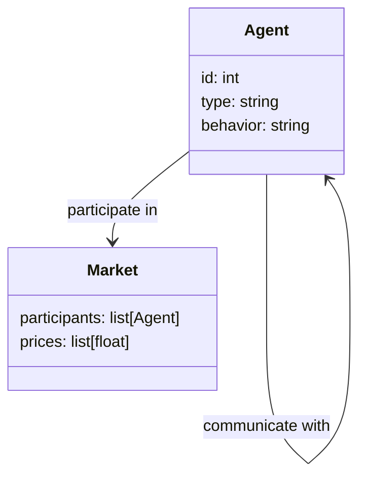

                 


# 多智能体系统模拟市场参与者行为

## 关键词：多智能体系统, 市场模拟, 博弈论, 分布式计算, 人工智能, 行为建模

## 摘要：  
多智能体系统（Multi-Agent Systems, MAS）是一种模拟多个智能体在复杂环境中交互和协作的系统，广泛应用于金融、经济和社会模拟等领域。本文将详细探讨如何利用多智能体系统模拟市场参与者的复杂行为，包括智能体建模、博弈论应用、分布式计算算法以及实际项目实现。通过理论与实践结合，本文旨在帮助读者理解并掌握多智能体系统在市场模拟中的应用。

---

# 第一部分: 多智能体系统与市场参与者行为模拟

---

## 第1章: 多智能体系统概述

### 1.1 多智能体系统的基本概念

#### 1.1.1 多智能体系统的定义  
多智能体系统（MAS）是由多个智能体（Agent）组成的分布式系统，这些智能体通过交互和协作完成特定目标。智能体是具有感知、决策和行动能力的实体，可以是软件程序或物理设备。

#### 1.1.2 多智能体系统的特征  
- **自主性**：智能体能够自主决策，无需外部干预。  
- **反应性**：智能体能够实时感知环境并做出反应。  
- **协作性**：多个智能体通过协作完成复杂任务。  
- **分布性**：智能体分布在不同的位置，通过通信完成任务。  

#### 1.1.3 多智能体系统与单智能体系统的区别  
单智能体系统由一个中心化决策单元控制，而多智能体系统由多个分散的智能体组成，智能体之间通过通信和协作完成任务。多智能体系统更适用于复杂、动态的环境。

---

### 1.2 市场参与者行为模拟的背景

#### 1.2.1 市场参与者的多样性  
市场参与者包括投资者、交易员、机构等，他们的行为受多种因素影响，如情绪、信息和策略。

#### 1.2.2 市场行为模拟的意义  
模拟市场参与者行为有助于理解市场动态、预测价格波动，并为投资决策提供支持。

#### 1.2.3 多智能体系统在市场模拟中的应用  
多智能体系统能够模拟多个市场参与者的复杂行为，适用于股票交易、金融衍生品定价等场景。

---

### 1.3 多智能体系统建模方法

#### 1.3.1 基于主体的建模方法  
基于主体的建模方法通过模拟每个智能体的行为，分析系统的整体动态。

#### 1.3.2 基于规则的建模方法  
基于规则的建模方法通过定义智能体的行为规则，模拟其决策过程。

#### 1.3.3 基于博弈论的建模方法  
基于博弈论的建模方法通过分析智能体的策略选择和收益，模拟市场中的竞争与合作。

---

### 1.4 多智能体系统的技术基础

#### 1.4.1 分布式计算  
分布式计算是多智能体系统的核心技术，通过将任务分配给多个智能体完成，提高系统的并行性和效率。

#### 1.4.2 通信协议  
智能体之间的通信需要遵循特定的协议，确保信息的准确传递和处理。

#### 1.4.3 协作与协调机制  
协作与协调机制是多智能体系统的重要组成部分，通过协调智能体的行为，确保系统的高效运行。

---

## 第2章: 市场参与者行为建模

### 2.1 市场参与者的类型

#### 2.1.1 投资者  
投资者是市场的主要参与者，他们的行为受风险偏好和市场信息的影响。

#### 2.1.2 交易员  
交易员负责执行交易指令，影响市场价格。

#### 2.1.3 市场机构  
市场机构包括交易所、经纪商等，提供市场基础设施和服务。

---

### 2.2 市场参与者行为的特征

#### 2.2.1 理性行为  
理性行为是指参与者基于最大化收益的原则做出决策。

#### 2.2.2 有限理性  
有限理性是指参与者在信息不完全或决策成本较高的情况下做出的决策。

#### 2.2.3 社会性行为  
社会性行为是指参与者受社会心理和群体行为的影响而做出的决策。

---

### 2.3 基于博弈论的行为建模

#### 2.3.1 博弈论基础  
博弈论是分析市场参与者行为的重要工具，包括策略、收益和均衡的概念。

#### 2.3.2 纯策略与混合策略  
纯策略是指参与者在所有情况下都选择相同的策略，而混合策略是参与者以一定概率选择不同策略。

#### 2.3.3 Nash均衡  
Nash均衡是指在给定其他参与者策略的情况下，参与者无法通过单方面改变策略来提高自身收益的状态。

---

### 2.4 市场行为的动态模拟

#### 2.4.1 市场情绪的传播  
市场情绪的传播会影响参与者的决策，进而影响市场价格。

#### 2.4.2 市场信息的扩散  
市场信息的扩散会影响参与者的决策，进而影响市场价格。

#### 2.4.3 市场反馈机制  
市场反馈机制是指市场价格的变化对参与者行为的影响，形成市场的自我调节机制。

---

## 第3章: 多智能体系统的算法原理

### 3.1 分布式计算算法

#### 3.1.1 分布式一致性算法  
分布式一致性算法用于确保分布式系统中数据的一致性，如Paxos和Raft算法。

#### 3.1.2 分布式任务分配算法  
分布式任务分配算法用于将任务分配给多个智能体，如负载均衡算法。

#### 3.1.3 分布式通信协议  
分布式通信协议用于智能体之间的通信，如TCP/IP协议。

---

### 3.2 协作与协调算法

#### 3.2.1 协作任务分配算法  
协作任务分配算法用于将任务分配给多个智能体，确保任务的高效完成。

#### 3.2.2 协调机制设计  
协调机制设计用于协调智能体的行为，确保系统的整体目标的实现。

#### 3.2.3 冲突解决算法  
冲突解决算法用于解决智能体之间的冲突，如资源竞争问题。

---

### 3.3 基于博弈论的决策算法

#### 3.3.1 最大化效用函数  
最大化效用函数是参与者基于自身收益最大化原则做出决策的数学模型。

#### 3.3.2 Nash均衡求解  
Nash均衡求解是通过数学方法找到市场参与者的均衡策略。

#### 3.3.3 强化学习算法  
强化学习算法是通过智能体与环境的交互，逐步优化决策策略。

---

## 第4章: 系统分析与架构设计

### 4.1 问题场景介绍

#### 4.1.1 市场参与者行为模拟的复杂性  
市场参与者行为模拟需要考虑多个因素，如参与者的决策、市场环境和信息传播。

#### 4.1.2 系统需求分析  
系统需求包括智能体建模、行为模拟和结果分析。

#### 4.1.3 系统边界与外延  
系统的边界包括智能体的感知、决策和行动，外延包括市场环境和参与者之间的交互。

---

### 4.2 系统功能设计

#### 4.2.1 领域模型设计  
领域模型设计包括智能体的属性和行为，如投资者的决策规则。

#### 4.2.2 领域模型类图  
使用mermaid类图展示领域模型的设计。



---

### 4.3 系统架构设计

#### 4.3.1 分层架构设计  
系统架构采用分层架构，包括数据层、业务逻辑层和用户界面层。

#### 4.3.2 模块关系设计  
模块关系设计包括智能体模块、市场模块和通信模块。

#### 4.3.3 模块交互设计  
模块交互设计通过序列图展示模块之间的调用关系。

---

### 4.4 系统接口设计

#### 4.4.1 系统调用接口  
系统调用接口包括智能体注册、行为模拟和结果查询。

#### 4.4.2 接口交互流程  
接口交互流程通过序列图展示系统调用的流程。

---

### 4.5 本章小结

---

## 第5章: 项目实战

### 5.1 环境安装

#### 5.1.1 系统运行环境  
系统运行环境包括操作系统、编程语言和相关库。

#### 5.1.2 工具安装  
工具安装包括安装Python、Jupyter Notebook和相关库。

---

### 5.2 系统核心实现

#### 5.2.1 智能体类实现  
智能体类实现包括智能体的属性和行为方法。

```python
class Agent:
    def __init__(self, id, type):
        self.id = id
        self.type = type
        self.behavior = None

    def decide(self, market):
        # 根据市场信息决定行为
        pass
```

#### 5.2.2 市场模拟实现  
市场模拟实现包括市场环境的初始化和价格的更新。

```python
class Market:
    def __init__(self, participants):
        self.participants = participants
        self.prices = []

    def update_prices(self):
        # 根据参与者的行为更新价格
        pass
```

---

### 5.3 代码解读与分析

#### 5.3.1 核心代码实现  
核心代码实现包括智能体的行为模拟和市场的动态更新。

#### 5.3.2 代码功能扩展  
代码功能扩展包括添加更多的市场参与者和行为类型。

---

### 5.4 案例分析

#### 5.4.1 案例介绍  
案例介绍包括选择股票交易市场模拟作为案例。

#### 5.4.2 案例实现  
案例实现包括智能体的行为模拟和市场的动态更新。

#### 5.4.3 案例分析  
案例分析包括对模拟结果的分析和总结。

---

## 第6章: 最佳实践与总结

### 6.1 学习要点回顾

#### 6.1.1 多智能体系统的核心概念  
多智能体系统的核心概念包括智能体、分布式计算和协作机制。

#### 6.1.2 市场参与者行为建模方法  
市场参与者行为建模方法包括基于主体的建模、基于规则的建模和基于博弈论的建模。

---

### 6.2 注意事项

#### 6.2.1 系统复杂性  
多智能体系统的复杂性较高，需要考虑智能体之间的交互和协作。

#### 6.2.2 算法选择  
算法选择需要根据具体场景和需求进行调整。

#### 6.2.3 系统优化  
系统优化需要考虑性能和可扩展性。

---

### 6.3 未来研究方向

#### 6.3.1 更复杂的市场行为建模  
未来可以研究更复杂的市场行为建模，如非理性行为和群体行为。

#### 6.3.2 多智能体系统的可扩展性  
未来可以研究多智能体系统的可扩展性，支持更多的智能体和更复杂的场景。

---

### 6.4 扩展阅读

#### 6.4.1 推荐书籍  
推荐书籍包括《Multi-Agent Systems: Algorithmic, Complexity, and Synthesis》和《Game Theory and Its Applications in the Social and Biological Sciences》。

#### 6.4.2 推荐论文  
推荐论文包括《A Survey on Multi-Agent Systems》和《Game Theory in Multi-Agent Systems》。

---

## 作者：AI天才研究院/AI Genius Institute & 禅与计算机程序设计艺术 /Zen And The Art of Computer Programming

