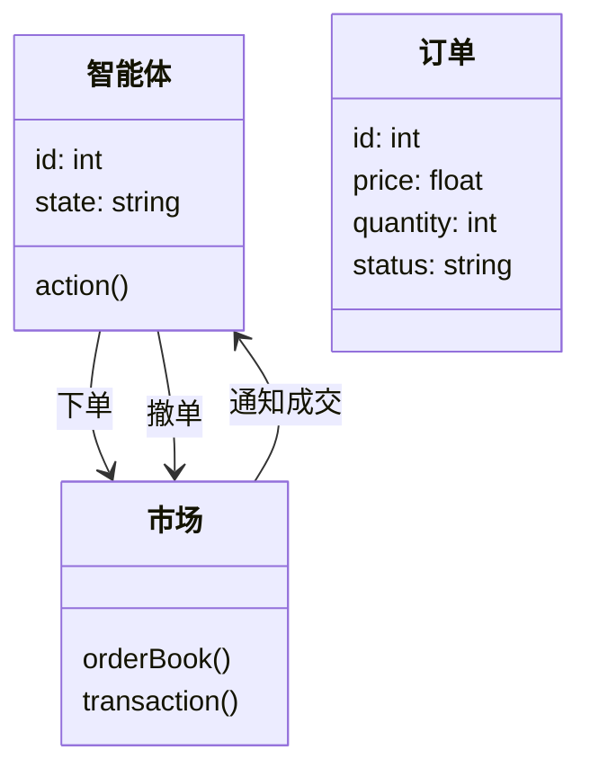
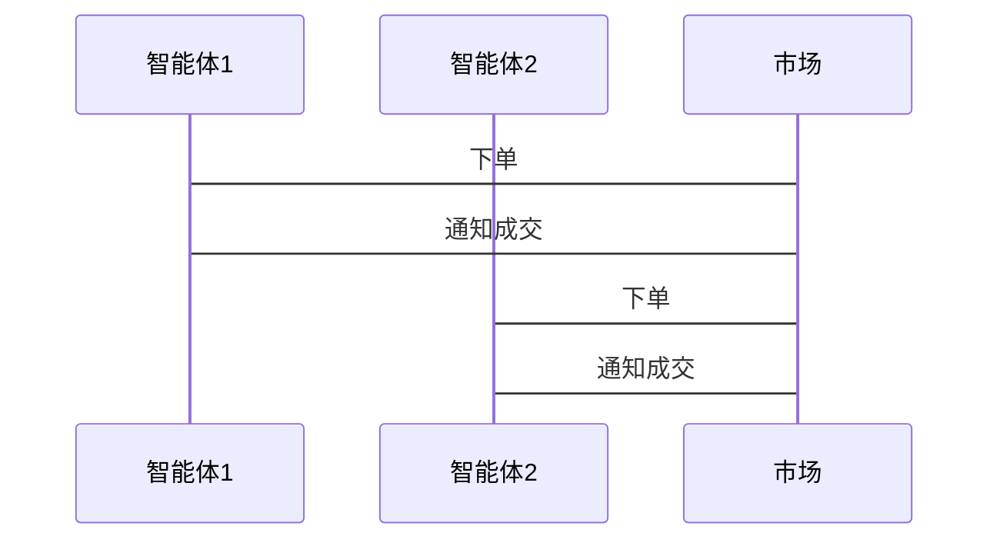

                 


# 多智能体系统模拟市场微观结构

> 关键词：多智能体系统，市场微观结构，智能体建模，交易模拟，算法实现

> 摘要：本文详细探讨了多智能体系统在模拟市场微观结构中的应用，从基本概念到算法实现，再到系统架构设计，逐步分析了如何通过多智能体系统建模市场微观结构，并通过实际案例展示了其在金融交易中的应用。

---

## 第一章：多智能体系统与市场微观结构概述

### 1.1 多智能体系统的定义与特点

#### 1.1.1 多智能体系统的定义
多智能体系统（Multi-Agent System, MAS）是由多个具有自主性、反应性、协作性和社会性的智能体组成的复杂系统。这些智能体能够通过感知环境、自主决策并与其他智能体交互，共同完成特定任务。

#### 1.1.2 多智能体系统的核心特点
- **自主性**：智能体能够自主决策，无需外部干预。
- **反应性**：智能体能够实时感知环境并做出反应。
- **协作性**：多个智能体能够通过协作完成复杂任务。
- **社会性**：智能体之间存在复杂的交互关系，类似于社会中的个体。

#### 1.1.3 多智能体系统与单智能体系统的区别
| 特性 | 单智能体系统 | 多智能体系统 |
|------|--------------|--------------|
| 决策 | 中央控制     | 分布式决策  |
| 交互 | 无           | 智能体之间存在交互 |
| 复杂性 | 较低         | 较高         |

### 1.2 市场微观结构的定义与重要性

#### 1.2.1 市场微观结构的定义
市场微观结构是指市场中的参与者（如买方、卖方、交易商等）及其交互方式所构成的系统结构。它描述了市场的运行机制，包括订单簿、交易行为、价格形成机制等。

#### 1.2.2 市场微观结构的核心要素
- **订单簿**：记录市场上所有未成交的订单。
- **交易行为**：买方和卖方的交易行为，包括下单、撤单、成交等。
- **价格形成机制**：价格如何在市场中形成和变化。

#### 1.2.3 市场微观结构的重要性
- **准确模拟市场行为**：帮助理解市场的运行机制。
- **风险控制**：通过模拟市场行为，识别潜在风险。
- **优化交易策略**：通过模拟不同交易策略的效果，优化交易行为。

### 1.3 多智能体系统模拟市场微观结构的应用场景

#### 1.3.1 金融市场中的多智能体模拟
- **股票交易**：模拟股票市场的价格波动。
- **外汇交易**：模拟外汇市场的汇率变化。
- **期货交易**：模拟期货市场的价格波动。

#### 1.3.2 其他领域的应用
- **经济模拟**：模拟经济系统的运行。
- **供应链管理**：模拟供应链中的多方协作。

---

## 第二章：多智能体系统的核心概念与联系

### 2.1 多智能体系统的核心概念

#### 2.1.1 智能体的定义与特征
- **定义**：智能体是一个能够感知环境、自主决策并采取行动的实体。
- **特征**：
  - 感知能力
  - 决策能力
  - 行动能力
  - 学习能力

#### 2.1.2 智能体的分类
| 类型 | 描述 |
|------|------|
| 单智能体 | 独立运行，不与其他智能体交互 |
| 多智能体 | 多个智能体协作完成任务 |

#### 2.1.3 多智能体系统中的交互关系
- **协作**：智能体之间通过协作完成共同目标。
- **竞争**：智能体之间存在竞争关系，例如在市场中争夺订单。
- **独立**：智能体之间独立运行，互不影响。

#### 2.1.4 多智能体系统的通信机制
- **直接通信**：智能体之间直接交换信息。
- **间接通信**：通过中间媒介（如消息队列）进行通信。

#### 2.1.5 多智能体系统的协调算法
- **协商算法**：智能体通过协商达成一致。
- **拍卖算法**：智能体通过拍卖机制分配资源。
- **领导-跟随算法**：一个智能体作为领导者，其他智能体作为跟随者。

### 2.2 多智能体系统与市场微观结构的关系

#### 2.2.1 多智能体系统在市场微观结构中的角色
- **买方智能体**：模拟市场中的买方行为。
- **卖方智能体**：模拟市场中的卖方行为。
- **交易商智能体**：模拟交易商的交易行为。

#### 2.2.2 市场微观结构对多智能体系统的影响
- **交易规则**：市场中的交易规则约束智能体的行为。
- **价格波动**：市场中的价格波动影响智能体的决策。

### 2.3 多智能体系统的核心算法与实现

#### 2.3.1 多智能体系统的协调算法
- **协商算法**：智能体通过协商达成一致。
- **拍卖算法**：智能体通过拍卖机制分配资源。

#### 2.3.2 多智能体系统的通信机制
- **直接通信**：智能体之间直接交换信息。
- **间接通信**：通过中间媒介进行通信。

---

## 第三章：市场微观结构建模

### 3.1 市场微观结构的建模方法

#### 3.1.1 市场微观结构的层次化建模
- **层次化建模**：从宏观到微观，逐步细化市场结构。
- **动态建模**：模拟市场中动态变化的交易行为。
- **网络建模**：将市场视为一个复杂的网络，分析智能体之间的交互关系。

#### 3.1.2 市场微观结构的核心模型
- **订单簿模型**：记录市场上所有未成交的订单。
- **交易行为模型**：模拟买方和卖方的交易行为。
- **价格形成模型**：模拟价格的形成和变化机制。

---

## 第四章：系统分析与架构设计

### 4.1 问题场景介绍

#### 4.1.1 问题描述
- **目标**：模拟市场微观结构中的交易行为。
- **边界**：仅考虑市场中的交易行为，不涉及市场外部因素。

### 4.2 系统功能设计

#### 4.2.1 领域模型类图


#### 4.2.2 系统架构设计


### 4.3 系统交互设计

#### 4.3.1 系统交互序列图


---

## 第五章：项目实战

### 5.1 环境安装

#### 5.1.1 安装Python
```bash
# 安装Python
sudo apt-get install python3
```

#### 5.1.2 安装依赖库
```bash
# 安装依赖库
pip install numpy matplotlib
```

### 5.2 系统核心实现源代码

#### 5.2.1 智能体类
```python
class Agent:
    def __init__(self, id):
        self.id = id
        self.state = "idle"
    
    def action(self):
        if self.state == "idle":
            # 下单
            pass
        else:
            # 撤单
            pass
```

#### 5.2.2 市场类
```python
class Market:
    def __init__(self):
        self.orderBook = []
    
    def add_order(self, order):
        self.orderBook.append(order)
    
    def remove_order(self, order_id):
        for order in self.orderBook:
            if order.id == order_id:
                self.orderBook.remove(order)
                break
```

### 5.3 代码应用解读与分析

#### 5.3.1 代码解读
- **Agent类**：表示一个智能体，具有id和状态，能够执行动作。
- **Market类**：表示市场，管理订单簿，能够添加和删除订单。

#### 5.3.2 案例分析
```python
# 创建智能体
agent1 = Agent(1)
agent2 = Agent(2)

# 创建市场
market = Market()

# 智能体1下单
agent1.state = "active"
agent1.action()

# 智能体2下单
agent2.state = "active"
agent2.action()

# 查看订单簿
print(market.orderBook)
```

---

## 第六章：总结与展望

### 6.1 最佳实践 tips
- **模块化设计**：将系统分解为多个模块，便于维护和扩展。
- **性能优化**：通过并行计算和优化算法提高系统的运行效率。
- **测试与验证**：通过测试验证系统的正确性和稳定性。

### 6.2 小结
本文详细探讨了多智能体系统在模拟市场微观结构中的应用，从基本概念到算法实现，再到系统架构设计，逐步分析了如何通过多智能体系统建模市场微观结构，并通过实际案例展示了其在金融交易中的应用。

### 6.3 注意事项
- **数据准确性**：确保市场数据的准确性和实时性。
- **系统安全性**：保证系统的安全性，防止数据泄露和攻击。

### 6.4 拓展阅读
- **推荐书籍**：《Multi-Agent Systems: Algorithmic, Complexity, and Agent-Based Simulation》
- **推荐论文**：《A Survey on Multi-Agent Systems and Their Applications in Financial Markets》

---

作者：AI天才研究院/AI Genius Institute & 禅与计算机程序设计艺术 /Zen And The Art of Computer Programming

