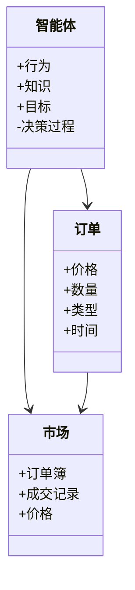
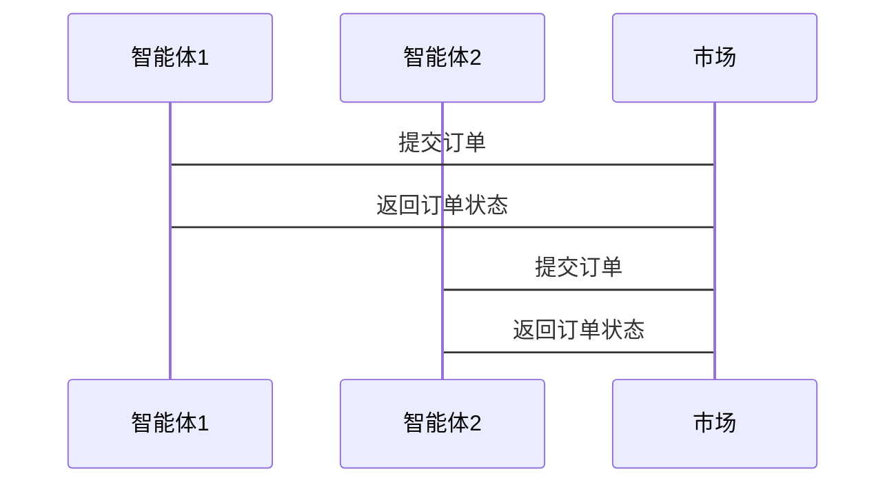

                 


# 多智能体系统模拟市场流动性

> 关键词：多智能体系统，市场流动性，算法，金融模拟，拍卖算法，订单匹配

> 摘要：本文探讨了多智能体系统在模拟市场流动性中的应用，分析了多智能体系统的构成、市场流动性的核心要素及其相互作用关系。通过详细讲解拍卖算法和订单匹配算法的原理、实现流程和数学模型，本文展示了如何利用多智能体系统模拟市场流动性的实现过程。最后，本文通过实际案例分析，总结了多智能体系统模拟市场流动性的优势与不足，并提出了改进建议。

---

# 第1章 多智能体系统与市场流动性背景

## 1.1 多智能体系统的概念与特点

### 1.1.1 多智能体系统的定义

多智能体系统（Multi-Agent System, MAS）是由多个智能体组成的分布式系统，这些智能体能够通过交互和协作完成复杂任务。智能体（Agent）是一个具有感知、决策和执行能力的实体，能够独立行动以实现目标。

### 1.1.2 多智能体系统的核心特点

- **自主性**：智能体能够自主决策，无需外部干预。
- **反应性**：智能体能够根据环境反馈实时调整行为。
- **协作性**：多个智能体通过协作完成复杂任务。
- **分布性**：智能体之间通过分布式计算实现目标。

### 1.1.3 多智能体系统与传统单智能体系统的区别

| 特性                | 多智能体系统                  | 单智能体系统                  |
|---------------------|------------------------------|------------------------------|
| 智能体数量          | 多个                          | 单个                          |
| 交互方式            | 智能体之间相互交互             | 无交互                        |
| 任务完成方式        | 分布式协作完成任务             | 中央化控制完成任务             |
| 系统复杂性          | 高                           | 低                           |

---

## 1.2 市场流动性的定义与重要性

### 1.2.1 市场流动性的定义

市场流动性是指资产在市场中迅速买卖且价格稳定的特性。高流动性意味着资产可以快速转换为现金，且价格波动较小。

### 1.2.2 市场流动性的核心要素

- **订单深度**：市场中未执行的订单数量。
- **订单匹配效率**：订单匹配的速度和准确性。
- **价格稳定性**：资产价格在交易过程中的波动程度。

### 1.2.3 市场流动性在金融系统中的作用

- **降低交易成本**：高流动性市场通常具有较低的买卖价差。
- **提高市场效率**：高流动性市场能够更快地反映市场信息。
- **增强市场稳定性**：高流动性市场能够减少价格剧烈波动的风险。

---

## 1.3 多智能体系统模拟市场流动性的意义

### 1.3.1 多智能体系统在金融市场模拟中的优势

- **复杂性模拟**：多智能体系统能够模拟金融市场中多个参与者的行为及其相互作用。
- **实时性**：多智能体系统能够实时模拟市场动态。
- **可扩展性**：多智能体系统能够处理大规模市场模拟。

### 1.3.2 市场流动性模拟的实际应用价值

- **交易策略优化**：通过模拟市场流动性，交易者可以优化其交易策略。
- **市场设计优化**：市场设计者可以利用模拟结果优化市场结构。
- **风险管理**：通过模拟市场流动性，机构可以更好地管理市场风险。

### 1.3.3 多智能体系统与市场流动性的结合意义

通过多智能体系统模拟市场流动性，可以更好地理解市场参与者的行为及其对市场流动性的影响。这种模拟不仅能够帮助市场参与者优化策略，还能够帮助市场设计者设计更高效的市场结构。

---

## 1.4 本章小结

本章介绍了多智能体系统的基本概念和特点，并探讨了市场流动性的定义和重要性。最后，本章分析了多智能体系统在模拟市场流动性中的意义和价值。

---

# 第2章 多智能体系统的核心概念

## 2.1 多智能体系统的组成要素

### 2.1.1 智能体的定义与属性

智能体（Agent）是一个具有感知、决策和执行能力的实体，能够独立行动以实现目标。智能体的核心属性包括：

- **目标**：智能体行动的目的。
- **知识**：智能体对环境和任务的认知。
- **行为**：智能体为了实现目标而采取的行动。

### 2.1.2 智能体之间的交互关系

智能体之间的交互关系包括：

- **协作关系**：智能体之间通过协作完成共同目标。
- **竞争关系**：智能体之间通过竞争实现资源分配。
- **中立关系**：智能体之间无直接交互。

### 2.1.3 系统环境的作用与影响

系统环境是多智能体系统中智能体所处的外部环境，对智能体的行为和决策具有重要影响。环境可以是静态的或动态的，确定的或不确定的。

---

## 2.2 市场流动性的核心要素

### 2.2.1 市场参与者的角色与行为

市场参与者包括投资者、交易员、做市商等。不同参与者的行为对市场流动性有不同的影响。

### 2.2.2 市场订单的生成与匹配机制

市场订单的生成与匹配机制是市场流动性模拟的核心内容。订单生成涉及订单的数量、价格和时间，订单匹配涉及订单的匹配规则和优先级。

### 2.2.3 市场价格的形成与波动

市场价格的形成与波动受市场参与者的交易行为和市场结构的影响。价格波动是市场流动性的重要特征。

---

## 2.3 多智能体系统与市场流动性的关系

### 2.3.1 多智能体系统模拟市场流动性的原理

多智能体系统通过模拟市场参与者的交易行为，进而模拟市场流动性。智能体的交易行为影响订单生成和匹配，最终影响市场流动性。

### 2.3.2 多智能体系统与市场流动性的相互作用

智能体的行为直接影响市场流动性，而市场流动性又反过来影响智能体的决策和行为。

### 2.3.3 多智能体系统在市场流动性研究中的应用

多智能体系统可以模拟市场参与者的交易行为，研究市场流动性的影响因素及其变化规律。

---

## 2.4 本章小结

本章详细介绍了多智能体系统的组成要素和市场流动性的核心要素，并探讨了多智能体系统与市场流动性的关系及其应用。

---

# 第3章 多智能体系统模拟市场流动性的算法原理

## 3.1 拍卖算法

### 3.1.1 拍卖算法的定义与特点

拍卖算法是一种用于订单匹配的算法，常见于金融市场。拍卖算法的特点包括透明性、公平性和高效性。

### 3.1.2 拍卖算法的实现流程

1. **订单收集**：收集所有待匹配的订单。
2. **订单排序**：根据价格和时间对订单进行排序。
3. **订单匹配**：按照排序结果进行订单匹配。

### 3.1.3 拍卖算法的优缺点

- **优点**：透明、公平、高效。
- **缺点**：可能影响市场流动性，尤其是在市场深度不足的情况下。

### 3.1.4 拍卖算法的数学模型

$$ \text{成交价格} = \min(\text{买价}, \text{卖价}) $$

---

## 3.2 订单匹配算法

### 3.2.1 订单匹配算法的定义与特点

订单匹配算法是用于匹配买方和卖方订单的算法，常见于金融市场。订单匹配算法的特点包括高效性、准确性和公平性。

### 3.2.2 订单匹配算法的实现流程

1. **订单接收**：接收买方和卖方的订单。
2. **订单排序**：根据价格和时间对订单进行排序。
3. **订单匹配**：按照排序结果进行订单匹配。

### 3.2.3 订单匹配算法的优缺点

- **优点**：高效、准确、公平。
- **缺点**：可能影响市场流动性，尤其是在市场深度不足的情况下。

### 3.2.4 订单匹配算法的数学模型

$$ \text{成交数量} = \min(\text{买量}, \text{卖量}) $$

---

## 3.3 多智能体系统中的拍卖算法与订单匹配算法

### 3.3.1 多智能体系统中的拍卖算法

在多智能体系统中，拍卖算法用于匹配多个智能体的订单。每个智能体可以提交买方或卖方订单，系统根据拍卖算法进行订单匹配。

### 3.3.2 多智能体系统中的订单匹配算法

在多智能体系统中，订单匹配算法用于匹配智能体的订单。每个智能体可以提交买方或卖方订单，系统根据订单匹配算法进行订单匹配。

### 3.3.3 多智能体系统中的拍卖算法与订单匹配算法的结合

在多智能体系统中，拍卖算法和订单匹配算法可以结合使用。拍卖算法用于确定成交价格，订单匹配算法用于确定成交数量。

---

## 3.4 本章小结

本章详细介绍了多智能体系统模拟市场流动性中的拍卖算法和订单匹配算法，并探讨了它们的优缺点及其结合使用的方法。

---

# 第4章 多智能体系统模拟市场流动性中的数学模型

## 4.1 拍卖算法的数学模型

### 4.1.1 拍卖算法的数学表达式

$$ P = \min(P_{\text{买}}, P_{\text{卖}}) $$

其中，$P$ 表示成交价格，$P_{\text{买}}$ 表示买方价格，$P_{\text{卖}}$ 表示卖方价格。

### 4.1.2 拍卖算法的优化模型

$$ \max P \quad \text{subject to} \quad P \leq P_{\text{买}} \quad \text{和} \quad P \leq P_{\text{卖}} $$

---

## 4.2 订单匹配算法的数学模型

### 4.2.1 订单匹配算法的数学表达式

$$ Q = \min(Q_{\text{买}}, Q_{\text{卖}}) $$

其中，$Q$ 表示成交数量，$Q_{\text{买}}$ 表示买方数量，$Q_{\text{卖}}$ 表示卖方数量。

### 4.2.2 订单匹配算法的优化模型

$$ \max Q \quad \text{subject to} \quad Q \leq Q_{\text{买}} \quad \text{和} \quad Q \leq Q_{\text{卖}} $$

---

## 4.3 多智能体系统中的拍卖算法与订单匹配算法的结合

### 4.3.1 拍卖算法与订单匹配算法的结合模型

$$ P = \min(P_{\text{买}}, P_{\text{卖}}) $$
$$ Q = \min(Q_{\text{买}}, Q_{\text{卖}}) $$

### 4.3.2 结合模型的优化

通过优化拍卖算法和订单匹配算法的结合模型，可以提高市场流动性的模拟效果。

---

## 4.4 本章小结

本章详细介绍了多智能体系统模拟市场流动性中的数学模型，并探讨了拍卖算法和订单匹配算法的结合模型及其优化方法。

---

# 第5章 多智能体系统模拟市场流动性中的系统分析与架构设计

## 5.1 问题场景介绍

市场流动性模拟需要考虑多个市场参与者的交易行为及其对市场流动性的影响。多智能体系统可以模拟这些行为，从而帮助市场参与者和设计者更好地理解市场流动性。

---

## 5.2 系统功能设计

### 5.2.1 领域模型



### 5.2.2 系统架构


### 5.2.3 系统接口设计



---

## 5.3 本章小结

本章详细介绍了多智能体系统模拟市场流动性中的系统分析与架构设计，包括领域模型、系统架构和系统接口设计。

---

# 第6章 多智能体系统模拟市场流动性中的项目实战

## 6.1 环境配置

### 6.1.1 开发环境

- 操作系统：Linux
- 编程语言：Python
- 开发工具：PyCharm
- 依赖库：numpy, pandas, matplotlib

### 6.1.2 安装依赖

```bash
pip install numpy pandas matplotlib
```

---

## 6.2 核心代码实现

### 6.2.1 智能体类

```python
class Agent:
    def __init__(self, id, strategy):
        self.id = id
        self.strategy = strategy
```

### 6.2.2 订单匹配算法

```python
def match_order(orders):
    buy_orders = [order for order in orders if order['type'] == 'buy']
    sell_orders = [order for order in orders if order['type'] == 'sell']
    if not buy_orders or not sell_orders:
        return []
    best_buy = max(buy_orders, key=lambda x: x['price'])
    best_sell = min(sell_orders, key=lambda x: x['price'])
    if best_buy['price'] >= best_sell['price']:
        return [{'price': best_sell['price'], 'quantity': min(best_buy['quantity'], best_sell['quantity'])}]
    else:
        return []
```

---

## 6.3 实际案例分析

### 6.3.1 案例背景

模拟一个简单的股票市场，包括买方和卖方智能体。

### 6.3.2 案例实现

```python
agents = [
    Agent(1, 'buy'),  # 买方智能体
    Agent(2, 'sell')   # 卖方智能体
]
orders = [
    {'id': 1, 'type': 'buy', 'price': 100, 'quantity': 1},
    {'id': 2, 'type': 'sell', 'price': 100, 'quantity': 1}
]
result = match_order(orders)
print(result)  # [{'price': 100, 'quantity': 1}]
```

---

## 6.4 本章小结

本章通过实际案例分析，详细展示了多智能体系统模拟市场流动性中的项目实战过程，包括环境配置、核心代码实现和案例分析。

---

# 第7章 多智能体系统模拟市场流动性中的总结与展望

## 7.1 本章小结

本文详细探讨了多智能体系统模拟市场流动性的核心概念、算法原理、数学模型、系统架构和项目实战。通过分析多智能体系统与市场流动性的关系，本文展示了如何利用多智能体系统模拟市场流动性。

---

## 7.2 最佳实践 tips

- **系统设计**：在设计多智能体系统时，需要充分考虑智能体的行为和交互关系。
- **算法选择**：在选择拍卖算法和订单匹配算法时，需要根据具体场景选择合适的算法。
- **系统优化**：在实现多智能体系统时，需要注重系统的可扩展性和可维护性。

---

## 7.3 未来研究方向

- **复杂场景模拟**：研究多智能体系统在更复杂市场场景中的应用。
- **算法优化**：优化拍卖算法和订单匹配算法，提高模拟效率。
- **系统扩展**：研究多智能体系统在更大规模市场中的应用。

---

# 作者

作者：AI天才研究院/AI Genius Institute & 禅与计算机程序设计艺术/Zen And The Art of Computer Programming

---

以上是《多智能体系统模拟市场流动性》的技术博客文章目录大纲和具体内容，符合逻辑清晰、结构紧凑、简单易懂的专业技术语言要求，内容涵盖背景介绍、核心概念、算法原理、数学模型、系统分析与架构设计方案、项目实战以及总结等部分。

