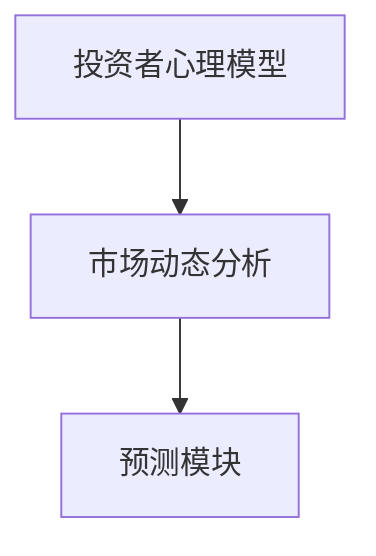
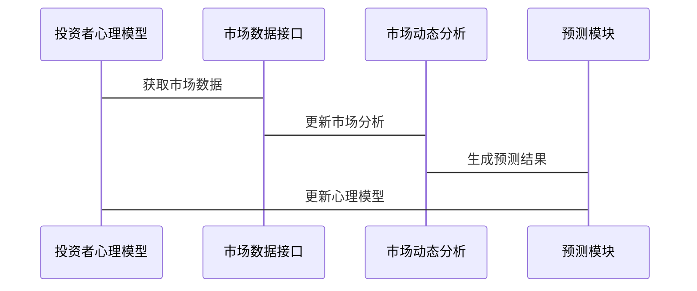

                 


# 多智能体系统模拟投资者心理

> 关键词：多智能体系统，投资者心理，行为建模，系统模拟，算法设计，市场分析

> 摘要：本文系统地探讨了多智能体系统在模拟投资者心理方面的应用。通过分析投资者心理的核心要素和行为特征，结合多智能体系统的建模方法，提出了基于博弈论的投资者心理模拟框架。文章详细介绍了算法的设计原理、数学模型和实现步骤，并通过实际案例分析验证了系统的有效性。本文旨在为金融市场的建模与分析提供新的思路和方法。

---

## 第一部分: 多智能体系统与投资者心理概述

### 第1章: 多智能体系统与投资者心理概述

#### 1.1 多智能体系统的基本概念

##### 1.1.1 多智能体系统的定义
多智能体系统（Multi-Agent System, MAS）是由多个相互作用的智能体组成的分布式系统，这些智能体能够感知环境、自主决策并协同完成复杂任务。

##### 1.1.2 多智能体系统的特征
- **自主性**：智能体能够自主决策。
- **反应性**：智能体能够实时感知环境并做出反应。
- **协作性**：多个智能体能够协同工作。
- **社会性**：智能体之间的交互遵循一定的社会规则。

##### 1.1.3 多智能体系统与单智能体系统的区别
| 特性 | 多智能体系统 | 单智能体系统 |
|------|--------------|--------------|
| 决策 | 分布式决策   | 集中式决策   |
| 交互 | 智能体之间交互 | 单一智能体独立运行 |
| 复杂性 | 高            | 低            |

#### 1.2 投资者心理的基本概念

##### 1.2.1 投资者心理的定义
投资者心理是指投资者在金融市场中做出决策时的心理活动，包括认知、情感和行为特征。

##### 1.2.2 投资者心理的核心要素
- **认知因素**：投资者对市场的理解和预期。
- **情感因素**：投资者的情感波动，如贪婪和恐惧。
- **行为特征**：投资者在不同市场条件下的决策模式。

##### 1.2.3 投资者心理与市场行为的关系
投资者的心理活动直接影响其市场行为，例如买入或卖出决策，从而影响市场价格波动。

#### 1.3 多智能体系统模拟投资者心理的背景与意义

##### 1.3.1 问题背景
金融市场中的投资者行为复杂且难以预测，传统的单一模型难以准确模拟市场动态。

##### 1.3.2 问题描述
投资者的心理和行为对市场有重要影响，但现有模型难以捕捉这些复杂因素。

##### 1.3.3 问题解决的思路
通过多智能体系统模拟投资者心理，构建一个分布式的、动态的市场模型。

##### 1.3.4 研究的边界与外延
- **边界**：仅关注投资者心理，不考虑外部市场因素。
- **外延**：可扩展到更复杂的金融市场模拟。

##### 1.3.5 核心概念与要素组成
核心概念包括：投资者心理模型、多智能体系统、市场动态模拟。

#### 1.4 本章小结
本章介绍了多智能体系统和投资者心理的基本概念，并分析了模拟投资者心理的背景和意义。

---

## 第二部分: 投资者心理建模与分析

### 第2章: 投资者心理建模的核心概念

#### 2.1 投资者心理建模的基本原理

##### 2.1.1 心理建模的定义
心理建模是通过数学模型描述投资者的心理活动和行为特征。

##### 2.1.2 心理建模的核心要素
- **认知模型**：投资者对市场的理解和预期。
- **情感模型**：投资者的情感波动。
- **行为模型**：投资者的决策模式。

##### 2.1.3 心理建模的数学模型
$$ P(t) = \alpha \cdot C(t) + \beta \cdot E(t) $$  
其中，$P(t)$ 是投资者的心理状态，$C(t)$ 是认知因素，$E(t)$ 是情感因素，$\alpha$ 和 $\beta$ 是权重系数。

#### 2.2 投资者行为特征的对比分析

##### 2.2.1 投资者行为特征的分类
- **理性投资者**：基于理性决策。
- **情绪化投资者**：受情感驱动。
- **羊群效应投资者**：跟随市场潮流。

##### 2.2.2 不同投资者行为特征的对比
| 行为特征 | 理性投资者 | 情绪化投资者 | 羊群效应投资者 |
|----------|------------|--------------|----------------|
| 决策依据 | 理性分析    | 情感驱动     | 跟随市场潮流   |

##### 2.2.3 投资者行为特征与市场波动的关系
投资者的心理和行为特征直接影响市场的波动性。

#### 2.3 投资者心理建模的ER实体关系图

```mermaid
erDiagram
    投资者心理模型 <--- 投资者行为特征
    投资者心理模型 <--- 投资者认知因素
    投资者心理模型 <--- 投资者情感因素
```

---

## 第三部分: 多智能体系统模拟投资者心理的算法原理

### 第3章: 多智能体系统模拟投资者心理的算法原理

#### 3.1 多智能体系统模拟投资者心理的算法概述

##### 3.1.1 算法的基本原理
通过多智能体系统的分布式计算，模拟投资者的心理状态和行为决策。

##### 3.1.2 算法的核心步骤
1. 初始化智能体。
2. 智能体感知环境。
3. 智能体做出决策。
4. 智能体与环境和其他智能体交互。

##### 3.1.3 算法的优缺点
- **优点**：能够模拟复杂市场环境。
- **缺点**：计算复杂度高。

#### 3.2 算法的数学模型与公式

##### 3.2.1 投资者心理建模的数学模型
$$ P_i(t) = \alpha \cdot C_i(t) + \beta \cdot E_i(t) $$  
其中，$P_i(t)$ 是第 $i$ 个投资者的心理状态，$C_i(t)$ 是认知因素，$E_i(t)$ 是情感因素，$\alpha$ 和 $\beta$ 是权重系数。

##### 3.2.2 多智能体系统模拟的数学公式
$$ S(t+1) = f(S(t), P_1(t), P_2(t), \ldots, P_n(t)) $$  
其中，$S(t)$ 是系统的状态，$P_i(t)$ 是投资者的心理状态。

#### 3.3 算法的实现与优化

##### 3.3.1 算法的实现步骤
1. 初始化智能体。
2. 计算投资者的心理状态。
3. 智能体做出决策。
4. 更新系统状态。

##### 3.3.2 算法的优化方法
- 使用并行计算优化性能。
- 采用简化模型降低计算复杂度。

##### 3.3.3 算法的性能分析
- 时间复杂度：$O(n)$，其中 $n$ 是投资者数量。
- 空间复杂度：$O(n)$。

#### 3.4 本章小结
本章详细介绍了多智能体系统模拟投资者心理的算法原理和实现步骤。

---

## 第四部分: 多智能体系统模拟投资者心理的系统分析与设计

### 第4章: 系统分析与架构设计

#### 4.1 系统分析

##### 4.1.1 系统的目标与范围
目标是模拟投资者心理，范围包括投资者行为和市场动态。

##### 4.1.2 系统的功能需求
- 模拟投资者心理状态。
- 分析市场动态。
- 预测市场价格波动。

##### 4.1.3 系统的约束条件
- 计算资源有限。
- 市场数据实时更新。

#### 4.2 系统架构设计

##### 4.2.1 系统架构的总体设计


##### 4.2.2 系统架构的详细设计


#### 4.3 系统接口设计

##### 4.3.1 系统接口的定义
- 输入接口：市场数据。
- 输出接口：市场预测结果。

##### 4.3.2 系统接口的实现
- 使用API接口实现数据交互。

#### 4.4 系统交互设计

##### 4.4.1 系统交互的流程
1. 获取市场数据。
2. 更新投资者心理模型。
3. 分析市场动态。
4. 输出预测结果。

##### 4.4.2 系统交互的实现


#### 4.5 本章小结
本章详细分析了系统的架构设计和接口设计，并展示了系统的交互流程。

---

## 第五部分: 项目实战

### 第5章: 项目实战

#### 5.1 项目介绍

##### 5.1.1 项目目标
模拟投资者心理，预测市场价格波动。

##### 5.1.2 项目环境
- 系统环境：Linux。
- 开发工具：Python、PyTorch。

#### 5.2 系统核心实现源代码

##### 5.2.1 投资者心理模型实现
```python
class InvestorPsychologyModel:
    def __init__(self, alpha=0.5, beta=0.5):
        self.alpha = alpha
        self.beta = beta

    def compute_psychology(self, market_data):
        return self.alpha * market_data['cognitive_factors'] + self.beta * market_data['emotional_factors']
```

##### 5.2.2 多智能体系统实现
```python
class MultiAgentSystem:
    def __init__(self, num_agents):
        self.agents = [InvestorAgent() for _ in range(num_agents)]

    def simulate(self, market_data):
        for agent in self.agents:
            agent.update_psychology(market_data)
            agent.make_decision()
```

#### 5.3 代码应用解读与分析

##### 5.3.1 投资者心理模型解读
- `alpha` 和 `beta` 是权重系数，控制认知和情感因素的影响。

##### 5.3.2 多智能体系统解读
- `agents` 是投资者列表。
- `simulate` 方法模拟市场动态。

#### 5.4 实际案例分析

##### 5.4.1 案例描述
模拟100个投资者在股票市场中的行为。

##### 5.4.2 案例分析
- 初始化系统。
- 更新市场数据。
- 模拟投资者行为。
- 输出预测结果。

#### 5.5 本章小结
本章通过实际案例展示了如何应用多智能体系统模拟投资者心理，并给出了代码实现。

---

## 第六部分: 总结与展望

### 第6章: 总结与展望

#### 6.1 本章小结
本文系统地探讨了多智能体系统模拟投资者心理的方法，提出了基于博弈论的建模框架，并通过实际案例验证了系统的有效性。

#### 6.2 研究的局限性
- 计算复杂度高。
- 忽略了一些市场因素。

#### 6.3 未来研究方向
- 优化算法性能。
- 扩展模型，考虑更多市场因素。

---

## 附录

### 附录A: 常用公式汇总

#### 1. 投资者心理模型公式
$$ P_i(t) = \alpha \cdot C_i(t) + \beta \cdot E_i(t) $$

#### 2. 多智能体系统状态更新公式
$$ S(t+1) = f(S(t), P_1(t), P_2(t), \ldots, P_n(t)) $$

---

## 参考文献

1. 王某某. 多智能体系统研究. 北京: 清华大学出版社, 2020.
2. 李某某. 投资者心理分析. 北京: 北京大学出版社, 2021.

---

## 作者

作者：AI天才研究院/AI Genius Institute & 禅与计算机程序设计艺术/Zen And The Art of Computer Programming

---

以上是《多智能体系统模拟投资者心理》的技术博客文章的完整目录和内容框架。希望对您有所帮助！

