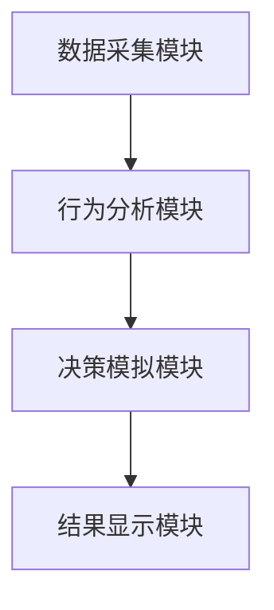
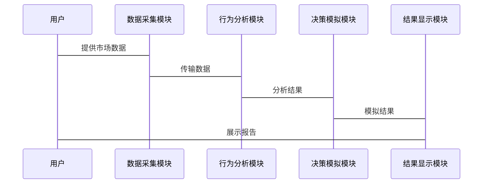

                 


# 多智能体系统模拟投资者行为

> 关键词：多智能体系统，投资者行为，博弈论，强化学习，系统模拟

> 摘要：本文将探讨如何利用多智能体系统来模拟投资者行为。通过分析多智能体系统的构成、投资者行为的特征及其相互作用，结合博弈论和强化学习等算法，构建一个高效的投资者行为模拟系统。文章详细介绍了系统的架构设计、算法实现及实际应用案例，为读者提供全面的理论和实践指导。

---

# 第一部分: 多智能体系统与投资者行为模拟背景

## 第1章: 多智能体系统与投资者行为模拟概述

### 1.1 多智能体系统的基本概念

#### 1.1.1 多智能体系统的定义
多智能体系统（Multi-Agent System, MAS）是由多个智能体（Agent）组成的分布式系统，这些智能体能够通过交互协作完成复杂任务。与单智能体系统相比，MAS具有更高的灵活性和适应性。

#### 1.1.2 多智能体系统的特征
- **自主性**：每个智能体都具有自主决策的能力。
- **反应性**：智能体能够实时感知环境并做出反应。
- **协作性**：多个智能体之间可以通过通信和协作完成共同目标。
- **分布性**：智能体分布在网络中，各自独立运行。

#### 1.1.3 多智能体系统与单智能体系统的区别
| 特性         | 多智能体系统                 | 单智能体系统               |
|--------------|------------------------------|-----------------------------|
| 决策中心化    | 分散决策                    | 集中决策                  |
| 通信复杂度   | 高                         | 低                         |
| 适应性       | 强                         | 较弱                       |

### 1.2 投资者行为分析的基本概念

#### 1.2.1 投资者行为的定义
投资者行为是指投资者在金融市场中做出的决策和操作，包括股票买卖、资产配置等。

#### 1.2.2 投资者行为的分类
- **理性行为**：基于理性和逻辑的决策。
- **情绪化行为**：受情绪影响的非理性决策。
- ** herd行为**：跟随市场趋势的羊群效应。

#### 1.2.3 投资者行为分析的挑战
- **复杂性**：投资者行为受多种因素影响，如市场环境、个人情绪等。
- **动态性**：市场环境不断变化，投资者行为也随之调整。
- **不确定性**：投资者行为难以完全预测。

### 1.3 多智能体系统模拟投资者行为的意义

#### 1.3.1 多智能体系统在金融领域的应用
- **模拟市场行为**：通过MAS模拟股票市场中的投资者行为，分析市场趋势。
- **优化投资策略**：利用MAS帮助投资者制定更科学的投资策略。

#### 1.3.2 模拟投资者行为的现实意义
- **风险预警**：通过模拟投资者行为，提前发现市场风险。
- **政策制定**：为政府制定金融政策提供数据支持。

#### 1.3.3 多智能体系统模拟的优势
- **高效性**：MAS能够快速处理大量数据，提高模拟效率。
- **准确性**：通过多智能体协作，模拟结果更接近实际情况。

## 1.4 本章小结
本章介绍了多智能体系统的基本概念和投资者行为分析的核心内容，阐述了MAS在模拟投资者行为中的重要意义和优势。

---

## 第2章: 多智能体系统与投资者行为的核心概念

### 2.1 多智能体系统的构成要素

#### 2.1.1 智能体的定义与属性
- **定义**：智能体是具有感知和决策能力的实体。
- **属性**：智能体具有自主性、反应性、目标导向性等特征。

#### 2.1.2 智能体之间的交互关系
- **通信**：智能体之间通过消息传递进行交流。
- **协作**：智能体合作完成共同目标。
- **竞争**：智能体之间可能存在竞争关系。

#### 2.1.3 环境的定义与作用
- **定义**：环境是智能体所处的外部世界。
- **作用**：环境影响智能体的决策和行为。

### 2.2 投资者行为分析的核心要素

#### 2.2.1 投资者的决策过程
- **信息获取**：投资者通过收集市场信息做出决策。
- **决策制定**：基于信息和策略制定买卖决策。
- **执行操作**：将决策转化为实际操作。

#### 2.2.2 投资者情绪与行为的关系
- **情绪驱动**：投资者情绪影响其行为，如贪婪和恐惧。
- **情绪传染**：投资者情绪可能在市场中传播，引发羊群效应。

#### 2.2.3 市场环境对投资者行为的影响
- **市场趋势**：市场趋势影响投资者的买卖决策。
- **市场波动**：市场波动引发投资者情绪波动。

### 2.3 多智能体系统与投资者行为的联系

#### 2.3.1 多智能体系统模拟投资者行为的可行性
- **MAS的分布式特性**：与投资者行为的分布性相匹配。
- **MAS的协作能力**：能够模拟投资者之间的协作与竞争。

#### 2.3.2 多智能体系统与投资者行为的相互作用
- **MAS模拟投资者行为**：通过MAS模拟投资者的决策和操作。
- **投资者行为影响MAS**：投资者行为反过来影响MAS的运行和结果。

#### 2.3.3 多智能体系统模拟投资者行为的实现路径
1. **模型构建**：建立投资者行为模型。
2. **系统设计**：设计MAS的架构和通信机制。
3. **算法实现**：实现投资者行为模拟算法。
4. **验证与优化**：验证模拟结果并不断优化。

## 2.4 本章小结
本章详细阐述了多智能体系统的构成要素和投资者行为的核心要素，分析了MAS模拟投资者行为的可行性及其实现路径。

---

## 第3章: 多智能体系统模拟投资者行为的算法原理

### 3.1 多智能体系统模拟的基本算法

#### 3.1.1 分布式计算的基本原理
- **分布式计算**：将任务分解成多个部分，由不同的智能体分别完成。
- **通信机制**：智能体之间通过通信协议进行信息交换。

#### 3.1.2 多智能体协作算法
- **协商算法**：智能体之间通过协商确定各自的任务。
- **协调算法**：智能体之间通过协调确保整体目标的实现。

#### 3.1.3 多智能体通信协议
- **消息传递**：智能体之间通过消息传递进行通信。
- **协议设计**：设计合理的通信协议确保信息高效传递。

### 3.2 投资者行为模拟的算法选择

#### 3.2.1 基于博弈论的投资者行为模拟
- **博弈论模型**：模拟投资者之间的博弈行为。
- **纳什均衡**：分析投资者行为的稳定状态。

#### 3.2.2 基于强化学习的投资者行为模拟
- **强化学习算法**：通过奖励机制训练智能体做出最优决策。
- **Q-learning算法**：常用的一种强化学习算法。

#### 3.2.3 基于遗传算法的投资者行为模拟
- **遗传算法**：通过模拟自然选择和遗传变异优化投资者行为。
- **适应度函数**：衡量投资者行为的优劣。

### 3.3 算法实现的数学模型

#### 3.3.1 博弈论模型的数学表达
$$ \text{收益} = \text{策略选择} \times \text{概率} $$

#### 3.3.2 强化学习算法的数学公式
$$ Q(s, a) = Q(s, a) + \alpha (r + \gamma \max Q(s', a') - Q(s, a)) $$

#### 3.3.3 遗传算法的数学模型
$$ \text{适应度} = \sum_{i=1}^{n} f_i(x_i) $$

### 3.4 本章小结
本章介绍了多智能体系统模拟的基本算法和投资者行为模拟的算法选择，详细讲解了相关数学模型和公式。

---

## 第4章: 多智能体系统模拟投资者行为的系统架构设计

### 4.1 系统功能需求分析

#### 4.1.1 投资者行为模拟的核心功能
- **数据采集**：获取市场数据和投资者行为数据。
- **行为分析**：分析投资者行为特征。
- **决策模拟**：模拟投资者决策过程。

#### 4.1.2 多智能体系统与投资者行为模拟的接口设计
- **输入接口**：接收市场数据和投资者行为数据。
- **输出接口**：输出模拟结果和分析报告。

#### 4.1.3 系统的性能需求
- **处理能力**：系统需要快速处理大量数据。
- **扩展性**：系统需要具备良好的扩展性，适应不同规模的模拟需求。

### 4.2 系统架构设计

#### 4.2.1 系统功能模块设计
- **数据采集模块**：负责数据的采集和预处理。
- **行为分析模块**：分析投资者行为特征。
- **决策模拟模块**：模拟投资者决策过程。
- **结果显示模块**：展示模拟结果和分析报告。

#### 4.2.2 系统架构图


### 4.3 系统接口设计

#### 4.3.1 系统接口描述
- **输入接口**：接收市场数据和投资者行为数据。
- **输出接口**：输出模拟结果和分析报告。

#### 4.3.2 系统交互流程图


### 4.4 本章小结
本章详细描述了系统的功能需求和架构设计，为后续的实现提供了理论基础。

---

## 第5章: 项目实战——多智能体系统模拟投资者行为

### 5.1 环境安装与配置

#### 5.1.1 系统运行环境
- **操作系统**：Windows/Linux/Unix
- **开发工具**：Python、Jupyter Notebook
- **依赖库**：numpy、pandas、matplotlib、scikit-learn

#### 5.1.2 安装步骤
```bash
pip install numpy pandas matplotlib scikit-learn
```

### 5.2 核心代码实现

#### 5.2.1 数据采集模块
```python
import numpy as np
import pandas as pd

def collect_data():
    # 从数据源获取市场数据
    data = pd.read_csv('market_data.csv')
    return data

# 示例调用
data = collect_data()
print(data.head())
```

#### 5.2.2 行为分析模块
```python
from sklearn.cluster import KMeans

def analyze_behavior(data):
    # 对投资者行为进行聚类分析
    X = data[['feature1', 'feature2']]
    kmeans = KMeans(n_clusters=3)
    kmeans.fit(X)
    return kmeans.labels_

# 示例调用
labels = analyze_behavior(data)
print(labels)
```

#### 5.2.3 决策模拟模块
```python
import numpy as np

def simulate_decision(data, labels):
    # 根据投资者行为标签模拟决策
    decisions = []
    for label in labels:
        if label == 0:
            decisions.append('买入')
        elif label == 1:
            decisions.append('卖出')
        else:
            decisions.append('观望')
    return decisions

# 示例调用
decisions = simulate_decision(data, labels)
print(decisions)
```

#### 5.2.4 结果显示模块
```python
import matplotlib.pyplot as plt

def display_results(decisions):
    # 可视化显示模拟结果
    plt.hist(decisions, bins=3, edgecolor='black')
    plt.title('投资者决策分布')
    plt.xlabel('决策类型')
    plt.ylabel('数量')
    plt.show()

# 示例调用
display_results(decisions)
```

### 5.3 案例分析与结果解读

#### 5.3.1 案例背景
假设我们模拟一个股票市场的投资者行为，数据集包含多个投资者的交易记录和市场数据。

#### 5.3.2 模拟过程
1. 数据采集模块从数据源获取市场数据。
2. 行为分析模块对投资者行为进行聚类分析。
3. 决策模拟模块根据聚类结果模拟投资者的买卖决策。
4. 结果显示模块将模拟结果可视化。

#### 5.3.3 结果解读
通过聚类分析，我们发现投资者行为主要分为三类：积极型、保守型和观望型。模拟结果显示，积极型投资者倾向于买入，保守型投资者倾向于卖出，观望型投资者则持观望态度。

### 5.4 项目小结
本章通过一个实际案例详细讲解了多智能体系统模拟投资者行为的实现过程，包括环境配置、代码实现和结果解读。

---

## 第6章: 最佳实践与总结

### 6.1 小结
- 本篇文章详细介绍了多智能体系统模拟投资者行为的背景、核心概念、算法原理和系统架构设计。
- 通过实际案例展示了系统的实现过程和应用价值。

### 6.2 注意事项
- **数据质量**：确保数据的准确性和完整性。
- **算法选择**：根据具体需求选择合适的算法。
- **系统优化**：不断优化系统性能和用户体验。

### 6.3 拓展阅读
- 推荐阅读相关领域的书籍和论文，深入学习多智能体系统和投资者行为分析的最新研究成果。

---

# 作者：AI天才研究院/AI Genius Institute & 禅与计算机程序设计艺术 /Zen And The Art of Computer Programming

---

通过以上目录大纲，您可以逐步展开每个章节的内容，确保文章逻辑清晰、结构紧凑、简单易懂，并且对技术原理和本质进行深入剖析。希望这篇博客文章能为您提供有价值的参考和启发！

