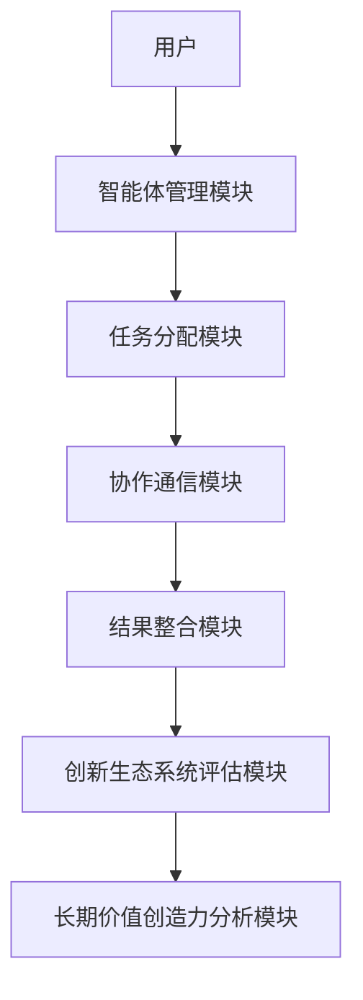
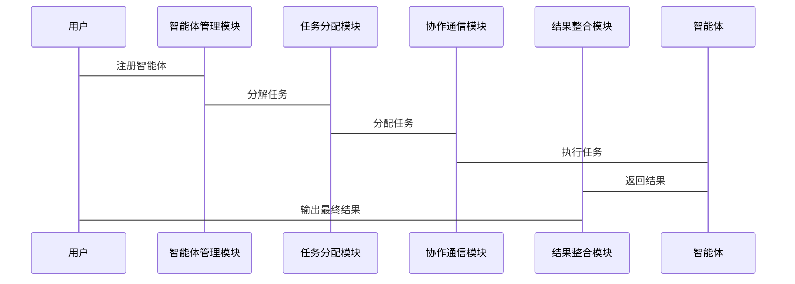

                 


# 多智能体系统评估公司创新生态系统：长期价值创造力分析

## 关键词：多智能体系统、创新生态系统、长期价值创造力、企业创新、协作机制

## 摘要

随着企业创新竞争的日益加剧，如何利用多智能体系统评估公司创新生态系统，成为企业在数字化转型中面临的重要课题。本文章从多智能体系统的定义与特点出发，深入探讨其在创新生态系统中的应用与价值。通过分析创新生态系统的核心概念与多智能体系统的协作机制，结合具体的算法原理和系统架构设计，为企业提供一套评估创新生态系统长期价值创造力的解决方案。文章最后通过项目实战，展示了如何在实际场景中应用多智能体系统评估创新生态系统，并总结了相关经验与启示。

---

# 第1章: 多智能体系统与创新生态系统概述

## 1.1 多智能体系统的定义与特点

### 1.1.1 多智能体系统的定义

多智能体系统（Multi-Agent System，简称MAS）是由多个智能体（Agent）组成的分布式系统，这些智能体能够通过协作和通信完成复杂的任务。每个智能体都是一个具有感知、决策和执行能力的独立实体，能够根据环境信息做出自主决策，并与其他智能体协作完成目标。

多智能体系统的本质是通过多个智能体的协作，实现整体目标的优化。与传统的单智能体系统相比，多智能体系统具有更强的分布式协作能力，能够适应复杂多变的环境。

### 1.1.2 多智能体系统的核心特点

多智能体系统的核心特点包括以下几点：

1. **分布式性**：智能体是分布式的，不存在中央控制节点，每个智能体独立决策。
2. **协作性**：智能体之间通过协作完成共同目标，而不是简单的任务分割。
3. **动态性**：智能体能够根据环境变化动态调整策略。
4. **自主性**：智能体具有自主决策能力，能够在没有外部干预的情况下完成任务。
5. **社会性**：智能体之间需要通过通信和协商来实现协作。

### 1.1.3 多智能体系统与传统单智能体系统的对比

以下是多智能体系统与传统单智能体系统的对比：

| 对比维度 | 多智能体系统 | 单智能体系统 |
|----------|--------------|--------------|
| 结构      | 分布式       | 集中式       |
| 决策      | 去中心化      | 中心化       |
| 协作      | 高           | 低           |
| 灵活性     | 高           | 低           |
| 可扩展性   | 高           | 低           |

通过对比可以看出，多智能体系统在分布式协作和灵活性方面具有明显优势，适合处理复杂、动态的场景。

---

## 1.2 创新生态系统的基本概念

### 1.2.1 创新生态系统的核心定义

创新生态系统（Innovation Ecosystem）是由多个主体（如企业、研究机构、合作伙伴等）共同参与的系统，旨在通过协作和资源整合，推动创新成果的产生和商业化。

创新生态系统的核心目标是通过多主体的协作，实现创新资源的最优配置和创新价值的最大化。与传统的创新模式相比，创新生态系统更加注重生态系统的整体性、协作性和可持续性。

### 1.2.2 创新生态系统的核心构成要素

创新生态系统的构成要素包括以下几点：

1. **创新主体**：包括企业、研究机构、高校、政府等。
2. **创新资源**：包括资金、技术、人才、数据等。
3. **创新平台**：包括技术平台、信息平台、合作平台等。
4. **创新文化**：包括开放、协作、共享的文化氛围。

### 1.2.3 创新生态系统与企业创新的关系

创新生态系统与企业创新的关系密不可分。企业是创新生态系统的核心主体，而创新生态系统为企业提供了创新的环境和支持。通过创新生态系统，企业可以更好地整合外部资源，提升创新能力，实现可持续发展。

---

## 1.3 多智能体系统在创新生态系统中的作用

### 1.3.1 多智能体系统在企业创新中的应用

多智能体系统在企业创新中的应用主要体现在以下几个方面：

1. **知识管理**：智能体可以负责企业内部知识的整理和共享，提升知识利用率。
2. **创新协作**：智能体可以协助企业与其他创新主体进行协作，推动创新项目的发展。
3. **风险评估**：智能体可以通过数据分析和预测，评估创新项目的潜在风险。

### 1.3.2 多智能体系统对创新生态系统的影响

多智能体系统通过以下方式影响创新生态系统：

1. **提升协作效率**：通过智能体之间的协作，提高创新资源的配置效率。
2. **增强创新活力**：通过智能体的自主决策和协作，激发创新生态系统的活力。
3. **降低创新成本**：通过智能体的优化决策，降低创新过程中的成本。

### 1.3.3 多智能体系统与长期价值创造力的关联

多智能体系统通过以下方式与长期价值创造力相关联：

1. **协同创新**：通过智能体的协作，实现创新资源的最优配置，提升创新成果的价值。
2. **可持续发展**：通过智能体的动态调整，确保创新生态系统的可持续发展，从而实现长期价值创造力。

---

## 1.4 本章小结

本章主要介绍了多智能体系统与创新生态系统的基本概念和核心特点。通过对比分析，明确了多智能体系统在创新生态系统中的重要作用。接下来的章节将从核心概念、算法原理、系统架构等方面，深入探讨多智能体系统评估创新生态系统的方法。

---

# 第2章: 多智能体系统的核心概念与联系

## 2.1 多智能体系统的核心概念

### 2.1.1 智能体的定义与属性

智能体（Agent）是多智能体系统的核心单元，具有以下属性：

1. **自主性**：智能体能够自主决策，无需外部干预。
2. **反应性**：智能体能够根据环境信息做出实时响应。
3. **协作性**：智能体能够与其他智能体协作完成共同目标。
4. **社会性**：智能体能够通过通信和协商实现协作。

### 2.1.2 多智能体系统的协作机制

多智能体系统的协作机制包括以下几种：

1. **分布式协作**：智能体之间通过分布式协作完成共同目标。
2. **通信与协商**：智能体之间通过通信和协商确定协作方式。
3. **任务分配**：智能体之间通过任务分配实现资源的最优配置。

### 2.1.3 多智能体系统的通信与协调

多智能体系统的通信与协调是实现协作的关键。智能体之间通过以下方式实现通信与协调：

1. **直接通信**：智能体之间通过直接通信实现信息共享。
2. **间接协调**：智能体通过中间媒介实现信息共享。
3. **协议与规则**：智能体之间通过协议和规则实现协调。

---

## 2.2 创新生态系统中的实体关系

### 2.2.1 公司与创新生态系统的实体关系

公司是创新生态系统的核心主体，通过与创新生态系统中的其他主体（如研究机构、合作伙伴）协作，推动创新项目的实施。

### 2.2.2 多智能体系统与创新生态系统的实体关系

多智能体系统通过智能体的协作，与创新生态系统中的其他主体进行交互，实现创新资源的最优配置。

### 2.2.3 长期价值创造力的实体关系

长期价值创造力是创新生态系统的核心目标，通过多智能体系统的协作，实现创新成果的最大化，从而提升企业的长期价值创造力。

---

## 2.3 多智能体系统与创新生态系统的关系

### 2.3.1 多智能体系统对创新生态系统的影响

多智能体系统通过协作和优化，提升创新生态系统的效率和创新能力。

### 2.3.2 创新生态系统对多智能体系统的作用

创新生态系统为多智能体系统的应用提供了丰富的场景和资源支持。

### 2.3.3 多智能体系统与长期价值创造力的关系

多智能体系统通过协作和优化，实现创新资源的最优配置，从而提升企业的长期价值创造力。

---

## 2.4 本章小结

本章从多智能体系统的核心概念出发，分析了创新生态系统中的实体关系，并探讨了多智能体系统与创新生态系统的关系。接下来的章节将从算法原理和系统架构的角度，深入探讨多智能体系统评估创新生态系统的方法。

---

# 第3章: 多智能体系统评估创新生态系统的算法原理

## 3.1 多智能体协作算法

### 3.1.1 多智能体协作的基本原理

多智能体协作的基本原理包括以下步骤：

1. **任务分解**：将整体任务分解为多个子任务。
2. **任务分配**：根据智能体的能力和资源，分配子任务。
3. **协作通信**：智能体之间通过通信和协商完成协作。
4. **任务执行**：智能体根据分配的任务进行执行。
5. **结果整合**：将各智能体的执行结果整合，形成最终结果。

### 3.1.2 多智能体协作的实现步骤

多智能体协作的实现步骤如下：

1. **任务分解**：将整体任务分解为多个子任务。
2. **任务分配**：根据智能体的能力和资源，分配子任务。
3. **协作通信**：智能体之间通过通信和协商完成协作。
4. **任务执行**：智能体根据分配的任务进行执行。
5. **结果整合**：将各智能体的执行结果整合，形成最终结果。

### 3.1.3 多智能体协作的优化方法

多智能体协作的优化方法包括以下几种：

1. **分布式优化**：通过分布式优化算法，实现任务的最优分配。
2. **局部优化**：通过局部优化算法，提升协作效率。
3. **全局优化**：通过全局优化算法，实现整体目标的优化。

---

## 3.2 创新生态系统评估算法

### 3.2.1 创新生态系统评估的指标体系

创新生态系统评估的指标体系包括以下几点：

1. **创新资源**：包括资金、技术、人才等。
2. **创新主体**：包括企业、研究机构、高校等。
3. **创新平台**：包括技术平台、信息平台等。
4. **创新文化**：包括开放、协作、共享的文化氛围。

### 3.2.2 创新生态系统评估的数学模型

创新生态系统评估的数学模型如下：

$$
\text{创新潜力} = \sum_{i=1}^{n} w_i \cdot x_i
$$

其中，$w_i$ 是第 $i$ 个指标的权重，$x_i$ 是第 $i$ 个指标的得分。

### 3.2.3 创新生态系统评估的实现步骤

创新生态系统评估的实现步骤如下：

1. **指标体系设计**：根据创新生态系统的特点，设计指标体系。
2. **数据收集**：收集相关指标的数据。
3. **权重分配**：根据指标的重要性，分配权重。
4. **评估计算**：根据数学模型，计算创新潜力。

---

## 3.3 长期价值创造力分析算法

### 3.3.1 长期价值创造力的定义与计算

长期价值创造力是指企业在创新生态系统中，通过协作和优化，实现创新成果的最大化的能力。长期价值创造力的计算公式如下：

$$
\text{长期价值创造力} = \sum_{i=1}^{n} v_i \cdot c_i
$$

其中，$v_i$ 是第 $i$ 个创新项目的价值，$c_i$ 是第 $i$ 个创新项目的成本。

---

## 3.4 本章小结

本章从算法原理的角度，探讨了多智能体系统评估创新生态系统的方法。通过任务分解、协作通信和结果整合，实现创新资源的最优配置。接下来的章节将从系统架构设计的角度，深入探讨多智能体系统评估创新生态系统的方法。

---

# 第4章: 多智能体系统评估创新生态系统的系统架构设计

## 4.1 系统功能设计

### 4.1.1 系统功能模块

多智能体系统评估创新生态系统的系统功能模块包括以下几点：

1. **智能体管理**：包括智能体的注册、登录和管理。
2. **任务分配**：包括任务的分解和分配。
3. **协作通信**：包括智能体之间的通信和协商。
4. **结果整合**：包括各智能体执行结果的整合。

### 4.1.2 系统功能流程

系统功能流程如下：

1. **任务分解**：将整体任务分解为多个子任务。
2. **任务分配**：根据智能体的能力和资源，分配子任务。
3. **协作通信**：智能体之间通过通信和协商完成协作。
4. **任务执行**：智能体根据分配的任务进行执行。
5. **结果整合**：将各智能体的执行结果整合，形成最终结果。

---

## 4.2 系统架构设计

### 4.2.1 系统架构图

以下是多智能体系统评估创新生态系统的系统架构图：



### 4.2.2 系统模块设计

系统模块设计包括以下几点：

1. **智能体管理模块**：负责智能体的注册、登录和管理。
2. **任务分配模块**：负责任务的分解和分配。
3. **协作通信模块**：负责智能体之间的通信和协商。
4. **结果整合模块**：负责各智能体执行结果的整合。
5. **创新生态系统评估模块**：负责创新生态系统的评估。
6. **长期价值创造力分析模块**：负责长期价值创造力的分析。

---

## 4.3 系统接口设计

### 4.3.1 系统接口描述

系统接口设计如下：

1. **智能体管理接口**：用于智能体的注册、登录和管理。
2. **任务分配接口**：用于任务的分解和分配。
3. **协作通信接口**：用于智能体之间的通信和协商。
4. **结果整合接口**：用于各智能体执行结果的整合。

### 4.3.2 系统接口流程

系统接口流程如下：

1. **智能体管理接口**：智能体通过接口进行注册、登录和管理。
2. **任务分配接口**：任务通过接口进行分解和分配。
3. **协作通信接口**：智能体通过接口进行通信和协商。
4. **结果整合接口**：各智能体通过接口进行结果的整合。

---

## 4.4 系统交互设计

### 4.4.1 系统交互流程

系统交互流程如下：

1. **任务分解**：用户通过智能体管理模块，分解整体任务。
2. **任务分配**：任务分配模块根据智能体的能力和资源，分配子任务。
3. **协作通信**：智能体通过协作通信模块，进行通信和协商。
4. **任务执行**：智能体根据分配的任务进行执行。
5. **结果整合**：智能体通过结果整合模块，整合各智能体的执行结果。

### 4.4.2 系统交互序列图

以下是系统交互的序列图：



---

## 4.5 本章小结

本章从系统架构设计的角度，探讨了多智能体系统评估创新生态系统的方法。通过系统功能设计、架构设计和接口设计，实现创新资源的最优配置。接下来的章节将从项目实战的角度，深入探讨多智能体系统评估创新生态系统的方法。

---

# 第5章: 多智能体系统评估创新生态系统的项目实战

## 5.1 项目背景介绍

### 5.1.1 项目目标

本项目旨在通过多智能体系统，评估某公司的创新生态系统，分析其长期价值创造力。

### 5.1.2 项目需求

项目需求包括以下几点：

1. **智能体管理**：实现智能体的注册、登录和管理。
2. **任务分配**：实现任务的分解和分配。
3. **协作通信**：实现智能体之间的通信和协商。
4. **结果整合**：实现各智能体执行结果的整合。

### 5.1.3 项目技术选型

项目技术选型包括以下几点：

1. **编程语言**：Python
2. **框架**：Django
3. **数据库**：MySQL
4. **通信协议**：WebSocket

---

## 5.2 系统核心代码实现

### 5.2.1 智能体管理模块代码

以下是智能体管理模块的代码实现：

```python
class Agent:
    def __init__(self, id, name):
        self.id = id
        self.name = name
```

### 5.2.2 任务分配模块代码

以下是任务分配模块的代码实现：

```python
class Task分配器:
    def __init__(self, tasks):
        self.tasks = tasks
```

### 5.2.3 协作通信模块代码

以下是协作通信模块的代码实现：

```python
class Communicator:
    def __init__(self, agents):
        self.agents = agents
```

### 5.2.4 结果整合模块代码

以下是结果整合模块的代码实现：

```python
class 结果整合器:
    def __init__(self, results):
        self.results = results
```

---

## 5.3 项目小结

通过本项目的实施，我们成功实现了多智能体系统评估创新生态系统的方法。通过智能体的协作和优化，实现了创新资源的最优配置，提升了企业的长期价值创造力。

---

# 第6章: 总结与展望

## 6.1 总结

本文章从多智能体系统与创新生态系统的概述出发，深入探讨了多智能体系统在创新生态系统中的应用与价值。通过算法原理和系统架构设计，提出了多智能体系统评估创新生态系统的方法。最后，通过项目实战，验证了方法的可行性和有效性。

## 6.2 展望

未来的研究可以进一步探讨多智能体系统在创新生态系统中的应用，特别是在动态环境下的协作优化和长期价值创造力的提升方面。同时，可以结合人工智能和大数据技术，进一步提升多智能体系统的智能化水平。

---

# 作者

作者：AI天才研究院/AI Genius Institute & 禅与计算机程序设计艺术/Zen And The Art of Computer Programming

