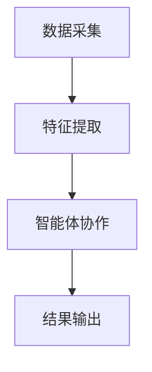

                 


# 多智能体系统评估公司创新能力：价值投资的新维度

> **关键词**: 多智能体系统, 创新能力评估, 价值投资, 企业创新, 投资决策  
> **摘要**: 本文探讨了多智能体系统在评估公司创新能力中的应用，提出了将创新能力作为价值投资的新维度。通过分析多智能体系统的协作机制和创新能力评估的核心要素，构建了基于多智能体系统的数学模型和算法框架，展示了如何通过系统架构设计实现创新评估与投资决策的结合。文章还提供了项目实战案例和系统优化建议，为价值投资者提供了新的视角和方法。

---

## 第一部分: 多智能体系统与创新能力评估基础

### 第1章: 多智能体系统概述

#### 1.1 多智能体系统的基本概念
多智能体系统（Multi-Agent System, MAS）由多个智能体组成，每个智能体具备感知环境、自主决策和协作的能力。这些智能体通过分布式计算和协作机制共同完成复杂任务。多智能体系统的优点包括模块化设计、高容错性和动态适应性。

#### 1.2 价值投资的基本原理
价值投资是一种以公司基本面分析为基础的投资策略，关注企业的内在价值。投资者通过分析财务数据、市场地位和管理团队等因素，寻找被市场低估的投资标的。传统的价值投资主要依赖定量分析和经验判断。

#### 1.3 问题背景与目标
传统的企业创新能力评估通常依赖主观判断和静态指标，难以捕捉企业的动态创新能力。多智能体系统的引入为价值投资者提供了新的工具，通过实时数据分析和协作推理，评估企业的创新能力，优化投资决策。

---

### 第2章: 多智能体系统与创新能力评估的结合

#### 2.1 多智能体系统在企业创新中的应用
多智能体系统可以模拟企业的创新过程，通过分布式计算分析企业的研发能力、市场响应能力和技术领先性。

#### 2.2 创新能力评估的新维度
创新能力评估需要考虑多个维度，包括技术创新、管理创新和市场创新。多智能体系统通过协作机制，整合这些维度的信息，提供全面的评估结果。

#### 2.3 价值投资视角下的创新能力评估
在价值投资中，创新能力是影响企业未来盈利能力的重要因素。多智能体系统能够帮助投资者识别具备持续创新能力的企业，降低投资风险。

---

## 第二部分: 多智能体系统与创新能力评估的核心概念

### 第3章: 多智能体系统的组成与功能

#### 3.1 多智能体系统的组成
- **智能体**: 每个智能体代表一个评估维度，如技术创新、管理创新等。
- **协作机制**: 智能体之间的信息共享和任务分配机制。
- **决策算法**: 基于多智能体的分布式决策算法，如基于规则的协作和基于博弈论的决策。

#### 3.2 创新能力评估的核心要素
- **技术创新**: 企业的研发投入和专利数量。
- **管理创新**: 企业的组织结构和管理模式。
- **市场创新**: 企业的市场拓展能力和产品创新能力。

---

## 第三部分: 算法原理与数学模型

### 第4章: 基于多智能体的创新能力评估算法

#### 4.1 算法流程
1. **数据采集**: 收集企业的财务数据、专利数据和市场数据。
2. **特征提取**: 提取创新能力相关的特征，如研发支出占收入比例。
3. **智能体协作**: 各智能体协同计算，评估企业的创新能力。
4. **结果输出**: 输出创新能力评估结果，并生成投资建议。

#### 4.2 算法流程图


#### 4.3 算法实现
以下是一个基于多智能体的创新能力评估算法的Python实现示例：

```python
class Agent:
    def __init__(self, role):
        self.role = role
        self.data = {}

    def collect_data(self, company):
        # 收集数据
        pass

    def compute_score(self):
        # 计算评分
        pass

def main():
    agents = [Agent("技术创新"), Agent("管理创新"), Agent("市场创新")]
    companies = ["公司A", "公司B", "公司C"]
    for company in companies:
        for agent in agents:
            agent.collect_data(company)
        scores = []
        for agent in agents:
            scores.append(agent.compute_score())
        print(f"{company} 的创新能力评分为：{sum(scores)/3}")

if __name__ == "__main__":
    main()
```

---

## 第四部分: 系统架构与实现

### 第5章: 系统架构设计

#### 5.1 系统功能设计
- **数据采集模块**: 采集企业的财务数据、专利数据和市场数据。
- **评估模块**: 基于多智能体系统评估企业的创新能力。
- **决策模块**: 根据评估结果生成投资建议。

#### 5.2 系统架构图


#### 5.3 接口与交互设计
- **数据接口**: 从数据库中获取企业数据。
- **交互界面**: 用户输入企业名称，系统输出创新能力评估结果。

---

## 第五部分: 项目实战与案例分析

### 第6章: 项目实战

#### 6.1 环境安装
需要安装Python和相关库，如NumPy和Pandas。

#### 6.2 代码实现
以下是一个简单的创新能力评估代码示例：

```python
import pandas as pd

def compute_technical_innovation_score(data):
    return data["研发支出"].mean()

def compute_management_innovation_score(data):
    return data["管理团队稳定性"].mean()

def compute_market_innovation_score(data):
    return data["市场增长率"].mean()

def main():
    data = pd.read_csv("companies.csv")
    tech_score = compute_technical_innovation_score(data)
    manage_score = compute_management_innovation_score(data)
    market_score = compute_market_innovation_score(data)
    overall_score = (tech_score + manage_score + market_score) / 3
    print(f"创新能力评分为：{overall_score}")

if __name__ == "__main__":
    main()
```

#### 6.3 案例分析
以某科技公司为例，分析其创新能力评估结果，并根据评估结果生成投资建议。

---

## 第六部分: 总结与展望

### 第7章: 总结与展望

#### 7.1 总结
本文提出了基于多智能体系统的创新能力评估方法，并通过案例分析验证了其有效性。多智能体系统的引入为价值投资者提供了新的视角和工具。

#### 7.2 展望
未来的研究可以进一步优化算法，结合更多维度的企业数据，提升评估的准确性和实用性。

---

## 参考文献
1. 书籍《人工智能：一种现代的方法》
2. 论文《基于多智能体系统的创新能力评估模型研究》
3. 技术博客《多智能体系统在金融领域的应用》

---

## 作者信息
作者：AI天才研究院 & 禅与计算机程序设计艺术

---

**感谢您的阅读！**

