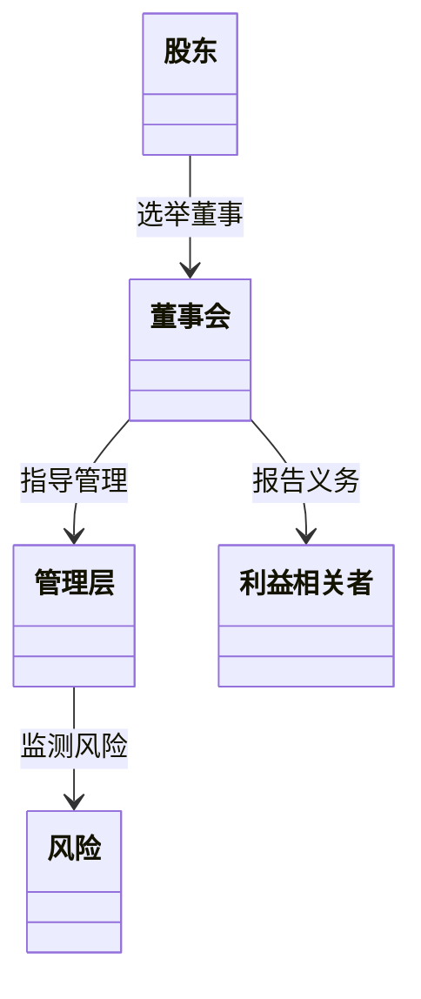
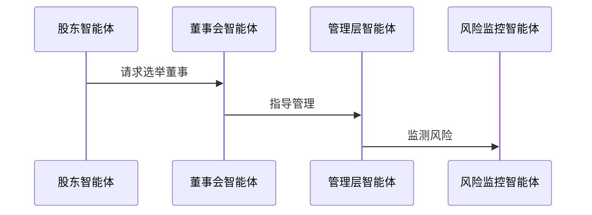

                 


# 多智能体系统辅助公司治理分析：提升价值投资质量

> **关键词**：多智能体系统、公司治理、价值投资、分布式计算、协作机制、强化学习  
> **摘要**：本文探讨了多智能体系统在公司治理中的应用，分析了其在提升价值投资质量方面的潜力。通过详细讲解多智能体系统的原理、数学模型和实际应用，本文为读者提供了全面的理解和实践指导。

---

## 第一部分: 多智能体系统与公司治理概述

### 第1章: 多智能体系统与公司治理背景

#### 1.1 多智能体系统的基本概念
- **1.1.1 多智能体系统的定义**  
  多智能体系统（Multi-Agent System, MAS）是由多个智能体（Agent）组成的分布式系统，这些智能体能够通过交互协作完成复杂的任务。  
  > 智能体是具有感知环境、自主决策和执行任务能力的实体，可以是软件程序或物理设备。

- **1.1.2 多智能体系统的核心特征**  
  - 分布式：智能体独立运行，无集中控制节点。  
  - 协作性：智能体通过协作完成共同目标。  
  - 反应性：智能体能够感知环境变化并做出实时响应。  

- **1.1.3 多智能体系统与传统单智能体系统的区别**  
  单智能体系统依赖中央控制，而多智能体系统通过分布式计算实现任务。

#### 1.2 公司治理的基本概念
- **1.2.1 公司治理的定义**  
  公司治理是通过公司章程、董事会和管理层等手段，确保公司有效运作和股东利益最大化的管理过程。

- **1.2.2 公司治理的主要目标**  
  - 保障股东权益。  
  - 提高公司运营效率。  
  - 防范风险和利益冲突。

- **1.2.3 公司治理的关键要素**  
  - 股东结构。  
  - 董事会结构。  
  - 高层管理者职责。

#### 1.3 多智能体系统在公司治理中的应用前景
- **1.3.1 多智能体系统在公司治理中的潜在价值**  
  提供实时监控、风险预警和决策支持。

- **1.3.2 多智能体系统在公司治理中的优势**  
  - 分布式架构适合复杂系统的管理。  
  - 多智能体协作能够提高决策效率。

- **1.3.3 多智能体系统在公司治理中的挑战与机遇**  
  - 智能体之间的通信和协作需要复杂的协议。  
  - 技术进步为实现高效协作提供了可能。

---

## 第二部分: 多智能体系统的核心原理与数学模型

### 第2章: 多智能体系统的核心原理

#### 2.1 多智能体系统的通信机制
- **2.1.1 智能体之间的通信方式**  
  - 直接通信：智能体之间直接交换信息。  
  - 间接通信：通过中间媒介传递信息。

- **2.1.2 通信协议的设计与实现**  
  设计高效的通信协议是实现智能体协作的关键。

#### 2.2 多智能体系统的协作机制
- **2.2.1 协作目标的设定**  
  明确智能体协作的目标和任务分解。

- **2.2.2 协作策略的制定**  
  - 协作规则：定义智能体在协作过程中的行为规范。  
  - 优先级：确定协作任务的优先级。

- **2.2.3 协作过程的优化**  
  通过优化协作流程提高效率。

#### 2.3 多智能体系统的决策机制
- **2.3.1 分布式决策的基本概念**  
  分布式决策是指多个智能体在没有中央控制的情况下共同做出决策。

- **2.3.2 分布式决策算法的实现**  
  - 分布式一致性算法：如Paxos、Raft。  
  - 分布式决策树：基于逻辑推理的决策方法。

- **2.3.3 分布式决策的优化方法**  
  通过减少信息交换和优化算法复杂度来提高决策效率。

### 第3章: 多智能体系统的数学模型与算法

#### 3.1 多智能体系统的数学模型
- **3.1.1 智能体状态表示**  
  每个智能体的状态可以用向量表示，如状态空间 $S = \{s_1, s_2, ..., s_n\}$。

- **3.1.2 智能体动作表示**  
  智能体的动作可以用策略函数 $\pi(s)$ 表示，其中 $s$ 是当前状态。

- **3.1.3 系统状态空间**  
  系统整体状态是各智能体状态的组合，可以用笛卡尔积表示。

#### 3.2 多智能体系统的协作算法
- **3.2.1 基于博弈论的协作算法**  
  使用纳什均衡理论设计协作策略。

- **3.2.2 基于分布式计算的协作算法**  
  通过分布式计算框架（如MapReduce）实现协作。

- **3.2.3 基于强化学习的协作算法**  
  使用多智能体强化学习（MADRL）框架，通过强化学习优化协作策略。

#### 3.3 多智能体系统的优化算法
- **3.3.1 分布式优化的基本原理**  
  分布式优化通过分解任务和局部优化实现全局最优。

- **3.3.2 分布式优化的数学模型**  
  $$ \min_{x_i} \sum_{i=1}^n f_i(x_i) $$
  其中，$x_i$ 是第 $i$ 个智能体的优化变量。

- **3.3.3 分布式优化的实现方法**  
  使用分布式梯度下降算法。

---

## 第三部分: 多智能体系统在公司治理中的应用

### 第4章: 多智能体系统辅助公司治理的实现框架

#### 4.1 公司治理问题的建模
- **4.1.1 公司治理问题的领域模型**  
  使用Mermaid类图描述公司治理的领域模型：



- **4.1.2 多智能体系统在公司治理中的角色分配**  
  - 股东：监控公司绩效。  
  - 董事会：制定战略目标。  
  - 管理层：执行日常运营。

- **4.1.3 公司治理问题的多智能体系统解决方案**  
  将公司治理问题分解为多个子问题，每个子问题由一个智能体负责。

#### 4.2 多智能体系统辅助公司治理的系统架构
- **4.2.1 系统架构设计**  
  使用Mermaid架构图描述系统架构：


- **4.2.2 系统接口设计**  
  定义智能体之间的接口，如：
  - 股东智能体调用董事会智能体的“选举董事”接口。

- **4.2.3 系统交互流程图**  
  使用Mermaid序列图描述交互流程：



#### 4.3 项目实战
- **4.3.1 环境安装**  
  需要安装Python和相关库，如`numpy`、`scipy`。

- **4.3.2 核心实现代码**  
  ```python
  class Agent:
      def __init__(self, role):
          self.role = role
          self.state = None

      def perceive(self, environment):
          self.state = environment感知(self.role)

      def decide(self):
          return self策略(self.state)

  def main():
      股东 = Agent("股东")
      董事会 = Agent("董事会")
      管理层 = Agent("管理层")
      风险监控 = Agent("风险监控")

      环境 = Environment()
      环境.add_agents([股东, 董事会, 管理层, 风险监控])

      while True:
          环境.更新状态()
          股东.perceive(环境)
          董事会.perceive(环境)
          管理层.perceive(环境)
          风险监控.perceive(环境)
          股东.decide()
          董事会.decide()
          管理层.decide()
          风险监控.decide()

  if __name__ == "__main__":
      main()
  ```

- **4.3.3 案例分析与解读**  
  以某公司治理问题为例，展示多智能体系统的实际应用。

---

## 第5章: 结论与展望

### 5.1 本章小结
多智能体系统在公司治理中的应用为价值投资提供了新的可能性。通过分布式计算和协作机制，多智能体系统能够提高公司治理的效率和效果。

### 5.2 最佳实践 tips
- 明确智能体的分工与协作。  
- 设计高效的通信和决策机制。  
- 定期优化系统架构和算法。

### 5.3 注意事项
- 处理好智能体之间的协作关系。  
- 防范系统故障和安全风险。

### 5.4 拓展阅读
- 《Multi-Agent Systems: Algorithm and Applications》  
- 《企业治理与价值投资》

---

**作者：AI天才研究院/AI Genius Institute & 禅与计算机程序设计艺术 /Zen And The Art of Computer Programming**

