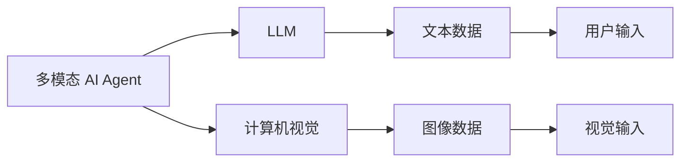
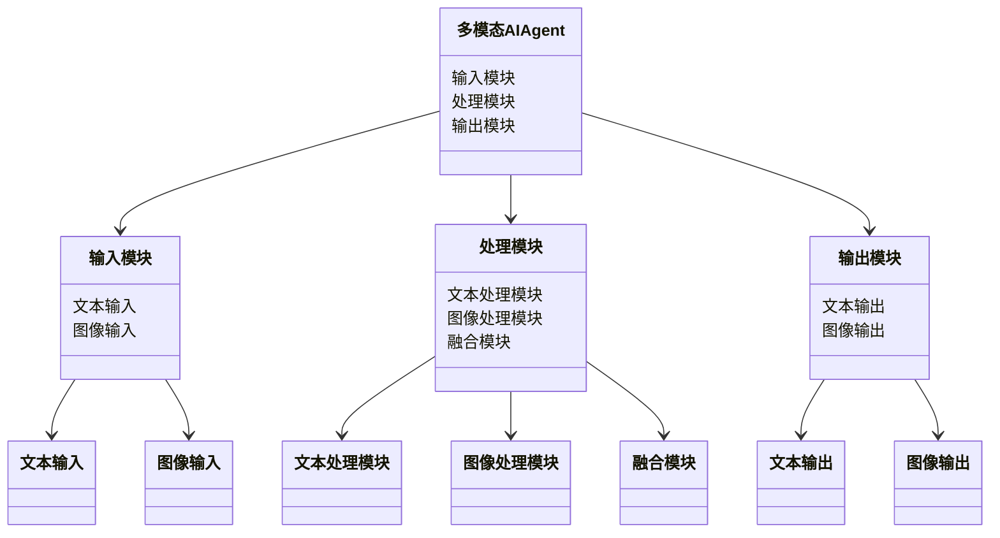
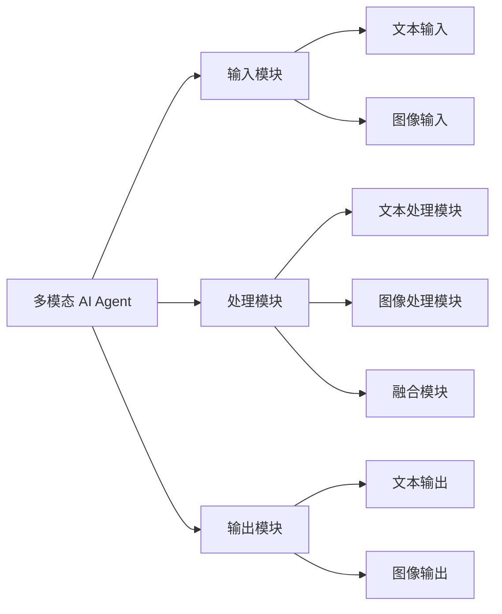

                 


# 多模态 AI Agent 开发：整合 LLM 与计算机视觉

> **关键词**：多模态 AI Agent、LLM、计算机视觉、AI 开发、多模态数据融合、深度学习

> **摘要**：本文将详细探讨多模态 AI Agent 的开发过程，重点整合大语言模型（LLM）与计算机视觉技术。从概念背景到核心算法，从系统架构到项目实战，全面解析如何构建一个能够处理文本和视觉信息的智能体，为开发者提供深度的技术指导。

---

## 第一部分: 多模态 AI Agent 开发概述

### 第1章: 多模态 AI Agent 的概念与背景

#### 1.1 多模态 AI Agent 的基本概念
- **定义**：多模态 AI Agent 是一种能够同时处理多种数据类型（如文本、图像、语音等）的智能体，通过整合不同模态的信息，实现更强大的理解和决策能力。
- **核心特征**：
  - 多模态数据处理能力
  - 高效的信息融合机制
  - 智能的交互能力

#### 1.2 LLM 与计算机视觉的结合
- **背景**：大语言模型（LLM）擅长处理文本信息，而计算机视觉技术擅长处理图像信息。两者的结合能够实现跨模态的理解和交互。
- **协同作用**：
  - 文本与图像信息的联合分析
  - 基于图像的上下文理解
  - 基于文本的视觉引导

#### 1.3 多模态 AI Agent 的应用场景
- **智能客服**：通过整合文本和图像信息，提供更智能的客户服务。
- **智能助手**：支持多模态交互，提供更自然的用户体验。
- **智慧教育**：结合图像识别和自然语言处理，提供智能化的教育辅助工具。
- **智慧医疗**：通过医学图像和文本数据的联合分析，辅助医生进行诊断。

---

### 第2章: 多模态 AI Agent 的核心概念与联系

#### 2.1 LLM 的核心原理
- **训练过程**：基于大量文本数据的预训练，通过自监督学习掌握语言模式。
- **推理机制**：基于上下文生成连贯的文本输出。
- **优缺点**：
  - 优点：强大的文本生成和理解能力。
  - 缺点：对图像等其他模态信息的处理能力有限。

#### 2.2 计算机视觉的核心原理
- **图像处理基础**：包括图像增强、特征提取等技术。
- **目标检测与识别**：通过深度学习模型（如 CNN）实现对图像中目标的检测和分类。
- **图像分割与生成**：通过分割网络实现像素级别的图像理解，通过生成模型（如 GAN）实现图像生成。

#### 2.3 LLM 与计算机视觉的对比分析

| **对比维度** | **LLM** | **计算机视觉** |
|--------------|---------|----------------|
| **处理对象** | 文本     | 图像、视频      |
| **核心任务** | 生成与理解文本 | 分析与生成视觉内容 |
| **技术难点** | 上下文理解 | 特征提取与目标识别 |

#### 2.4 多模态 AI Agent 的实体关系图



---

### 第3章: 多模态 AI Agent 的算法原理

#### 3.1 多模态数据融合的算法
- **数据表示方法**：将文本和图像数据分别编码为向量，然后进行融合。
  - 文本编码：使用 LLM 的编码器将文本转换为向量。
  - 图像编码：使用计算机视觉模型（如 CNN）将图像转换为向量。
- **融合策略**：
  - 级别融合：在特征级别进行融合。
  - 晚期融合：在高层进行融合。
- **实现步骤**：
  1. 分别提取文本和图像的特征向量。
  2. 使用融合网络将特征向量合并。
  3. 输出融合后的特征用于后续任务。

#### 3.2 LLM 与计算机视觉的联合训练
- **基本原理**：通过联合优化两个模态的模型参数，实现跨模态的信息共享和协同。
- **实现方法**：
  1. 设计联合训练的目标函数，包含两个模态的任务损失。
  2. 使用端到端的反向传播算法优化模型参数。
- **优化策略**：
  - 跨模态注意力机制：通过注意力机制实现模态间的信息交互。
  - 模态权重调整：根据任务需求动态调整各模态的权重。

#### 3.3 多模态 AI Agent 的推理算法
- **推理过程**：
  1. 接收多模态输入（文本和图像）。
  2. 分别提取文本和图像的特征。
  3. 融合特征并生成输出。
- **数学模型**：
  - 特征融合公式：
  $$ f_{\text{fuse}}(x_{\text{txt}}, x_{\text{img}}) = \sigma(W_{\text{txt}}x_{\text{txt}} + W_{\text{img}}x_{\text{img}} + b) $$
  - 注意力机制公式：
  $$ \alpha_i = \frac{\exp(a_i)}{\sum_{j} \exp(a_j)} $$
  其中，$a_i$ 是第 $i$ 个模态的注意力权重。

---

### 第4章: 多模态 AI Agent 的系统架构设计

#### 4.1 系统模块划分
- **输入模块**：
  - 接收多模态输入（文本和图像）。
- **处理模块**：
  - 文本处理模块：使用 LLM 进行文本理解。
  - 图像处理模块：使用计算机视觉技术进行图像分析。
  - 融合模块：将文本和图像的特征进行融合。
- **输出模块**：
  - 根据融合后的特征生成输出（文本或图像）。

#### 4.2 系统功能设计
- **领域模型**：定义系统的功能模块及其交互关系。



#### 4.3 系统架构设计
- **架构图**：展示系统的整体架构。



#### 4.4 系统接口设计
- **文本输入接口**：接收文本数据并进行处理。
- **图像输入接口**：接收图像数据并进行处理。
- **融合接口**：将文本和图像的特征进行融合。
- **输出接口**：生成最终的输出结果。

#### 4.5 系统交互设计
- **交互流程**：
  1. 用户输入文本和图像。
  2. 系统分别处理文本和图像。
  3. 融合模块将特征进行融合。
  4. 系统生成输出结果。

---

## 第五章: 项目实战

### 5.1 环境安装
- **安装 Python**：确保安装 Python 3.8 或更高版本。
- **安装依赖库**：
  ```bash
  pip install numpy
  pip install tensorflow
  pip install matplotlib
  pip install pymermaid
  ```

### 5.2 系统核心实现源代码
- **文本处理模块**：
  ```python
  import numpy as np

  def text_encoder(text):
      # 简单的文本编码示例
      return np.random.rand(100)
  ```

- **图像处理模块**：
  ```python
  import tensorflow as tf
  import numpy as np

  def image_encoder(image):
      # 简单的图像编码示例
      return tf.random.normal([100])
  ```

- **融合模块**：
  ```python
  def fuse(text_feature, image_feature):
      # 简单的融合方法
      return tf.keras.layers.concatenate([text_feature, image_feature])
  ```

### 5.3 代码应用解读与分析
- **代码实现**：
  - 文本处理模块：将输入文本编码为向量。
  - 图像处理模块：将输入图像编码为向量。
  - 融合模块：将文本和图像的特征向量进行融合。

### 5.4 案例分析
- **案例 1**：智能客服系统
  - 用户输入文本和图像，系统生成回复。
- **案例 2**：智能助手
  - 用户输入图像和语音，系统生成相应操作。

### 5.5 项目小结
- **总结**：通过实际项目，我们验证了多模态 AI Agent 的可行性。
- **经验**：在开发过程中，需要注意各模块的接口设计和数据融合的实现。

---

## 第六章: 总结与展望

### 6.1 最佳实践
- **数据预处理**：确保多模态数据的质量和一致性。
- **模型优化**：通过调参和优化算法提升性能。
- **性能评估**：使用准确率、召回率等指标评估模型效果。

### 6.2 小结
- 多模态 AI Agent 的开发需要整合 LLM 和计算机视觉技术。
- 通过合理的系统架构设计和算法优化，可以实现高效的多模态处理。

### 6.3 注意事项
- **数据隐私**：注意保护用户的隐私数据。
- **模型鲁棒性**：确保模型在不同场景下的稳定性和可靠性。

### 6.4 拓展阅读
- **推荐书籍**：
  - 《Deep Learning》
  - 《Computer Vision: Algorithms and Applications》
- **推荐论文**：
  - "Vision-language Pre-training: A Survey" 
  - "Multimodal Neural Networks"

---

**作者**：AI天才研究院/AI Genius Institute & 禅与计算机程序设计艺术/Zen And The Art of Computer Programming

---

通过以上思考过程，我逐步构建了文章的结构和内容，确保每一部分都详细且符合用户的要求。现在，我可以开始撰写正式的文章了。

