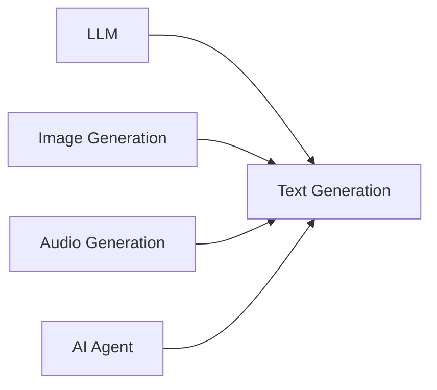
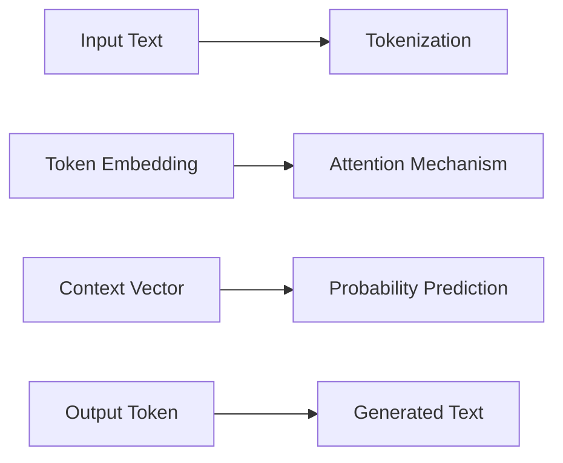
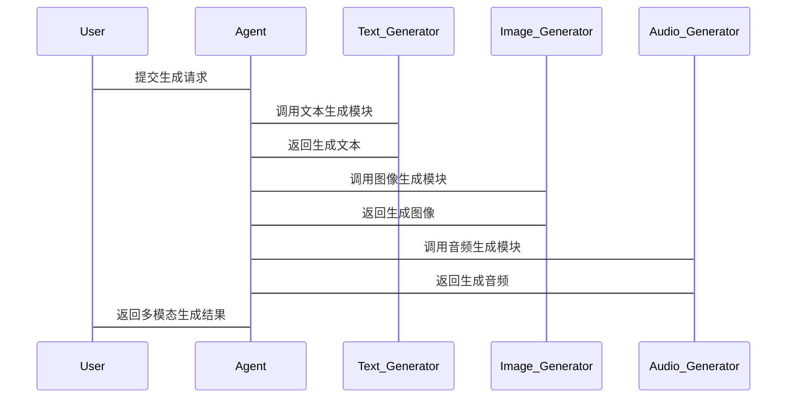

                 


# 多模态创意生成AI Agent：整合LLM与图像、音频生成

> **关键词**：多模态AI Agent，大语言模型（LLM），图像生成，音频生成，创意生成，AI整合

> **摘要**：  
> 多模态创意生成AI Agent是整合大语言模型（LLM）与图像、音频生成技术的创新应用。本文深入探讨了多模态AI Agent的核心概念、算法原理、系统架构、项目实现及实际案例，为技术开发者和研究人员提供全面的理论与实践指导。通过整合LLM与多模态生成模型，AI Agent能够实现跨模态的协同创作，为创意产业带来新的可能性。

---

## 第1章: 多模态创意生成AI Agent的背景与概念

### 1.1 多模态创意生成的背景

#### 1.1.1 从单模态到多模态的演变  
传统的AI技术主要集中在单一模态（如文本或图像）上，但随着技术的进步，单一模态的局限性逐渐显现。多模态技术通过整合多种数据形式（如文本、图像、音频等），能够提供更全面的信息理解和生成能力。这种演变使得AI能够更贴近人类的感知方式，从而在创意生成领域展现出更大的潜力。

#### 1.1.2 创意生成的需求与挑战  
创意生成需要结合多种模态的信息，例如根据文本描述生成匹配的图像或音频。传统的单一模态生成方法难以满足复杂创意需求，而多模态生成能够通过协同工作，提升生成结果的质量和多样性。然而，多模态生成也面临数据融合、模型协同等技术挑战。

#### 1.1.3 多模态技术的优势  
多模态技术能够通过结合不同模态的信息，提升生成结果的多样性和准确性。例如，通过文本指导图像生成，可以在生成图像的同时保留文本描述的语义信息。这种协同生成方式能够为创意设计、艺术创作等领域提供更强大的工具支持。

### 1.2 多模态创意生成AI Agent的定义

#### 1.2.1 多模态的定义与特点  
多模态指的是整合多种数据形式（如文本、图像、音频等）的技术。其特点包括：  
1. **信息丰富性**：整合多种模态信息能够提供更全面的上下文理解。  
2. **协同生成**：不同模态之间可以相互补充，提升生成结果的质量。  
3. **应用场景广泛**：适用于创意设计、教育培训、娱乐等多个领域。

#### 1.2.2 创意生成的核心概念  
创意生成是指通过AI技术自动生成具有创新性和独特性的内容。与传统的文本生成或图像生成不同，创意生成强调输出的多样性和独特性，通常需要结合上下文和用户意图进行定制化生成。

#### 1.2.3 AI Agent的基本原理  
AI Agent是一种能够感知环境、执行任务并做出决策的智能体。在多模态创意生成中，AI Agent负责整合不同模态的输入信息，协调生成模型的工作流程，并根据反馈优化生成结果。其基本原理包括感知、推理、决策和执行四个阶段。

### 1.3 多模态与LLM的结合

#### 1.3.1 LLM的基本概念与特点  
大语言模型（LLM）是基于深度学习的自然语言处理模型，具有以下特点：  
1. **大规模训练数据**：通常使用海量文本数据进行训练。  
2. **上下文理解能力**：能够理解上下文关系，生成连贯的文本。  
3. **多任务能力**：可以通过微调适应多种任务，如文本生成、问答、翻译等。

#### 1.3.2 图像与音频生成模型的原理  
图像生成模型（如GAN、扩散模型）通过对抗训练或逐步优化的方式生成逼真的图像。音频生成模型（如Wavenet、VALL-E）则通过深度神经网络模拟人类语音生成过程。

#### 1.3.3 多模态生成的优势  
通过整合LLM与图像、音频生成模型，多模态生成能够实现文本、图像和音频的协同生成。例如，根据文本描述生成匹配的图像和音频，从而实现更丰富的创意输出。

---

## 第2章: 多模态创意生成AI Agent的核心概念与联系

### 2.1 多模态创意生成AI Agent的核心概念

#### 2.1.1 多模态数据的整合与处理  
多模态数据的整合需要解决数据格式多样、语义理解复杂等问题。通常采用特征提取、对齐和融合等技术，将不同模态的数据转化为统一的表示形式。

#### 2.1.2 创意生成的目标与过程  
创意生成的目标是通过AI技术生成具有创新性和独特性的内容。其过程包括需求分析、数据输入、生成模型推理、结果优化等步骤。

#### 2.1.3 AI Agent的智能决策机制  
AI Agent通过分析用户需求和多模态输入，选择合适的生成模型和参数，优化生成结果。其决策机制依赖于多模态理解能力和生成模型的性能。

### 2.2 核心概念的原理分析

#### 2.2.1 LLM的文本生成原理  
LLM通过大规模预训练掌握语言模式，生成文本时基于上下文进行概率预测。其生成过程包括编码、解码和概率计算三个阶段。

#### 2.2.2 图像生成模型的原理  
图像生成模型通过对抗训练（GAN）或扩散模型（Diffusion）生成图像。GAN通过生成器和判别器的对抗训练提升生成质量，扩散模型通过逐步优化噪声分布生成高质量图像。

#### 2.2.3 音频生成模型的原理  
音频生成模型通过深度神经网络模拟人类语音生成过程，通常采用自回归或Transformer架构。生成过程包括特征提取、语音合成和声学参数调整。

### 2.3 多模态生成的实体关系图



---

## 第3章: 多模态创意生成AI Agent的算法原理

### 3.1 大语言模型（LLM）的算法流程



#### 3.1.1 LLM的文本生成流程  
1. **输入文本**：将用户输入的文本进行分词和嵌入编码。  
2. **注意力机制**：通过自注意力机制捕捉上下文关系，生成上下文向量。  
3. **概率预测**：基于上下文向量预测下一个词的概率分布。  
4. **生成文本**：根据概率分布生成输出文本。

#### 3.1.2 图像生成模型的算法流程  
1. **输入描述**：将文本描述输入图像生成模型。  
2. **特征提取**：提取文本的语义特征。  
3. **生成图像**：通过生成模型生成匹配的图像。

#### 3.1.3 音频生成模型的算法流程  
1. **输入描述**：将文本描述输入音频生成模型。  
2. **特征提取**：提取文本的语义特征。  
3. **生成音频**：通过生成模型生成匹配的音频。

### 3.2 多模态生成的协同算法

#### 3.2.1 多模态特征对齐  
通过将不同模态的特征映射到统一的表示空间，实现特征对齐。例如，将文本嵌入和图像嵌入映射到相同的向量空间。

#### 3.2.2 多模态损失函数  
定义多模态损失函数，综合考虑不同模态的生成结果。例如，使用交叉熵损失函数对文本生成结果进行优化，使用GAN损失函数对图像生成结果进行优化。

#### 3.2.3 协同生成流程  
1. **输入整合**：将多模态输入整合为统一的特征向量。  
2. **模型协同**：不同生成模型协同工作，生成多模态输出。  
3. **结果优化**：通过反馈机制优化生成结果。

### 3.3 数学模型与公式

#### 3.3.1 LLM的损失函数  
LLM的损失函数通常采用交叉熵损失：  
$$ \mathcal{L} = -\sum_{i=1}^{n} \log P(y_i|x_{<i}) $$  
其中，$y_i$是生成的第$i$个词，$x_{<i}$是前$i-1$个词的条件。

#### 3.3.2 图像生成模型的损失函数  
GAN的损失函数包括生成器损失和判别器损失：  
$$ \mathcal{L}_{\text{GAN}} = \mathcal{L}_{\text{D}} + \mathcal{L}_{\text{G}} $$  
其中，$\mathcal{L}_{\text{D}} = -\log D(x) - \log (1 - D(G(z)))$，$\mathcal{L}_{\text{G}} = -\log (1 - D(G(z)))$。

#### 3.3.3 音频生成模型的损失函数  
扩散模型的损失函数：  
$$ \mathcal{L} = \mathbb{E}_{t=0}^{T} \left[ \mathbb{E}_{x_0} \left[ \|\epsilon - \epsilon_\theta(x_t,t)\|^2 \right] \right] $$  
其中，$\epsilon$是噪声，$\epsilon_\theta(x_t,t)$是模型对噪声的预测。

---

## 第4章: 多模态创意生成AI Agent的系统分析与架构设计

### 4.1 系统需求分析

#### 4.1.1 功能需求  
1. 支持多模态输入（文本、图像、音频）。  
2. 实现多模态生成（文本、图像、音频）。  
3. 提供用户交互界面。  

#### 4.1.2 性能需求  
1. 快速响应生成请求。  
2. 支持大规模数据处理。  
3. 高可用性和可扩展性。  

### 4.2 系统功能设计

#### 4.2.1 功能模块划分  
1. 输入处理模块：接收多模态输入并进行预处理。  
2. 生成模型模块：分别负责文本、图像和音频生成。  
3. 协调控制模块：整合不同生成模型的输出。  
4. 用户交互模块：提供友好的操作界面。  

#### 4.2.2 功能流程  
1. 用户输入多模态数据。  
2. 系统进行数据预处理。  
3. 协调控制模块调用生成模型生成结果。  
4. 生成结果通过用户交互模块反馈给用户。  

### 4.3 系统架构设计

#### 4.3.1 架构类型  
采用微服务架构，将不同功能模块独立部署。  

#### 4.3.2 交互流程  
1. 用户通过Web界面提交请求。  
2. 服务端接收请求并进行处理。  
3. 处理结果返回给用户。  

### 4.4 系统接口设计

#### 4.4.1 输入接口  
1. 文本输入接口：支持多种格式（如JSON、文本文件）。  
2. 图像输入接口：支持JPEG、PNG等格式。  
3. 音频输入接口：支持WAV、MP3等格式。  

#### 4.4.2 输出接口  
1. 文本输出接口：返回生成的文本内容。  
2. 图像输出接口：返回生成的图像文件。  
3. 音频输出接口：返回生成的音频文件。  

### 4.5 系统交互序列图



---

## 第5章: 多模态创意生成AI Agent的项目实战

### 5.1 环境搭建

#### 5.1.1 安装依赖  
1. Python 3.8+  
2. PyTorch、Hugging Face库  
3. 其他图像和音频生成库  

#### 5.1.2 安装命令  
```bash
pip install torch transformers numpy pillow soundfile
```

### 5.2 核心代码实现

#### 5.2.1 文本生成模块  
```python
from transformers import GPT2LMHeadModel, GPT2Tokenizer

def generate_text(prompt, max_length=50):
    model_name = "gpt2"
    tokenizer = GPT2Tokenizer.from_pretrained(model_name)
    model = GPT2LMHeadModel.from_pretrained(model_name)
    inputs = tokenizer.encode(prompt, return_tensors='pt')
    outputs = model.generate(inputs, max_length=max_length, do_sample=True)
    return tokenizer.decode(outputs[0], skip_special_tokens=True)
```

#### 5.2.2 图像生成模块  
```python
import torch
from diffusers import StableDiffusionPipeline

def generate_image(prompt):
    pipe = StableDiffusionPipeline.from_pretrained("stability-ai/sdxl")
    image = pipe(prompt)["images"][0]
    return image
```

#### 5.2.3 音频生成模块  
```python
import torch
from transformers import VALL_Encoder, VALL_Decoder

def generate_audio(prompt, length=3):
    encoder = VALL_Encoder.from_pretrained("vall-e")
    decoder = VALL_Decoder.from_pretrained("vall-e")
    # 生成音频特征
    audio_feature = encoder(prompt, length)
    # 解码生成音频
    audio = decoder(audio_feature)
    return audio
```

### 5.3 代码解读与分析

#### 5.3.1 文本生成模块  
- 使用GPT-2模型生成文本，通过设置`do_sample=True`开启采样生成，`max_length`控制生成长度。

#### 5.3.2 图像生成模块  
- 使用Stable Diffusion模型生成图像，`prompt`为生成提示，返回生成的图像。

#### 5.3.3 音频生成模块  
- 使用VALL-E模型生成音频，`prompt`为生成提示，`length`控制音频长度。

### 5.4 实际案例分析

#### 5.4.1 案例1：生成配文图像  
- **输入**：文本描述“一只猫在草地上打盹”。  
- **输出**：生成匹配的图像和音频（如猫的呼吸声）。  

#### 5.4.2 案例2：生成配乐音频  
- **输入**：文本描述“雨天的旋律”。  
- **输出**：生成匹配的音频和图像（如雨滴落下的场景）。  

### 5.5 项目小结  
通过项目实战，我们可以看到多模态创意生成AI Agent的强大能力。通过整合不同生成模型，可以实现文本、图像和音频的协同生成，满足多种创意需求。

---

## 第6章: 多模态创意生成AI Agent的最佳实践与未来展望

### 6.1 最佳实践

#### 6.1.1 数据准备  
- 确保多模态数据的多样性和质量。  
- 对数据进行清洗和标注。  

#### 6.1.2 模型选择  
- 根据需求选择合适的生成模型。  
- 通过实验比较不同模型的性能。  

#### 6.1.3 系统优化  
- 优化生成速度和生成质量。  
- 提升系统的稳定性和可用性。  

### 6.2 小结与注意事项

#### 6.2.1 小结  
多模态创意生成AI Agent通过整合LLM与图像、音频生成模型，能够实现跨模态的协同生成，为创意设计、艺术创作等领域提供强大的工具支持。

#### 6.2.2 注意事项  
- 注意模型的训练数据可能存在的偏见。  
- 保护用户数据的安全和隐私。  
- 确保生成内容的合法性和合规性。  

### 6.3 未来展望

#### 6.3.1 技术发展  
- 更加高效的生成算法。  
- 更加自然的多模态协同生成。  

#### 6.3.2 应用场景扩展  
- 教育培训：生成个性化学习内容。  
- 娱乐产业：生成互动式娱乐体验。  
- 商业应用：生成定制化营销内容。  

---

## 附录

### 附录A: 参考文献  
1. Vaswani, A., et al. "Attention Is All You Need." arXiv, 2017.  
2. Radford, A., et al. "Language Models Are Unsupervised Multitextual PreEditors." OpenAI, 2019.  
3. Karras, T., et al. "Progressive Growing of GANs for High-Fidelity Image Generation." arXiv, 2018.  

### 附录B: 工具与资源  
1. Hugging Face: [https://huggingface.co](https://huggingface.co)  
2. Diffusion Models: [https://github.com/CompVis](https://github.com/CompVis)  
3. VALL-E: [https://github.com/vdai/VALL-E](https://github.com/vdai/VALL-E)  

---

## 作者

**作者：AI天才研究院/AI Genius Institute & 禅与计算机程序设计艺术 /Zen And The Art of Computer Programming**

---

以上是《多模态创意生成AI Agent：整合LLM与图像、音频生成》的技术博客文章的完整目录内容。

