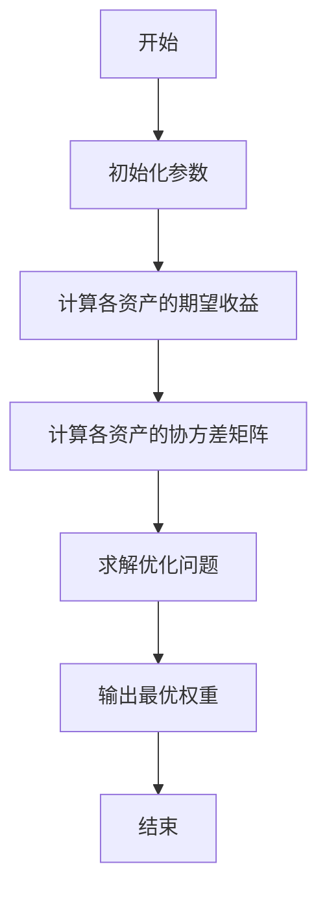
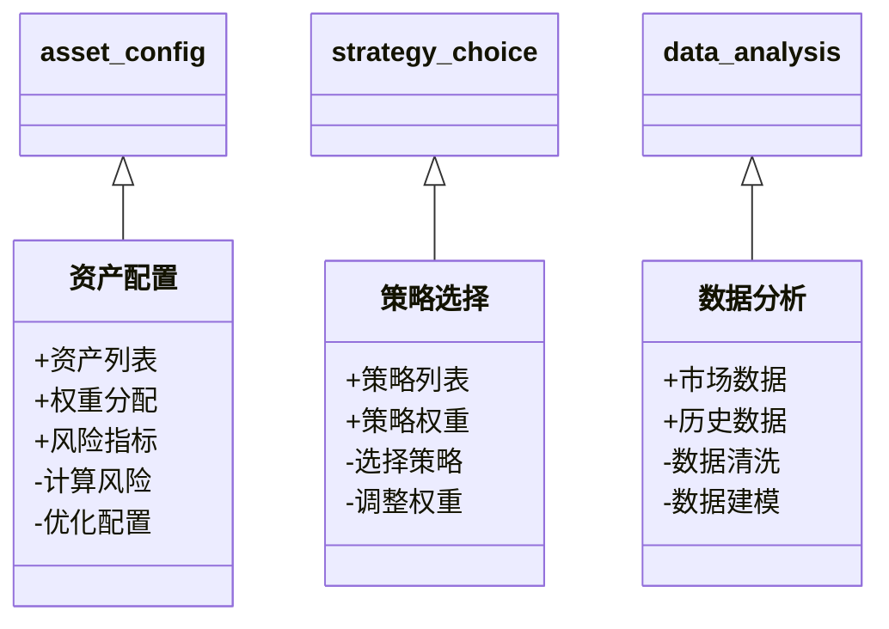
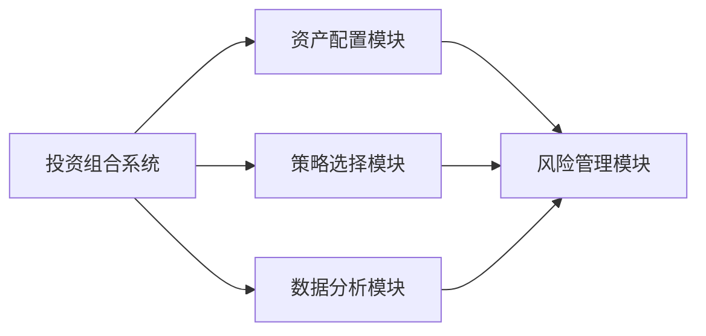
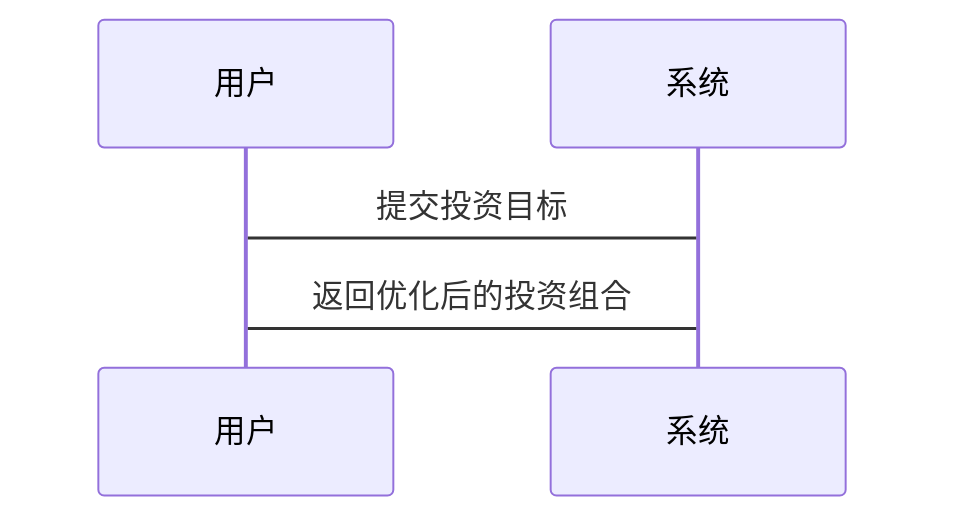

                 


# 多策略投资组合：综合运用不同投资方法

---

## 关键词

多策略投资、投资组合优化、风险管理、资产配置、投资策略、金融数据分析

---

## 摘要

多策略投资组合是一种通过综合运用多种投资策略来优化资产配置、降低风险、提高收益的有效方法。本文从多策略投资的基本概念出发，详细讲解了多策略投资组合的数学模型与算法原理，分析了系统的架构设计，并通过实际案例展示了如何构建一个多策略投资组合系统。文章内容涵盖背景介绍、核心概念、数学公式、系统架构、项目实战等多个方面，帮助读者全面理解多策略投资组合的理论与实践。

---

## 正文

---

## 第一部分：多策略投资组合的背景与基础

### 第1章：多策略投资组合概述

#### 1.1 多策略投资的基本概念

##### 1.1.1 投资组合的基本定义

投资组合是指将一定数量的金融资产（如股票、债券、基金等）按照一定比例配置在一起，以实现特定投资目标的组合。投资组合的核心目标是在风险可控的前提下，实现收益的最大化。

##### 1.1.2 多策略投资的定义与特点

多策略投资是一种综合运用多种投资策略的投资方法，通过将不同类型的资产和策略相结合，优化投资组合的风险收益比。其特点是灵活性高、风险分散性强、收益来源多样化。

##### 1.1.3 多策略投资的优缺点分析

| 优点 | 缺点 |
|------|------|
| 风险分散，收益稳定 | 策略间可能存在冲突，需要精细的协调 |
| 适应不同市场环境 | 管理复杂度高，需要专业的知识和技能 |
| 收益来源多样化 | 需要较高的初始投入和持续的管理成本 |

---

#### 1.2 多策略投资的背景与应用场景

##### 1.2.1 当前金融市场的发展趋势

当前金融市场波动加剧，单一投资策略难以应对复杂多变的市场环境。多策略投资通过结合多种策略，能够在不同市场条件下灵活调整，提高投资的稳健性。

##### 1.2.2 多策略投资的应用场景

多策略投资适用于多种场景，包括：

- **机构投资**：通过多策略投资优化机构资产配置，降低市场波动风险。
- **个人投资**：通过多策略组合实现个人财务目标，平衡风险与收益。
- **风险管理**：通过多策略组合分散风险，降低投资组合的整体波动性。

##### 1.2.3 多策略投资的边界与外延

多策略投资的边界在于不同策略之间的协同与平衡，外延则包括新兴的金融工具和数据分析技术。

---

#### 1.3 多策略投资的核心要素

##### 1.3.1 投资目标与风险偏好

投资目标是投资组合的核心，而风险偏好决定了资产配置的结构。多策略投资需要根据投资者的目标和风险承受能力，选择合适的策略组合。

##### 1.3.2 不同投资策略的对比分析

以下是几种常见的投资策略对比：

| 策略类型 | 定义 | 优点 | 缺点 |
|----------|------|------|------|
| 股票投资 | 通过购买股票获得收益 | 收益潜力大 | 风险高 |
| 债券投资 | 通过购买债券获得固定收益 | 风险低 | 收益有限 |
| 商品投资 | 投资黄金、原油等商品 | 抗通胀能力强 | 市场波动大 |
| 对冲基金 | 通过做多、做空实现收益 | 灵活性高 | 成本高 |

##### 1.3.3 投资组合的构建与优化

投资组合的构建需要考虑以下因素：

- **资产配置**：不同资产的比例分配。
- **策略选择**：选择适合目标的多种策略。
- **风险控制**：通过分散投资降低风险。

---

## 第二部分：多策略投资组合的数学模型与算法原理

### 第2章：投资组合优化的数学模型

#### 2.1 投资组合优化的基本原理

##### 2.1.1 均值-方差模型的介绍

均值-方差模型是投资组合优化的经典模型，由Harry Markowitz提出。该模型通过最小化投资组合的方差（风险）来实现收益最大化。

##### 2.1.2 风险调整后的收益最大化

在多策略投资中，收益不仅要看绝对数值，还需要考虑风险调整后的收益。常用的风险调整指标包括夏普比率和特雷纳比率。

##### 2.1.3 投资组合优化的约束条件

投资组合优化通常受到以下约束：

- **权重约束**：每种资产的权重不能超过一定比例。
- **流动性约束**：投资组合需要保持一定的流动性。
- **风险约束**：投资组合的整体风险不能超过设定值。

#### 2.2 多策略投资组合的数学公式

##### 2.2.1 均值-方差模型的公式推导

目标函数：
$$ \text{目标函数：} \min \sigma^2 $$

约束条件：
$$ \sum_{i=1}^n w_i = 1 $$

其中，$w_i$ 是第 $i$ 种资产的权重，$\sigma^2$ 是投资组合的方差。

##### 2.2.2 多策略组合的风险调整公式

风险调整后收益：
$$ \text{风险调整后收益} = R_p - \lambda \sigma_p $$

其中，$R_p$ 是投资组合的收益，$\sigma_p$ 是投资组合的风险，$\lambda$ 是风险厌恶系数。

#### 2.3 投资组合优化的算法流程



---

## 第三部分：多策略投资组合的系统分析与架构设计

### 第3章：多策略投资系统的系统架构

#### 3.1 系统功能需求分析

##### 3.1.1 投资组合管理模块

- **功能**：实现多策略投资组合的构建与优化。
- **需求**：支持多种策略的组合优化，提供实时市场数据接口。

##### 3.1.2 风险管理模块

- **功能**：实时监控投资组合的风险指标。
- **需求**：提供风险预警机制，支持风险调整策略。

##### 3.1.3 数据分析模块

- **功能**：对历史数据进行分析，支持策略回测。
- **需求**：提供数据可视化功能，支持多种数据分析方法。

#### 3.2 系统架构设计

##### 3.2.1 领域模型设计



##### 3.2.2 系统架构设计



##### 3.2.3 接口设计与交互设计



---

## 第四部分：多策略投资组合的项目实战

### 第4章：多策略投资组合的实现

#### 4.1 环境安装与配置

##### 4.1.1 安装Python环境

使用Anaconda或Pythonda环境，安装必要的库，如numpy、pandas、scipy、matplotlib等。

##### 4.1.2 数据源配置

选择合适的金融数据源，如Yahoo Finance或Alpha Vantage。

#### 4.2 核心代码实现

##### 4.2.1 数据获取与处理

```python
import numpy as np
import pandas as pd
import matplotlib.pyplot as plt

# 获取数据
def get_data(tickers, start, end):
    data = pd.DataFrame()
    for ticker in tickers:
        df = pd.read_csv(f'data/{ticker}.csv', parse_dates=True, index_col='Date')
        data[ticker] = df['Close']
    return data

# 数据清洗
def data_cleaning(data):
    data = data.dropna()
    return data
```

##### 4.2.2 投资组合优化

```python
from scipy.optimize import minimize

def portfolio Optimization(data, weights):
    returns = data.pct_change().dropna()
    n = len(weights)
    return 0.5 * (weights.T @ np.dot(returns, returns.T) @ weights)
```

##### 4.2.3 策略回测与分析

```python
def backtest_strategy(data, strategy):
    positions = strategy.run_backtest(data)
    returns = positions.shift(1)
    returns = returns * data.pct_change()
    return returns.sum()
```

##### 4.2.4 风险管理

```python
def risk_management(weights, returns):
    portfolio_variance = weights.T @ np.cov(returns.T) @ weights
    return np.sqrt(portfolio_variance)
```

#### 4.3 实际案例分析

##### 4.3.1 股票与债券组合优化

假设我们有两只股票和一只债券，目标是优化它们的权重以最小化风险。

```python
tickers = ['AAPL', 'GOOGL', 'BOND']
data = get_data(tickers, '2020-01-01', '2023-12-31')
data = data_cleaning(data)
weights = np.array([0.4, 0.4, 0.2])
```

##### 4.3.2 策略组合优化

```python
# 定义优化函数
def optimization_function(weights, returns):
    return portfolio_Optimization(returns, weights)

# 使用 scipy.optimize.minimize 进行优化
result = minimize(optimization_function, initial_guess, args=(returns,))
optimized_weights = result.x
```

---

## 第五部分：多策略投资组合的总结与展望

### 第5章：总结与展望

#### 5.1 最佳实践与注意事项

- **策略选择**：根据市场环境和投资目标选择合适的策略。
- **风险管理**：持续监控投资组合的风险，及时调整。
- **数据质量**：确保数据的准确性和及时性。

#### 5.2 未来发展方向

- **智能投顾**：结合人工智能技术，实现自动化投资组合管理。
- **大数据分析**：利用大数据技术，提高投资策略的预测能力。
- **动态调整**：根据市场变化，实时调整投资组合。

---

## 作者

作者：AI天才研究院/AI Genius Institute & 禅与计算机程序设计艺术/Zen And The Art of Computer Programming

---

以上是《多策略投资组合：综合运用不同投资方法》的完整目录大纲和内容概要，涵盖了从基础概念到系统设计，再到实际案例的全过程。文章内容丰富，逻辑清晰，适合对投资组合优化和多策略投资感兴趣的技术人员和金融从业者阅读。

