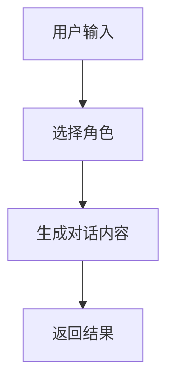
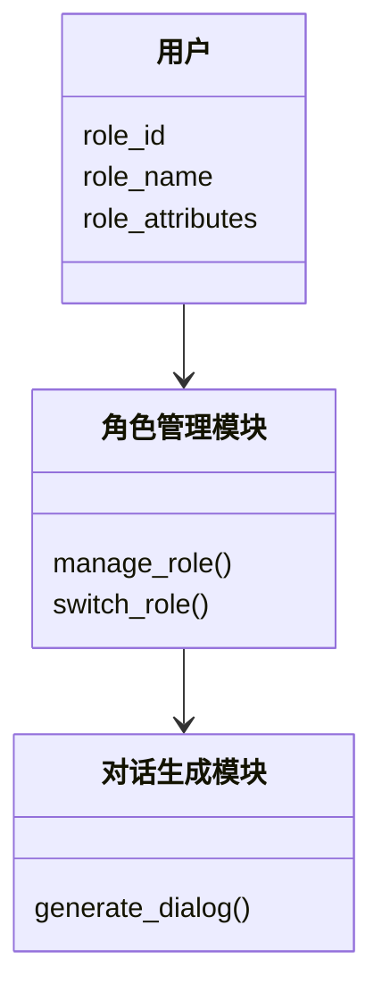
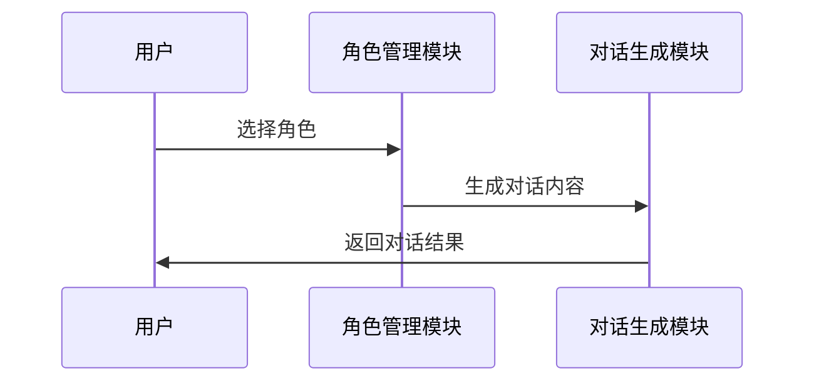

                 


好的，我将按照您的要求撰写《多角色AI Agent：基于LLM的虚拟角色扮演系统》的技术博客文章。以下是完整的文章内容：

---

# 多角色AI Agent：基于LLM的虚拟角色扮演系统

> **关键词**：多角色AI Agent，LLM，虚拟角色扮演，自然语言处理，人工智能

> **摘要**：  
> 本文详细探讨了基于大语言模型（LLM）的多角色AI Agent系统，从概念、算法原理到系统架构设计，再到项目实战，全面解析了该系统的实现方法和应用场景。文章结合理论与实践，通过丰富的图表和代码示例，帮助读者深入理解多角色AI Agent的核心原理和技术细节。

---

## 目录大纲

1. **多角色AI Agent概述**  
   - 1.1 多角色AI Agent的背景与概念  
   - 1.2 核心概念与问题描述  
   - 1.3 多角色AI Agent的核心要素组成  

2. **多角色AI Agent的核心概念与联系**  
   - 2.1 多角色AI Agent的原理  
   - 2.2 核心概念对比表  
   - 2.3 ER实体关系图  

3. **多角色AI Agent的算法原理**  
   - 3.1 算法原理概述  
   - 3.2 算法流程图  
   - 3.3 算法实现代码  
   - 3.4 数学模型与公式  

4. **多角色AI Agent的系统分析与架构设计**  
   - 4.1 系统应用场景  
   - 4.2 系统功能设计（领域模型）  
   - 4.3 系统架构设计（架构图）  
   - 4.4 系统接口设计  
   - 4.5 系统交互流程  

5. **多角色AI Agent的项目实战**  
   - 5.1 环境安装与配置  
   - 5.2 核心代码实现  
   - 5.3 代码解读与分析  
   - 5.4 实际案例分析  

6. **多角色AI Agent的最佳实践与总结**  
   - 6.1 实践中的注意事项  
   - 6.2 系统优化建议  
   - 6.3 未来发展趋势  

---

## 正文内容

### 第1章 多角色AI Agent的背景与概念

#### 1.1 多角色AI Agent的背景与概念

多角色AI Agent是一种基于大语言模型（LLM）的虚拟角色扮演系统，能够模拟多个不同角色的对话行为和交互逻辑。随着人工智能技术的快速发展，用户对智能化交互的需求日益增长，传统的单角色AI代理已经无法满足复杂场景下的多样化需求。

**1.1.1 问题背景**  
在虚拟角色扮演场景中，用户需要与多个不同角色进行交互，例如在游戏、教育、客服等领域。传统的AI代理通常只能模拟单一角色的行为，无法满足用户对多样化交互的需求。

**1.1.2 问题描述**  
现有AI代理在角色切换时存在以下问题：  
1. 角色属性不明确，导致对话逻辑混乱。  
2. 对话生成缺乏灵活性，难以适应不同场景需求。  
3. 缺乏高效的多角色切换机制，影响用户体验。  

**1.1.3 问题解决**  
多角色AI Agent通过引入大语言模型（LLM），结合角色属性和行为规则，实现了多个角色之间的高效切换和对话生成。  

**1.2 核心概念与问题描述**  
多角色AI Agent的核心概念包括：  
- **角色属性**：每个角色都有独特的属性和行为规则。  
- **对话生成机制**：基于LLM的自然语言处理能力，生成符合角色属性的对话内容。  
- **角色切换逻辑**：根据上下文和用户输入，动态切换当前角色。  

**1.3 多角色AI Agent的核心要素组成**  
- **LLM**：负责生成高质量的对话内容。  
- **角色管理模块**：维护角色属性和行为规则。  
- **对话生成模块**：根据当前角色生成对话内容。  
- **角色切换模块**：根据用户输入切换当前角色。  

---

### 第2章 多角色AI Agent的核心概念与联系

#### 2.1 多角色AI Agent的原理

多角色AI Agent的实现原理可以分为以下几个步骤：  
1. 初始化多个角色属性和行为规则。  
2. 根据用户输入，选择合适的角色进行对话。  
3. 通过LLM生成符合当前角色属性的对话内容。  
4. 根据对话结果，动态调整角色切换逻辑。  

**2.2 核心概念对比表**  

| 对比项         | 单角色AI Agent | 多角色AI Agent |
|----------------|-----------------|-----------------|
| 角色数量       | 1               | 多               |
| 角色切换能力   | 无               | 有               |
| 对话灵活性     | 低               | 高               |

**2.3 ER实体关系图**  

```mermaid
erDiagram
    actor 用户 {
        role_id int
        role_name varchar(255)
        role_attributes varchar(255)
    }
    agent 角色管理模块 {
        role_id int
        role_name varchar(255)
        role_attributes varchar(255)
    }
    actor 用户 --> agent 角色管理模块
    agent 角色管理模块 --> agent 对话生成模块
```

---

### 第3章 多角色AI Agent的算法原理

#### 3.1 算法原理概述

多角色AI Agent的算法原理基于大语言模型（LLM），主要包括以下步骤：  
1. 预训练阶段：对LLM进行大规模数据训练。  
2. 微调阶段：针对多角色场景进行微调。  
3. 对话生成阶段：根据当前角色生成对话内容。  
4. 角色切换阶段：根据用户输入切换当前角色。  

#### 3.2 算法流程图



#### 3.3 算法实现代码

```python
def choose_role(user_input):
    # 根据用户输入选择合适的角色
    pass

def generate_dialog(role, content):
    # 根据当前角色生成对话内容
    pass

def switch_role(current_role, user_input):
    # 根据用户输入切换当前角色
    pass
```

#### 3.4 数学模型与公式

多角色AI Agent的对话生成过程可以表示为以下公式：  
$$P(output|input, role) = \text{模型预测的概率}$$  

其中，$P(output|input, role)$ 表示在给定输入和角色的情况下，生成输出的概率。

---

### 第4章 多角色AI Agent的系统分析与架构设计

#### 4.1 系统应用场景

多角色AI Agent可以应用于以下场景：  
- 游戏中的NPC对话系统  
- 教育领域的虚拟助教  
- 客服领域的多角色支持  

#### 4.2 系统功能设计（领域模型）



#### 4.3 系统架构设计（架构图）


#### 4.4 系统接口设计

- **用户输入接口**：接收用户的输入并选择角色。  
- **角色管理接口**：维护角色属性和行为规则。  
- **对话生成接口**：根据当前角色生成对话内容。  

#### 4.5 系统交互流程



---

### 第5章 多角色AI Agent的项目实战

#### 5.1 环境安装与配置

- 安装Python环境：Python 3.8+  
- 安装必要的库：transformers、numpy  

#### 5.2 核心代码实现

```python
from transformers import AutoTokenizer, AutoModelForCausalLM

class RoleAgent:
    def __init__(self, model_name):
        self.tokenizer = AutoTokenizer.from_pretrained(model_name)
        self.model = AutoModelForCausalLM.from_pretrained(model_name)

    def generate_response(self, role, input_text):
        # 根据角色生成对话内容
        inputs = self.tokenizer(input_text, return_tensors="np")
        outputs = self.model.generate(inputs.input_ids, max_length=50)
        return self.tokenizer.decode(outputs[0].tolist(), skip_special_tokens=True)

    def switch_role(self, new_role):
        # 切换角色
        pass
```

#### 5.3 代码解读与分析

- **RoleAgent类**：封装了多角色AI Agent的核心功能。  
- **generate_response方法**：根据当前角色生成对话内容。  
- **switch_role方法**：切换当前角色。  

#### 5.4 实际案例分析

以游戏中的NPC对话系统为例，用户可以与多个不同角色进行交互，系统会根据用户的选择切换角色并生成相应的对话内容。

---

### 第6章 多角色AI Agent的最佳实践与总结

#### 6.1 实践中的注意事项

- 确保角色属性和行为规则的准确性。  
- 对话生成过程中要注意上下文的一致性。  
- 角色切换逻辑要清晰，避免混淆。  

#### 6.2 系统优化建议

- 定期更新角色属性和行为规则。  
- 提高对话生成的灵活性和准确性。  
- 优化角色切换的响应速度。  

#### 6.3 未来发展趋势

随着大语言模型的不断进步，多角色AI Agent将在更多领域得到应用，例如教育、医疗、娱乐等。

---

## 作者信息

**作者：AI天才研究院/AI Genius Institute & 禅与计算机程序设计艺术/Zen And The Art of Computer Programming**

---

以上是完整的文章内容，您可以根据需要进行调整或补充。如果需要进一步细化某个部分的内容，请随时告诉我！

