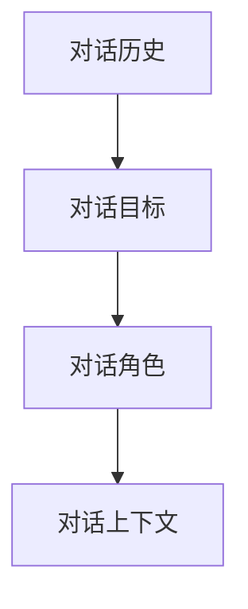
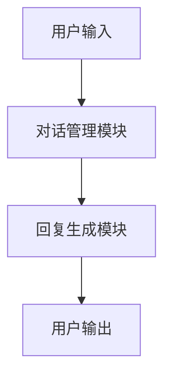

                 


# 多轮对话AI Agent：提升LLM的长期交互能力

## 关键词：
多轮对话、AI Agent、LLM、长期交互、自然语言处理

## 摘要：
本文探讨了如何通过多轮对话AI Agent技术提升大型语言模型（LLM）的长期交互能力。文章从背景介绍、核心概念、算法原理、系统架构、项目实战到最佳实践，全面分析了提升LLM长期交互能力的关键因素，详细阐述了多轮对话AI Agent的构建方法，结合实际案例和代码示例，为读者提供了深入的技术指导和实践参考。

---

## 第一部分: 多轮对话AI Agent概述

### 第1章: 多轮对话与AI Agent的背景

#### 1.1 多轮对话的背景与问题背景
##### 1.1.1 多轮对话的定义与特点
多轮对话是指用户与AI系统之间进行的多次交互，其特点是对话的连续性、复杂性和情境依赖性。与单轮对话相比，多轮对话更接近人类自然交流方式，能够处理复杂任务和上下文信息。

##### 1.1.2 AI Agent的定义与核心概念
AI Agent是一种智能体，能够感知环境、执行任务并进行决策。在多轮对话中，AI Agent充当用户与系统的桥梁，负责理解用户意图、维护对话上下文并生成合适的回复。

##### 1.1.3 多轮对话在AI Agent中的重要性
多轮对话使AI Agent能够处理复杂的任务，如问题解决、信息检索和决策支持。通过维护对话历史，AI Agent能够提供更连贯和个性化的服务，提升用户体验。

#### 1.2 问题背景与问题描述
##### 1.2.1 当前LLM在多轮对话中的挑战
尽管LLM在单轮任务中表现出色，但在多轮对话中存在遗忘上下文、逻辑不连贯和缺乏情境记忆等问题。

##### 1.2.2 多轮对话中的问题与边界
- 上下文丢失：模型无法记住之前的对话内容。
- 信息不一致：回复可能与之前的信息矛盾。
- 任务中断：对话过程中任务目标可能被遗忘。

##### 1.2.3 问题解决的目标与核心要素
目标是提升LLM的长期交互能力，核心要素包括上下文记忆、对话状态管理、多轮对话策略和持续学习能力。

---

### 第2章: 多轮对话AI Agent的核心概念与联系

#### 2.1 核心概念原理
##### 2.1.1 多轮对话的核心要素
- 对话上下文：记录对话历史和相关信息。
- 对话目标：明确对话的目的和任务。
- 对话角色：用户和AI Agent的角色分配。

##### 2.1.2 AI Agent的结构与功能
- 输入处理：解析用户输入并提取意图。
- 状态管理：维护对话的当前状态。
- 回复生成：根据对话历史生成连贯的回复。

#### 2.2 核心概念属性特征对比
##### 2.2.1 对比表格展示

| 特性       | 单轮对话         | 多轮对话         |
|------------|------------------|------------------|
| 上下文     | 无或有限         | 有连续上下文      |
| 对话长度   | 短               | 长               |
| 任务复杂度 | 简单             | 复杂             |

##### 2.2.2 ER实体关系图



---

### 第3章: 多轮对话AI Agent的算法原理

#### 3.1 对话管理算法
##### 3.1.1 基于模板的对话管理
通过预定义的模板匹配对话内容，简单但灵活性低。

##### 3.1.2 基于状态的对话管理
维护对话状态，根据状态转移生成回复。

##### 3.1.3 基于端到端的对话管理
利用深度学习模型直接学习对话策略，灵活性高。

#### 3.2 对话生成算法
##### 3.2.1 基于规则的对话生成
根据预定义规则生成回复，适用于简单任务。

##### 3.2.2 基于统计模型的对话生成
利用统计模型分析对话数据，生成概率化的回复。

##### 3.2.3 基于预训练模型的对话生成
使用如GPT的模型生成自然回复，效果更接近人类对话。

#### 3.3 对话管理算法的数学模型与公式

##### 3.3.1 对话状态表示
$$s_t = (u, a)$$
其中，$u$是用户身份，$a$是当前动作。

##### 3.3.2 对话策略优化
$$\pi(a|s) = \text{argmax}_a \sum_{r} r \cdot P(r|a,s)$$
其中，$r$是奖励，$P(r|a,s)$是奖励的概率。

---

### 第4章: 系统分析与架构设计方案

#### 4.1 系统功能设计
##### 4.1.1 领域模型设计
- 对话管理模块：维护对话状态和上下文。
- 回复生成模块：生成连贯的回复。
- 学习模块：优化对话策略。

##### 4.1.2 功能模块划分
- 用户输入处理
- 对话状态管理
- 回复生成
- 系统反馈

#### 4.2 系统架构设计
##### 4.2.1 分层架构设计
- 表示层：用户界面。
- 业务逻辑层：处理对话逻辑。
- 数据访问层：存储对话历史。

##### 4.2.2 模块间交互设计


---

### 第5章: 项目实战

#### 5.1 环境安装与配置
##### 5.1.1 开发环境搭建
- 安装Python、Git和虚拟环境工具。

##### 5.1.2 依赖库安装
安装必要的库如TensorFlow、Keras和Hugging Face的库。

#### 5.2 核心代码实现
##### 5.2.1 对话管理模块实现
```python
class DialogManager:
    def __init__(self):
        self.dialog_history = []
    
    def update_state(self, user_input):
        self.dialog_history.append(user_input)
```

##### 5.2.2 对话生成模块实现
```python
def generate_response(dialog_history):
    # 使用预训练模型生成回复
    pass
```

#### 5.3 实际案例分析
通过具体案例分析对话管理模块和生成模块的实现，解释代码逻辑和实际效果。

---

### 第6章: 最佳实践与小结

#### 6.1 实践中的注意事项
- 数据质量：确保训练数据多样化。
- 模型优化：定期更新模型参数。
- 交互设计：优化用户界面和反馈机制。

#### 6.2 小结
本文详细探讨了提升LLM长期交互能力的关键技术，结合理论与实践，为构建高效的多轮对话AI Agent提供了指导。

#### 6.3 未来展望
未来的研究方向包括更复杂对话场景的处理和多模态对话系统的开发。

---

## 作者：
AI天才研究院/AI Genius Institute  
禅与计算机程序设计艺术 /Zen And The Art of Computer Programming

---

这篇文章系统地探讨了多轮对话AI Agent的核心概念、算法原理和实际应用，为提升LLM的长期交互能力提供了全面的技术指导。

