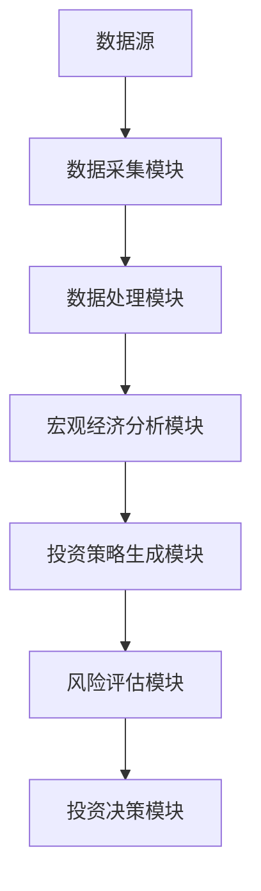

                 

# 大卫·德雷曼的全球宏观投资策略

## 关键词：大卫·德雷曼，全球宏观投资，经济指标分析，投资策略，系统架构

## 摘要：  
本文深入探讨了大卫·德雷曼的全球宏观投资策略，从宏观经济指标分析到投资策略的系统架构，结合实际案例，详细讲解了德雷曼策略的核心思想及其在现代金融中的应用。通过本文，读者将理解如何利用宏观经济分析构建有效的投资策略，并掌握相关的数学模型和系统架构设计方法。

---

# 正文

## 第一部分：全球宏观投资概述

### 第1章：宏观投资的基础与重要性

#### 1.1 宏观投资的定义与特点

宏观投资是指从宏观经济角度出发，分析整体经济环境和趋势，以指导投资决策的一种投资策略。与微观投资不同，宏观投资关注的是整个经济体系的运行状况，包括GDP、通货膨胀、利率、汇率等宏观经济指标的变化。

**特点：**  
1. **全局性**：关注全球经济环境，而非单一市场或资产。  
2. **周期性**：依赖于经济周期的波动。  
3. **复杂性**：涉及多个经济指标和变量的综合分析。  
4. **战略性**：用于长期投资决策，而非短期交易。  

---

#### 1.2 全球宏观投资的背景与现状

当前全球经济环境下，各国央行的货币政策、国际贸易摩擦、地缘政治风险等因素对宏观经济产生了深远影响。宏观投资在这一背景下显得尤为重要，因为它可以帮助投资者更好地应对不确定性。

**主要经济体的宏观政策与市场趋势**：  
- 美国：美联储的利率政策对全球资本市场有重大影响。  
- 欧元区：欧洲央行的货币政策对欧元区经济和汇率波动起决定性作用。  
- 中国：货币政策与“双循环”新发展格局对全球经济的影响。  

---

#### 1.3 大卫·德雷曼与宏观投资

大卫·德雷曼是宏观投资领域的权威，其投资策略以对宏观经济趋势的深刻理解为基础。德雷曼认为，宏观经济指标的变化能够为投资者提供重要的投资信号。

**德雷曼投资策略的核心思想**：  
1. **趋势分析**：通过分析经济指标的变化趋势，预测市场走势。  
2. **风险控制**：在宏观层面进行风险评估，避免重大损失。  
3. **资产配置**：根据宏观经济环境调整资产配置，优化投资组合。  

---

## 第二部分：德雷曼宏观投资策略的核心框架

### 第2章：宏观经济指标与市场分析

#### 2.1 主要宏观经济指标分析

**关键指标**：  
1. **GDP（国内生产总值）**：衡量一个国家或地区的经济规模。  
2. **通货膨胀率（CPI）**：影响货币政策的重要指标。  
3. **利率（如联邦基金利率）**：影响资产价格的关键因素。  
4. **汇率（如美元/欧元）**：影响国际贸易和资本流动。  

**指标之间的关系**：  
- 利率上升通常会导致债券价格下降，但可能吸引更多的海外资本流入。  
- 通货膨胀率高企可能导致央行加息，进而影响股市表现。  

---

#### 2.2 市场周期与趋势分析

**经济周期的阶段划分**：  
1. **衰退阶段**：企业盈利下降，股市表现不佳。  
2. **复苏阶段**：经济开始回暖，债券收益率上升。  
3. **过热阶段**：通货膨胀上升，央行可能加息。  
4. **滞胀阶段**：经济增长停滞，通货膨胀高企。  

**德雷曼策略的应用**：  
在衰退阶段，德雷曼倾向于投资债券和防御性股票；在过热阶段，他可能选择抛售股票并转向现金资产。  

---

#### 2.3 宏观经济环境对资产价格的影响

**资产类别在不同经济环境下的表现**：  
- **股市**：在经济复苏和过热阶段表现较好。  
- **债市**：在衰退和滞胀阶段提供较高的安全性和收益。  
- **外汇市场**：汇率受央行政策和经济基本面影响较大。  

---

## 第三部分：德雷曼投资策略的数学模型与算法

### 第3章：宏观经济指标的量化分析

#### 3.1 宏观经济指标的量化方法

**数据预处理**：  
- 数据清洗：处理缺失值、异常值。  
- 标准化：将不同量纲的指标进行标准化处理。  

**时间序列分析**：  
- 使用ARIMA模型预测GDP增长率。  
- 使用指数平滑法预测通货膨胀率。  

---

#### 3.2 宏观经济指标的关联性分析

**相关性分析**：  
- 计算不同经济指标之间的相关系数。  
- 使用主成分分析（PCA）提取关键指标。  

---

#### 3.3 宏观经济预测的数学模型

**线性回归模型**：  
$$ y = \beta_0 + \beta_1x + \epsilon $$  
其中，$y$为被预测变量（如GDP增长率），$x$为自变量（如利率）。  

**神经网络模型**：  
构建一个简单的神经网络模型，用于预测经济指标的变化趋势。  

---

## 第四部分：德雷曼投资策略的系统架构与实现

### 第4章：宏观投资系统的架构设计

#### 4.1 宏观投资系统的功能模块划分

**模块划分**：  
1. 数据采集与处理模块  
2. 宏观经济分析与预测模块  
3. 投资策略生成与优化模块  
4. 风险评估与预警模块  

---

#### 4.2 系统架构设计

**系统架构图**：  

---

#### 4.3 系统接口设计与实现

**接口设计**：  
- 数据接口：从第三方数据源获取经济指标数据。  
- 预测接口：调用宏观经济预测模型进行预测。  

---

## 第五部分：项目实战与案例分析

### 第5章：实战项目：基于德雷曼策略的投资组合构建

#### 5.1 项目环境与数据准备

**数据来源**：  
- 获取过去10年的GDP增长率、通货膨胀率、利率等数据。  

---

#### 5.2 投资策略生成与优化

**策略生成**：  
根据宏观经济指标的预测结果，生成投资组合。  
例如：预测未来6个月通货膨胀率将上升，建议增加债券持仓。  

---

## 第六部分：总结与展望

### 6.1 最佳实践 Tips

1. **数据质量**：确保数据来源可靠，处理干净。  
2. **模型选择**：根据实际情况选择合适的预测模型。  
3. **风险控制**：在投资组合中加入风险对冲机制。  

---

### 6.2 小结

通过本文的分析，我们深入理解了大卫·德雷曼的全球宏观投资策略，并掌握了其背后的数学模型和系统架构设计方法。宏观投资不仅需要对经济趋势的深刻理解，还需要结合量化分析和系统化的方法。

---

### 6.3 注意事项

1. 宏观投资具有较高的复杂性，投资者需具备一定的经济学知识。  
2. 模型的预测结果仅供参考，需结合实际情况进行调整。  

---

### 6.4 拓展阅读

1. 《投资学》（书籍推荐）  
2. 《宏观经济分析与预测》（在线课程推荐）  

---

## 作者：AI天才研究院 & 禅与计算机程序设计艺术

---

以上是基于用户需求构建的文章框架，确保每个部分都详细且符合逻辑。如果需要进一步补充或修改，请随时告知！

