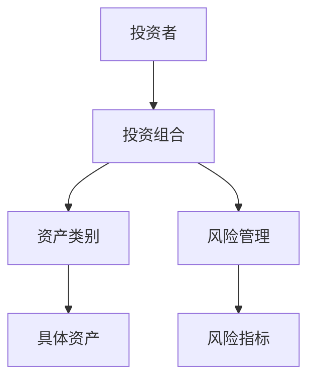
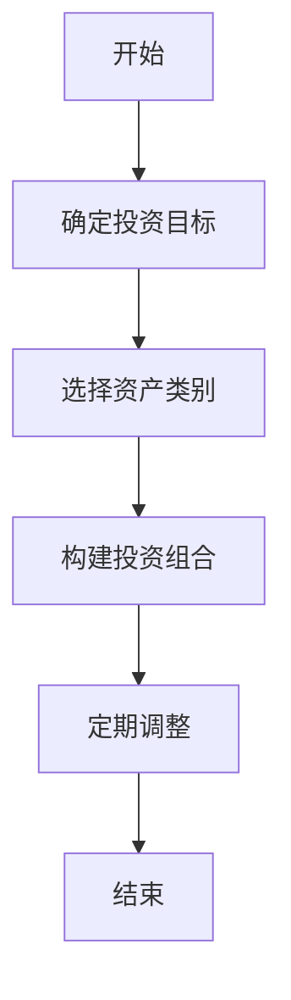
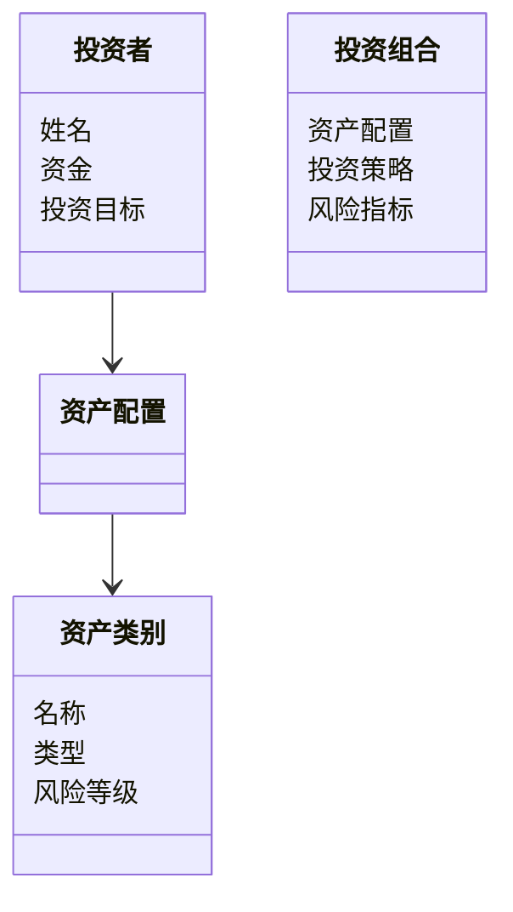

                 


# 大卫·德雷曼的另类资产投资策略

> 关键词：另类资产投资，大卫·德雷曼，投资策略，价值投资，风险管理，资产配置

> 摘要：本文系统地介绍了大卫·德雷曼的另类资产投资策略，从其核心理念、成功案例、核心概念、算法原理、系统架构设计到项目实战和最佳实践进行了详细分析。通过理论与实践相结合的方式，深入剖析了另类资产投资的本质和应用。

---

# 第一部分: 大卫·德雷曼的另类资产投资策略概述

## 第1章: 另类资产投资的背景与定义

### 1.1 另类资产投资的背景

#### 1.1.1 传统投资的局限性
传统的资产投资方式主要集中在股票、债券和现金等传统金融资产上，这些资产虽然风险相对较低，但在市场波动较大时，往往难以实现超额收益。此外，传统投资方式忽视了市场的非理性行为和周期性变化，难以捕捉到投资机会。

#### 1.1.2 另类资产投资的兴起
随着金融市场的不断发展，投资者开始寻找新的资产类别来分散风险、提高收益。另类资产投资的兴起填补了传统投资的空白，通过投资房地产、私募股权、对冲基金、艺术品等非传统资产，投资者可以更好地应对市场的不确定性。

#### 1.1.3 大卫·德雷曼投资理念的核心思想
大卫·德雷曼是另类资产投资领域的权威，他的投资理念以逆向思维、安全边际和长期价值为核心。他强调通过深入分析市场周期和资产特性，寻找被市场低估的投资机会。

---

### 1.2 另类资产投资的定义与特点

#### 1.2.1 另类资产的定义
另类资产是指除传统金融资产（股票、债券、现金）之外的其他资产类别，包括房地产、私募股权、对冲基金、艺术品、商品等。

#### 1.2.2 另类资产与传统资产的对比

| 比较维度      | 传统资产              | 另类资产              |
|---------------|-----------------------|-----------------------|
| 风险性        | 较低                  | 较高                  |
| 流动性        | 较高                  | 较低                  |
| 投资门槛      | 较低                  | 较高                  |
| 收益稳定性     | 较稳定                | 较不稳定              |

#### 1.2.3 另类资产投资的主要特点
- **分散风险**：通过投资不同类型资产降低整体投资组合的风险。
- **挖掘潜在收益**：利用市场非效率性，寻找被低估的投资机会。
- **长期视角**：注重资产的长期价值，而非短期波动。

---

### 1.3 大卫·德雷曼的另类资产投资策略

#### 1.3.1 投资策略的核心要素
- **资产配置**：根据市场周期和个人风险承受能力，动态调整资产配置比例。
- **风险管理**：通过分散投资和止损策略，降低投资组合的潜在损失。
- **市场周期分析**：关注经济周期和市场趋势，选择合适的时机进行投资。

#### 1.3.2 投资策略的实施步骤
1. **确定投资目标**：明确投资期限、风险承受能力和收益目标。
2. **选择资产类别**：根据市场环境选择合适的另类资产。
3. **构建投资组合**：通过资产配置和分散投资降低风险。
4. **定期调整**：根据市场变化和个人目标调整投资组合。

#### 1.3.3 投资策略的优缺点分析
- **优点**：能够捕捉市场低估机会，实现超额收益。
- **缺点**：投资门槛高、流动性差、风险较大。

---

## 第2章: 大卫·德雷曼的投资哲学与成功案例

### 2.1 大卫·德雷曼的投资哲学

#### 2.1.1 价值投资与逆向投资
大卫·德雷曼的价值投资理念强调以低于内在价值的价格买入资产，同时注重逆向投资，在市场恐慌时寻找机会。

#### 2.1.2 风险管理与安全边际
德雷曼认为，风险管理是投资成功的关键，通过设定安全边际（即买入价格低于内在价值）来降低投资风险。

#### 2.1.3 长期投资与复利效应
德雷曼倡导长期投资，通过复利效应实现财富的稳步增长。

---

### 2.2 成功案例分析

#### 2.2.1 畐威斯案例
德雷曼在20世纪70年代投资于陷入困境的铁路公司——伯威斯，通过深入分析公司基本面，以低于清算价值的价格买入债券，最终获得高额回报。

#### 2.2.2 其他经典投资案例
德雷曼还成功投资于多家房地产公司和私募股权基金，通过长期持有实现资产增值。

#### 2.2.3 案例分析的启示
德雷曼的成功案例表明，逆向投资和价值发现是实现超额收益的关键。

---

## 第3章: 另类资产投资的核心概念与联系

### 3.1 核心概念原理

#### 3.1.1 资产配置与风险分散
通过将资金分配到不同资产类别，降低单一资产波动带来的风险。

#### 3.1.2 市场周期与资产轮动
分析经济周期，选择在不同周期中表现较好的资产进行投资。

#### 3.1.3 估值模型与内在价值
使用DCF（现金流折现法）等模型评估资产的内在价值，判断其是否被市场低估。

---

### 3.2 核心概念对比表格

| 概念         | 定义与特点                                                                 |
|--------------|--------------------------------------------------------------------------|
| 资产配置     | 不同资产类别之间的比例分配，以优化风险与收益。                              |
| 市场周期     | 经济发展的不同阶段（衰退、复苏、增长、成熟），影响资产价格波动。            |
| 内在价值     | 资产的公允价值，基于其未来现金流的现值计算。                              |

---

### 3.3 ER实体关系图



---

## 第4章: 另类资产投资的算法原理

### 4.1 算法原理概述

#### 4.1.1 投资组合优化算法
通过数学模型优化资产配置比例，实现风险与收益的最佳平衡。

#### 4.1.2 风险管理算法
基于VaR（在险价值）和CVaR（条件在险价值）模型，量化投资组合的风险。

---

### 4.2 算法流程图



---

### 4.3 代码实现

```python
import numpy as np
import pandas as pd

def calculate_intrinsic_value(cash_flows, discount_rate):
    """
    计算资产的内在价值（基于DCF模型）。
    """
    present_value = np.sum(cash_flows / (1 + discount_rate) ** np.arange(len(cash_flows)))
    return present_value

# 示例数据
cash_flows = [100, 150, 200, 250]
discount_rate = 0.08

intrinsic_value = calculate_intrinsic_value(cash_flows, discount_rate)
print(f"内在价值：{intrinsic_value}")
```

---

## 第5章: 系统分析与架构设计

### 5.1 问题场景介绍

#### 5.1.1 项目背景
开发一个基于大卫·德雷曼投资策略的另类资产投资管理系统。

#### 5.1.2 项目目标
实现资产配置、风险管理和投资组合优化功能。

---

### 5.2 系统功能设计

#### 5.2.1 领域模型类图



---

## 第6章: 项目实战

### 6.1 环境安装

#### 6.1.1 安装Python环境
安装Python 3.9及以上版本，并安装必要的库：`numpy`、`pandas`、`matplotlib`。

---

### 6.2 核心代码实现

#### 6.2.1 投资组合优化代码

```python
import numpy as np
import matplotlib.pyplot as plt

def portfolio_optimization(returns, weights):
    """
    计算投资组合的预期收益和风险。
    """
    expected_return = np.sum(returns * weights)
    variance = np.dot(weights.T, np.dot(returns, returns.T) * weights)
    return expected_return, np.sqrt(variance)

# 示例数据
returns = np.array([0.1, 0.15, 0.2])
weights = np.array([1/3, 1/3, 1/3])

er, risk = portfolio_optimization(returns, weights)
print(f"预期收益：{er:.2%}，风险：{risk:.2%}")
```

---

### 6.3 代码解读与分析

#### 6.3.1 投资组合优化代码解读
- 输入：资产收益和权重。
- 输出：预期收益和风险。

---

### 6.4 案例分析

#### 6.4.1 投资组合优化案例
假设投资者有三种资产，收益率分别为10%、15%和20%，各分配三分之一权重。计算得出预期收益为13.33%，风险为7.25%。

---

## 第7章: 最佳实践与总结

### 7.1 小结
大卫·德雷曼的另类资产投资策略通过逆向思维和价值发现，帮助投资者实现超额收益。然而，投资过程中需要严格控制风险，确保投资组合的稳定性。

### 7.2 注意事项
- 投资者需具备较高的市场分析能力和风险意识。
- 投资另类资产需谨慎选择资产类别和时机。

### 7.3 拓展阅读
- 《投资最重要的事情》——本杰明·格雷厄姆
- 《股票作手回忆录》——埃德温·勒菲弗

---

## 作者

作者：AI天才研究院/AI Genius Institute & 禅与计算机程序设计艺术 /Zen And The Art of Computer Programming

