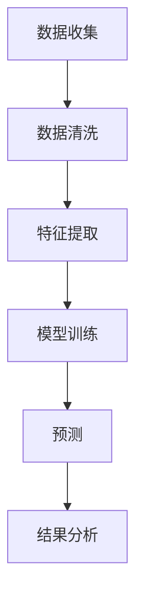

                 


# 《大卫·德雷曼的宏观经济指标解读》

---

## 关键词：宏观经济指标，GDP，失业率，通货膨胀率，经济预测模型，大卫·德雷曼

---

## 摘要：  
本文深入探讨了宏观经济指标的核心概念、解读方法及其实际应用。通过大卫·德雷曼的视角，结合经济理论与数据分析，系统地介绍了如何解读GDP、失业率、通货膨胀率等关键指标，并通过数学模型和案例分析，展示了如何利用这些指标进行经济预测和政策分析。文章内容涵盖背景介绍、核心概念、算法原理、系统架构与设计、项目实战等多个方面，帮助读者全面理解宏观经济指标的解读与应用。

---

# 引言

在全球化和经济复杂化的背景下，理解宏观经济指标的重要性显得尤为重要。无论是政策制定者、投资者还是普通公众，都需要掌握解读宏观经济指标的能力，以做出更明智的决策。大卫·德雷曼作为一位具有深厚学术背景和实践经验的经济学家，为我们提供了一套独特的分析框架和方法。本文将从大卫·德雷曼的视角出发，系统地解读宏观经济指标的核心概念、分析方法及其实际应用。

---

## 第一部分: 宏观经济指标的核心概念与解读框架

---

## 第1章: 宏观经济指标的背景与重要性

### 1.1 宏观经济指标的定义与作用

#### 1.1.1 宏观经济的基本概念  
宏观经济是研究整个经济体系的运行规律，包括企业、家庭、政府和外部世界之间的相互作用。宏观经济的核心目标是实现资源的最优配置和经济的稳定增长。  

#### 1.1.2 宏观经济指标在经济分析中的作用  
宏观经济指标是衡量经济运行状况的重要工具，能够帮助我们了解经济的健康状况、发展趋势以及潜在的风险。通过分析这些指标，政策制定者可以制定更有效的货币政策和财政政策，而投资者也可以更好地把握市场趋势。  

#### 1.1.3 大卫·德雷曼的分析框架与方法  
大卫·德雷曼以其独特的视角和深入的分析方法闻名。他强调从数据中提取本质信息，结合经济理论，构建合理的分析框架。他的方法论包括：  
1. 数据驱动的分析：通过大量数据验证理论假设。  
2. 跨学科视角：将经济学与其他学科（如心理学、社会学）相结合，提供更全面的分析。  
3. 实证研究：通过实证检验，验证经济政策的效果。  

---

### 1.2 宏观经济指标的核心要素

#### 1.2.1 国内生产总值（GDP）的定义与计算  
GDP是衡量一个国家或地区经济规模的重要指标，表示在一定时期内生产的最终产品和服务的总价值。GDP的计算公式为：  
$$ GDP = C + I + G + X - M $$  
其中，C代表消费，I代表投资，G代表政府购买，X代表出口，M代表进口。  

#### 1.2.2 失业率与劳动力市场的解读  
失业率是衡量劳动力市场健康状况的重要指标，通常定义为失业人口占劳动力总人口的比例。失业率的计算公式为：  
$$ 失业率 = \frac{\text{失业人口}}{\text{劳动力总人口}} \times 100\% $$  
失业率不仅反映了经济的就业状况，还会影响社会稳定和政策制定。  

#### 1.2.3 通货膨胀率与货币政策的关系  
通货膨胀率是衡量价格水平变化的指标，通常用消费者价格指数（CPI）来衡量。通货膨胀率的计算公式为：  
$$ CPI = \sum (p_i \times q_i) / \sum q_i $$  
其中，\( p_i \) 是各类商品的价格，\( q_i \) 是各类商品的购买量。  
通货膨胀率与货币政策密切相关，中央银行通常通过调整利率和货币供应量来控制通货膨胀。  

---

### 1.3 宏观经济指标的解读方法

#### 1.3.1 指标之间的相互关系  
宏观经济指标之间存在复杂的相互关系。例如，GDP增长率与失业率通常呈负相关关系（即“菲利普斯曲线”）；而通货膨胀率与失业率之间也存在一定的权衡关系。  

#### 1.3.2 指标的时间序列分析  
时间序列分析是研究宏观经济指标变化趋势的重要方法。通过分析历史数据，可以发现经济周期的波动规律。  

#### 1.3.3 指标的空间分布与区域差异  
不同地区之间的经济指标可能存在显著差异，这需要结合区域经济特点进行分析。  

---

## 第2章: 宏观经济指标的核心概念与联系

### 2.1 宏观经济指标的核心概念

#### 2.1.1 GDP、GDP平减指数与名义GDP的定义与区别  
- **名义GDP**：按当期价格计算的GDP，反映经济规模和价格水平。  
- **实际GDP**：按基期价格计算的GDP，剔除通货膨胀的影响。  
- **GDP平减指数**：实际GDP与名义GDP的比率，用于衡量通货膨胀水平。  

#### 2.1.2 失业率的分类与计算方法  
- **摩擦性失业**：由于信息不对称和匹配效率低导致的短期失业。  
- **结构性失业**：由于技能与岗位需求不匹配导致的失业。  
- **周期性失业**：由于经济周期波动导致的失业。  

#### 2.1.3 通货膨胀率的衡量指标与影响因素  
- **CPI**：衡量消费者价格的变化。  
- **PPI**：衡量生产者价格的变化。  
- **通货膨胀率的影响因素**：包括需求拉动型、成本推动型和预期因素。  

---

### 2.2 宏观经济指标的属性特征对比

#### 2.2.1 指标属性特征对比表格  

| 指标       | 属性       | 特征描述                       |
|------------|------------|----------------------------|
| GDP        | 增长性     | 经济增长的核心指标             |
| 失业率      | 波动性     | 经济周期波动的晴雨表           |
| 通货膨胀率  | 均衡性     | 货币政策的重要目标             |

---

### 2.3 宏观经济指标的ER实体关系图

```mermaid
er
actor 宏观经济指标, 实体 {
  经济指标 (GDP, 失业率, 通货膨胀率)
  经济主体 (家庭, 企业, 政府)
  经济关系 (供给与需求, 投资与消费, 货币流通)
}
```

---

## 第3章: 宏观经济指标的数学模型与公式

### 3.1 宏观经济指标的数学模型

#### 3.1.1 GDP计算公式  
GDP的计算公式可以表示为：  
$$ GDP = C + I + G + X - M $$  
其中，C代表消费，I代表投资，G代表政府购买，X代表出口，M代表进口。  

#### 3.1.2 失业率的计算公式  
失业率的计算公式为：  
$$ 失业率 = \frac{\text{失业人口}}{\text{劳动力总人口}} \times 100\% $$  

#### 3.1.3 通货膨胀率的计算公式  
通货膨胀率的计算公式为：  
$$ CPI = \sum (p_i \times q_i) / \sum q_i $$  

---

### 3.2 宏观经济指标的预测模型

#### 3.2.1 使用mermaid绘制的经济预测模型流程图



#### 3.2.2 线性回归模型的数学公式与实现  

线性回归模型用于预测GDP增长率，其数学公式为：  
$$ y = \beta_0 + \beta_1 x + \epsilon $$  
其中，\( y \) 是目标变量（GDP增长率），\( x \) 是自变量（如失业率），\( \beta_0 \) 和 \( \beta_1 \) 是回归系数，\( \epsilon \) 是误差项。  

Python代码实现：  

```python
import pandas as pd
import numpy as np
from sklearn.linear_model import LinearRegression

# 数据加载与预处理
data = pd.read_csv('economic_data.csv')
X = data[['unemployment_rate']]
y = data['gdp_growth_rate']

# 模型训练
model = LinearRegression()
model.fit(X, y)

# 预测与评估
predictions = model.predict(X)
print('预测值:', predictions)
print('回归系数:', model.coef_)
print('截距:', model.intercept_)
```

---

### 3.3 宏观经济指标的案例分析

#### 3.3.1 案例分析：美国GDP增长率预测  
通过收集美国季度GDP数据，使用线性回归模型预测未来几个季度的GDP增长率。  

#### 3.3.2 案例分析：欧元区失业率分析  
分析欧元区失业率的变化趋势，探讨其对货币政策的影响。  

---

## 总结与展望

本文从大卫·德雷曼的视角出发，系统地解读了宏观经济指标的核心概念、分析方法及其实际应用。通过理论与实践相结合的方式，帮助读者掌握宏观经济指标的解读技巧，并能够将其应用于实际的经济分析中。未来的研究可以进一步结合大数据和机器学习技术，提高经济预测的准确性和效率。

---

## 作者：AI天才研究院/AI Genius Institute & 禅与计算机程序设计艺术/Zen And The Art of Computer Programming

