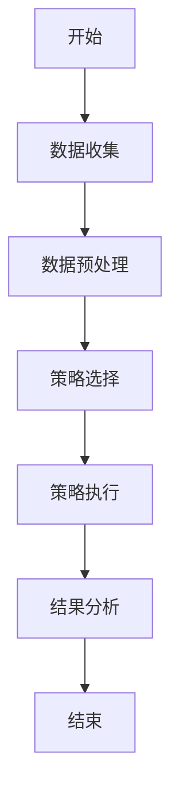
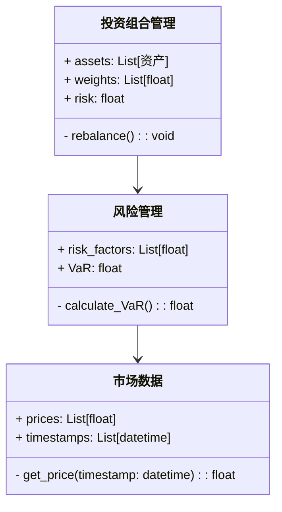
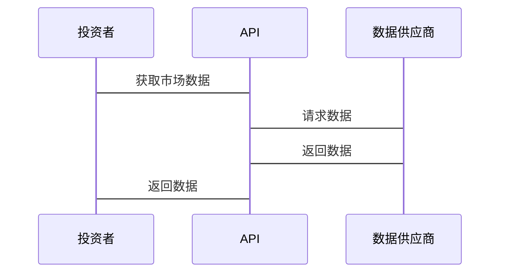

                 


```markdown
# 大卫·德雷曼的对冲基金投资策略

> 关键词：对冲基金、投资策略、大卫·德雷曼、风险管理、统计套利

> 摘要：本文深入分析了大卫·德雷曼的对冲基金投资策略，从基础概念到核心模型，再到算法实现和系统设计，全面探讨了其策略的数学原理、系统架构和实际应用。通过详细讲解和案例分析，本文为读者提供了从理论到实践的完整指南。

---

# 第一部分: 对冲基金投资策略概述

## 第1章: 对冲基金的基本概念与背景

### 1.1 对冲基金的定义与特点

#### 1.1.1 对冲基金的定义
对冲基金是一种通过利用市场波动进行投资的金融工具，旨在在不同市场条件下实现正向收益。其核心思想是通过做多和做空相结合，对冲市场系统性风险，从而实现超额收益。对冲基金通常采用杠杆、套利、 arbitrage 等多种策略，追求绝对收益，而非相对收益。

#### 1.1.2 对冲基金的核心特点
1. **多空策略**：同时进行多头和空头交易，以对冲市场风险。
2. **杠杆效应**：通过杠杆放大收益，但也增加了风险。
3. **多样化策略**：涵盖股票、债券、外汇等多种资产。
4. **绝对收益目标**：追求无论市场如何变化的正收益。

#### 1.1.3 对冲基金与传统投资的区别
传统的股票投资依赖于市场上涨时的收益，而对冲基金通过多空策略在市场下跌时也能获利。对冲基金的风险控制更为严格，通常采用量化模型和风险管理技术。

### 1.2 大卫·德雷曼的背景与投资哲学

#### 1.2.1 大卫·德雷曼的生平简介
大卫·德雷曼是美国著名对冲基金经理，以其独特的统计套利策略闻名。他创立的对冲基金公司通过量化模型和数学算法，在市场中寻找套利机会，实现稳定收益。

#### 1.2.2 德雷曼的投资哲学与理念
德雷曼的投资哲学基于统计套利和均值回归理论。他认为，市场中存在大量的短期定价偏差，通过数学模型可以捕捉这些机会，实现长期稳定的收益。他强调风险控制的重要性，认为对冲基金的核心是通过量化手段管理风险。

#### 1.2.3 德雷曼对冲基金策略的核心思想
德雷曼策略的核心是通过量化模型识别市场中的套利机会，并利用统计方法进行风险管理。他认为，市场中性策略能够有效对冲系统性风险，从而实现绝对收益。

---

## 第2章: 对冲基金市场的基本分析

### 2.1 对冲基金的主要策略类型

#### 2.1.1 股票多空策略
股票多空策略是通过对多头和空头头寸的配置，利用市场波动获利。例如，当预期市场上涨时，建立多头头寸；当预期市场下跌时，建立空头头寸。

#### 2.1.2 债券市场中性策略
债券市场中性策略通过同时做多和做空债券，利用债券价格的短期波动获利。该策略通常用于利率变化较小的市场环境。

#### 2.1.3 统计套利策略
统计套利策略通过寻找资产之间的定价偏差，利用数学模型进行套利。例如，当两只股票的价格差异超过其历史平均值时，买进价格较低的股票，卖出价格较高的股票。

#### 2.1.4 跨期套利策略
跨期套利策略利用同一资产在不同时间点的价格差异进行套利。例如，买入近期合约，卖出远期合约，利用价差获利。

#### 2.1.5 其他创新策略
随着市场的变化，对冲基金不断创新出新的策略，例如算法交易、高频交易等。

### 2.2 对冲基金市场的参与者与生态

#### 2.2.1 对冲基金的主要参与者
1. **基金经理**：负责管理和操作对冲基金。
2. **投资者**：提供资金的机构或个人投资者。
3. **做市商**：为对冲基金提供流动性支持的金融机构。
4. **技术供应商**：提供交易系统和数据分析工具的公司。

#### 2.2.2 对冲基金市场的生态结构
对冲基金市场的生态包括从资金募集、策略执行到风险管理的各个环节。各参与者之间相互依赖，共同构成了一个复杂的生态系统。

#### 2.2.3 对冲基金行业的现状与趋势
近年来，对冲基金行业呈现出量化交易普及、技术驱动增强的趋势。随着人工智能和大数据技术的发展，对冲基金策略也越来越依赖于量化模型和算法交易。

---

## 第3章: 德雷曼对冲基金策略的数学模型

### 3.1 对冲基金策略的数学基础

#### 3.1.1 股票价格波动的数学模型
股票价格的波动可以用随机游走模型或均值回归模型来描述。例如，股票价格的波动可以用以下公式表示：

$$ P_{t+1} = P_t + \epsilon $$

其中，$\epsilon$ 是随机误差项，表示价格的随机波动。

#### 3.1.2 统计套利的数学原理
统计套利的核心是寻找资产之间的定价偏差，并利用这些偏差进行套利。例如，当两只股票的价格差异超过其历史平均值时，套利机会出现。

#### 3.1.3 时间序列分析与预测
时间序列分析用于预测股票价格的未来走势。常用的方法包括ARIMA模型和GARCH模型。例如，ARIMA模型可以表示为：

$$ y_t = \phi y_{t-1} + \theta \epsilon_{t-1} + \epsilon_t $$

其中，$\phi$ 和 $\theta$ 是模型参数，$\epsilon$ 是白噪声。

### 3.2 德雷曼策略的核心公式

#### 3.2.1 均值回归模型
均值回归模型假设价格会回归其历史平均值。套利机会的识别可以通过以下公式实现：

$$ |P_i - \bar{P}| > n\sigma $$

其中，$P_i$ 是当前价格，$\bar{P}$ 是历史平均价格，$\sigma$ 是标准差，$n$ 是置信水平。

#### 3.2.2 方差分析模型
方差分析用于评估投资组合的风险。投资组合的方差可以表示为：

$$ \text{Var}(r) = \sum_{i=1}^n w_i^2 \sigma_i^2 + \sum_{i \neq j} w_i w_j \sigma_{i,j} $$

其中，$w_i$ 是资产$i$的权重，$\sigma_i^2$ 是资产$i$的方差，$\sigma_{i,j}$ 是资产$i$和$j$的协方差。

#### 3.2.3 风险调整回报模型
风险调整回报模型用于评估投资回报的风险调整后表现。夏普比率是常用的指标，其公式为：

$$ \text{夏普比率} = \frac{E[r - r_f]}{\sigma} $$

其中，$E[r - r_f]$ 是投资回报的期望值，$\sigma$ 是投资回报的标准差，$r_f$ 是无风险利率。

---

## 第4章: 德雷曼对冲基金策略的ER实体关系图

### 4.1 对冲基金策略的实体关系

#### 4.1.1 投资组合实体
投资组合由多个资产组成，每个资产都有自己的权重和风险敞口。

#### 4.1.2 风险管理实体
风险管理实体负责监控和管理投资组合的风险，包括流动性风险、市场风险和信用风险。

#### 4.1.3 市场数据实体
市场数据实体包括股票价格、债券收益率、外汇汇率等实时市场数据。

### 4.2 策略模型的ER图展示

```mermaid
er
  actor 投资者
  actor 做市商
  actor 技术供应商
  actor 监管机构
  entity 资产
  entity 投资组合
  entity 风险管理
  entity 市场数据
  relationship 实际控制
  relationship 包含
  relationship 监控
```

---

## 第5章: 对冲基金策略的算法实现

### 5.1 对冲基金策略的算法流程



### 5.2 数据收集与预处理

#### 5.2.1 数据收集
通过API或数据供应商获取实时市场数据，包括股票价格、指数值等。

#### 5.2.2 数据预处理
对数据进行清洗和标准化，确保数据的完整性和一致性。

### 5.3 策略执行

#### 5.3.1 策略选择
根据市场情况选择合适的策略，例如均值回归或统计套利。

#### 5.3.2 策略执行
根据选择的策略生成交易信号，并执行交易。

### 5.4 结果分析

#### 5.4.1 性能评估
评估投资组合的收益和风险，计算夏普比率等指标。

#### 5.4.2 风险监控
监控投资组合的风险敞口，及时调整头寸。

---

## 第6章: 系统分析与架构设计

### 6.1 系统功能设计

#### 6.1.1 领域模型


### 6.2 系统架构设计


### 6.3 接口交互设计



---

## 第7章: 项目实战

### 7.1 模拟投资组合

#### 7.1.1 环境安装
安装必要的Python库，例如pandas、numpy、matplotlib。

#### 7.1.2 代码实现

```python
import pandas as pd
import numpy as np

# 数据收集
data = pd.read_csv('market_data.csv')

# 数据预处理
data = data.dropna()
data = data['Close'].values

# 均值回归策略
def mean_reversion_strategy(prices, window=20):
    mean = prices.rolling(window).mean()
    std = prices.rolling(window).std()
    z_scores = (prices - mean) / std
    return z_scores

# 策略执行
z_scores = mean_reversion_strategy(data)
positions = np.where(z_scores > 1, -1, np.where(z_scores < -1, 1, 0))

# 结果分析
returns = positions.shift(1) * (data[1:] - data[:-1]) / data[:-1]
returns = returns[returns != 0]
print("平均收益:", returns.mean())
print("标准差:", returns.std())
```

### 7.1.3 案例分析
通过上述代码，我们可以看到均值回归策略在不同市场环境下的表现。

---

## 第8章: 总结与展望

### 8.1 总结
通过对大卫·德雷曼对冲基金策略的深入分析，我们了解了其数学模型、系统架构和实际应用。德雷曼的策略以统计套利和风险管理为核心，结合量化模型实现稳定收益。

### 8.2 注意事项
在实际操作中，需要注意市场风险、模型风险和流动性风险。同时，应对策略进行持续优化，以适应市场变化。

### 8.3 最佳实践
建议读者结合实际市场数据，进一步优化策略模型，并尝试开发新的策略。

---

# 作者

作者：AI天才研究院/AI Genius Institute & 禅与计算机程序设计艺术 /Zen And The Art of Computer Programming
```

