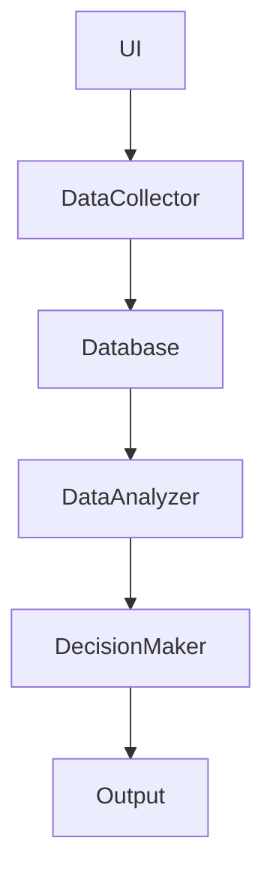

                 


# 特殊情况投资：从公司事件中获利——大卫·德雷曼的投资策略

> 关键词：特殊情况投资、大卫·德雷曼、公司事件、并购重组、杠杆收购、投资策略、数学建模

> 摘要：本文详细探讨了大卫·德雷曼的特殊情况投资策略，分析了公司事件对投资机会的影响，并结合数学建模和系统架构设计，展示了如何从并购、重组等公司事件中获利。文章通过实际案例分析和系统设计，提供了可操作的投资策略和最佳实践。

---

## 第1章 特殊情况投资的背景与概念

### 1.1 特殊情况投资的定义

#### 1.1.1 什么是特殊情况投资
特殊情况投资是指在公司发生重大事件（如并购、重组、杠杆收购、债务重组等）时，投资者通过分析这些事件对公司价值的影响，寻找短期或长期的投资机会。这类投资通常具有高风险、高回报的特点。

#### 1.1.2 特殊情况投资的特点
- **短期性**：投资机会往往在事件发生后短期内出现。
- **高波动性**：公司事件可能导致股价大幅波动，为投资者提供套利机会。
- **复杂性**：涉及多方面的财务、法律和市场因素。

#### 1.1.3 特殊情况投资的分类
- **并购相关投资**：公司并购后的协同效应和价值重估。
- **重组相关投资**：公司通过重组优化资本结构，提高效率。
- **杠杆收购相关投资**：利用杠杆效应放大收益或风险。

---

### 1.2 大卫·德雷曼的特殊情况投资方法

#### 1.2.1 德雷曼的投资理念
大卫·德雷曼以“从公司事件中获利”为核心理念，专注于分析公司事件对公司价值的影响，寻找市场未充分反映的投资机会。

#### 1.2.2 德雷曼的特殊情投资策略
- **事件驱动策略**：通过分析公司事件（如并购、重组）寻找投资机会。
- **套利策略**：利用市场对公司事件的短期反应，进行套利交易。

#### 1.2.3 德雷曼的成功案例
- **案例1**：某公司并购后的协同效应导致股价上升。
- **案例2**：某公司重组后资本结构优化，股价回升。

---

## 第2章 公司事件与投资机会

### 2.1 公司事件的类型

#### 2.1.1 并购与重组
- **并购**：一家公司收购另一家公司，通常会导致被并购公司的价值重估。
- **重组**：公司通过调整资产结构、业务流程等优化运营效率。

#### 2.1.2 杠杆收购
- **杠杆收购**：通过高杠杆融资进行收购，收益和风险均被放大。

#### 2.1.3 债务重组
- **债务重组**：公司通过调整债务结构降低财务风险。

#### 2.1.4 法律诉讼与和解
- **法律诉讼**：公司因诉讼事件导致股价波动，为投资者提供机会。

---

### 2.2 公司事件的驱动因素

#### 2.2.1 市场因素
- **行业整合**：行业内的并购活动增加。
- **市场波动**：市场波动可能导致公司事件的发生。

#### 2.2.2 公司内部因素
- **管理决策**：公司管理层的决策直接影响公司事件的发生。
- **财务状况**：公司财务状况不佳可能导致重组或并购。

#### 2.2.3 外部环境因素
- **经济环境**：经济衰退可能导致并购活动增加。
- **政策变化**：政策变化可能影响公司的运营。

---

## 第3章 特殊情况投资的核心概念

### 3.1 并购与重组的经济学分析

#### 3.1.1 并购的动机与类型
- **动机**：市场扩张、成本协同、战略防御。
- **类型**：横向并购、纵向并购、混合并购。

#### 3.1.2 重组的目的是什么
- **优化资产结构**：通过重组调整资产结构，提高效率。
- **降低运营成本**：通过重组优化业务流程，降低成本。

#### 3.1.3 并购与重组的经济影响
- **协同效应**：并购后的协同效应可能导致公司价值提升。
- **市场反应**：并购消息可能导致股价短期波动。

---

### 3.2 杠杆收购的原理与风险

#### 3.2.1 杠杆收购的定义与特点
- **定义**：通过高杠杆融资进行收购。
- **特点**：高风险、高回报。

#### 3.2.2 杠杆收购的风险分析
- **财务风险**：高杠杆可能导致财务负担加重。
- **市场风险**：市场波动可能影响收购后的业绩。

#### 3.2.3 杠杆收购的案例分析
- **案例**：某公司通过杠杆收购竞争对手，最终实现业绩增长。

---

## 第4章 特殊情况投资的数学建模

### 4.1 并购与重组的数学建模

#### 4.1.1 并购的收益计算公式
$$\text{收益} = \text{并购后价值} - \text{并购前价值}$$

#### 4.1.2 重组的成本分摊模型
$$\text{成本分摊} = \frac{\text{总成本}}{\text{参与方数量}}$$

#### 4.1.3 并购后的协同效应评估
$$\text{协同效应} = \text{协同成本节约} + \text{协同收入增长}$$

---

### 4.2 杠杆收购的财务分析

#### 4.2.1 杠杆收购的资本结构优化
$$\text{资本成本} = \text{债务成本} + \text{股权成本}$$

#### 4.2.2 杠杆收购的资本成本计算
$$\text{资本成本} = \frac{\text{债务利息}}{\text{债务规模}} + \frac{\text{股权成本}}{\text{股权规模}}$$

#### 4.2.3 杠杆收购的财务杠杆效应
$$\text{财务杠杆} = \frac{\text{债务规模}}{\text{股东权益}}$$

---

## 第5章 投资决策系统的系统架构设计

### 5.1 投资决策系统的功能设计

#### 5.1.1 系统功能模块
- **数据采集模块**：收集公司事件数据。
- **数据分析模块**：分析公司事件对公司价值的影响。
- **投资决策模块**：基于分析结果生成投资策略。

#### 5.1.2 系统功能设计的ER图
```mermaid
erd
    CompanyEvent (id, name, type, description)
    InvestmentOpportunity (id, company_id, event_id, potential_return)
    DataAnalysis (id, analysis_method, result)
```

---

### 5.2 投资决策系统的架构设计

#### 5.2.1 系统架构图


---

## 第6章 项目实战：基于大卫·德雷曼策略的特殊情况投资

### 6.1 项目背景与目标

#### 6.1.1 项目背景
分析某公司并购事件，评估并购后的协同效应，制定投资策略。

#### 6.1.2 项目目标
- 评估并购后的协同效应。
- 制定基于大卫·德雷曼策略的投资计划。

---

### 6.2 项目环境与工具

#### 6.2.1 环境安装
- **工具**：Python、Pandas、Matplotlib、Mermaid。
- **数据源**：公司并购事件数据。

---

### 6.3 核心代码实现

#### 6.3.1 数据采集与处理
```python
import pandas as pd

# 读取并购事件数据
data = pd.read_csv('merger_events.csv')

# 数据清洗
data = data.dropna()
data = data[ data['event_type'] == 'merger' ]
```

#### 6.3.2 协同效应分析
```python
# 计算协同效应
synergy = data['post_value'] - data['pre_value']
synergy.plot(kind='bar')
plt.title('Synergy Analysis')
plt.show()
```

---

### 6.4 案例分析与结果解读

#### 6.4.1 案例分析
分析某公司并购事件，计算并购后的协同效应，制定投资策略。

#### 6.4.2 结果解读
- **协同效应显著**：并购后公司价值提升。
- **投资机会**：短期套利和长期投资机会。

---

### 6.5 项目总结与经验分享

#### 6.5.1 项目总结
- 成功分析并购事件，评估协同效应。
- 制定了基于大卫·德雷曼策略的投资计划。

#### 6.5.2 经验分享
- 数据分析是关键。
- 案例分析需结合实际情况。

---

## 结论与最佳实践

### 7.1 结论

- 大卫·德雷曼的特殊情况投资策略通过分析公司事件，寻找投资机会。
- 数学建模和系统架构设计为投资决策提供了有力支持。

---

### 7.2 最佳实践 tips

- **数据驱动**：基于数据分析制定投资策略。
- **风险管理**：识别并控制投资风险。
- **持续学习**：关注公司事件和市场变化。

---

作者：AI天才研究院/AI Genius Institute & 禅与计算机程序设计艺术 /Zen And The Art of Computer Programming

---

结语：特殊情况投资需要结合理论与实践，通过数据分析和系统设计，投资者可以更好地把握投资机会，实现收益最大化。

