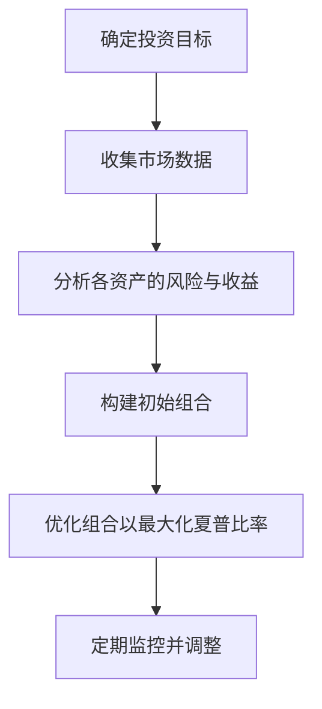
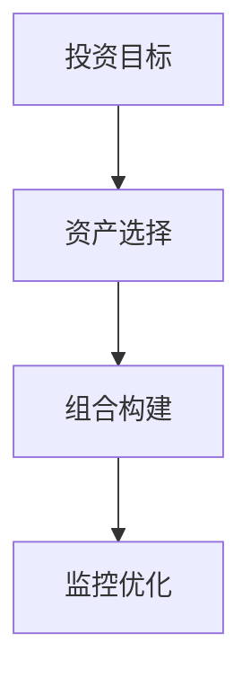

                 


```markdown
# 大卫·斯文森的另类资产配置策略

> 关键词：大卫·斯文森，另类资产配置，投资策略，私募股权，风险管理，夏普比率

> 摘要：大卫·斯文森作为耶鲁大学首席投资官，以其独特的另类资产配置策略闻名，通过将一部分资产投资于私募股权、房地产信托等另类资产，取得了优异的长期回报。本文详细分析了他的策略的核心思想、算法原理、系统架构，并通过实际案例展示其应用。文章还提供了详细的数学模型和Python代码示例，帮助读者理解和实现这一策略。

---

# 第1章: 大卫·斯文森的另类资产配置策略概述

## 1.1 大卫·斯文森的生平与成就
### 1.1.1 个人背景
大卫·斯文森于1954年出生于美国康涅狄格州，曾在耶鲁大学学习经济学，并在麻省理工学院（MIT）获得博士学位。他在1981年加入耶鲁大学，担任首席投资官，从此开始了他的投资生涯。

### 1.1.2 在耶鲁大学的成就
在大卫·斯文森的领导下，耶鲁大学的捐赠基金规模从1980年代初期的约1.3亿美元增长到2010年代的数十亿美元。他通过将一部分资产投资于私募股权、房地产信托、对冲基金等另类资产，实现了远超市场平均水平的回报。

### 1.1.3 投资理念与风格
斯文森强调长期投资和分散化，认为通过合理配置不同类型的资产可以降低风险并提高回报。他的策略注重基本面分析和长期持有，避免频繁交易和市场波动的影响。

## 1.2 另类资产配置的定义与特点
### 1.2.1 另类资产的定义
另类资产是指传统股票、债券之外的资产类别，包括私募股权、房地产信托、对冲基金、大宗商品等。这些资产通常具有较高的流动性溢价和较低的相关性，能够在传统资产表现不佳时提供额外收益。

### 1.2.2 另类资产配置的核心特点
- **分散化**：通过投资不同类型的资产降低风险。
- **长期视角**：注重资产的长期增值潜力。
- **主动管理**：积极参与被投资企业的管理，以实现更高的回报。
- **风险管理**：严格控制风险，避免重大损失。

### 1.2.3 与传统资产配置的区别
传统资产配置主要依赖于股票和债券，而另类资产配置引入了更多元化的资产类别，能够在不同经济环境下提供更稳定的回报。

## 1.3 大卫·斯文森策略的核心思想
### 1.3.1 长期投资理念
斯文森认为，投资的目的是通过长期持有优质资产实现财富增值，而不是通过短期交易赚取差价。

### 1.3.2 分散化投资原则
通过将资产分配到不同的另类资产类别中，降低单一资产类别波动带来的风险。

### 1.3.3 风险管理的重要性
斯文森强调，风险管理是投资成功的关键。通过严格的风险评估和控制，确保在不同市场环境下都能实现稳定的回报。

## 1.4 本章小结
本章介绍了大卫·斯文森的生平、成就及其另类资产配置策略的核心思想。他的策略通过长期投资、分散化和风险管理，实现了优异的回报。

---

# 第2章: 另类资产配置的核心概念

## 2.1 核心概念与原理
### 2.1.1 大卫·斯文森策略的核心要素
- **目标设定**：明确投资目标和风险承受能力。
- **资产选择**：选择具有长期增值潜力的另类资产。
- **组合构建**：根据目标和资产特性构建投资组合。
- **监控优化**：定期评估和调整投资组合。

### 2.1.2 另类资产配置的数学模型
使用夏普比率衡量投资组合的超额回报相对于其风险的程度：
$$ \text{夏普比率} = \frac{E(r_p) - r_f}{\sigma_p} $$
其中，\( E(r_p) \) 是投资组合的预期回报率，\( r_f \) 是无风险利率，\( \sigma_p \) 是投资组合的波动率。

### 2.1.3 核心概念的ER实体关系图
```mermaid
erDiagram
    大卫·斯文森策略 --> 投资目标
    大卫·斯文森策略 --> 资产选择
    资产选择 --> 投资组合
    投资组合 --> 监控优化
```

## 2.2 核心概念对比表格
| 比较维度 | 传统资产配置 | 另类资产配置 |
|----------|--------------|--------------|
| 主要资产类别 | 股票、债券 | 私募股权、房地产信托、对冲基金 |
| 投资期限 | 短期 | 长期 |
| 风险管理 | 较低 | 较高 |
| 回报潜力 | 稳定 | 较高 |

## 2.3 本章小结
本章详细解释了大卫·斯文森另类资产配置策略的核心概念，包括其数学模型和核心要素，并通过对比表格展示了与传统资产配置的区别。

---

# 第3章: 大卫·斯文森策略的算法原理

## 3.1 算法原理概述
### 3.1.1 算法的输入与输出
- **输入**：投资目标、可投资资产列表、市场数据。
- **输出**：优化后的投资组合。

### 3.1.2 算法的核心步骤
1. 确定投资目标和风险承受能力。
2. 收集并分析各另类资产的历史数据。
3. 使用夏普比率等指标评估各资产的收益与风险。
4. 构建初始投资组合。
5. 优化投资组合以最大化夏普比率。
6. 定期监控并调整组合。

## 3.2 算法流程图


## 3.3 本章小结
本章通过流程图和详细步骤说明了大卫·斯文森策略的算法原理，展示了如何通过数学模型优化投资组合。

---

# 第4章: 另类资产配置的系统分析与架构设计

## 4.1 问题场景介绍
### 4.1.1 投资目标的设定
根据投资者的财务状况和风险偏好确定投资目标。

### 4.1.2 资产配置的约束条件
- 资金规模限制。
- 风险承受能力。
- 投资期限。

### 4.1.3 系统功能需求
- 数据采集与处理。
- 资产分析与评估。
- 组合优化。
- 风险管理。

## 4.2 系统功能设计
### 4.2.1 领域模型Mermaid类图
```mermaid
classDiagram
    class 大卫·斯文森策略 {
        +目标设定
        +资产选择
        +组合构建
        +监控优化
    }
    class 投资目标 {
        +风险承受能力
        +投资期限
        +预期回报率
    }
    大卫·斯文森策略 --> 投资目标
```

### 4.2.2 系统架构设计Mermaid架构图


## 4.3 本章小结
本章通过系统架构设计展示了大卫·斯文森策略的实现过程，强调了各模块的交互与协作。

---

# 第5章: 大卫·斯文森策略的项目实战

## 5.1 项目实战与案例分析
### 5.1.1 案例介绍
假设我们管理一个1000万美元的捐赠基金，目标是通过另类资产配置实现年化8%的回报，同时将风险控制在合理范围内。

### 5.1.2 资产选择与配置
- 40%私募股权。
- 30%房地产信托。
- 20%对冲基金。
- 10%其他另类资产。

### 5.1.3 组合优化
使用夏普比率优化模型，调整各资产的比例，使整体组合的夏普比率最大化。

## 5.2 系统实现
### 5.2.1 Python代码示例
```python
import numpy as np

# 假设各资产的预期回报率和波动率
assets = ['私募股权', '房地产信托', '对冲基金', '其他']
returns = [0.1, 0.08, 0.06, 0.04]
volatility = [0.2, 0.15, 0.1, 0.08]

# 计算夏普比率
rf = 0.02
sharpe_ratio = (np.mean(returns) - rf) / np.mean(volatility)
print(f"夏普比率: {sharpe_ratio}")
```

## 5.3 本章小结
本章通过具体案例展示了大卫·斯文森策略的实战应用，提供了详细的Python代码示例，帮助读者理解和实现这一策略。

---

# 第6章: 大卫·斯文森策略的最佳实践

## 6.1 小结
大卫·斯文森通过另类资产配置实现了优异的投资回报，其核心思想包括长期投资、分散化和严格的风险管理。

## 6.2 注意事项
- **风险控制**：严格控制投资组合的风险。
- **长期视角**：避免短期波动的影响。
- **持续学习**：不断优化和调整投资策略。

## 6.3 拓展阅读
推荐阅读大卫·斯文森的著作《机构投资与基金管理》以及相关投资策略的书籍。

---

# 作者信息

作者：AI天才研究院/AI Genius Institute & 禅与计算机程序设计艺术 /Zen And The Art of Computer Programming
```

