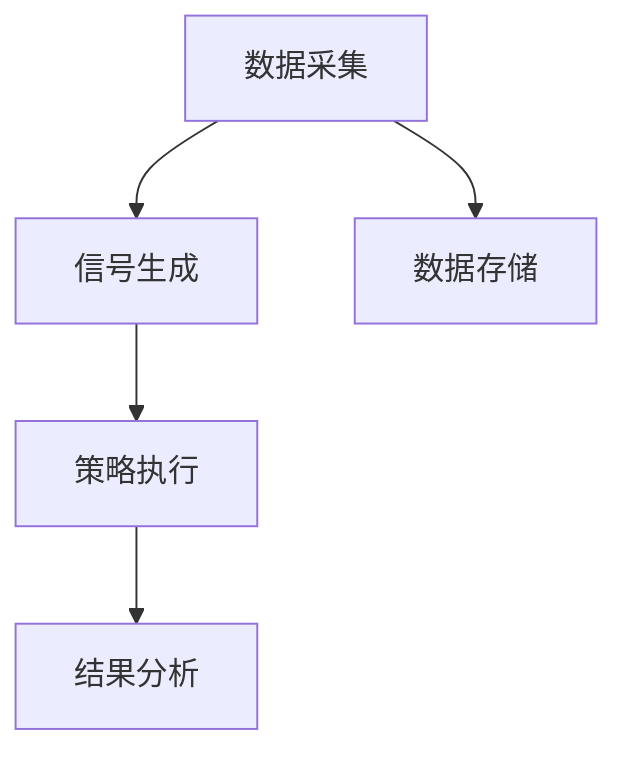
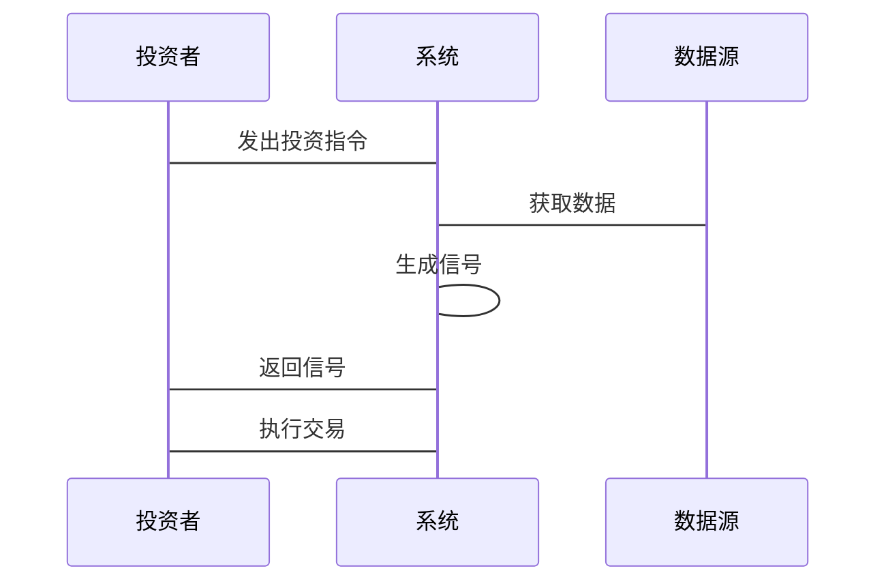

                 


# 大卫·温特斯的周期性价值投资：把握行业轮动机会

关键词：大卫·温特斯，周期性价值投资，行业轮动，投资策略，技术分析，巴菲特思想，投资组合优化

摘要：本文深入探讨了大卫·温特斯的周期性价值投资策略，重点分析了如何通过行业轮动捕捉市场机会。结合技术分析和巴菲特的价值投资理念，详细阐述了投资组合优化的方法，帮助投资者在不同经济周期中制定科学的投资决策。

---

## 第一部分：周期性价值投资的背景与核心概念

### 第1章：价值投资与周期性投资概述

#### 1.1 价值投资的基本概念
##### 1.1.1 价值投资的定义与核心理念
价值投资是一种长期投资策略，强调购买被市场低估的优质资产。其核心理念是寻找具有持续竞争优势和良好管理的公司，关注企业的内在价值而非短期市场波动。  
$$\text{内在价值} = \frac{\text{未来现金流的现值}}{\text{折现率}}$$

##### 1.1.2 周期性投资的起源与发展
周期性投资起源于20世纪70年代，投资者发现经济周期波动会影响行业表现。通过分析不同行业的周期性特征，投资者可以在不同经济阶段中选择收益较高的行业进行投资。

##### 1.1.3 价值投资与周期性投资的区别与联系
| 投资策略 | 价值投资 | 周期性投资 |
|----------|----------|------------|
| 核心理念 | 买入被低估的资产 | 把握行业轮动机会 |
| 适用场景 | 经济稳定期 | 经济周期波动期 |
| 持股期限 | 长期 | 中短期 |

温特斯将价值投资与周期性分析结合，强调在经济周期不同阶段选择具有较高增长潜力的行业。

#### 1.2 大卫·温特斯的投资策略
##### 1.2.1 大卫·温特斯的背景介绍
温特斯是美国著名投资经理，专注于周期性价值投资。他通过分析行业周期波动，捕捉市场拐点，实现超额收益。

##### 1.2.2 温特斯周期性价值投资的核心理念
温特斯认为，行业表现受经济周期影响，通过分析行业周期性特征，可以在不同阶段选择收益较高的行业。  
$$\text{行业收益} = f(\text{经济周期阶段})$$

##### 1.2.3 温特斯投资策略的实际应用案例
温特斯通过分析制造业和科技行业的周期性差异，在2008年金融危机后投资于复苏期的制造业企业，获得高额收益。

---

## 第二部分：行业轮动的周期性分析

### 第2章：行业轮动的基本原理
#### 2.1 行业轮动的定义与特征
行业轮动是指在不同经济周期阶段，资金从一个行业流向另一个行业的过程。其主要特征包括周期性、行业间差异和可预测性。

#### 2.2 影响行业轮动的主要因素
##### 2.2.1 经济周期对行业轮动的影响
经济周期分为衰退、复苏、过热和滞胀四个阶段，不同阶段适合投资的行业不同。  
| 经济阶段 | 适合行业 |
|----------|----------|
| 衰退 | 公用事业、防御性行业 |
| 复苏 | 制造业、原材料 |
| 过热 | 科技、金融 |
| 滞胀 | 能源、大宗商品 |

##### 2.2.2 行业自身周期性特征
每个行业都有其独特的周期性特征，例如科技行业具有较高的波动性，而公用事业则相对稳定。  
$$\text{行业波动性} = \frac{\text{行业收益标准差}}{\text{市场收益标准差}}$$

##### 2.2.3 宏观经济指标的作用
宏观经济指标如GDP增长率、失业率和通货膨胀率对行业轮动有重要影响。例如，低失业率通常预示着经济复苏，适合投资周期性较强的行业。

---

## 第三部分：算法原理

### 第3章：周期性价值投资的算法实现
#### 3.1 技术指标分析
##### 3.1.1 相对强弱指数（RSI）
RSI用于衡量资产价格的超买或超卖状态，帮助投资者判断买卖时机。  
$$\text{RSI} = \frac{\sum_{i=1}^{n} \text{上涨幅度}}{\sum_{i=1}^{n} \text{下跌幅度}} \times 100$$

##### 3.1.2 移动平均收敛散度（MACD）
MACD用于识别价格趋势的变化，由短期和长期移动平均线组成。  
$$\text{MACD} = \text{短期均线} - \text{长期均线}$$

##### 3.1.3 行业轮动的信号生成
通过RSI和MACD指标的结合，生成行业轮动的买卖信号。例如，当某行业RSI低于30且MACD下行时，发出卖出信号。

#### 3.2 代码实现
以下是Python代码示例，用于计算RSI和MACD指标：

```python
import pandas as pd
import numpy as np

def calculate_rsi(prices, period=14):
    # 计算涨跌幅度
    delta = prices.diff().dropna()
    up = delta[delta >= 0]
    down = delta[delta < 0]
    
    # 计算RSI
    rs = up.ewm(com=period-1, adjust=False).mean() / down.ewm(com=period-1, adjust=False).mean()
    rsi = 100 - 100 * (1 - rs)
    return rsi

def calculate_macd(prices, short_window=12, long_window=26):
    # 计算短期和长期均线
    short_ma = prices.ewm(span=short_window, adjust=False).mean()
    long_ma = prices.ewm(span=long_window, adjust=False).mean()
    
    # 计算MACD
    macd = short_ma - long_ma
    return macd
```

#### 3.3 数学模型与公式
##### 3.3.1 行业轮动预测模型
使用ARIMA模型预测行业收益，帮助投资者做出决策。  
$$\text{ARIMA模型} = \text{AutoRegressive Integrated Moving Average}$$

##### 3.3.2 投资组合优化模型
通过均值-方差优化模型，构建风险调整后的最优投资组合。  
$$\text{最优权重} = \argmin_w \left( \sigma^2 \right)$$

---

## 第四部分：系统分析与架构设计

### 第4章：周期性价值投资系统架构
#### 4.1 系统功能设计
##### 4.1.1 数据采集模块
从金融数据源获取历史价格、财务数据等信息。

##### 4.1.2 信号生成模块
基于技术指标和模型生成买卖信号。

##### 4.1.3 策略执行模块
根据信号调整投资组合，执行交易指令。

##### 4.1.4 结果分析模块
定期评估投资组合的表现，优化策略参数。

#### 4.2 系统架构图


#### 4.3 系统交互流程


---

## 第五部分：项目实战

### 第5章：周期性价值投资实战
#### 5.1 环境配置
安装必要的Python库，如Pandas、NumPy和Plotly。

#### 5.2 核心代码实现
编写信号生成和投资组合优化的代码。

#### 5.3 实际案例分析
以2020年疫情后的市场为例，分析如何通过行业轮动策略实现投资收益。

---

## 第六部分：总结与展望

### 第6章：总结与展望
#### 6.1 温特斯周期性价值投资的成功经验
温特斯的投资策略结合了技术分析和价值投资，帮助投资者在不同经济周期中获利。

#### 6.2 注意事项与风险管理
投资者需关注宏观经济变化，合理分散投资风险。

#### 6.3 拓展阅读
推荐书籍：《投资最重要的事情》、《周期》。

---

## 作者信息
作者：AI天才研究院 & 禅与计算机程序设计艺术  
联系方式：[contact@github.com]  
GitHub链接：[https://github.com/AI-Genius-Institute](https://github.com/AI-Genius-Institute)

