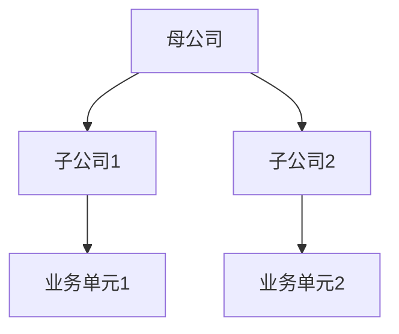
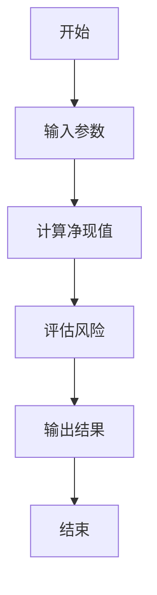
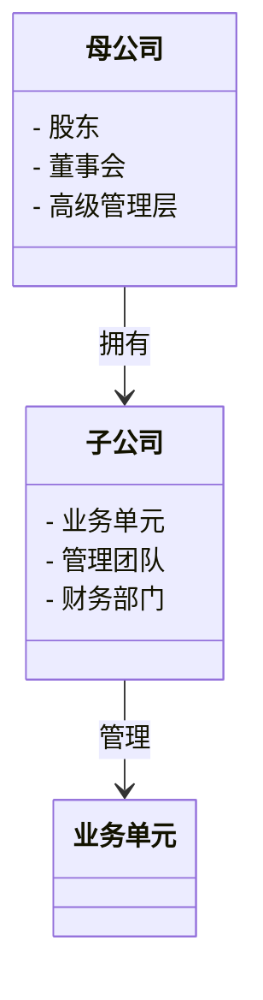
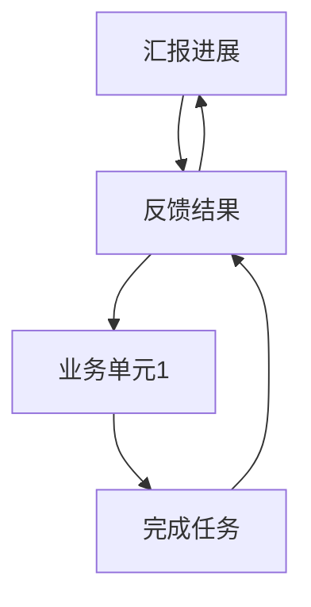

                 


# 大卫·艾伦·科恩的公司分拆价值释放策略

> 关键词：公司分拆，价值释放，大卫·艾伦·科恩，战略咨询，企业架构

> 摘要：本文深入探讨了大卫·艾伦·科恩的公司分拆策略，分析了其如何通过分拆释放公司价值，并详细讲解了分拆的类型、算法原理、系统架构设计以及实际案例分析。文章从背景介绍到项目实战，全面阐述了公司分拆的理论与实践。

---

## 第一部分: 公司分拆与价值释放概述

### 第1章: 公司分拆的定义与价值释放机制

#### 1.1 公司分拆的定义
公司分拆是指将一个企业拆分成多个独立的业务单元或子公司，每个单元专注于特定的业务领域。通过分拆，母公司可以将资源更高效地分配到高价值的业务中，从而释放整体价值。

#### 1.2 大卫·艾伦·科恩的分拆策略
大卫·艾伦·科恩是全球知名的管理咨询专家，他在公司分拆领域提出了独特的策略。他的方法强调通过分拆实现业务聚焦，优化管理效率，并通过独立运营提升子公司价值。

#### 1.3 当前商业环境与分拆趋势
在全球化和数字化转型的背景下，公司分拆已成为企业提升竞争力的重要手段。通过分拆，企业可以更好地适应市场变化，快速响应客户需求，并实现业务创新。

---

## 第二部分: 分拆的核心概念与联系

### 第2章: 分拆的类型与关键要素

#### 2.1 分拆的类型对比
| 类型       | 定义                                                                 | 优点                                                                 | 缺点                                                                 |
|------------|----------------------------------------------------------------------|----------------------------------------------------------------------|----------------------------------------------------------------------|
| 业务分拆   | 将特定业务线独立出来，形成新的子公司                              | 提高业务专注度，优化管理效率                                         | 可能导致资源分散，增加管理复杂性                                   |
| 股权分拆   | 将子公司股权部分出售或公开上市                                    | 提高子公司融资能力，降低母公司风险                                 | 可能失去对子公司的控制权                                             |
| 市场分拆   | 根据地理或客户群体划分业务单元                                    | 更好地适应不同市场的特点                                           | 可能增加跨市场协调的难度                                             |

#### 2.2 分拆的关键要素
- **业务单元的独立性**：确保每个子公司在组织架构、财务管理等方面独立运作。
- **资产的重新分配**：将资产合理分配到各个业务单元，提高资产利用效率。
- **管理体系的调整**：建立新的管理机制，确保分拆后的子公司能够高效运作。

#### 2.3 分拆的流程与步骤
1. **分拆前的评估**：分析公司业务结构，确定分拆的可行性和价值。
2. **分拆的实施过程**：将公司拆分成多个业务单元，明确每个单元的目标和职责。
3. **分拆后的整合**：优化公司治理结构，确保各子公司协同合作。

#### 2.4 分拆的实体关系图


---

## 第三部分: 分拆的算法原理与数学模型

### 第3章: 分拆的评估模型

#### 3.1 分拆的净现值分析
净现值（Net Present Value，NPV）是评估分拆价值的重要指标。其公式为：
$$ NPV = \sum_{t=0}^{n} \frac{C_t}{(1+r)^t} $$
其中，$C_t$ 是第 $t$ 年的现金流，$r$ 是贴现率。

#### 3.2 分拆的收益分配模型
收益分配公式为：
$$ R = \sum_{i=1}^{n} w_i \times v_i $$
其中，$w_i$ 是第 $i$ 个业务单元的权重，$v_i$ 是其价值。

#### 3.3 分拆的风险评估模型
风险评估公式为：
$$ Risk = \sum_{i=1}^{n} P_i \times I_i $$
其中，$P_i$ 是第 $i$ 个风险发生的概率，$I_i$ 是其影响程度。

#### 3.4 分拆的算法流程图


---

## 第四部分: 系统分析与架构设计

### 第4章: 系统分析与架构设计

#### 4.1 问题场景介绍
以一家多元化企业为例，通过分拆实现业务聚焦。假设母公司拥有多个业务单元，涵盖科技、金融和制造领域。

#### 4.2 系统功能设计


#### 4.3 系统架构设计


#### 4.4 系统接口设计
- 子公司与母公司之间的数据接口：财务报表、战略规划。
- 子公司内部接口：业务单元之间的协作。

#### 4.5 系统交互流程图


---

## 第五部分: 项目实战

### 第5章: 项目实战

#### 5.1 环境安装
- 配置公司架构：明确母公司与子公司的关系。
- 设定业务目标：优化资源配置，提升子公司价值。

#### 5.2 核心实现源代码
```python
def calculate_npv(cash_flows, discount_rate):
    npv = 0
    for t, cash_flow in enumerate(cash_flows):
        npv += cash_flow / (1 + discount_rate) ** t
    return npv

# 示例
cash_flows = [100, 200, 300]
discount_rate = 0.1
print("净现值:", calculate_npv(cash_flows, discount_rate))
```

#### 5.3 案例分析
以某科技公司为例，通过分拆实现业务聚焦。分拆后，子公司在技术创新和市场拓展方面取得了显著进展。

#### 5.4 项目总结
分拆成功的关键在于明确业务目标、合理分配资源，并确保子公司的独立运作。

---

## 第六部分: 最佳实践

### 第6章: 最佳实践

#### 6.1 小结
公司分拆是释放企业价值的重要策略，通过合理的分拆和优化管理，企业可以实现业务聚焦和高效运营。

#### 6.2 注意事项
- 确保分拆后的子公司具备独立的运营能力。
- 优化公司治理结构，确保各子公司协同合作。

#### 6.3 拓展阅读
- 《企业架构设计》
- 《战略管理：制定有效的商业策略》

---

## 作者：AI天才研究院/AI Genius Institute & 禅与计算机程序设计艺术 /Zen And The Art of Computer Programming

