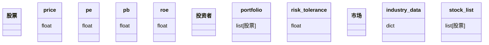
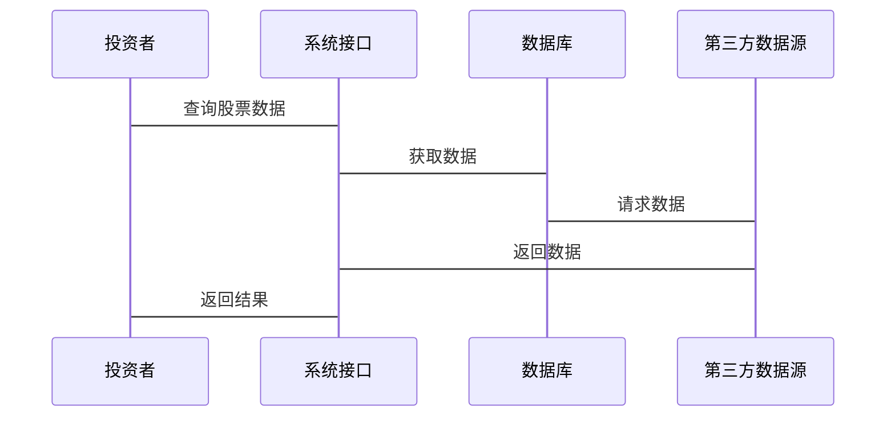

                 


# 大卫·艾伯特的深度价值投资：寻找被市场遗忘的股票

## 关键词：深度价值投资、股票估值、大卫·艾伯特、DCF模型、投资策略、遗忘股票

## 摘要：  
深度价值投资是一种以基本面分析为核心的长期投资策略，旨在通过发现市场中被低估的股票，实现长期稳定的超额收益。本文将详细探讨大卫·艾伯特的深度价值投资理念，分析其背后的数学模型与算法原理，并通过实际案例展示如何在当前市场中寻找被遗忘的股票。文章内容涵盖价值投资的起源、核心模型、系统架构设计、代码实现以及项目实战，帮助读者全面理解深度价值投资的精髓。

---

## 第1章: 深度价值投资的背景与核心理念

### 1.1 价值投资的起源与现状

#### 1.1.1 巴菲特的价值投资理念  
价值投资的鼻祖是本杰明·格雷厄姆，而巴菲特则是将这一理念发扬光大的代表人物。他强调以合理的价格买入优秀的公司，并长期持有。  

#### 1.1.2 大卫·艾伯特的深度价值投资方法  
大卫·艾伯特在巴菲特的基础上，进一步深化了价值投资的理论，提出了“深度价值投资”的概念。他强调通过对企业基本面的深入分析，寻找市场中被严重低估的股票。  

#### 1.1.3 当前市场的价值投资机会  
随着市场的波动加剧，许多优质公司因短期市场波动而被低估。深度价值投资为投资者提供了在市场底部布局的机会。

---

### 1.2 深度价值投资的定义与特点

#### 1.2.1 深度价值投资的核心概念  
深度价值投资是一种以内在价值为核心的投资策略，强调通过对企业财务状况、行业地位和未来盈利能力的分析，找到市场价格低于内在价值的股票。  

#### 1.2.2 深度价值投资与传统价值投资的区别  
深度价值投资更注重对企业基本面的深度挖掘，尤其是中小盘股和被市场遗忘的股票。  

#### 1.2.3 深度价值投资的适用场景  
适用于市场底部、行业低谷或个股基本面拐点出现的情况。

---

### 1.3 市场中的遗忘股票

#### 1.3.1 遗忘股票的定义与特征  
遗忘股票是指那些因市场波动、行业周期或投资者情绪而被市场忽视，但具有潜在价值的股票。  

#### 1.3.2 遗忘股票的形成原因  
市场情绪、信息不对称、短期波动等因素可能导致优质股票被遗忘。  

#### 1.3.3 寻找遗忘股票的策略与方法  
通过基本面分析、行业研究和市场情绪分析，筛选出被低估的股票。

---

## 第2章: 深度价值投资的核心模型与工具

### 2.1 股票估值的核心模型

#### 2.1.1 现金流折现模型（DCF）  
现金流折现模型是深度价值投资中最重要的估值工具之一。其基本思想是将未来现金流折现，计算出股票的内在价值。  

#### 2.1.2 市盈率与市净率分析  
市盈率（PE）和市净率（PB）是衡量股票价值的重要指标，但需结合行业特点和企业实际情况进行分析。  

#### 2.1.3 股东权益收益率（ROE）  
ROE反映了企业的盈利能力，但需结合企业的资本结构进行分析。

---

### 2.2 财务报表分析的关键指标

#### 2.2.1 收入与利润分析  
分析企业的收入增长、利润结构和盈利能力，判断企业的经营状况。  

#### 2.2.2 资产负债表分析  
通过分析企业的资产、负债和所有者权益，评估企业的财务健康状况。  

#### 2.2.3 现金流量表分析  
现金流量表反映了企业的现金流入和流出情况，是判断企业财务状况的重要依据。

---

### 2.3 股票筛选与投资组合管理

#### 2.3.1 股票筛选的多维度指标  
结合PE、PB、ROE等指标，筛选出具有投资价值的股票。  

#### 2.3.2 投资组合的构建与优化  
根据市场环境和个人风险偏好，构建合理的投资组合，并定期进行优化。  

#### 2.3.3 风险控制与仓位管理  
通过分散投资、止损设置和仓位调整，控制投资风险。

---

## 第3章: 深度价值投资的算法与数学模型

### 3.1 股票估值的数学模型

#### 3.1.1 现金流折现模型的公式推导  
$$DCF = \sum_{t=1}^{n} \frac{CF_t}{(1+r)^t} + \frac{TV}{(1+r)^n}$$  
其中，$CF_t$为第$t$年的现金流，$r$为折现率，$TV$为终值。  

#### 3.1.2 市盈率与市净率的计算公式  
$$PE = \frac{P}{E}$$  
$$PB = \frac{P}{B}$$  
其中，$P$为股价，$E$为每股收益，$B$为每股净资产。

---

### 3.2 投资组合优化的算法

#### 3.2.1 马科维茨投资组合理论  
马科维茨的投资组合理论强调通过优化风险和收益，构建最优投资组合。  

#### 3.2.2 现实中的简化模型  
在实际操作中，投资者可以根据自身的风险承受能力和收益目标，选择合适的投资组合优化模型。  

#### 3.2.3 风险调整后的收益优化  
通过调整风险因子，优化投资组合的收益与风险比。

---

### 3.3 代码实现与案例分析

#### 3.3.1 Python代码实现DCF模型  
```python
def calculate_dcf(cash_flows, discount_rate, terminal_value):
    dcf = 0
    for t in range(len(cash_flows)):
        dcf += cash_flows[t] / (1 + discount_rate) ** t
    dcf += terminal_value / (1 + discount_rate) ** len(cash_flows)
    return dcf

# 示例：计算某公司未来5年的现金流折现值
cash_flows = [100, 120, 150, 180, 200]
discount_rate = 0.1
terminal_value = 500
dcf_value = calculate_dcf(cash_flows, discount_rate, terminal_value)
print(f"DCF Value: {dcf_value:.2f}")
```

#### 3.3.2 案例分析  
以某公司为例，通过DCF模型计算其内在价值，并与市场价格进行对比，判断其是否为被低估的股票。

---

## 第4章: 系统分析与架构设计方案

### 4.1 问题场景介绍  
通过构建一个价值投资分析系统，帮助投资者快速筛选出被低估的股票。

### 4.2 系统功能设计

#### 4.2.1 领域模型类图  


### 4.3 系统架构设计  


### 4.4 系统接口设计  


---

## 第5章: 项目实战

### 5.1 环境安装  
安装Python、Pandas、NumPy等工具，并配置相应的开发环境。

### 5.2 核心代码实现

#### 5.2.1 股票筛选代码  
```python
import pandas as pd

def screen_stocks(data, max_pe=15, min_roe=0.1):
    filtered = data[(data['pe'] <= max_pe) & (data['roe'] >= min_roe)]
    return filtered

# 示例数据
data = pd.DataFrame({
    'pe': [10, 12, 8, 18, 20],
    'roe': [0.15, 0.1, 0.2, 0.05, 0.12]
})
result = screen_stocks(data)
print(result)
```

### 5.3 实际案例分析  
以某行业为例，筛选出符合条件的股票，并分析其投资价值。

### 5.4 项目小结  
总结项目实现的关键点，强调代码实现与实际应用的结合。

---

## 第6章: 最佳实践与小结

### 6.1 最佳实践  
- 定期复盘，调整投资策略。  
- 保持对市场的敏感性，及时捕捉投资机会。  
- 严格控制风险，避免过度集中投资。

### 6.2 小结  
深度价值投资是一种需要耐心和纪律的投资方法。通过系统的分析和科学的工具，投资者可以在市场中找到被遗忘的股票，实现长期稳定的收益。

---

## 作者：AI天才研究院/AI Genius Institute & 禅与计算机程序设计艺术 /Zen And The Art of Computer Programming

---

希望这篇文章能为深度价值投资的实践者和研究者提供有价值的参考。

