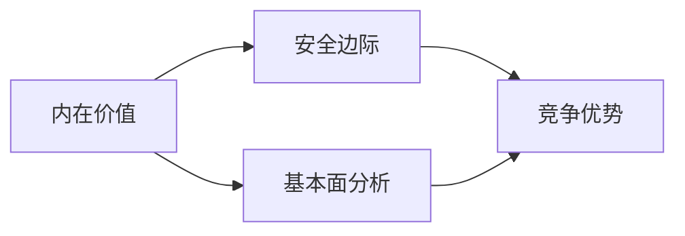
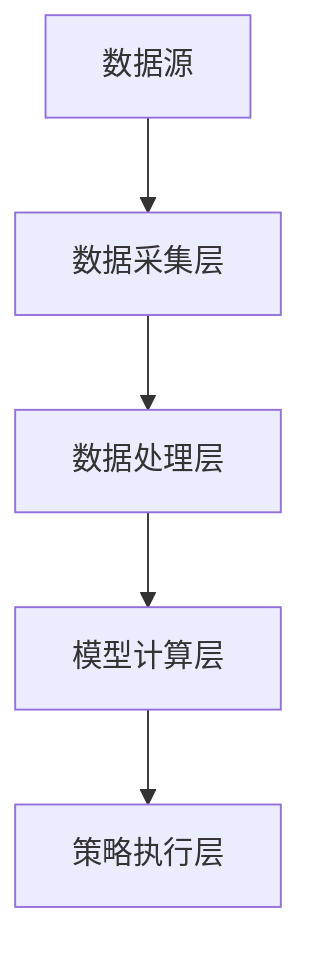

                 


# 《大卫·艾因霍恩的对冲基金价值投资：机构投资者的视角》

---

## 关键词  
- 大卫·艾因霍恩  
- 价值投资  
- 对冲基金  
- 机构投资者  
- 投资策略  

---

## 摘要  
大卫·艾因霍恩是全球著名的价值投资者和对冲基金经理，他的投资策略以基本面分析为核心，强调安全边际和逆向思维。本文从机构投资者的视角出发，深入探讨艾因霍恩的价值投资理念、对冲基金运作模式以及机构投资者如何借鉴其策略进行投资决策。通过系统分析和案例研究，揭示其投资方法的数学模型、算法原理及实际应用，为机构投资者提供实践指导。

---

## 正文  

### 第一部分：价值投资的理论基础  

#### 第1章：价值投资的核心理念  

##### 1.1 大卫·艾因霍恩的投资哲学  

###### 1.1.1 价值投资的定义与核心要素  
价值投资是一种以公司基本面分析为基础的投资策略，强调以低于内在价值的价格买入优质资产。其核心要素包括：  
- **内在价值**：资产的未来现金流的现值。  
- **安全边际**：买入价格与内在价值的折扣率。  
- **竞争优势**：企业在行业中的独特优势。  

**公式：**  
$$ \text{内在价值} = \sum_{t=1}^{n} \frac{\text{现金流}}{(1 + r)^t} $$  

**图1-1：价值投资的核心要素**  


###### 1.1.2 安全边际的概念与重要性  
安全边际是价值投资的核心，通过支付低于内在价值的价格，降低投资风险。艾因霍恩的安全边际公式：  
$$ \text{安全边际} = \text{内在价值} - \text{买入价格} $$  

###### 1.1.3 艾因霍恩的价值投资框架  
艾因霍恩的投资框架包括：  
1. 识别具有竞争优势的企业。  
2. 分析财务报表，评估内在价值。  
3. 确定安全边际，选择低估资产。  

##### 1.2 价值投资与传统投资的区别  

###### 1.2.1 传统投资的局限性  
传统投资依赖市场趋势和短期波动，忽视基本面分析。  

###### 1.2.2 价值投资的独特视角  
价值投资通过深入分析企业基本面，寻找长期价值。  

###### 1.2.3 两者的优劣势对比  
| 特性 | 价值投资 | 传统投资 |  
|------|----------|-----------|  
| 风险 | 较低     | 较高       |  
| 收益 | 稳定     | 波动较大   |  

##### 1.3 艾因霍恩的选股标准  

###### 1.3.1 公司基本面分析  
- **收入与利润**：关注增长性和稳定性。  
- **负债与现金流**：评估财务健康。  

###### 1.3.2 行业地位与竞争优势  
- **市场地位**：龙头企业优先。  
- **竞争优势**：专利、品牌等。  

###### 1.3.3 财务指标的筛选与评估  
关键指标：ROE（净资产收益率）、ROA（资产回报率）、毛利率。  

---

### 第二部分：对冲基金的运作机制  

#### 第2章：对冲基金的基本运作模式  

##### 2.1 对冲基金的定义与特点  

###### 2.1.1 对冲基金的定义  
对冲基金通过做多和做空操作，追求绝对收益。  

###### 2.1.2 对冲基金与传统资产管理的区别  
- **杠杆使用**：对冲基金可使用杠杆。  
- **策略多样性**：涵盖多空策略、套利等。  

##### 2.2 艾因霍恩的对冲基金策略  

###### 2.2.1 价值导向的投资策略  
- **低估值资产**：买入低估股票。  
- **短期波动**：捕捉市场错估。  

###### 2.2.2 逆向投资的逻辑  
在市场恐慌时买入优质资产，逆向操作。  

###### 2.2.3 集中投资与风险控制  
- **集中持仓**：减少分散带来的风险。  
- **风险对冲**：通过做空对冲市场风险。  

---

### 第三部分：机构投资者的视角  

#### 第3章：机构投资者的策略与考量  

##### 3.1 机构投资者的资产配置  

###### 3.1.1 资本资产定价模型（CAPM）  
$$ \text{预期收益} = r_f + \beta (R_m - r_f) $$  

##### 3.1.2 价值投资在机构配置中的应用  
- **长期视角**：匹配机构投资者的长期目标。  
- **风险分散**：通过多样化降低风险。  

##### 3.2 机构投资者的风险管理  

###### 3.2.1 风险调整后的收益  
- **夏普比率**：衡量风险调整后收益。  
$$ \text{夏普比率} = \frac{R_p - R_f}{\sigma_p} $$  

###### 3.2.2 价值投资与风险管理的结合  
通过安全边际和分散投资降低风险。  

##### 3.3 机构投资者的长期投资策略  

###### 3.3.1 长期视角下的价值投资  
机构投资者通过长期持有优质资产，实现价值增长。  

###### 3.3.2 机构投资者的监控与调整  
定期评估投资组合，动态调整持仓。  

---

### 第四部分：系统分析与架构设计  

#### 第4章：价值投资的系统分析  

##### 4.1 系统功能设计  

###### 4.1.1 价值投资系统的模块划分  
- **数据采集**：获取企业财务数据。  
- **模型计算**：评估内在价值。  
- **策略执行**：生成投资信号。  

##### 4.2 系统架构设计  

###### 4.2.1 分层架构  


##### 4.3 系统接口设计  

###### 4.3.1 API接口  
- 数据接口：获取实时数据。  
- 计算接口：调用模型计算。  

##### 4.4 系统交互设计  

###### 4.4.1 用户交互流程  
```mermaid  
sequenceDiagram  
actor 用户  
participant 系统  
用户 -> 系统：请求数据  
系统 -> 用户：返回数据  
用户 -> 系统：执行计算  
系统 -> 用户：返回结果  
```

---

### 第五部分：项目实战  

#### 第5章：价值投资策略的实战应用  

##### 5.1 环境安装  

###### 5.1.1 安装Python与相关库  
- 安装：`pip install pandas numpy matplotlib`  

##### 5.2 核心代码实现  

###### 5.2.1 内在价值计算  
```python
def calculate_intrinsic_value(cash_flows, discount_rate):
    return sum(cash_flow / (1 + discount_rate)**t for t, cash_flow in enumerate(cash_flows))
```

###### 5.2.2 安全边际计算  
```python
def calculate_margin_of_safety(intrinsic_value, purchase_price):
    return intrinsic_value - purchase_price
```

##### 5.3 代码解读与分析  

###### 5.3.1 内在价值计算示例  
假设现金流为[100, 150, 200]，折现率为0.1：  
$$ \text{内在价值} = \frac{100}{1.1} + \frac{150}{1.1^2} + \frac{200}{1.1^3} \approx 372.09 $$  

##### 5.4 案例分析  

###### 5.4.1 某公司投资案例  
- **买入价格**：$50  
- **内在价值**：$60  
- **安全边际**：$10  

---

### 第六部分：总结与展望  

#### 第6章：价值投资的未来  

##### 6.1 总结与回顾  

###### 6.1.1 大卫·艾因霍恩的投资策略  
- 以基本面分析为核心。  
- 强调安全边际与逆向思维。  

##### 6.2 机构投资者的借鉴  

###### 6.2.1 长期视角的重要性  
机构投资者应坚持长期投资，避免短期波动干扰。  

##### 6.3 未来展望  

###### 6.3.1 数学模型的优化  
结合大数据和机器学习，提升基本面分析的准确性。  

---

## 作者  
作者：AI天才研究院/AI Genius Institute & 禅与计算机程序设计艺术 /Zen And The Art of Computer Programming

