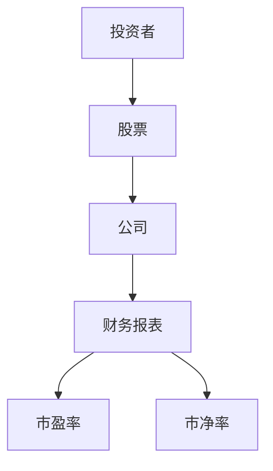
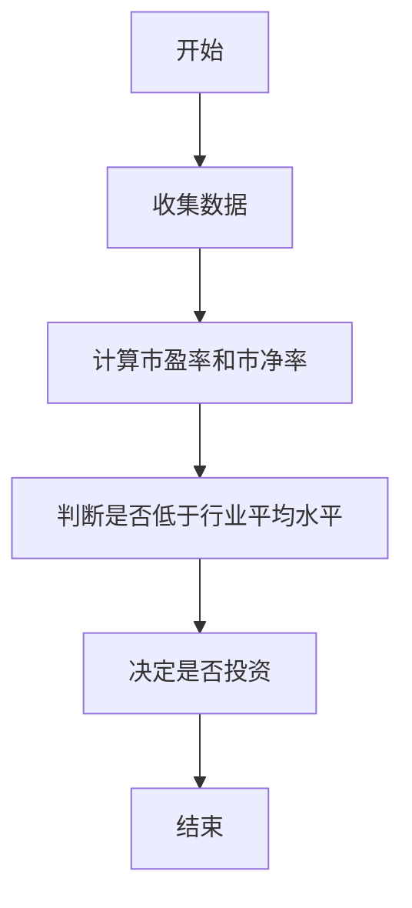
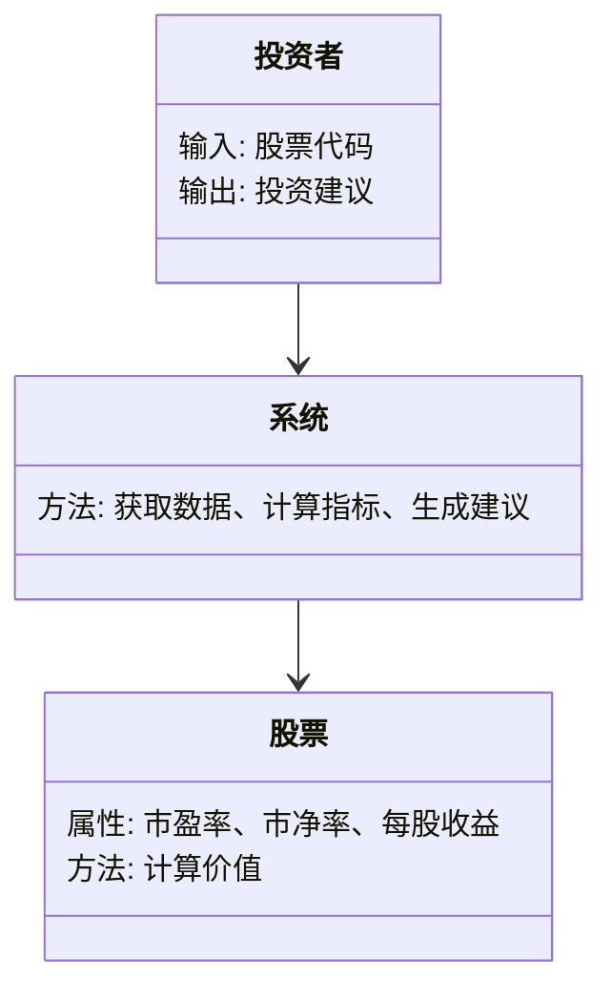

                 


# 大卫德雷曼的价值投资实务

> 关键词：价值投资，大卫德雷曼，投资策略，市盈率，市净率，投资组合，投资算法

> 摘要：本文深入探讨了大卫德雷曼的价值投资策略，从核心概念到算法实现，再到系统架构设计，全面解析了价值投资的实务操作。文章通过详细的数学公式、Mermaid图表和Python代码示例，帮助读者系统地理解和应用价值投资的方法。

---

## 第一部分：价值投资的背景与核心理念

### 第1章：价值投资的起源与发展

#### 1.1 价值投资的起源
- **投资学的基本概念**  
  投资学是研究资金分配和资产定价的学科，旨在通过科学的方法实现财富的保值与增值。  
- **价值投资的定义与核心理念**  
  价值投资是由本杰明·格雷厄姆和大卫·德雷曼共同提出的投资策略，强调以低于内在价值的价格买入优质资产。其核心理念是：市场短期是投票器，长期是称重机。  
- **大卫德雷曼的贡献**  
  大卫德雷曼是价值投资的重要传承者，他的研究成果将价值投资从理论推向实践，提出了许多实用的选股指标和投资策略。

#### 1.2 价值投资的核心要素
- **价值投资的三要素**  
  1. **安全边际**：买入价格低于内在价值的部分。  
  2. **内在价值**：资产在未来现金流的现值。  
  3. **市场先生**：市场的波动性和非理性是投资机会的来源。  
- **价值投资与成长投资的区别**  
  | 指标 | 价值投资 | 成长投资 |
  |------|----------|----------|
  | 核心 | 低市盈率、低市净率 | 高成长性、高市盈率 |
  | 风险 | 低 | 高 |
  | 代表人物 | 格雷厄姆、德雷曼 | 费雪、彼得·林奇 |
- **价值投资的边界与外延**  
  价值投资不仅适用于股票，还可以扩展到房地产、债券等资产类别。

---

### 第2章：价值投资的核心概念与联系

#### 2.1 价值投资的核心原理
- **市盈率与市净率的计算公式**  
  $$市盈率 = \frac{股价}{每股收益}$$  
  $$市净率 = \frac{股价}{每股净资产}$$  
- **价值投资的核心要素对比表格**  
  | 指标 | 定义 | 重要性 |
  |------|------|--------|
  | 市盈率 | 股价与每股收益的比率 | 判断股票是否被高估或低估 |
  | 市净率 | 股价与每股净资产的比率 | 判断股票的资产价值是否合理 |

#### 2.2 价值投资的ER实体关系图


---

### 第3章：价值投资的算法原理

#### 3.1 价值投资的算法流程


#### 3.2 价值投资的数学模型
- **市盈率计算公式**  
  $$市盈率 = \frac{股价}{每股收益}$$  
- **市净率计算公式**  
  $$市净率 = \frac{股价}{每股净资产}$$

---

### 第4章：价值投资的系统分析与架构设计

#### 4.1 价值投资决策系统的功能设计


---

## 第二部分：价值投资的算法实现

### 第5章：价值投资的项目实战

#### 5.1 环境安装
- 需要的工具：Python 3.8+，Pandas库，NumPy库。
- 安装命令：
  ```bash
  pip install pandas numpy
  ```

#### 5.2 系统核心实现源代码
```python
import pandas as pd
import numpy as np

def calculate_value_investing_signals(df):
    # 计算市盈率
    df['PE'] = df['股价'] / df['每股收益']
    # 计算市净率
    df['PB'] = df['股价'] / df['每股净资产']
    # 判断是否低于行业平均水平
    industry_avg_pe = df['PE'].mean()
    industry_avg_pb = df['PB'].mean()
    df['投资信号'] = (df['PE'] < industry_avg_pe) & (df['PB'] < industry_avg_pb)
    return df

# 示例数据
data = {
    '股票代码': ['AAPL', 'MSFT', 'GOOGL', 'AMZN', 'FB'],
    '股价': [321.45, 334.56, 302.03, 312.12, 350.10],
    '每股收益': [10.21, 12.34, 15.45, 13.23, 14.50],
    '每股净资产': [56.78, 67.89, 78.90, 65.43, 60.12]
}
df = pd.DataFrame(data)

# 计算信号
result = calculate_value_investing_signals(df)
print(result)
```

#### 5.3 代码应用解读与分析
- **数据收集**：从股票数据库中获取目标股票的股价、每股收益和每股净资产。  
- **指标计算**：计算市盈率和市净率。  
- **信号生成**：判断市盈率和市净率是否低于行业平均水平，生成投资信号。  

#### 5.4 实际案例分析
- 假设行业平均市盈率为18，市净率为2.5。  
- 对于AAPL，市盈率=321.45/10.21≈31.48，市净率=321.45/56.78≈5.65。  
- 由于市盈率和市净率均高于行业平均水平，AAPL的投资信号为False。  

---

### 第6章：最佳实践与小结

#### 6.1 小结
- 价值投资的核心在于寻找价格低于内在价值的资产。  
- 通过市盈率和市净率等指标，可以有效筛选出具有投资价值的股票。  

#### 6.2 注意事项
- 价值投资需要结合市场环境和公司基本面进行综合判断。  
- 避免过度依赖单一指标，应多维度分析。  

#### 6.3 拓展阅读
- 格雷厄姆的《证券分析》  
- 德雷曼的《投资学》  

---

作者：AI天才研究院/AI Genius Institute & 禅与计算机程序设计艺术 /Zen And The Art of Computer Programming

