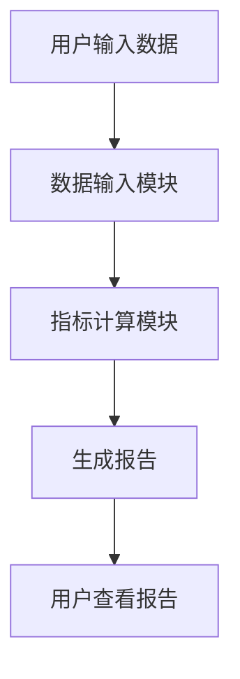

                 


# 大卫德雷曼的资产负债表分析

## 关键词：大卫德雷曼、资产负债表、财务分析、现金流量、比率分析、投资策略

## 摘要：大卫德雷曼的资产负债表分析方法是一种强大的工具，用于评估公司的财务健康状况和投资潜力。本文将详细探讨大卫德雷曼分析法的核心概念、数学模型、系统架构及实际应用。通过分析资产负债表的关键要素，本文揭示了如何利用这些信息来制定有效的投资策略，并提供了丰富的实战案例和代码实现。

---

## 第1章: 资产负债表的基本概念与大卫德雷曼分析法概述

### 1.1 资产负债表的核心概念

#### 1.1.1 资产、负债、所有者权益的基本定义

- **资产**：公司拥有的资源，能够带来未来经济利益的经济资源。
- **负债**：公司需要偿还的债务。
- **所有者权益**：公司资产减去负债后归所有者所有的部分。

#### 1.1.2 资产负债表的结构与作用

- 资产负债表的结构分为资产、负债和所有者权益三部分。
- 通过资产负债表，投资者可以评估公司的财务状况、偿债能力和经营效率。

#### 1.1.3 大卫德雷曼分析法的起源与特点

- 大卫德雷曼是一位著名投资专家，他提出了一种基于资产负债表的分析方法，专注于现金流量和财务比率分析。
- 该方法注重现金流的质量和稳定性，强调通过资产负债表数据来评估公司的财务健康状况。

### 1.2 大卫德雷曼分析法的背景与应用

#### 1.2.1 现金流量分析的重要性

- 现金流量是公司财务健康的核心指标，反映了公司的盈利能力和偿债能力。
- 现金流量分为经营活动现金流、投资活动现金流和筹资活动现金流。

#### 1.2.2 资产负债表在投资决策中的作用

- 资产负债表提供了公司财务状况的全面信息，帮助投资者评估公司的偿债能力和财务稳定性。
- 通过分析资产负债表，投资者可以识别公司的潜在风险和投资机会。

#### 1.2.3 大卫德雷曼分析法与其他财务分析方法的对比

- 与传统的财务比率分析相比，大卫德雷曼分析法更注重现金流的质量和稳定性。
- 与其他现金流分析方法相比，大卫德雷曼分析法更强调资产负债表的结构和勾稽关系。

### 1.3 本书的核心内容与学习目标

#### 1.3.1 本书的主要分析框架

- 本书将详细介绍大卫德雷曼分析法的核心概念、数学模型和实际应用。
- 通过系统的分析框架，读者可以掌握如何利用资产负债表数据进行财务分析。

#### 1.3.2 学习本书的必要性与方法论

- 学习大卫德雷曼分析法有助于投资者做出更明智的投资决策。
- 读者应具备基础的财务知识和编程能力，以便更好地理解和应用分析方法。

#### 1.3.3 本书的结构安排与章节概览

- 本书分为五章，涵盖资产负债表的核心概念、数学模型、系统架构、项目实战等内容。
- 每章内容均配有丰富的实例和代码，帮助读者深入理解和应用分析方法。

---

## 第2章: 资产负债表的核心要素与分析框架

### 2.1 资产负债表的主要组成部分

#### 2.1.1 资产的分类与特征

- 资产分为流动资产、非流动资产、其他资产等类别。
- 流动资产包括现金、应收账款、存货等，非流动资产包括固定资产、无形资产等。

#### 2.1.2 负债的分类与特征

- 负债分为流动负债、非流动负债等类别。
- 流动负债包括应付账款、短期借款等，非流动负债包括长期借款等。

#### 2.1.3 所有者权益的构成与作用

- 所有者权益包括股本、资本公积、盈余公积等。
- 所有者权益反映了公司净资产的价值。

### 2.2 大卫德雷曼分析法的核心要素

#### 2.2.1 现金流量分析的核心指标

- 自由现金流是公司经营活动产生的现金流减去资本支出。
- 现金流量质量是经营活动现金流与净利润的比率。

#### 2.2.2 资产负债表的勾稽关系

- 资产负债表的总负债与总资产的比率反映了公司的负债率。
- 资产负债表的速动比率反映了公司的短期偿债能力。

#### 2.2.3 财务健康度的评价标准

- 财务健康度是通过流动性、偿债能力和盈利能力三个维度综合评价的。

### 2.3 资产负债表分析的基本流程

#### 2.3.1 数据收集与整理

- 收集公司的资产负债表数据，包括资产、负债和所有者权益的详细信息。

#### 2.3.2 关键指标的计算与解读

- 计算自由现金流、负债率、速动比率等关键指标。
- 解读这些指标的含义，评估公司的财务状况。

#### 2.3.3 财务状况的综合评价

- 结合多个指标，综合评价公司的财务健康度。
- 根据评价结果，制定相应的投资策略。

---

## 第3章: 大卫德雷曼分析法的数学模型与公式

### 3.1 现金流量分析的关键公式

#### 3.1.1 自由现金流的计算公式

$$
\text{自由现金流} = \text{净利润} - \text{折旧} - \text{资本支出}
$$

#### 3.1.2 现金流量质量的评价指标

$$
\text{现金流量质量} = \frac{\text{经营活动现金流}}{\text{净利润}}
$$

### 3.2 资产负债表比率分析的数学模型

#### 3.2.1 负债率的计算公式

$$
\text{负债率} = \frac{\text{总负债}}{\text{总资产}}
$$

#### 3.2.2 速动比率的计算公式

$$
\text{速动比率} = \frac{\text{流动资产} - \text{存货}}{\text{流动负债}}
$$

### 3.3 财务健康度的综合评价模型

#### 3.3.1 财务健康度的评价指标

$$
\text{财务健康度} = \text{流动性评分} \times \text{偿债能力评分} \times \text{盈利能力评分}
$$

#### 3.3.2 模型的适用性与局限性

- 该模型适用于大多数行业，但在特定行业可能需要调整权重。
- 模型的局限性在于假设所有指标的重要性相同。

---

## 第4章: 系统分析与架构设计方案

### 4.1 系统分析框架

#### 4.1.1 资产负债表分析的系统目标

- 系统目标是通过分析资产负债表数据，评估公司的财务健康状况。
- 系统需要支持多维度的财务分析，包括现金流量、比率分析等。

#### 4.1.2 系统功能模块划分

- 数据输入模块：用于输入资产负债表数据。
- 指标计算模块：计算自由现金流、负债率等关键指标。
- 报告生成模块：生成财务分析报告。

#### 4.1.3 数据流与信息处理流程

- 数据输入模块将资产负债表数据输入系统。
- 指标计算模块根据输入数据计算关键指标。
- 报告生成模块将计算结果整理成报告。

### 4.2 系统架构设计

#### 4.2.1 分层架构设计

- 系统分为数据层、业务逻辑层和用户界面层。
- 数据层负责数据的存储和管理。
- 业务逻辑层负责指标的计算和分析。
- 用户界面层负责与用户的交互。

#### 4.2.2 模块化设计与接口规范

- 每个模块都有清晰的接口定义，确保模块之间的通信。
- 接口规范包括输入和输出的数据格式。

#### 4.2.3 数据存储与处理方案

- 数据存储采用数据库技术，确保数据的安全和高效访问。
- 数据处理采用高效的算法，确保系统的响应速度。

### 4.3 系统交互设计

#### 4.3.1 用户需求分析

- 用户需要输入资产负债表数据，选择分析指标，查看分析结果。
- 用户界面需要直观易用，方便用户操作。

#### 4.3.2 系统功能流程图



#### 4.3.3 界面设计与用户体验优化

- 界面设计采用现代风格，注重用户体验。
- 用户界面需要提供友好的操作指南，帮助用户完成数据分析。

---

## 第5章: 项目实战——大卫德雷曼分析法的应用

### 5.1 项目背景与目标

- 本项目旨在通过大卫德雷曼分析法，分析某公司的财务状况，评估其投资价值。
- 项目目标是通过实际案例，展示分析方法的应用过程。

### 5.2 环境安装与配置

- 安装Python编程环境，包括Jupyter Notebook。
- 安装必要的库，如pandas、numpy、matplotlib。

### 5.3 系统核心实现源代码

```python
import pandas as pd

# 输入资产负债表数据
df = pd.read_csv('balance_sheet.csv')

# 计算自由现金流
free_cash_flow = df['净利润'] - df['折旧'] - df['资本支出']

# 计算现金流量质量
cash_flow_quality = df['经营活动现金流'] / df['净利润']

# 计算负债率
debt_ratio = df['总负债'] / df['总资产']

# 计算速动比率
quick_ratio = (df['流动资产'] - df['存货']) / df['流动负债']

# 打印结果
print('自由现金流:', free_cash_flow)
print('现金流量质量:', cash_flow_quality)
print('负债率:', debt_ratio)
print('速动比率:', quick_ratio)
```

### 5.4 代码应用解读与分析

- 代码首先读取资产负债表数据，计算自由现金流、现金流量质量、负债率和速动比率。
- 通过这些指标，评估公司的财务健康状况。

### 5.5 实际案例分析

- 以某公司为例，分析其资产负债表数据。
- 计算各项指标，评估公司的财务健康度。

### 5.6 项目小结

- 通过项目实战，读者可以掌握大卫德雷曼分析法的实际应用。
- 项目中小结分析结果，总结分析过程中的经验和教训。

---

## 第6章: 总结与最佳实践

### 6.1 小结

- 大卫德雷曼分析法是一种强大的工具，通过分析资产负债表数据，评估公司的财务健康状况。
- 本文详细介绍了分析方法的核心概念、数学模型和实际应用。

### 6.2 最佳实践 tips

- 在进行财务分析时，应结合行业特点和公司实际情况，灵活应用分析方法。
- 定期更新资产负债表数据，及时发现和解决问题。

### 6.3 注意事项

- 分析过程中应注重数据的准确性和完整性。
- 避免仅依赖单一指标，综合考虑多个指标的综合评价。

### 6.4 拓展阅读

- 建议读者进一步学习其他财务分析方法，如杜邦分析法、趋势分析法等。
- 可以阅读大卫德雷曼的原著，深入理解其分析方法的精髓。

---

## 作者：AI天才研究院/AI Genius Institute & 禅与计算机程序设计艺术 /Zen And The Art of Computer Programming

