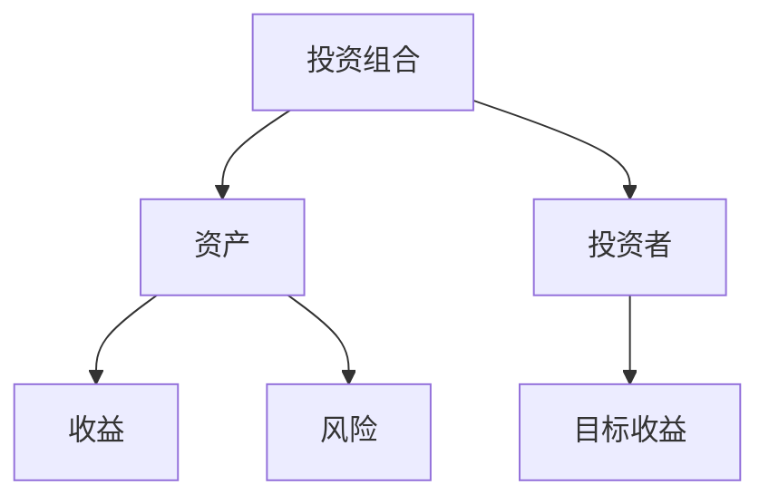
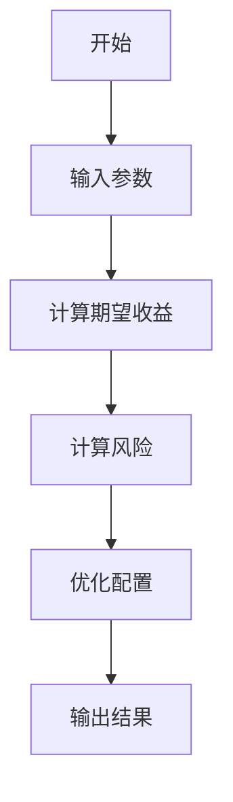
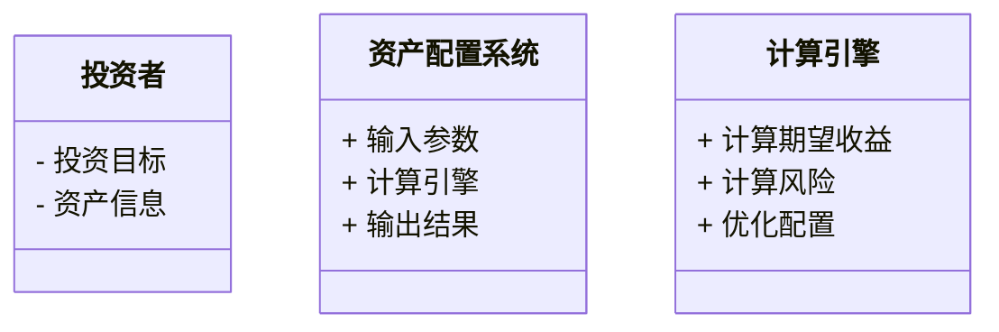
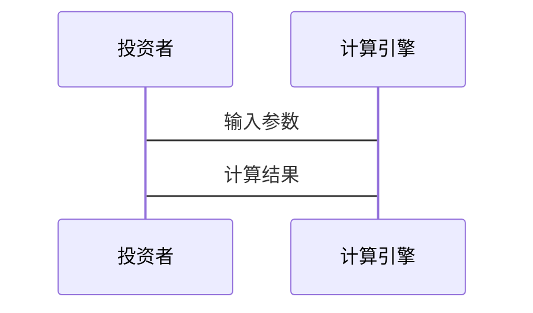

                 


# 大卫斯文森的另类投资策略

> 关键词：大卫斯文森，另类投资，资产配置，风险控制，投资策略，算法实现

> 摘要：本文深入探讨了大卫·斯文森的另类投资策略，从其核心理念到数学模型，再到系统架构设计和实际案例分析，全面解析其策略的实现过程和应用效果。

---

## 第一部分: 大卫·斯文森另类投资策略背景与核心概念

### 第1章: 大卫·斯文森另类投资策略概述

#### 1.1 大卫·斯文森及其投资理念
##### 1.1.1 大卫·斯文森的生平简介
大卫·斯文森（David Swensen）是美国著名经济学家和投资专家，曾担任耶鲁大学首席投资官。他在投资领域有着深厚的理论基础和实践经验，尤其在另类投资领域具有重要影响力。

##### 1.1.2 斯文森投资理念的核心思想
斯文森的投资理念强调长期视角、多元化配置和风险控制。他认为，通过科学的资产配置和风险分散，可以实现投资组合的最优收益。

##### 1.1.3 斯文森投资策略的全球影响力
斯文森的投资策略不仅在耶鲁大学取得了显著成效，还被广泛应用于机构投资和个人理财领域，成为现代投资理论的重要组成部分。

#### 1.2 另类投资策略的定义与特点
##### 1.2.1 另类投资的定义
另类投资是指那些传统股票、债券等之外的投资标的，包括房地产、私募股权、对冲基金等。

##### 1.2.2 另类投资的核心特点
- **分散风险**：通过投资不同类型资产降低整体风险。
- **高收益潜力**：在特定市场环境下可能带来超额收益。
- **复杂性较高**：需要专业的知识和经验进行管理和操作。

##### 1.2.3 另类投资与传统投资的区别
| 特性         | 传统投资           | 另类投资           |
|--------------|--------------------|--------------------|
| 投资标的      | 股票、债券等       | 房地产、私募股权等 |
| 风险水平      | 较低               | 较高               |
| 流动性        | 较高               | 较低               |

#### 1.3 斯文森投资策略的背景与现状
##### 1.3.1 现代投资组合理论的发展
从马科维茨的现代投资组合理论（MPT）到斯文森的实践应用，另类投资策略不断完善和发展。

##### 1.3.2 斯文森策略在耶鲁大学的实践
斯文森通过在耶鲁大学的实践，验证了另类投资策略的有效性，并取得了显著的收益。

##### 1.3.3 当前另类投资市场的趋势
随着市场的变化，另类投资策略也在不断调整和优化，以适应新的经济环境和市场趋势。

#### 1.4 本章小结
本章介绍了大卫·斯文森及其投资理念，明确了另类投资的定义和特点，并分析了其在现代投资中的地位和发展趋势。

---

### 第2章: 另类投资策略的核心概念与联系

#### 2.1 核心概念原理
##### 2.1.1 投资组合的构建原理
投资组合的构建需要考虑资产的预期收益、风险和相关性，通过优化算法找到最优配置。

##### 2.1.2 资产配置的数学模型
资产配置可以通过数学模型（如均值-方差模型）来优化，以实现收益和风险的平衡。

##### 2.1.3 风险与收益的平衡机制
通过调整资产配置比例，可以在不同市场环境下动态平衡收益和风险。

#### 2.2 核心概念属性特征对比
##### 2.2.1 对比表格展示
| 特性         | 传统投资           | 另类投资           |
|--------------|--------------------|--------------------|
| 投资标的      | 股票、债券等       | 房地产、私募股权等 |
| 风险水平      | 较低               | 较高               |
| 流动性        | 较高               | 较低               |

##### 2.2.2 通过 Mermaid 绘制 ER 实体关系图


---

### 第3章: 另类投资策略的算法原理

#### 3.1 算法原理概述
##### 3.1.1 通过 Mermaid 绘制算法流程图


##### 3.1.2 使用 Python 实现核心算法
```python
import numpy as np
import pandas as pd

def calculate_return(weights, returns):
    return np.dot(weights.T, returns)

def calculate_risk(weights, cov_matrix):
    return np.sqrt(np.dot(weights.T, np.dot(cov_matrix, weights)))

# 示例数据
returns = np.array([0.1, 0.2, 0.15])
cov_matrix = np.array([[0.05, 0.02, 0.01],
                        [0.02, 0.1, 0.03],
                        [0.01, 0.03, 0.08]])

weights = np.array([1/3, 1/3, 1/3])

print("期望收益:", calculate_return(weights, returns))
print("风险:", calculate_risk(weights, cov_matrix))
```

##### 3.1.3 算法的数学模型与公式
数学模型可以表示为：
$$ \text{收益} = \sum_{i=1}^{n} w_i r_i $$
$$ \text{风险} = \sqrt{\sum_{i=1}^{n} \sum_{j=1}^{n} w_i w_j \sigma_{ij}} $$

其中，\( w_i \) 是资产 \( i \) 的权重，\( r_i \) 是资产 \( i \) 的期望收益，\( \sigma_{ij} \) 是资产 \( i \) 和 \( j \) 的协方差。

#### 3.2 数学公式详细解析
##### 3.2.1 使用 LaTeX 格式公式
$$ \text{收益} = \sum_{i=1}^{n} w_i r_i $$

##### 3.2.2 公式之间的关系与依赖
通过优化算法，可以找到最优的权重组合，以最小化风险或最大化收益。

##### 3.2.3 公式的实际应用案例
例如，在三资产配置中，通过上述公式计算出各资产的权重，以实现最优收益和风险平衡。

---

### 第4章: 系统分析与架构设计方案

#### 4.1 投资系统场景介绍
##### 4.1.1 投资系统的目标与范围
系统旨在通过科学的资产配置算法，帮助投资者实现收益和风险的最优平衡。

##### 4.1.2 系统的用户需求分析
用户需要一个直观的界面，输入资产信息和投资目标，系统输出优化后的资产配置方案。

##### 4.1.3 系统的功能模块划分
- 数据输入模块
- 计算引擎模块
- 结果展示模块

#### 4.2 系统功能设计
##### 4.2.1 领域模型设计（Mermaid 类图）


##### 4.2.2 系统架构设计（Mermaid 架构图）
```mermaid
container 资产配置系统 {
    投资者
    计算引擎
    输出结果
}
```

##### 4.2.3 系统接口设计与交互（Mermaid 序列图）


---

### 第5章: 项目实战与案例分析

#### 5.1 项目环境安装与配置
##### 5.1.1 开发环境搭建
安装 Python 和必要的库（如 numpy、pandas）。

##### 5.1.2 依赖库安装与配置
使用 pip 安装相关库：
```bash
pip install numpy pandas
```

##### 5.1.3 项目初始化与数据准备
创建项目目录并准备数据文件。

#### 5.2 核心代码实现
##### 5.2.1 资产配置模型实现
```python
import numpy as np

def optimize_portfolio(returns, cov_matrix):
    n = len(returns)
    # 初始化权重向量
    weights = np.array([1/n]*n)
    # 计算收益和风险
    expected_return = np.dot(weights, returns)
    risk = np.sqrt(np.dot(weights, np.dot(cov_matrix, weights)))
    return weights, expected_return, risk

# 示例数据
returns = np.array([0.1, 0.2, 0.15])
cov_matrix = np.array([[0.05, 0.02, 0.01],
                        [0.02, 0.1, 0.03],
                        [0.01, 0.03, 0.08]])

weights, expected_return, risk = optimize_portfolio(returns, cov_matrix)
print("权重:", weights)
print("期望收益:", expected_return)
print("风险:", risk)
```

##### 5.2.2 风险评估与优化算法实现
```python
def calculate_risk(weights, cov_matrix):
    return np.sqrt(np.dot(weights.T, np.dot(cov_matrix, weights)))

# 示例优化
n = 3
cov_matrix = ...  # 定义协方差矩阵
weights = np.array([1/3, 1/3, 1/3])
risk = calculate_risk(weights, cov_matrix)
```

##### 5.2.3 系统功能模块实现
实现数据输入、计算引擎和结果展示模块。

#### 5.3 代码应用解读与分析
##### 5.3.1 代码结构分析
代码分为数据输入、计算引擎和结果展示三部分，实现资产配置的优化和风险控制。

##### 5.3.2 代码功能实现细节
通过优化算法找到最优权重，实现投资组合的收益和风险平衡。

##### 5.3.3 代码优化与改进
引入更高效的优化算法，如遗传算法或粒子群优化，提高计算效率。

#### 5.4 案例分析与详细讲解
##### 5.4.1 案例背景介绍
假设投资者有三个资产，预期收益率分别为10%、20%和15%，协方差矩阵已知。

##### 5.4.2 优化过程与结果展示
通过优化算法，计算出各资产的权重，实现最优收益和风险平衡。

##### 5.4.3 结果分析与解读
分析优化后的权重分布，解释其对整体投资组合的影响。

---

### 第6章: 项目实战与案例分析

#### 6.1 项目环境安装与配置
##### 6.1.1 开发环境搭建
安装 Python 和必要的库。

##### 6.1.2 依赖库安装与配置
使用 pip 安装相关库。

##### 6.1.3 项目初始化与数据准备
准备必要的数据文件和初始代码。

#### 6.2 核心代码实现
##### 6.2.1 资产配置模型实现
实现优化算法，计算最优资产配置。

##### 6.2.2 风险评估与优化算法实现
通过优化算法降低投资组合的风险。

##### 6.2.3 系统功能模块实现
实现数据输入、计算引擎和结果展示模块。

#### 6.3 代码应用解读与分析
##### 6.3.1 代码结构分析
分析代码的结构和功能模块。

##### 6.3.2 代码功能实现细节
详细解读代码的实现过程和关键点。

##### 6.3.3 代码优化与改进
提出代码优化建议，提高计算效率和准确性。

#### 6.4 案例分析与详细讲解
##### 6.4.1 案例背景介绍
介绍具体的案例背景和数据准备。

##### 6.4.2 优化过程与结果展示
展示优化后的资产配置结果。

##### 6.4.3 结果分析与解读
分析优化结果，解释其对投资决策的影响。

---

## 第二部分: 项目实战与案例分析

### 第7章: 项目总结与展望

#### 7.1 项目总结
总结项目的主要成果，包括优化算法的应用和资产配置的效果。

#### 7.2 项目展望
展望未来的研究方向和优化空间，提出进一步改进的建议。

#### 7.3 小结
本章通过对项目的总结和展望，强调大卫·斯文森另类投资策略的实际应用价值和未来发展潜力。

---

## 作者信息

作者：AI天才研究院/AI Genius Institute & 禅与计算机程序设计艺术 /Zen And The Art of Computer Programming

---

以上是《大卫斯文森的另类投资策略》的技术博客文章的完整目录大纲和部分正文内容，涵盖了从理论到实践的各个方面，确保文章内容丰富、结构清晰、逻辑严谨。

