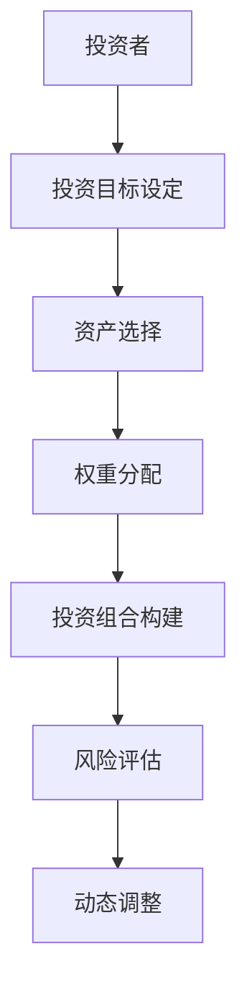

                 

# 《大卫斯文森的另类资产投资》

> 关键词：大卫·斯文森，另类资产投资，私募股权，对冲基金，资产配置，风险管理

> 摘要：本文深入探讨了大卫·斯文森在另类资产投资领域的独特理念和策略。通过分析其资产配置模型、投资策略以及风险管理方法，揭示了另类资产投资的核心原理和实际应用。本文不仅介绍了斯文森的投资哲学，还结合实际案例，详细讲解了如何在现代投资组合中有效配置另类资产，以实现长期稳定的收益。同时，本文还分析了斯文森投资策略的优缺点，并提出了在实际操作中需要注意的关键点。

---

## # 引言

在现代金融投资领域，大卫·斯文森（David Swensen）被誉为另类资产投资的先驱。作为耶鲁大学捐赠基金的首席投资官，他通过创新的资产配置策略，成功将耶鲁大学的捐赠基金从1980年代的不足1亿美元增长到如今的数十亿美元。斯文森的投资理念不仅改变了学术界和机构投资者的资产管理方式，也为个人投资者提供了全新的视角。

本文将系统性地分析斯文森的另类资产投资策略，探讨其背后的逻辑与方法，并结合实际案例，为读者提供有价值的见解。

---

## ## 第一部分：另类资产的分类与配置方法

### ## 第1章：另类资产的分类与特征

#### ### 1.1 另类资产的定义与分类

另类资产是指传统资产类别之外的投资标的，主要包括以下几类：

- **私募股权**：通过投资于未上市公司或收购目标公司部分股权进行投资。
- **对冲基金**：通过多种金融工具和策略寻求绝对收益。
- **不动产投资信托（REITs）**：通过投资房地产相关资产获得收益。
- **债券与票据**：包括高收益债券、杠杆贷款等。
- **大宗商品**：如黄金、原油等实物资产。

#### ### 1.2 各类另类资产的特征对比

| 资产类型 | 收益来源 | 风险特征 | 流动性 | 代表性产品 |
|----------|----------|----------|--------|------------|
| 私募股权 | 股权增值 | 高       | 低     | 初创企业股权 |
| 对冲基金 | 绝对收益  | 中       | 中     | 股票多空策略 |
| REITs    | 租金收入  | 中       | 中     | 房地产信托基金 |
| 债券     | 利息收入  | 低       | 高     | 高收益债券 |

#### ### 1.3 另类资产与传统资产的对比

- **收益来源**：另类资产通常通过杠杆、短期套利等手段实现收益，而传统资产主要依赖于资本增值或利息收入。
- **风险特征**：另类资产的风险较高，但潜在收益也更大；传统资产的风险相对较低，收益较为稳定。
- **流动性**：另类资产的流动性通常较差，而传统资产的流动性较强。

---

### ## 第2章：资产配置的基本原理

#### ### 2.1 资产配置的目标与原则

资产配置的目标是通过合理分配不同类型资产的比例，实现投资收益的最大化和风险的最小化。其基本原则包括：

- **分散化原则**：通过投资不同类型资产降低风险。
- **长期视角原则**：关注资产的长期表现，而非短期波动。
- **动态调整原则**：根据市场变化和个人投资目标进行调整。

#### ### 2.2 资产配置的步骤与方法

1. **确定投资目标**：明确投资的收益目标和风险承受能力。
2. **选择资产类别**：根据目标选择适合的资产类别。
3. **分配权重**：确定各类资产在投资组合中的比例。
4. **定期调整**：根据市场变化和个人目标进行动态调整。

#### ### 2.3 资产配置的优缺点分析

- **优点**：通过分散化降低风险，实现长期稳定的收益。
- **缺点**：需要持续监控和调整，且在市场波动较大时可能面临较大损失。

---

## ## 第二部分：大卫·斯文森的长期投资策略

### ## 第3章：大卫·斯文森的资产配置模型

#### ### 3.1 斯文森投资策略的核心要素

- **长期视角**：斯文森强调长期投资，而非短期投机。
- **分散化**：通过配置不同类型资产降低风险。
- **动态调整**：根据市场变化和个人目标进行调整。

#### ### 3.2 资产配置的数学模型

斯文森的资产配置模型可以通过以下公式进行描述：

$$
w_i = \frac{w_i^g}{\sum_j w_j^g \cdot (1 + r_j)}
$$

其中，\( w_i \) 表示第i类资产的权重，\( w_i^g \) 表示初始权重，\( r_j \) 表示第j类资产的预期收益率。

#### ### 3.3 资产配置的动态调整

- **定期审查**：每季度或每半年审查一次投资组合。
- **再平衡**：根据市场表现调整各类资产的比例。

---

### ## 第4章：私募股权与对冲基金的投资策略

#### ### 4.1 私募股权的投资策略

- **目标选择**：选择具有高增长潜力的企业。
- **投资阶段**：主要投资于成长期和成熟期企业。
- **退出策略**：通过上市或并购退出。

#### ### 4.2 对冲基金的策略类型

- **股票多空策略**：通过做多和做空股票获利。
- **套利策略**：利用市场价差获利。
- **宏观对冲策略**：基于宏观经济走势进行投资。

---

## ## 第三部分：大卫·斯文森投资策略的系统架构设计

### ## 第5章：系统架构设计

#### ### 5.1 系统功能设计

- **数据采集**：收集各类资产的历史数据。
- **数据分析**：分析资产的收益、风险特征。
- **资产配置**：根据模型生成投资组合。
- **风险评估**：评估投资组合的风险。

#### ### 5.2 系统架构图

---

## ## 第四部分：结论与未来展望

### ## 第6章：结论

大卫·斯文森的另类资产投资策略为投资者提供了全新的视角。通过长期视角、分散化和动态调整，投资者可以实现稳定的收益和风险控制。然而，另类资产投资也存在一定的风险和挑战，需要投资者具备较高的专业知识和经验。

### ## 第7章：未来展望

随着金融市场的不断发展，另类资产投资将面临更多的机遇与挑战。未来的研究可以进一步探索人工智能在资产配置中的应用，以及如何通过技术创新提升投资效率。

---

## # 作者信息

作者：AI天才研究院/AI Genius Institute & 禅与计算机程序设计艺术 /Zen And The Art of Computer Programming

