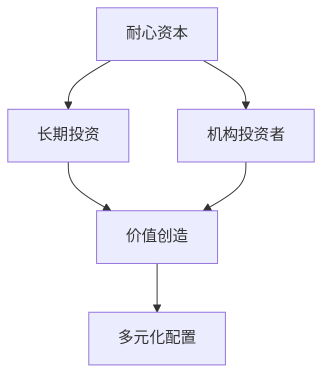
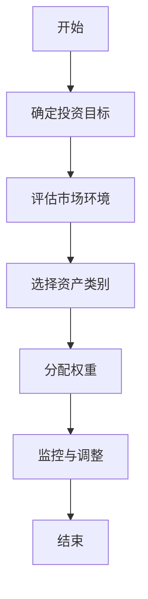
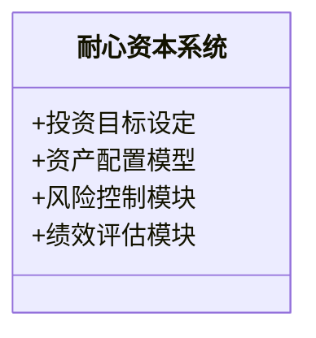
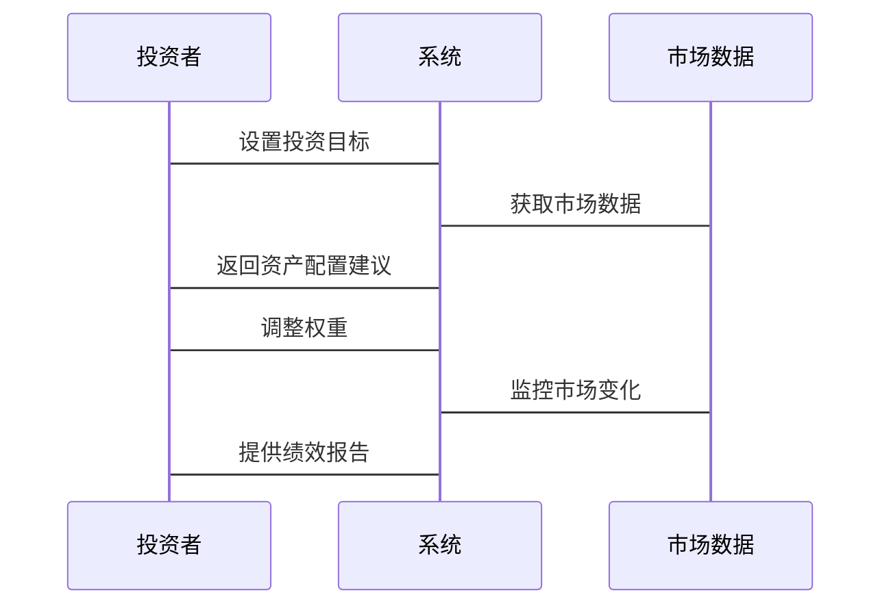

                 


# 大卫斯文森的耐心资本理念

## 关键词
- 耐心资本
- 机构投资
- 资产配置
- 风险管理
- 投资策略

## 摘要
大卫·斯文森是耶鲁大学首席投资官，他提出的耐心资本理念颠覆了传统的短期投资思维，强调通过长期投资和价值创造实现稳健收益。本文深入剖析了耐心资本的核心理念、数学模型、算法原理、系统架构设计以及在实际投资中的应用，并通过具体案例分析，展示了如何通过耐心资本理念实现投资目标。文章内容涵盖背景介绍、核心概念、系统架构、算法实现以及项目实战等多方面内容。

---

## 目录大纲

### 第一部分: 大卫斯文森的耐心资本理念概述

#### 第1章: 耐心资本的起源与核心理念

##### 1.1 耐心资本的背景介绍
- 1.1.1 机构投资的兴起
- 1.1.2 大卫·斯文森与耶鲁大学捐赠基金
- 1.1.3 耐心资本理念的提出与演变

##### 1.2 耐心资本的核心概念
- 1.2.1 核心概念：长期投资与价值创造
- 1.2.2 耐心资本的属性特征对比
- 1.2.3 耐心资本的ER实体关系图



---

### 第二部分: 耐心资本的核心概念与联系

#### 第2章: 耐心资本的原理分析

##### 2.1 耐心资本的原理分析
- 2.1.1 耐心资本的资产配置模型
- 2.1.2 耐心资本的数学模型与公式
  $$ 资产配置 = \sum_{i=1}^{n} w_i \times a_i $$
  其中，$w_i$ 是第 $i$ 个资产的权重，$a_i$ 是第 $i$ 个资产的收益

##### 2.2 耐心资本的算法原理
- 2.2.1 资产配置的Mermaid流程图


- 2.2.2 资产配置的Python实现
```python
def asset_allocation(weights, returns):
    # 计算资产配置的期望收益
    expected_return = sum(w * r for w, r in zip(weights, returns))
    return expected_return

# 示例权重和收益
weights = [0.4, 0.3, 0.2, 0.1]
returns = [0.08, 0.05, 0.07, 0.03]
allocation_return = asset_allocation(weights, returns)
print(f"资产配置的期望收益为：{allocation_return}")
```

---

### 第三部分: 耐心资本在机构投资中的应用

#### 第3章: 机构投资的场景分析

##### 3.1 机构投资的场景分析
- 3.1.1 耐心资本在捐赠基金中的应用
- 3.1.2 耐心资本在养老基金中的应用
- 3.1.3 耐心资本在主权财富基金中的应用

##### 3.2 系统架构设计
- 3.2.1 系统功能设计
- 3.2.2 系统架构设计的Mermaid图


- 3.2.3 系统接口设计
- 3.2.4 系统交互的Mermaid序列图


---

### 第四部分: 项目实战与总结

#### 第4章: 项目实战

##### 4.1 项目环境安装与配置
- 4.1.1 Python环境安装
- 4.1.2 第三方库安装（如numpy, pandas, matplotlib）

##### 4.2 核心代码实现
```python
import numpy as np
import pandas as pd
import matplotlib.pyplot as plt

def calculate_expected_return(weights, returns):
    return np.dot(weights, returns)

def calculate_risk(weights, covariance_matrix):
    return np.sqrt(np.dot(weights.T, np.dot(covariance_matrix, weights)))

# 示例数据
returns = pd.Series([0.08, 0.05, 0.07, 0.03])
covariance_matrix = pd.DataFrame({
    'A': [0.02, 0.01, 0.01, 0.005],
    'B': [0.01, 0.03, 0.02, 0.01],
    'C': [0.01, 0.02, 0.05, 0.01],
    'D': [0.005, 0.01, 0.01, 0.02]
})

weights = np.array([0.4, 0.3, 0.2, 0.1])
expected_return = calculate_expected_return(weights, returns)
risk = calculate_risk(weights, covariance_matrix.values)

print(f"期望收益：{expected_return}")
print(f"风险：{risk}")
```

##### 4.3 案例分析与解读
- 4.3.1 案例背景介绍
- 4.3.2 数据处理与分析
- 4.3.3 投资组合优化与结果解读

##### 4.4 项目小结
- 4.4.1 项目实现的关键点
- 4.4.2 项目中的问题与解决
- 4.4.3 项目经验总结

---

### 第五部分: 总结与展望

#### 第5章: 总结与最佳实践

##### 5.1 最佳实践 tips
- 5.1.1 投资目标的设定
- 5.1.2 风险管理的重要性
- 5.1.3 长期投资的纪律性

##### 5.2 小结
- 5.2.1 耐心资本理念的核心价值
- 5.2.2 机构投资中的应用前景
- 5.2.3 个人投资者的启示

##### 5.3 注意事项
- 5.3.1 避免短期波动干扰
- 5.3.2 保持长期视角
- 5.3.3 定期审视与调整

##### 5.4 拓展阅读
- 5.4.1 推荐书籍
- 5.4.2 相关研究论文
- 5.4.3 在线资源与工具

---

### 附录

#### 附录A: 术语表
- 耐心资本
- 资产配置
- 风险管理
- 投资组合优化

#### 附录B: 参考文献
- 大卫·斯文森的著作
- 相关学术论文
- 在线资源链接

---

### 作者

作者：AI天才研究院/AI Genius Institute & 禅与计算机程序设计艺术 /Zen And The Art of Computer Programming

