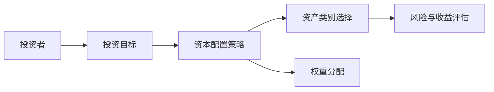

                 

# 《大卫斯文森的长期资本配置》

---

## 关键词：
- 大卫·斯文森
- 长期资本配置
- 投资组合管理
- 资产配置模型
- 风险调整收益

---

## 摘要：
本文深入探讨了大卫·斯文森的长期资本配置策略，分析其在机构投资中的应用及其对现代投资理论的贡献。文章从背景、核心概念、算法原理、系统架构到项目实战，全面解析了大卫·斯文森的投资理念和方法，并通过实例展示了如何构建和优化长期资本配置模型。通过本文，读者将掌握长期资本配置的核心思想和实际操作技巧，为机构投资和个人资产配置提供有价值的参考。

---

# 第一部分：长期资本配置的背景与核心概念

## 第1章：长期资本配置的背景与意义

### 1.1 长期资本配置的背景介绍
#### 1.1.1 机构投资与资本配置的演变
- 机构投资的兴起
- 资本配置的历史演变
- 大卫·斯文森的贡献

#### 1.1.2 大卫·斯文森的贡献与影响力
- 大卫·斯文森的学术背景
- 耶鲁大学捐赠基金的成功案例
- 对现代投资理论的贡献

#### 1.1.3 长期资本配置的核心问题与目标
- 资本配置的目标
- 长期资本配置的核心问题
- 投资者面临的挑战

### 1.2 长期资本配置的定义与特点
#### 1.2.1 长期资本配置的定义
- 长期资本配置的定义
- 长期资本配置的特征
- 长期资本配置与短期投资的区别

#### 1.2.2 长期资本配置的核心特点
- 投资期限的影响
- 资产类别的选择
- 风险与收益的平衡

#### 1.2.3 长期资本配置与传统投资的区别
- 传统投资的核心特点
- 长期资本配置的优势
- 两者的适用场景对比

### 1.3 大卫·斯文森的投资理念
#### 1.3.1 资本配置的三步法
- 投资目标的设定
- 资产类别选择
- 权重分配

#### 1.3.2 风险调整后的收益最大化
- 风险调整后的收益概念
- 如何实现收益最大化
- 风险与收益的平衡

#### 1.3.3 资产类别选择与权重分配
- 资产类别的选择标准
- 权重分配的原则
- 动态调整的策略

### 1.4 长期资本配置的边界与外延
#### 1.4.1 资本配置的边界条件
- 资本配置的约束条件
- 资本配置的适用范围
- 资本配置的限制因素

#### 1.4.2 长期资本配置的外延领域
- 投资组合管理
- 风险管理
- 投资策略的制定

#### 1.4.3 相关概念的对比与区分
- 资本配置与投资策略的区别
- 长期资本配置与其他投资方法的对比
- 资本配置与风险管理的关系

### 1.5 本章小结
- 本章主要介绍了长期资本配置的背景、定义、特点以及大卫·斯文森的投资理念。
- 强调了长期资本配置在机构投资中的重要性。
- 为后续章节奠定了理论基础。

---

## 第2章：长期资本配置的核心概念与联系

### 2.1 核心概念的原理
#### 2.1.1 资本配置模型的原理
- 资本配置模型的构成
- 模型的核心逻辑
- 模型的适用条件

#### 2.1.2 风险与收益的平衡
- 风险与收益的关系
- 如何平衡风险与收益
- 风险调整后的收益计算

#### 2.1.3 资产类别选择的逻辑
- 资产类别的分类
- 各类资产的风险收益特征
- 资产类别选择的依据

### 2.2 核心概念的属性特征对比
#### 2.2.1 不同资产类别的风险收益特征
- 股票、债券、房地产等资产的风险收益对比
- 各类资产在不同经济周期的表现
- 资产类别选择的策略

#### 2.2.2 投资期限与资本配置的关系
- 投资期限对资产配置的影响
- 长期与短期资本配置的差异
- 投资期限对风险承受能力的影响

#### 2.2.3 资本配置与市场环境的互动
- 市场环境对资本配置的影响
- 资本配置对市场环境的反馈
- 如何根据市场变化调整资本配置

### 2.3 ER实体关系图架构

### 2.4 本章小结
- 本章深入分析了长期资本配置的核心概念及其内在联系。
- 通过属性特征对比和ER实体关系图，清晰地展示了资本配置的逻辑框架。
- 为后续章节的算法原理和系统设计提供了理论支持。

---

## 第3章：长期资本配置的算法原理

### 3.1 算法原理的数学模型
#### 3.1.1 现代投资组合理论
$$ E(r_p) = \sum w_i E(r_i) $$
$$ \sigma_p^2 = \sum w_i^2 \sigma_i^2 + 2 \sum w_i w_j \sigma_{i,j} $$

#### 3.1.2 风险调整后的收益最大化
$$ \text{收益} = \text{风险调整后的收益} \times \text{权重} $$

#### 3.1.3 优化模型的构建
- 目标函数的构建
- 约束条件的设定
- 优化算法的选择

### 3.2 算法原理的详细讲解
#### 3.2.1 均值-方差优化的数学推导
- 均值-方差优化的核心思想
- 数学推导过程
- 优化结果的解释

#### 3.2.2 资产权重的计算公式
$$ w_i = \frac{E(r_i) - r_f}{\sum (E(r_j) - r_f) \cdot \sigma_j} $$

#### 3.2.3 风险调整后的收益计算
- 风险调整后的收益公式
- 如何计算各类资产的风险调整后收益
- 收益最大化的方法

### 3.3 算法原理的实例分析
#### 3.3.1 假设资产组合的构建
- 资产组合的构成
- 资产权重的设定
- 风险与收益的计算

#### 3.3.2 计算各资产的权重
- 使用数学公式计算权重
- 权重分配的合理性分析
- 权重调整的策略

#### 3.3.3 优化后的组合风险与收益分析
- 优化后的组合风险
- 优化后的组合收益
- 风险与收益的平衡

### 3.4 本章小结
- 本章详细讲解了长期资本配置的算法原理。
- 通过数学公式和实例分析，展示了如何构建和优化资本配置模型。
- 为实际应用提供了理论依据和方法指导。

---

## 第4章：长期资本配置的系统分析与架构设计

### 4.1 系统架构设计
#### 4.1.1 系统功能设计
- 投资目标设定模块
- 资产类别选择模块
- 权重分配模块
- 风险管理模块

#### 4.1.2 系统架构图

#### 4.1.3 接口设计
- 输入接口
- 输出接口
- 数据流方向

#### 4.1.4 交互流程
- 投资者输入需求
- 系统进行资产类别选择
- 系统计算权重分配
- 系统进行风险管理
- 输出优化后的资本配置方案

### 4.2 系统分析
#### 4.2.1 系统功能分析
- 每个模块的功能描述
- 模块之间的交互关系
- 系统的输入输出分析

#### 4.2.2 系统架构的合理性
- 系统架构的优缺点
- 系统架构的可扩展性
- 系统架构的可维护性

#### 4.2.3 系统架构的优化建议
- 如何优化系统架构
- 如何提高系统的效率
- 如何降低系统的风险

### 4.3 本章小结
- 本章详细分析了长期资本配置的系统架构设计。
- 通过功能设计、架构图和交互流程，展示了系统的整体结构。
- 为实际应用提供了系统化的指导。

---

## 第5章：长期资本配置的项目实战

### 5.1 项目背景与目标
#### 5.1.1 项目背景
- 项目来源
- 项目目标
- 项目意义

#### 5.1.2 项目目标
- 构建长期资本配置模型
- 实现资本配置优化
- 分析投资组合的风险与收益

### 5.2 项目实施步骤
#### 5.2.1 环境安装
- 开发环境的选择
- 开发工具的安装
- 数据源的获取

#### 5.2.2 核心代码实现
- 资本配置模型的实现
- 权重分配算法的实现
- 风险管理模块的实现

#### 5.2.3 代码解读与分析
- 代码的功能描述
- 代码的实现细节
- 代码的优化建议

### 5.3 项目实例分析
#### 5.3.1 实例一：假设资产组合的构建
- 资产组合的构成
- 资产权重的设定
- 风险与收益的计算

#### 5.3.2 实例二：优化后的资本配置方案
- 优化后的组合风险
- 优化后的组合收益
- 风险与收益的平衡

#### 5.3.3 实例三：实际市场环境下的应用
- 实际市场环境下的资本配置
- 市场变化对资本配置的影响
- 如何根据市场变化调整资本配置

### 5.4 项目小结
- 本章通过实际项目展示了长期资本配置的理论应用。
- 通过实例分析，验证了资本配置模型的有效性。
- 为实际投资提供了参考和借鉴。

---

## 第6章：长期资本配置的最佳实践与注意事项

### 6.1 最佳实践 tips
#### 6.1.1 理论与实践的结合
- 理论指导实践
- 实践验证理论
- 如何做到理论与实践的结合

#### 6.1.2 投资策略的动态调整
- 如何根据市场变化调整资本配置
- 如何根据投资目标的变化调整资本配置
- 动态调整的策略和方法

#### 6.1.3 风险管理的重要性
- 风险管理的核心作用
- 如何有效管理投资风险
- 风险管理的工具和方法

### 6.2 小结
- 本章总结了长期资本配置的最佳实践。
- 强调了理论与实践结合的重要性。
- 提出了动态调整资本配置的策略。

### 6.3 注意事项
#### 6.3.1 资本配置的边界条件
- 资本配置的适用范围
- 资本配置的限制因素
- 如何识别和处理边界条件

#### 6.3.2 投资者的风险承受能力
- 不同投资者的风险承受能力
- 如何评估投资者的风险承受能力
- 如何根据风险承受能力调整资本配置

#### 6.3.3 市场环境的变化
- 市场环境对资本配置的影响
- 如何应对市场环境的变化
- 如何在市场波动中保持资本配置的稳定性

### 6.4 拓展阅读
- 推荐书籍和文献
- 相关领域的最新研究
- 未来研究方向

### 6.5 本章小结
- 本章总结了长期资本配置的最佳实践和注意事项。
- 提出了投资者在实际操作中需要注意的问题。
- 为读者提供了进一步学习和研究的方向。

---

## 作者：AI天才研究院/AI Genius Institute & 禅与计算机程序设计艺术 /Zen And The Art of Computer Programming

