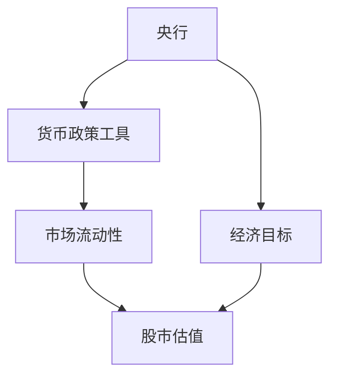
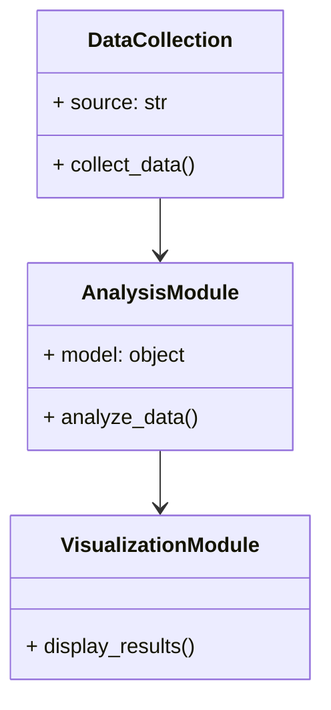

                 


# 央行政策对全球股市估值的影响

**关键词：** 央行政策、全球股市、估值影响、货币政策、市场流动性

**摘要：** 本文深入分析央行政策如何影响全球股市估值，探讨货币政策工具如利率、存款准备金率和量化宽松的传导机制，及其对市场流动性和投资者预期的调节作用。通过构建数学模型和案例分析，揭示不同地区政策差异对股市的影响，并提出投资建议和未来研究方向。

---

# 央行政策对全球股市估值的影响

## 第1章: 央行政策与全球股市估值的背景介绍

### 1.1 央行的定义与职能
央行是国家的货币发行机构，负责制定和执行货币政策，维护金融稳定，调节经济运行。其主要职能包括调控货币供应量、调节利率、维护银行体系稳定。

### 1.2 全球股市估值的基本概念
股市估值是指对股票市场价格进行评估，常用的指标包括市盈率（P/E）、市净率（P/B）等。全球股市由多个市场组成，如纽约证券交易所、纳斯达克、伦敦证交所等，各市场的特点和风险因素不同。

### 1.3 央行政策与股市估值的关系
央行通过调整货币政策工具影响市场流动性、资金成本和投资者预期，从而间接或直接影响股市估值。例如，降息政策降低了企业的融资成本，可能提升股市估值。

---

## 第2章: 央行政策对股市估值的核心概念与联系

### 2.1 央行政策工具的分类与特点
#### 2.1.1 存款准备金率
存款准备金率影响商业银行的信贷能力，进而影响市场流动性。降低准备金率可增加市场流动性，推高股市估值。

#### 2.1.2 利率政策
央行调整基准利率影响借贷成本和投资行为。降低利率通常会刺激投资，推高股市估值。

#### 2.1.3 货币发行量与量化宽松
量化宽松政策通过增加货币供应量，降低债券收益率，促使资金流入股市，提升估值。

### 2.2 股市估值的核心影响因素
#### 2.2.1 利率水平与股市估值的关系
利率下降通常导致股市估值上升，因为资金更倾向于高风险资产。

#### 2.2.2 货币政策对市场流动性的调节作用
流动性增加通常推高股市估值，反之则可能引发估值下降。

#### 2.2.3 市场预期与政策信号的互动
市场参与者对央行政策的预期影响股市估值，政策信号通过预期传导至市场。

### 2.3 央行政策与股市估值的实体关系图


---

## 第3章: 央行政策对股市估值的算法原理

### 3.1 央行政策影响股市估值的数学模型
构建多元回归模型，分析央行政策变量对股市估值的影响：

$$ V = \alpha \times M + \beta \times P + \gamma \times Y $$
其中：
- \( V \) 表示股市估值
- \( M \) 表示货币政策力度
- \( P \) 表示市场预期
- \( Y \) 表示宏观经济指标

### 3.2 模型实现与分析
使用Python代码实现数据处理和模型分析：

```python
import pandas as pd
import numpy as np
from sklearn.linear_model import LinearRegression

# 数据加载与预处理
data = pd.read_csv('stock_valuation.csv')
X = data[['M', 'P', 'Y']]
y = data['V']

# 模型训练
model = LinearRegression()
model.fit(X, y)

# 模型结果解读
coefficients = model.coef_
print(f'货币政策系数: {coefficients[0]}, 市场预期系数: {coefficients[1]}, 宏观经济系数: {coefficients[2]}')
```

---

## 第4章: 系统分析与架构设计方案

### 4.1 系统功能设计
设计一个分析框架，包括数据收集、分析处理和结果展示模块：



---

## 第5章: 项目实战

### 5.1 实战环境安装
安装必要的Python库：
```bash
pip install pandas numpy scikit-learn matplotlib
```

### 5.2 核心代码实现
实现数据处理和模型分析：

```python
# 数据加载与预处理
data = pd.read_csv('stock_valuation.csv')
X = data[['M', 'P', 'Y']]
y = data['V']

# 模型训练
model = LinearRegression()
model.fit(X, y)

# 模型结果解读
coefficients = model.coef_
print(f'货币政策系数: {coefficients[0]}, 市场预期系数: {coefficients[1]}, 宏观经济系数: {coefficients[2]}')

# 可视化
import matplotlib.pyplot as plt
plt.scatter(X['M'], y)
plt.title('货币政策与股市估值关系')
plt.xlabel('货币政策力度')
plt.ylabel('股市估值')
plt.show()
```

---

## 第6章: 总结与展望

### 6.1 本章总结
央行政策通过影响市场流动性、利率和市场预期，显著影响全球股市估值。不同地区的政策差异和传导机制需综合考虑。

### 6.2 未来研究方向
未来可探索动态调整模型，引入机器学习方法提高预测准确性，研究区域政策差异对股市的联动效应。

### 6.3 投资建议
投资者应关注央行政策信号，合理配置资产，分散风险，避免过度依赖单一市场。

---

**作者：AI天才研究院/AI Genius Institute & 禅与计算机程序设计艺术 /Zen And The Art of Computer Programming**

