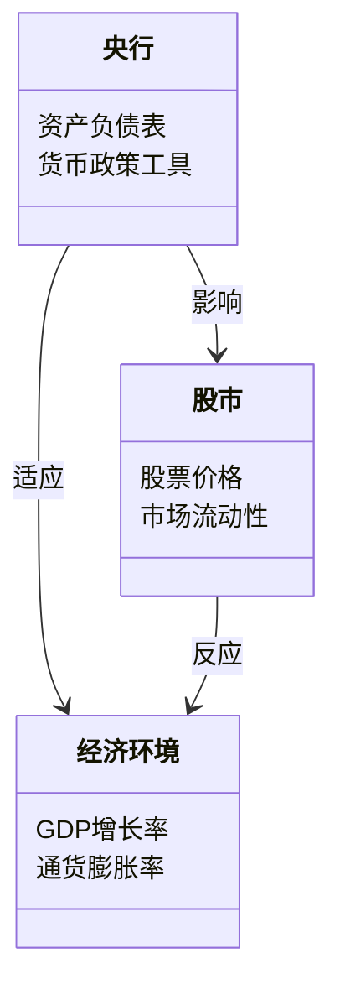

                 


# 央行资产负债表扩张对股市估值的影响

> 关键词：央行资产负债表、货币政策、股市估值、量化宽松、流动性、资产价格

> 摘要：本文系统分析了央行资产负债表扩张对股市估值的影响，从货币政策工具、央行资产负债表结构、货币政策对股市估值的影响机制、央行资产负债表扩张对股市估值的具体影响、央行资产负债表扩张的边界与外延、央行资产负债表扩张对股市估值的系统分析与架构设计方案、央行资产负债表扩张对股市估值的项目实战、央行资产负债表扩张对股市估值的总结与展望等八个方面展开深入讨论，结合实际案例和数学模型，全面阐述了央行资产负债表扩张对股市估值的影响路径和机制。

---

## 第一部分: 央行资产负债表扩张与股市估值的背景介绍

### 第1章: 央行资产负债表扩张概述

#### 1.1 央行的职能与资产负债表构成

##### 1.1.1 央行的基本职能

央行，即中央银行，是国家金融体系的核心机构，主要职能包括：

- **货币政策制定与执行**：通过调节货币供应量、利率等手段实现宏观经济目标。
- **金融监管**：监督金融机构，维护金融稳定。
- **支付清算系统管理**：提供清算服务，确保金融体系的高效运行。
- **最后贷款人角色**：在银行体系面临危机时提供流动性支持。

##### 1.1.2 央行资产负债表的构成要素

央行的资产负债表主要由以下部分构成：

- **资产**：包括外汇储备、政府债券、银行准备金、其他资产等。
- **负债**：包括流通中的货币（M0）、银行存款准备金、政府存款、其他负债等。
- **所有者权益**：包括央行资本金、未分配利润等。

##### 1.1.3 央行资产负债表扩张的定义与机制

央行资产负债表扩张是指通过增加资产或减少负债的方式，扩大央行资产负债表规模的过程。常见的扩张机制包括：

- **公开市场操作**：在公开市场上买卖政府债券，调节基础货币供应量。
- **降低存款准备金率**：减少商业银行需要持有的准备金，释放更多可贷资金。
- **降息**：降低基准利率，降低企业和个人的融资成本，刺激投资和消费。

#### 1.2 央行资产负债表扩张的背景与问题背景

##### 1.2.1 当前全球经济形势下的货币政策挑战

近年来，全球经济面临增长放缓、通货膨胀率低迷等问题，许多国家的央行选择通过扩张资产负债表来应对挑战。例如，2008年全球金融危机后，美联储、欧洲央行等采取了大规模的量化宽松政策。

##### 1.2.2 央行资产负债表扩张的必要性与边界

在经济低迷时期，央行通过扩张资产负债表可以向市场注入流动性，缓解金融机构的流动性压力，稳定市场信心。然而，过度扩张可能导致货币贬值、资产泡沫等问题，因此需要设定合理的边界。

##### 1.2.3 央行资产负债表扩张对金融市场的潜在影响

央行资产负债表扩张通常会通过以下方式影响金融市场：

- **流动性增加**：市场流动性充裕，可能导致资产价格上升。
- **利率下降**：降低融资成本，刺激投资。
- **市场预期变化**：市场参与者对未来的政策预期发生变化，影响资产价格。

#### 1.3 央行资产负债表扩张对股市估值的核心问题

##### 1.3.1 股市估值的基本概念与影响因素

股市估值是通过对上市公司财务数据的分析，估算其股票的合理价格。影响股市估值的主要因素包括：

- **盈利能力**：净利润增长率、ROE（净资产收益率）等。
- **成长性**：未来的收入和利润增长潜力。
- **行业地位**：公司在行业中的竞争地位。
- **宏观经济环境**：GDP增长率、通货膨胀率等。

##### 1.3.2 央行资产负债表扩张与股市估值的关系

央行通过扩张资产负债表，向市场注入流动性，降低融资成本，从而影响股市估值。具体表现包括：

- **流动性增加**：充裕的流动性推高资产价格。
- **利率下降**：降低企业的融资成本，提升企业的盈利能力和估值。
- **市场预期变化**：市场参与者预期未来央行将继续宽松政策，推高股市估值。

##### 1.3.3 问题解决的思路与方法

本文将从以下几个方面展开分析：

- **货币政策工具**：分析央行常用的货币政策工具及其对股市的影响。
- **央行资产负债表结构**：通过分析央行资产负债表的构成，理解其扩张机制。
- **货币政策对股市估值的影响机制**：通过数学模型和实际案例，分析央行资产负债表扩张对股市估值的具体影响路径。

---

## 第二部分: 央行资产负债表扩张的机制与工具

### 第2章: 央行资产负债表扩张的机制与工具

#### 2.1 央行的主要货币政策工具

##### 2.1.1 公开市场操作

公开市场操作是央行通过在公开市场上买卖政府债券，调节基础货币供应量的政策工具。例如，当央行购买政府债券时，商业银行的准备金增加，从而可以释放更多贷款，增加市场流动性。

##### 2.1.2 存款准备金率调整

存款准备金率是商业银行必须持有的准备金与存款的比例。降低存款准备金率可以释放更多的可贷资金，增加市场流动性。

##### 2.1.3 再贴现率调整

再贴现率是商业银行从央行借款的利率。降低再贴现率可以降低商业银行的融资成本，进而降低企业和个人的融资成本。

#### 2.2 央行资产负债表扩张的实现路径

##### 2.2.1 资产购买与负债增加的机制

当央行购买政府债券或其他资产时，资产端增加，负债端通过发行货币或增加银行准备金来匹配。这种操作会直接增加市场流动性。

##### 2.2.2 货币发行与信贷扩张的关系

货币发行是央行通过印刷钞票或增加电子货币供应来增加市场流动性。信贷扩张是指商业银行通过增加贷款来创造更多的存款。

##### 2.2.3 不同货币政策工具的比较与选择

不同的货币政策工具在实施效果和适用场景上有差异。例如，公开市场操作具有灵活性，可以随时调整；而存款准备金率调整具有较大的力度，但调整频率较低。

#### 2.3 央行资产负债表扩张的边界与外延

##### 2.3.1 货币政策的局限性

货币政策在实施过程中存在一定的局限性，例如：

- **政策时滞**：从政策制定到实际效果存在时间差。
- **有限的政策空间**：在利率接近零下限时，货币政策空间有限。

##### 2.3.2 央行资产负债表扩张的潜在风险

过度扩张央行资产负债表可能导致以下风险：

- **资产泡沫**：过多的流动性可能导致资产价格泡沫。
- **货币贬值**：过度印刷钞票可能导致货币贬值。
- **财政赤字增加**：央行通过购买政府债券支持政府支出，可能导致财政赤字增加。

##### 2.3.3 政策工具的相互作用与协调

不同货币政策工具之间存在相互作用，需要协调使用。例如，公开市场操作和存款准备金率调整可以共同使用，以达到预期的政策效果。

---

## 第三部分: 央行资产负债表扩张与股市估值的核心概念

### 第3章: 央行资产负债表扩张与股市估值的核心概念

#### 3.1 货币政策对股市估值的影响机制

##### 3.1.1 流动性供给与资产价格的关系

流动性供给增加会导致资产价格上升，这是因为更多的资金流入市场，推高资产价格。

##### 3.1.2 利率水平与股市估值的互动

低利率环境下，企业的融资成本降低，盈利能力提高，从而推高股市估值。

##### 3.1.3 市场预期与政策信号的传导

市场参与者会根据央行的政策信号调整投资行为，从而影响股市估值。

#### 3.2 央行资产负债表扩张对股市估值的具体影响

##### 3.2.1 资产负债表扩张对市场流动性的直接影响

通过公开市场操作和资产购买，央行增加市场流动性，推高股市估值。

##### 3.2.2 货币政策预期对股市估值的间接影响

市场参与者预期未来央行将继续宽松政策，从而推高股市估值。

##### 3.2.3 不同市场环境下的影响差异

在经济低迷时期，央行资产负债表扩张对股市估值的推动作用更为显著；而在经济过热时期，紧缩政策可能导致股市估值下降。

#### 3.3 核心概念的结构与要素

##### 3.3.1 央行资产负债表扩张的构成要素

- **资产**：政府债券、外汇储备等。
- **负债**：货币发行、银行准备金等。
- **所有者权益**：资本金、未分配利润等。

##### 3.3.2 货币政策工具的分类与比较

- **公开市场操作**：灵活，但力度较小。
- **存款准备金率调整**：力度大，但调整频率低。
- **再贴现率调整**：间接影响市场流动性。

---

## 第四部分: 央行资产负债表扩张对股市估值的系统分析与架构设计方案

### 第4章: 央行资产负债表扩张对股市估值的系统分析与架构设计方案

#### 4.1 系统功能设计

##### 4.1.1 问题场景介绍

在经济低迷时期，央行通过扩张资产负债表，向市场注入流动性，从而影响股市估值。

##### 4.1.2 系统功能设计

- **流动性监测**：实时监测市场流动性变化。
- **政策效果评估**：评估央行资产负债表扩张对股市估值的影响。
- **风险预警**：预警可能的风险，如资产泡沫。

##### 4.1.3 领域模型（Mermaid 类图）



##### 4.1.4 系统架构设计（Mermaid 架构图）


##### 4.1.5 系统接口设计

- **输入接口**：接收央行资产负债表数据和股市数据。
- **输出接口**：输出政策效果评估报告和风险预警信息。

##### 4.1.6 系统交互（Mermaid 序列图）


---

## 第五部分: 央行资产负债表扩张对股市估值的项目实战

### 第5章: 央行资产负债表扩张对股市估值的项目实战

#### 5.1 项目介绍

本项目旨在分析央行资产负债表扩张对股市估值的影响，选择美联储的量化宽松政策作为案例进行分析。

#### 5.2 项目环境安装

- **工具安装**：安装Python、Jupyter Notebook、Pandas、Matplotlib等工具。
- **数据获取**：获取美联储的资产负债表数据和同期股市数据。

#### 5.3 系统核心实现源代码

```python
import pandas as pd
import matplotlib.pyplot as plt

# 获取美联储资产负债表数据
fed_balance_sheet = pd.read_csv('fed_balance_sheet.csv')

# 获取同期股市数据
stock_data = pd.read_csv('stock_data.csv')

# 绘制央行资产负债表规模变化图
plt.figure(figsize=(10,6))
plt.plot(fed_balance_sheet['date'], fed_balance_sheet['total_assets'], label='Total Assets')
plt.title('Federal Reserve Balance Sheet Expansion')
plt.xlabel('Date')
plt.ylabel('Total Assets')
plt.legend()
plt.show()

# 绘制股市估值变化图
plt.figure(figsize=(10,6))
plt.plot(stock_data['date'], stock_data['stock_valuation'], label='Stock Valuation')
plt.title('Stock Valuation During Quantitative Easing')
plt.xlabel('Date')
plt.ylabel('Stock Valuation')
plt.legend()
plt.show()
```

#### 5.4 代码应用解读与分析

通过上述代码，我们可以绘制出美联储资产负债表规模变化图和股市估值变化图。从图中可以看出，在量化宽松期间，美联储资产负债表规模显著扩大，同时股市估值也呈现上升趋势。

#### 5.5 实际案例分析和详细讲解剖析

以美联储2008年推出的量化宽松政策为例，分析其对股市估值的具体影响：

- **2008年-2014年**：美联储通过购买政府债券和抵押贷款支持证券，向市场注入流动性，推动股市估值上升。
- **2014年-2020年**：美联储逐步退出量化宽松政策，股市估值增长放缓。
- **2020年-至今**：新冠疫情爆发后，美联储再次推出量化宽松政策，股市估值继续上升。

#### 5.6 项目小结

通过实际案例分析，可以得出结论：央行资产负债表扩张对股市估值具有显著的推动作用，尤其是在经济低迷时期。

---

## 第六部分: 央行资产负债表扩张对股市估值的总结与展望

### 第6章: 央行资产负债表扩张对股市估值的总结与展望

#### 6.1 核心内容总结

- **背景介绍**：央行资产负债表扩张是应对经济低迷的重要工具。
- **核心概念**：货币政策工具、央行资产负债表结构、股市估值影响机制。
- **系统分析**：通过系统架构设计，评估政策效果和风险。
- **项目实战**：通过实际案例分析，验证理论的可行性。

#### 6.2 最佳实践 tips

- **货币政策工具的选择**：根据不同经济环境选择合适的货币政策工具。
- **风险控制**：在实施扩张政策时，注意防范资产泡沫和货币贬值风险。
- **政策协调**：货币政策与财政政策需要协调配合，才能达到最佳效果。

#### 6.3 未来研究方向

- **货币政策工具的优化**：研究更有效的货币政策工具。
- **风险管理**：研究如何有效防范央行资产负债表扩张带来的风险。
- **国际合作**：研究跨国央行资产负债表扩张的协同效应。

#### 6.4 小结

央行资产负债表扩张对股市估值的影响是一个复杂的过程，涉及货币政策工具、市场预期、经济环境等多个方面。通过系统分析和实际案例分析，可以更好地理解其影响机制，并为政策制定者提供参考。

---

## 作者：AI天才研究院/AI Genius Institute & 禅与计算机程序设计艺术 /Zen And The Art of Computer Programming

