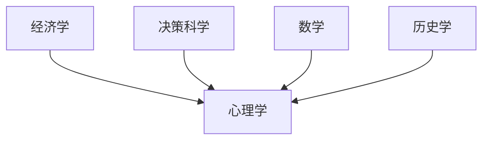
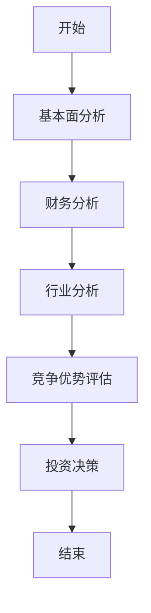

                 

# 如何像巴菲特和芒格一样选择好公司

## 关键词：价值投资，巴菲特，芒格，投资策略，财务分析，风险管理

## 摘要：  
本文将详细介绍如何像巴菲特和芒格一样选择好公司。通过分析价值投资的核心理念、巴菲特和芒格的投资策略、如何构建投资系统、实际案例分析以及风险管理等关键点，帮助读者掌握选择好公司的方法。本文结合技术语言和实际案例，深入剖析投资的本质，提供实用的工具和方法，帮助读者在投资领域取得长期稳定的收益。

---

# 第一部分：引言

## 1.1 投资的重要性与巴菲特的传奇

### 1.1.1 投资在现代生活中的意义  
投资是个人财富增长的重要途径，尤其是在通货膨胀的背景下，合理的投资能够帮助我们跑赢通货膨胀，实现财富的保值与增值。投资不仅仅是金钱的投入，更是一种思维方式和生活方式的体现。

### 1.1.2 巴菲特和芒格的传奇故事  
沃伦·巴菲特和查理·芒格是全球最著名的投资者之一。巴菲特以价值投资闻名，芒格则以多元思维模型著称。他们的投资哲学和成功案例为全球投资者提供了宝贵的经验和启示。

### 1.1.3 本书的目标读者与学习方法  
本书适合所有对投资感兴趣的人群，无论是新手还是有经验的投资者。通过系统化的学习和实战案例的分析，读者可以掌握价值投资的核心理念和方法。

---

# 第二部分：价值投资的核心概念

## 2.1 价值投资的基本原理

### 2.1.1 价值投资的定义与核心理念  
价值投资是一种以公司基本面分析为基础的投资方法，核心在于寻找市场价格低于内在价值的公司。巴菲特强调，投资的本质是寻找具有持续竞争优势和良好管理层的企业。

#### 图表：内在价值公式  
$$ \text{内在价值} = \frac{\text{自由现金流}}{\text{折现率}} $$  

### 2.1.2 投资的三要素：安全边际、内在价值与市场价格  
- **内在价值**：公司未来现金流的现值。
- **市场价格**：市场对公司价值的反映。
- **安全边际**：内在价值与市场价格之间的差额，是投资的安全垫。

### 2.1.3 价值投资与成长投资的区别与联系  
- 价值投资关注低估值的公司。
- 成长投资关注高成长的公司。
- 两者都强调长期投资，但侧重点不同。

## 2.2 巴菲特的选股标准

### 2.2.1 公司的财务健康状况分析  
- **收入与利润**：收入稳定，利润持续增长。
- **资产负债表**：低负债率，健康的现金流。
- **ROE（净资产收益率）**：衡量公司盈利能力的重要指标。

#### 图表：ROE计算公式  
$$ \text{ROE} = \frac{\text{净利润}}{\text{净资产}} $$  

### 2.2.2 管理层的诚信与能力评估  
- **管理层的诚信**：避免财务造假，保持透明。
- **管理层的能力**：能够持续创造价值。

### 2.2.3 行业地位与竞争优势分析  
- **行业地位**：是否是行业龙头。
- **竞争优势**：品牌、技术、成本等方面的优势。

## 2.3 芒格的多元思维模型

### 2.3.1 多元思维模型的定义与应用  
多元思维模型是芒格的核心思想，强调将不同学科的原理结合起来，形成一个完整的知识框架。

#### 图表：多元思维模型的结构  

### 2.3.2 经济学、心理学与决策科学的交叉应用  
- **经济学**：理解市场规律。
- **心理学**：分析投资者行为。
- **决策科学**：优化决策过程。

### 2.3.3 如何构建自己的多元思维框架  
通过学习多个领域的知识，并将其整合，形成一个完整的思考框架。

---

# 第三部分：投资系统的构建

## 3.1 投资策略的选择与制定

### 3.1.1 确定自己的投资目标与风险承受能力  
- **投资目标**：短期 vs 长期。
- **风险承受能力**：保守 vs 进取。

### 3.1.2 制定长期投资计划与短期策略  
- **长期计划**：资产配置。
- **短期策略**：市场波动应对。

### 3.1.3 投资组合的构建与优化  
- **资产配置**：股票、债券、现金等的分配。
- **优化方法**：定期调整，降低风险。

## 3.2 资产配置与风险管理

### 3.2.1 资产配置的基本原理与方法  
- **分散投资**：降低风险。
- **动态调整**：根据市场变化调整配置。

### 3.2.2 风险管理的策略与工具  
- **止损策略**：设定止损点。
- **保险工具**：期权、保险等。

### 3.2.3 如何在市场波动中保持冷静  
- **长期视角**：市场波动是暂时的。
- **理性决策**：避免情绪化投资。

## 3.3 投资决策的系统化流程

### 3.3.1 从基本面分析到投资决策的流程图  

### 3.3.2 系统化投资决策的优缺点分析  
- **优点**：降低人为错误，提高决策效率。
- **缺点**：可能忽视市场变化。

### 3.3.3 如何避免情绪化决策  
- **纪律性**：遵循既定的策略。
- **自我反思**：定期回顾决策过程。

---

# 第四部分：价值投资的实战案例

## 4.1 巴菲特的经典投资案例分析

### 4.1.1 可口可乐的投资启示  
- **公司分析**：强大的品牌和现金流。
- **投资决策**：长期持有。

### 4.1.2 伯克希尔 Hathaway 的成长历程  
- **公司背景**：保险业务为主，逐步扩展到多个领域。
- **投资策略**：收购优质企业。

### 4.1.3 避免投资陷阱的实战经验  
- **识别红 flags**：高负债、低ROE等。

## 4.2 芒格的决策智慧与投资哲学

### 4.2.1 多元思维模型的实际应用  
- **案例分析**：如何通过心理学和经济学分析市场行为。

### 4.2.2 避免认知偏差的技巧  
- **反思与复盘**：定期回顾投资决策，识别认知偏差。

### 4.2.3 投资中的耐心与等待  
- **长期视角**：等待好的投资机会。

---

# 第五部分：进阶内容与拓展

## 5.1 市场周期与投资机会

### 5.1.1 经济周期对投资的影响  
- **衰退期**：寻找低估资产。
- **复苏期**：布局周期性行业。

### 5.1.2 如何利用周期进行投资  
- **估值分析**：周期性行业在低谷时的投资机会。

## 5.2 行业分析与投资机会

### 5.2.1 行业选择的策略  
- **朝阳行业**：高成长性。
- **成熟行业**：稳定收益。

### 5.2.2 技术进步对行业的影响  
- **产业升级**：技术驱动的行业机会。

## 5.3 复利效应与长期投资

### 5.3.1 复利的数学模型  
$$ \text{复利公式} = P \times (1 + r)^t $$  

### 5.3.2 长期投资的重要性  
- **时间的力量**：复利效应的长期积累。

---

# 第六部分：总结与展望

## 6.1 总结与反思

### 6.1.1 价值投资的核心理念回顾  
- **内在价值**：基本面分析的核心。
- **安全边际**：投资的安全垫。
- **长期视角**：时间是好公司的朋友。

### 6.1.2 投资中的常见误区  
- **追涨杀跌**：情绪化决策。
- **过度分散**：降低收益。

## 6.2 未来投资趋势与展望

### 6.2.1 新兴行业的投资机会  
- **科技**：人工智能、大数据等。
- **绿色经济**：新能源、环保产业。

### 6.2.2 如何应对市场的不确定性  
- **风险管理**：构建防御性投资组合。
- **持续学习**：保持对市场的敏感性。

## 6.3 最佳实践 tips

### 6.3.1 持续学习与自我提升  
- **阅读经典书籍**：巴菲特、芒格的著作。
- **关注行业动态**：了解市场趋势。

### 6.3.2 保持耐心与纪律  
- **坚持长期投资**：避免短期波动的干扰。
- **严格执行策略**：不盲目跟风。

### 6.3.3 定期复盘与调整  
- **回顾投资组合**：优化配置。
- **总结经验教训**：提升决策能力。

---

# 作者：AI天才研究院/AI Genius Institute & 禅与计算机程序设计艺术 /Zen And The Art of Computer Programming

---

以上是《如何像巴菲特和芒格一样选择好公司》的文章目录大纲，按照要求逐步展开，包含技术细节、图表、数学公式和实际案例分析，确保内容全面且易于理解。

