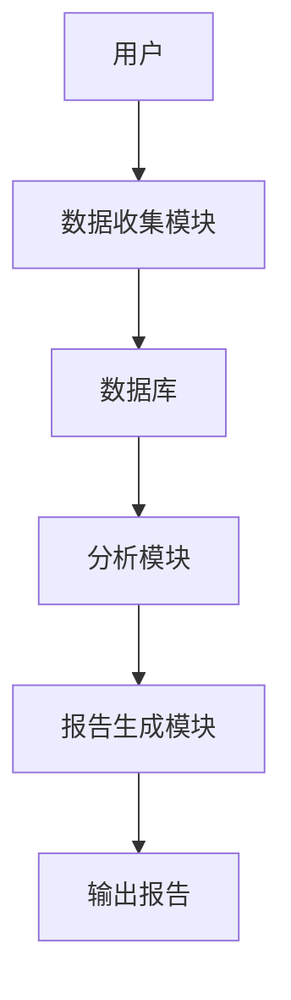
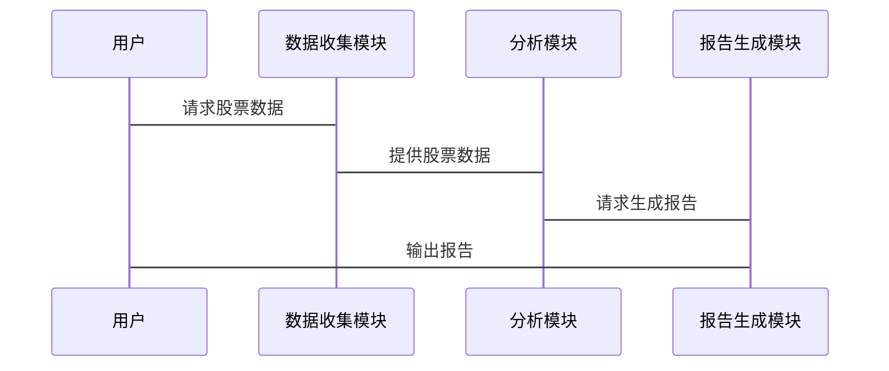

                 

# 如何判断股价是否具有吸引力：巴菲特的视角

## 关键词：巴菲特，价值投资，股价判断，基本面分析，安全边际，股票估值

## 摘要：  
本文从巴菲特的视角出发，详细分析如何判断股价是否具有吸引力。通过基本面分析、股票估值模型、安全边际计算等方法，结合实际案例，为投资者提供系统化的判断依据和实战指导。

---

# 第1章: 巴菲特投资哲学概述

## 1.1 价值投资的核心理念  
### 1.1.1 价值投资的定义与特点  
价值投资是一种以企业内在价值为基础的投资策略，注重长期持有优质资产。其核心是寻找市场价格低于内在价值的股票。  
**特点：**  
- 长期投资，注重复利效应。  
- 以基本面分析为基础，关注企业的盈利能力、成长性和竞争优势。  
- 强调安全边际，降低投资风险。  

### 1.1.2 巴菲特的投资策略与原则  
巴菲特的投资策略包括：  
1. **买入并持有**：长期持有优质股票，分享企业成长的成果。  
2. **集中投资**：将资金集中在少数优质资产上，避免过度分散。  
3. **安全边际**：买入价格低于内在价值，留有安全空间。  
4. ** margin of safety：** 在买入时留出的安全空间，确保即使市场价格波动，也不会亏损。  

### 1.1.3 长期投资与复利效应的重要性  
长期投资的核心在于复利效应。通过长期持有优质资产，投资者可以最大化资产的增值能力。  
**公式：**  
$$ \text{复利公式：} A = P \times (1 + r)^n $$  
其中，$P$ 是本金，$r$ 是年化收益率，$n$ 是投资年数。  

---

## 1.2 股价判断的背景与意义  
### 1.2.1 股票市场的基本概念  
股票是企业的一部分所有权，代表对公司的资产和收益的权利。股票市场是企业融资和投资者获利的平台。  

### 1.2.2 投资者与市场的互动关系  
投资者通过买入股票参与企业成长，企业通过发行股票获得资金支持。市场的波动性和不确定性要求投资者具备深入的分析能力和风险控制能力。  

### 1.2.3 股价判断对投资决策的影响  
股价判断是投资决策的核心，直接影响投资收益和风险。正确的股价判断可以帮助投资者避免高位接盘或低位割肉的错误。  

---

## 1.3 巴菲特视角下的安全边际  
### 1.3.1 安全边际的定义  
安全边际是指股票的市场价格低于其内在价值的部分，即：  
$$ \text{安全边际} = \text{内在价值} - \text{市场价格} $$  

### 1.3.2 安全边际在股价判断中的作用  
安全边际是巴菲特投资策略的核心，其作用包括：  
1. 降低投资风险：通过安全边际，投资者可以避免因市场价格波动而产生损失。  
2. 提高投资收益：安全边际为投资者提供了长期增值的空间。  

### 1.3.3 安全边际的计算方法  
计算安全边际需要先估算股票的内在价值，再与市场价格进行比较。  
**公式：**  
$$ \text{安全边际率} = \frac{\text{内在价值} - \text{市场价格}}{\text{市场价格}} \times 100\% $$  

---

## 1.4 本章小结  
本章从巴菲特的价值投资哲学出发，介绍了安全边际的概念和作用，为后续的股价判断奠定了理论基础。  

---

# 第2章: 股票基本面分析  

## 2.1 财务报表分析  
### 2.1.1 资产负债表解读  
资产负债表反映了企业的资产、负债和所有者权益。通过分析资产负债表，可以了解企业的财务健康状况。  
**关键指标：**  
- 资产负债率：$$ \text{资产负债率} = \frac{\text{总负债}}{\text{总资产}} \times 100\% $$  
- 速动比率：$$ \text{速动比率} = \frac{\text{流动资产} - \text{存货}}{\text{流动负债}} $$  

### 2.1.2 利润表分析  
利润表反映了企业的收入和利润情况。通过分析利润表，可以评估企业的盈利能力。  
**关键指标：**  
- 净利润率：$$ \text{净利润率} = \frac{\text{净利润}}{\text{营业收入}} \times 100\% $$  
- 毛利率：$$ \text{毛利率} = \frac{\text{营业收入} - \text{营业成本}}{\text{营业收入}} \times 100\% $$  

### 2.1.3 现金流量表分析  
现金流量表反映了企业的现金流入和流出情况。通过分析现金流量表，可以评估企业的财务流动性。  
**关键指标：**  
- 经营活动现金流：$$ \text{经营活动现金流} = \text{营业收入} - \text{经营活动费用} $$  

---

## 2.2 公司内在价值评估  
### 2.2.1 内在价值的定义  
内在价值是指企业在未来现金流的现值。  
**公式：**  
$$ \text{内在价值} = \sum_{t=1}^{n} \frac{\text{现金流}}{(1 + r)^t} $$  
其中，$r$ 是折现率，$n$ 是预测期数。  

### 2.2.2 内在价值的计算方法  
计算内在价值的步骤包括：  
1. 估计未来现金流。  
2. 确定合理的折现率。  
3. 将未来现金流折现，计算内在价值。  

### 2.2.3 内在价值与市场价格的关系  
内在价值是股价判断的核心依据。当市场价格低于内在价值时，股票具有吸引力。  

---

## 2.3 行业分析与竞争优势评估  
### 2.3.1 行业分析的基本方法  
行业分析包括市场规模、竞争格局、行业周期等因素。  
**步骤：**  
1. 确定行业规模。  
2. 分析行业竞争格局。  
3. 评估行业周期。  

### 2.3.2 企业竞争优势的判断  
竞争优势包括成本优势、品牌优势、技术优势等。  
**公式：**  
$$ \text{竞争优势指数} = \frac{\text{竞争优势得分}}{\text{行业平均得分}} \times 100\% $$  

---

## 2.4 本章小结  
本章详细介绍了股票基本面分析的核心内容，包括财务报表分析、内在价值评估和竞争优势评估。  

---

# 第3章: 股票估值模型  

## 3.1 现金流贴现模型（DCF）  
### 3.1.1 DCF模型的定义与特点  
现金流贴现模型（Discounted Cash Flow，DCF）是基于未来现金流现值的估值方法。  

### 3.1.2 DCF模型的计算步骤  
1. 估计未来现金流。  
2. 确定合理的折现率。  
3. 计算未来现金流的现值。  
4. 加上当前现金流，得到企业整体价值。  

### 3.1.3 DCF模型的优缺点  
**优点：** 精确反映企业未来现金流的现值。  
**缺点：** 对未来现金流的估计具有较高的不确定性。  

---

## 3.2 市盈率与市净率模型  
### 3.2.1 市盈率模型  
市盈率（P/E）是市场价格与每股收益的比值。  
**公式：**  
$$ \text{市盈率} = \frac{\text{市场价格}}{\text{每股收益}} $$  

### 3.2.2 市净率模型  
市净率（P/B）是市场价格与每股净资产的比值。  
**公式：**  
$$ \text{市净率} = \frac{\text{市场价格}}{\text{每股净资产}} $$  

---

## 3.3 股票估值的综合判断  
### 3.3.1 多模型结合的估值方法  
综合使用DCF模型、市盈率模型和市净率模型，可以更全面地评估股票的内在价值。  

### 3.3.2 估值结果的比较与分析  
通过比较不同模型的估值结果，可以判断股票的市场价格是否具有吸引力。  

---

## 3.4 本章小结  
本章介绍了股票估值的主要模型，包括DCF模型、市盈率模型和市净率模型，并强调了多模型结合的重要性。  

---

# 第4章: 安全边际的计算与应用  

## 4.1 安全边际的计算方法  
### 4.1.1 内在价值与市场价格的比较  
通过比较股票的内在价值和市场价格，计算安全边际。  
**公式：**  
$$ \text{安全边际} = \text{内在价值} - \text{市场价格} $$  

### 4.1.2 安全边际率的计算  
$$ \text{安全边际率} = \frac{\text{安全边际}}{\text{市场价格}} \times 100\% $$  

---

## 4.2 安全边际在投资决策中的应用  
### 4.2.1 安全边际与投资风险  
安全边际越大，投资风险越小。  
### 4.2.2 安全边际与投资收益  
安全边际为投资者提供了长期增值的空间。  

---

## 4.3 本章小结  
本章通过计算安全边际，帮助投资者在投资决策中降低风险，提高收益。  

---

# 第5章: 股票分析系统的架构设计  

## 5.1 系统功能设计  
### 5.1.1 数据收集模块  
收集股票的历史数据、财务数据等。  

### 5.1.2 分析模块  
包括基本面分析、估值模型计算、安全边际分析等。  

### 5.1.3 报告生成模块  
生成股票分析报告，供投资者参考。  

---

## 5.2 系统架构设计  
### 5.2.1 系统架构图  

---

## 5.3 系统接口设计  
### 5.3.1 数据接口  
从数据源获取股票数据。  

### 5.3.2 分析接口  
调用分析模块进行股价判断。  

---

## 5.4 系统交互设计  

---

## 5.5 本章小结  
本章通过系统架构设计，为投资者提供了一个完整的股票分析工具，帮助其做出科学的投资决策。  

---

# 第6章: 项目实战：如何判断一只股票的吸引力  

## 6.1 项目背景与目标  
选择一只股票，分析其基本面，计算内在价值和安全边际。  

---

## 6.2 数据收集与处理  
### 6.2.1 数据来源  
从股票交易平台或金融数据服务获取数据。  

### 6.2.2 数据清洗  
处理缺失数据和异常值。  

---

## 6.3 基本面分析  
### 6.3.1 财务报表分析  
分析公司的盈利能力、财务状况等。  

### 6.3.2 行业分析  
评估行业竞争格局和公司竞争优势。  

---

## 6.4 股票估值与安全边际计算  
### 6.4.1 内在价值计算  
使用DCF模型计算股票的内在价值。  

### 6.4.2 安全边际计算  
比较内在价值与市场价格，计算安全边际。  

---

## 6.5 投资决策  
### 6.5.1 安全边际判断  
如果安全边际较大，可以考虑买入。  

### 6.5.2 风险提示  
提醒投资者注意市场波动和公司风险。  

---

## 6.6 本章小结  
本章通过实际案例，展示了如何从基本面分析、估值计算和安全边际的角度，判断一只股票的吸引力。  

---

# 第7章: 最佳实践与投资策略  

## 7.1 巴菲特的投资策略总结  
### 7.1.1 长期投资，注重复利  
### 7.1.2 集中投资，避免分散  
### 7.1.3 重视安全边际，降低风险  

## 7.2 实战中的注意事项  
### 7.2.1 数据的准确性  
确保数据来源可靠。  
### 7.2.2 模型的适用性  
不同股票适用不同的估值模型。  
### 7.2.3 市场环境的变化  
关注宏观经济和市场环境的变化。  

---

## 7.3 投资者的自我反思  
### 7.3.1 投资目标的明确性  
明确自己的投资目标和风险承受能力。  
### 7.3.2 知识的更新与学习  
持续学习，更新知识和技能。  

---

## 7.4 拓展阅读  
推荐巴菲特的经典著作和相关投资书籍。  

---

## 7.5 本章小结  
本章总结了巴菲特的投资策略，并提出了投资者在实战中需要注意的事项。  

---

# 作者：AI天才研究院/AI Genius Institute & 禅与计算机程序设计艺术 /Zen And The Art of Computer Programming

