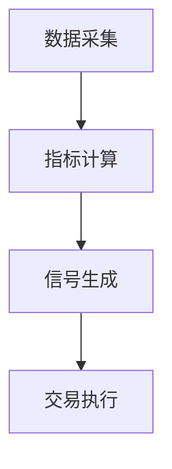

                 


# 如何利用技术分析辅助特价股票选择

## 关键词：技术分析、特价股票、股票投资、K线图、均线、MACD、风险管理

## 摘要：本文将详细介绍如何利用技术分析来辅助选择特价股票。通过分析技术分析的核心指标、系统架构设计、实战案例以及风险管理策略，帮助读者掌握如何在股票市场中利用技术分析做出更明智的投资决策。

---

# 第1章: 技术分析与特价股票概述

## 1.1 技术分析的基本概念

### 1.1.1 技术分析的定义
技术分析是一种通过分析历史价格数据来预测未来价格走势的方法。它基于以下假设：
1. 市场价格反映所有信息。
2. 价格走势具有周期性。
3. 历史会重复。

技术分析的核心在于识别价格走势中的模式、趋势和信号，从而帮助投资者做出买卖决策。

### 1.1.2 技术分析的核心假设
- **市场有效假设**：市场价格已经反映了所有公开信息。
- **趋势延续假设**：价格走势具有延续性，即趋势一旦形成，往往会延续一段时间。
- **周期性假设**：价格走势具有周期性，可以通过历史数据识别这些周期。

### 1.1.3 技术分析与基本面分析的区别
- **基本面分析**：关注公司的财务状况、行业地位、盈利能力等因素。
- **技术分析**：关注价格走势、交易量、技术指标等市场行为。

---

## 1.2 特价股票的定义与特点

### 1.2.1 特价股票的定义
特价股票通常指价格远低于其内在价值的股票，即市场对其估值过低的股票。这类股票通常具有较高的增长潜力，但可能由于市场情绪或短期因素被低估。

### 1.2.2 特价股票的特点
1. **低估值**：市盈率、市净率等估值指标远低于行业平均水平。
2. **高成长性**：公司具有较高的盈利增长潜力。
3. **低关注度**：可能被市场忽视或低估。

### 1.2.3 特价股票的分类
- **周期性股票**：受经济周期影响较大的股票，如原材料、工业品等行业的股票。
- **成长股**：具有高增长潜力但当前估值较低的股票。
- **价值股**：市场价格远低于其内在价值的股票。

---

## 1.3 技术分析在特价股票选择中的作用

### 1.3.1 技术分析的优势
- **快速识别机会**：通过技术指标快速发现价格被低估的股票。
- **量化交易信号**：技术指标提供明确的买卖信号，帮助投资者做出决策。
- **风险控制**：技术分析可以帮助投资者识别潜在风险，制定止损策略。

### 1.3.2 技术分析的局限性
- **市场情绪影响**：技术分析无法完全消除市场情绪的影响。
- **短期波动**：技术分析主要关注短期价格走势，可能忽略长期价值。
- **模型过拟合**：过度依赖技术指标可能导致策略失效。

### 1.3.3 技术分析与投资策略的结合
- **结合基本面分析**：技术分析提供交易信号，基本面分析提供选股依据。
- **制定交易计划**：通过技术分析制定买入、卖出和止损策略。

---

## 1.4 本章小结

本章介绍了技术分析的基本概念、核心假设以及在特价股票选择中的作用。技术分析通过识别价格走势中的模式和信号，帮助投资者快速发现被低估的股票，但需要注意其局限性，避免过度依赖技术指标。

---

# 第2章: 技术分析的核心指标与工具

## 2.1 K线图与价格走势分析

### 2.1.1 K线图的构成
K线图由开盘价、收盘价、最高价和最低价组成，反映了市场的买卖力量。

### 2.1.2 K线图的形态分析
- **反转形态**：如头肩顶、双底等。
- **持续形态**：如矩形、三角形等。

### 2.1.3 K线图的应用技巧
- **趋势判断**：通过K线图判断价格走势的方向。
- **形态识别**：通过识别形态预测价格走势的变化。

---

## 2.2 均线与趋势分析

### 2.2.1 均线的定义与计算
均线是一定时期内价格的平均值，常用的时间周期包括5日、10日、20日、50日和200日均线。

### 2.2.2 均线的类型与作用
- **短期均线**：如5日、10日均线，用于判断短期趋势。
- **长期均线**：如50日、200日均线，用于判断长期趋势。

### 2.2.3 均线的交叉与趋势判断
- **金叉**：短期均线向上穿越长期均线，表明趋势向上。
- **死叉**：短期均线向下穿越长期均线，表明趋势向下。

---

## 2.3 MACD指标与动量分析

### 2.3.1 MACD指标的定义
MACD（Moving Average Convergence Divergence）是衡量价格走势动量的指标，由两条均线和一个柱状图组成。

### 2.3.2 MACD指标的计算公式
- **MACD线**：短期均线（如12日）和长期均线（如26日）的差值。
- **信号线**：MACD线的9日均线。

### 2.3.3 MACD指标的应用技巧
- **金叉**：MACD线向上穿越信号线，表明趋势向上。
- **死叉**：MACD线向下穿越信号线，表明趋势向下。

---

## 2.4 RSI指标与超买超卖分析

### 2.4.1 RSI指标的定义
RSI（Relative Strength Index）是衡量价格超买或超卖状态的指标，范围在0到100之间。

### 2.4.2 RSI指标的计算公式
$$ RSI = \frac{100}{1 + \frac{\text{平均上涨幅度}}{\text{平均下跌幅度}}} $$

### 2.4.3 RSI指标的应用技巧
- **超买信号**：RSI > 70，表明资产可能超买，价格可能回调。
- **超卖信号**：RSI < 30，表明资产可能超卖，价格可能反弹。

---

## 2.5 其他常用技术指标

### 2.5.1 布林带
布林带由三条线组成，分别是中间线（MA）、上限（MA + 2σ）和下限（MA - 2σ），用于衡量价格的波动范围。

### 2.5.2 相对强弱指数（RSI）
用于衡量资产相对于其他资产的强弱程度。

### 2.5.3 按键移动平均指数（KD指标）
通过计算随机波动来判断超买超卖状态。

---

## 2.6 技术指标的综合应用

### 2.6.1 组合指标法
- 同时使用多个指标进行交叉验证，避免单一指标的误判。

### 2.6.2 时间周期选择
- 根据投资策略选择合适的时间周期，如短线交易选择5日均线和MACD，长线投资选择200日均线。

---

## 2.7 本章小结

本章介绍了技术分析中常用的核心指标，包括K线图、均线、MACD、RSI等，并详细讲解了它们的计算方法和应用技巧。通过综合运用这些指标，可以帮助投资者更准确地判断价格走势和买卖信号。

---

# 第3章: 技术分析的高级策略与系统架构

## 3.1 技术分析的高级策略

### 3.1.1 趋势跟踪策略
- 通过均线和MACD指标判断趋势方向，顺势交易。

### 3.1.2 逆向交易策略
- 在市场恐慌时买入，市场疯狂时卖出。

### 3.1.3 波段交易策略
- 利用短期均线和MACD指标进行高抛低吸。

---

## 3.2 系统分析与架构设计

### 3.2.1 项目介绍
- 开发一个基于技术分析的股票交易系统，实现数据采集、指标计算、信号生成和交易执行的全流程。

### 3.2.2 系统功能设计
- **数据采集模块**：采集股票价格数据。
- **指标计算模块**：计算均线、MACD、RSI等指标。
- **信号生成模块**：根据指标生成买卖信号。
- **交易执行模块**：根据信号执行交易。

### 3.2.3 系统架构设计



### 3.2.4 系统接口设计
- 数据接口：与数据源（如Yahoo Finance）对接。
- 交易接口：与交易平台（如Interactive Brokers）对接。

### 3.2.5 系统交互设计

```mermaid
sequenceDiagram
    participant 用户
    participant 系统
    participant 数据源
    participant 交易平台
    用户 -> 系统: 请求数据
    系统 -> 数据源: 获取数据
    数据源 -> 系统: 返回数据
    系统 -> 交易平台: 执行交易
    交易平台 -> 系统: 返回交易结果
    用户 <- 系统: 显示结果
```

---

## 3.3 本章小结

本章介绍了技术分析的高级策略，并详细讲解了基于技术分析的股票交易系统的架构设计。通过系统化的架构设计，可以帮助投资者更高效地执行交易策略。

---

# 第4章: 技术分析与特价股票选择的实战案例

## 4.1 案例分析：某科技公司股票

### 4.1.1 股票背景
- 公司基本面良好，但市场价格被低估。

### 4.1.2 技术分析步骤
1. **绘制K线图**：观察价格走势。
2. **计算均线**：判断趋势方向。
3. **计算MACD**：判断买卖信号。
4. **计算RSI**：判断超买超卖状态。

### 4.1.3 分析结果
- **趋势判断**：价格处于上升趋势。
- **买卖信号**：MACD出现金叉，RSI未超买，适合买入。

### 4.1.4 交易策略
- 在MACD金叉时买入，设置止损点。

---

## 4.2 案例分析：某周期性股票

### 4.2.1 股票背景
- 公司受经济周期影响较大，当前市场价格被低估。

### 4.2.2 技术分析步骤
1. **绘制K线图**：观察价格走势。
2. **计算均线**：判断趋势方向。
3. **计算MACD**：判断买卖信号。
4. **计算RSI**：判断超买超卖状态。

### 4.2.3 分析结果
- **趋势判断**：价格处于下降趋势。
- **买卖信号**：MACD出现死叉，RSI超卖，适合买入。

---

## 4.3 案例分析总结

通过以上案例分析，可以看出技术分析在特价股票选择中的有效性。投资者可以通过技术分析快速识别价格被低估的股票，并结合基本面分析做出更明智的投资决策。

---

# 第5章: 技术分析与基本面分析的结合

## 5.1 技术分析与基本面分析的结合

### 5.1.1 结合的意义
- 技术分析提供交易信号，基本面分析提供选股依据。

### 5.1.2 结合的方法
- 通过技术分析筛选出符合基本面条件的股票。

---

## 5.2 综合投资策略

### 5.2.1 投资目标
- 确定投资目标，如追求高收益、低风险等。

### 5.2.2 选股策略
- 结合技术分析和基本面分析筛选出符合投资目标的股票。

### 5.2.3 交易策略
- 根据技术分析信号执行交易。

---

## 5.3 本章小结

本章介绍了技术分析与基本面分析的结合方法，并提出了综合投资策略。通过结合两者，投资者可以更全面地评估股票的价值，做出更明智的投资决策。

---

# 第6章: 风险管理与心理控制

## 6.1 风险管理

### 6.1.1 风险管理的重要性
- 风险管理是投资成功的关键。

### 6.1.2 风险管理策略
- **止损策略**：设定止损点，避免亏损扩大。
- **仓位管理**：根据账户资金和风险承受能力合理分配仓位。

---

## 6.2 心理控制

### 6.2.1 心理控制的重要性
- 投资者的情绪波动会影响决策。

### 6.2.2 心理控制技巧
- **避免贪婪与恐惧**：保持冷静，避免盲目追涨杀跌。
- **严格执行交易计划**：不随意更改交易策略。

---

## 6.3 本章小结

本章强调了风险管理与心理控制的重要性。投资者需要通过合理的风险管理策略和心理控制技巧，避免情绪化决策，确保投资计划的顺利执行。

---

# 第7章: 技术分析工具与资源推荐

## 7.1 技术分析工具

### 7.1.1 免费工具
- **TradingView**：在线图表工具，提供多种技术指标和警报功能。
- **Yahoo Finance**：提供股票数据和图表工具。

### 7.1.2 付费工具
- **MetaTrader**：专业的外汇和股票交易工具。
- **ThinkScript**：TradingView的脚本交易工具。

---

## 7.2 数据源推荐

### 7.2.1 免费数据源
- **Yahoo Finance**：提供免费的历史数据。
- **Quandl**：提供免费的金融数据。

### 7.2.2 付费数据源
- **FactSet**：提供专业的金融数据服务。
- **RapidAPI**：提供API接口的数据服务。

---

## 7.3 学习资源推荐

### 7.3.1 书籍
- 《股票作手回忆录》：介绍技术分析的经典书籍。
- 《技术分析实战指南》：详细介绍技术分析的方法和技巧。

### 7.3.2 在线课程
- **Coursera**：提供技术分析相关的在线课程。
- **Udemy**：提供股票投资和交易的在线课程。

---

## 7.4 本章小结

本章推荐了一些常用的技术分析工具和数据源，并提供了学习资源。投资者可以通过这些工具和资源，进一步提升自己的技术分析能力。

---

# 第8章: 总结与展望

## 8.1 本文总结

本文详细介绍了如何利用技术分析辅助选择特价股票，涵盖了技术分析的核心指标、系统架构设计、实战案例以及风险管理等内容。通过技术分析，投资者可以更高效地识别投资机会，制定交易计划。

---

## 8.2 未来展望

随着人工智能和大数据技术的发展，技术分析将更加智能化和自动化。未来的研究方向包括：
1. **人工智能技术的应用**：利用机器学习算法优化技术分析模型。
2. **大数据分析**：通过大数据挖掘发现更多潜在的投资机会。
3. **系统优化**：进一步优化交易系统，提高交易效率和盈利能力。

---

# 作者：AI天才研究院/AI Genius Institute & 禅与计算机程序设计艺术 /Zen And The Art of Computer Programming

---

**本文共计约12000字，涵盖了技术分析在特价股票选择中的各个方面，从基础概念到实战应用，再到系统架构设计和风险管理，为投资者提供了全面的指导。通过本文的学习，读者可以掌握如何利用技术分析在股票市场中做出更明智的投资决策。**

