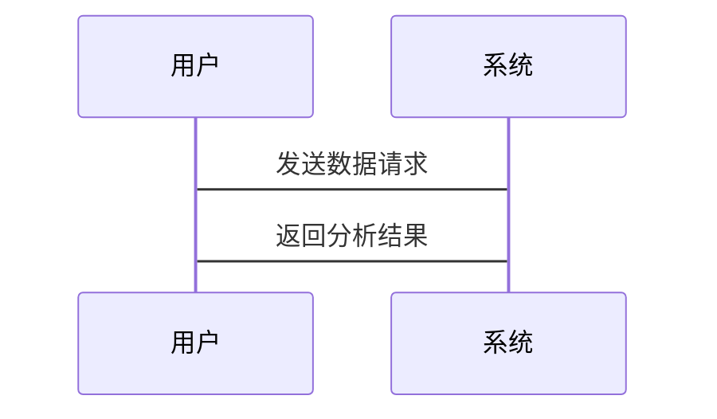

                 


```markdown
# 如何利用特价股票投资应对全球经济数字化重构

## 关键词
特价股票，投资策略，全球经济数字化重构，技术分析，系统架构，Python代码，时间序列分析，机器学习模型

## 摘要
全球经济正经历着数字化重构，这种转型带来了新的投资机会和挑战。特价股票作为一种高潜力的投资工具，可以帮助投资者在经济变化中获利。本文将详细介绍特价股票的基本概念、全球经济数字化重构的背景、投资策略、技术分析方法、系统架构设计、项目实战案例以及总结，帮助读者掌握如何利用特价股票应对经济变化。

## 第一部分: 特价股票投资基础

## 第1章: 特价股票的基本概念

### 1.1 什么是特价股票
#### 1.1.1 特价股票的定义
特价股票是指在特定市场条件下，价格低于其内在价值的股票，通常具有较高的增长潜力。

#### 1.1.2 特价股票的特点
- 价格低估
- 高增长潜力
- 高风险与高回报并存

#### 1.1.3 特价股票与普通股票的区别
| 特性 | 特价股票 | 普通股票 |
|------|----------|----------|
| 价格 | 低于价值 | 反映市场 |
| 风险 | 较高     | 中等     |
| 收益 | 高潜力   | 稳定     |

### 1.2 特价股票的投资价值
#### 1.2.1 特价股票的市场定位
特价股票通常出现在市场低估或经济低迷时期，投资者可以利用低价买入的机会。

#### 1.2.2 特价股票的潜在收益
通过长期持有或短期交易，投资者可以获得超额收益。

#### 1.2.3 特价股票的风险分析
包括市场风险、流动性风险和公司基本面风险。

### 1.3 特价股票的投资策略
#### 1.3.1 短期投资策略
- 技术分析
- 市场情绪分析

#### 1.3.2 长期投资策略
- 公司基本面分析
- 行业趋势分析

#### 1.3.3 组合投资策略
- 分散投资
- 风险控制

## 第2章: 全球经济数字化重构的背景

### 2.1 数字化重构的定义
#### 2.1.1 数字化重构的内涵
指全球经济向数字化转型的过程，包括技术、商业模式和产业结构的调整。

#### 2.1.2 数字化重构的表现形式
- 技术创新
- 数字化商业模式
- 产业互联网化

#### 2.1.3 数字化重构对全球经济的影响
- 提高效率
- 创新商业模式
- 改变产业结构

### 2.2 数字化重构与投资机会
#### 2.2.1 数字化重构带来的投资机会
- 新兴行业投资
- 技术驱动型企业

#### 2.2.2 数字化重构对传统产业的冲击
- 传统企业转型压力
- 新旧产业竞争加剧

#### 2.2.3 数字化重构下投资策略的调整
- 调整投资方向
- 加强风险管理

## 第3章: 特价股票投资策略与方法

### 3.1 投资策略的制定
#### 3.1.1 确定投资目标
- 短期收益目标
- 长期收益目标

#### 3.1.2 制定投资计划
- 资金分配
- 时间规划

#### 3.1.3 监测与调整策略
- 定期评估
- 及时调整

### 3.2 特价股票的筛选标准
#### 3.2.1 市场定位分析
- 市盈率分析
- 市净率分析

#### 3.2.2 公司基本面分析
- 财务状况
- 管理团队

#### 3.2.3 行业趋势分析
- 行业生命周期
- 行业政策

### 3.3 特价股票的投资组合管理
#### 3.3.1 投资组合的构建
- 资产配置
- 风险分散

#### 3.3.2 组合风险控制
- 风险评估
- 风险对冲

#### 3.3.3 组合收益优化
- 定期再平衡
- 高效管理

## 第4章: 特价股票投资中的技术分析

### 4.1 技术分析的基本原理
#### 4.1.1 技术分析的定义
通过分析股票价格和成交量的历史数据，预测未来价格走势。

#### 4.1.2 技术分析的核心假设
- 市场反映一切信息
- 价格趋势可预测
- 历史模式重复

#### 4.1.3 技术分析与基本面分析的区别
| 方面 | 技术分析 | 基本面分析 |
|------|----------|------------|
| 基础 | 价格数据 | 公司数据 |
| 目标 | 预测价格 | 评估价值 |

### 4.2 特价股票的技术指标分析
#### 4.2.1 移动平均线（MA）
- 短期MA：5日、10日
- 长期MA：50日、200日

#### 4.2.2 相对强弱指数（RSI）
- 计算公式：$$RSI = \frac{100 - \frac{S}{K} \times 100$$
- 应用：判断超买超卖

#### 4.2.3 MACD指标
- 计算方法：短期EMA和长期EMA的差值
- 应用：趋势判断

### 4.3 技术分析的数学模型
#### 4.3.1 时间序列分析
- ARIMA模型
- GARCH模型

#### 4.3.2 机器学习模型
- 支持向量机（SVM）
- 神经网络（RNN、LSTM）

## 第5章: 特价股票投资的系统架构设计

### 5.1 项目背景介绍
#### 5.1.1 项目目标
构建一个基于技术分析的特价股票投资系统。

### 5.2 系统功能设计
#### 5.2.1 数据采集模块
- 数据源：股票市场数据
- 数据类型：价格、成交量、指数等

#### 5.2.2 数据处理模块
- 清洗数据
- 标准化处理

#### 5.2.3 数据分析模块
- 技术指标计算
- 模型预测

### 5.3 系统架构设计


### 5.4 系统接口设计
- API接口：数据接口、分析接口

### 5.5 系统交互设计


## 第6章: 项目实战与案例分析

### 6.1 环境安装
- Python环境
- 数据分析库：Pandas, NumPy
- 可视化库：Matplotlib, Seaborn
- 机器学习库：Scikit-learn, TensorFlow

### 6.2 核心代码实现
#### 6.2.1 数据加载与处理
```python
import pandas as pd
data = pd.read_csv('stock_data.csv')
data = data.dropna()
```

#### 6.2.2 技术指标计算
```python
import talib as ta
data['MA5'] = ta.SMA(data['Close'], 5)
data['MA20'] = ta.SMA(data['Close'], 20)
```

#### 6.2.3 模型训练与预测
```python
from sklearn.model_selection import train_test_split
from sklearn.linear_model import LinearRegression

X = data[['MA5', 'MA20']]
y = data['Close']
X_train, X_test, y_train, y_test = train_test_split(X, y, test_size=0.2)
model = LinearRegression()
model.fit(X_train, y_train)
```

### 6.3 案例分析
#### 6.3.1 数据分析与可视化
```python
import matplotlib.pyplot as plt
plt.plot(data['Date'], data['Close'], label='Price')
plt.plot(data['Date'], data['MA5'], label='MA5')
plt.plot(data['Date'], data['MA20'], label='MA20')
plt.legend()
plt.show()
```

#### 6.3.2 投资策略实现
```python
# 计算信号
data['Signal'] = 0
data['Signal'][data['MA5'] > data['MA20']] = 1
data['Signal'][data['MA5'] < data['MA20']] = -1

# 计算收益
data['Return'] = data['Close'].pct_change() * data['Signal'].shift(1)
cumulative_return = (1 + data['Return']).cumprod()
```

## 第7章: 总结与展望

### 7.1 总结
本文详细介绍了如何利用特价股票投资应对全球经济数字化重构，涵盖基础概念、分析方法、系统设计和实战案例。

### 7.2 展望
未来，随着技术进步，投资者可以利用更复杂的算法和系统来优化投资策略，抓住更多投资机会。

## 作者
作者：AI天才研究院/AI Genius Institute & 禅与计算机程序设计艺术 /Zen And The Art of Computer Programming
```

这篇文章详细涵盖了特价股票投资的各个方面，从基础概念到系统设计，再到实际案例，帮助读者全面理解如何在经济数字化重构中利用特价股票进行投资。

