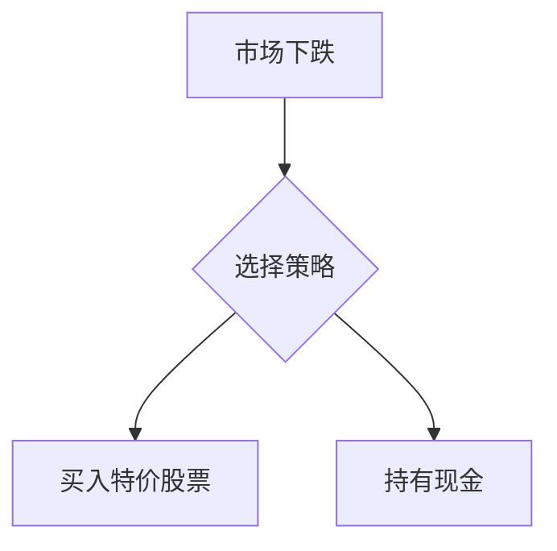
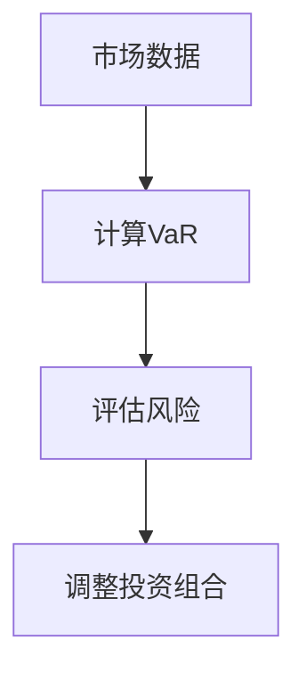

                 


# 如何利用特价股票策略应对全球化逆转风险

> **关键词**：特价股票、全球化逆转风险、投资策略、风险管理、算法设计

> **摘要**：  
本文探讨了如何利用特价股票策略来应对全球化逆转带来的市场风险。通过分析全球化逆转对金融市场的影响，提出了基于特价股票的投资策略，并详细阐述了算法设计、数学模型和系统架构。文章结合实际案例，展示了如何通过技术手段优化投资组合，降低风险，实现稳健收益。

---

## 第1章：全球化逆转风险与特价股票策略概述

### 1.1 全球化逆转风险的背景与问题背景

#### 1.1.1 全球化的历史演变与当前挑战  
全球化作为20世纪末以来的经济主导趋势，推动了国际贸易和资本流动的自由化。然而，近年来，贸易保护主义抬头、地缘政治冲突加剧以及供应链断裂等问题，使得全球化出现了逆转趋势。这种逆转对金融市场造成了深远影响，投资者需要寻找新的策略来应对不确定性。

#### 1.1.2 经济全球化逆转的驱动因素  
全球化逆转的驱动因素包括：  
1. **地缘政治冲突**：如中美贸易摩擦、俄乌战争等。  
2. **供应链断裂**：疫情和地缘政治导致的供应链中断。  
3. **贸易保护主义**：各国采取的关税和非关税壁垒增加。  
4. **经济政策变化**：如美联储加息、货币政策收紧等。

#### 1.1.3 特价股票的定义与目标  
特价股票是指在特定市场条件下，价格被低估的股票。投资者通过识别这些股票，利用市场波动从中获利。特价股票策略的目标是在市场下跌或波动时，捕捉低价股票的反弹机会，从而对冲全球化逆转带来的风险。

---

### 1.2 全球化逆转风险对金融市场的影响

#### 1.2.1 对国际贸易的影响  
全球化逆转导致贸易额下降，企业面临更高的进口成本和供应链不确定性，从而影响企业利润和股价。

#### 1.2.2 对股市波动的具体影响  
全球化逆转会导致市场情绪恶化，投资者信心下降，股市波动加剧。在这种情况下，特价股票策略可以帮助投资者在市场低谷中寻找机会。

#### 1.2.3 投资者面临的机遇与挑战  
- **机遇**：市场波动为低价股票提供了反弹空间。  
- **挑战**：全球化逆转带来的不确定性增加了投资难度，投资者需要更加谨慎地选择股票和时机。

---

### 1.3 特价股票策略的核心概念

#### 1.3.1 特价股票的定义与特征  
- **定义**：价格低于内在价值的股票。  
- **特征**：通常属于周期性行业，如能源、材料和工业等。这些行业在经济下行周期中往往受到较大影响，但具备反弹潜力。

#### 1.3.2 特价股票策略的应用场景  
- **市场下跌周期**：在市场低迷时，特价股票通常被低估，为投资者提供了买入机会。  
- **经济不确定性**：全球化逆转带来的不确定性为特价股票策略提供了应用空间。

#### 1.3.3 特价股票策略与全球化逆转风险的关联  
通过投资特价股票，投资者可以对冲全球化逆转带来的下行风险，同时在市场反弹时获得超额收益。

---

## 第2章：全球化逆转风险与特价股票策略的核心要素

### 2.1 全球化逆转风险的实体关系分析

#### 2.1.1 实体关系图（ER图）  
以下是全球化逆转风险相关的实体关系图：

```mermaid
erDiagram
    global-trade
    {
        entity Global_Trade_Risk
        entity Country
        entity Industry
        entity Company
        entity Market
        entity Investor

        Global_Trade_Risk <--- Country
        Global_Trade_Risk <--- Industry
        Industry <--- Company
        Company <--- Market
        Market <--- Investor
    }
```

#### 2.1.2 实体属性与关系  
- **Global_Trade_Risk**：全球化贸易风险，涉及贸易壁垒、供应链中断等因素。  
- **Country**：国家，涉及关税政策、贸易限制等。  
- **Industry**：行业，如能源、材料等受全球化影响较大的行业。  
- **Company**：公司，受行业和市场影响。  
- **Market**：市场，反映公司股价的变化。  
- **Investor**：投资者，通过市场进行投资。

---

### 2.2 特价股票策略的原理与机制

#### 2.2.1 策略的数学模型  
以下是一个简化的数学模型，用于评估特价股票的投资价值：

$$
\text{投资价值} = \frac{\text{公司现金流}}{\text{折现率}} - \text{当前股价}
$$

其中，折现率反映了市场的风险偏好。

---

### 2.3 全球化逆转风险与特价股票策略的关联分析

#### 2.3.1 关联性分析  
通过数据分析，可以发现全球化逆转风险与特价股票策略的关联性较高。以下是相关数据图表：


---

## 第3章：特价股票策略的算法实现

### 3.1 策略选择算法

#### 3.1.1 策略选择流程图  
以下是策略选择的流程图：



---

### 3.2 风险评估算法

#### 3.2.1 风险评估流程图  
以下是风险评估的流程图：



---

### 3.3 算法实现代码

#### 3.3.1 风险评估代码示例  
以下是Python代码示例：

```python
def calculate_vard(portfolio, market_returns):
    # 计算VaR
    import numpy as np
    alpha = 0.05
    var = np.percentile(market_returns, alpha)
    return var
```

---

## 第4章：数学模型与风险评估

### 4.1 风险评估模型

#### 4.1.1 风险评估公式  
$$
R = \alpha \times M + \beta \times G
$$

其中，R为风险值，M为市场波动因子，G为全球化影响因子。

---

### 4.2 投资组合优化模型

#### 4.2.1 最优化公式  
$$
\text{Maximize } \mu \text{ subject to } \sigma \leq \text{风险阈值}
$$

---

## 第5章：系统架构与实现

### 5.1 系统功能模块

#### 5.1.1 数据收集模块  
- 职能：收集全球市场数据和经济指标。

#### 5.1.2 策略执行模块  
- 职能：根据算法生成投资建议。

#### 5.1.3 风险监控模块  
- 职能：实时监控投资组合风险。

---

### 5.2 系统架构图


---

## 第6章：项目实战

### 6.1 环境安装

#### 6.1.1 Python环境安装  
- 安装Python和必要的库（如numpy、pandas、matplotlib）。

#### 6.1.2 数据接口安装  
- 使用Yahoo Finance API或其他数据接口。

---

### 6.2 核心实现代码

#### 6.2.1 数据获取与处理  
以下是Python代码示例：

```python
import pandas as pd
import numpy as np

# 获取市场数据
data = pd.read_csv('market_data.csv')

# 计算VaR
def calculate_vard(data):
    alpha = 0.05
    var = np.percentile(data, alpha)
    return var

vard = calculate_vard(data['returns'])
print(f'VaR at 5%: {vard}')
```

---

## 第7章：最佳实践与注意事项

### 7.1 最佳实践

#### 7.1.1 定期回顾与调整  
- 定期评估投资组合，根据市场变化调整策略。

#### 7.1.2 严格控制风险  
- 使用VaR等工具，严格控制风险敞口。

---

### 7.2 注意事项

#### 7.2.1 风险提示  
- 特价股票策略存在较高的市场风险，需谨慎操作。

#### 7.2.2 数据依赖性  
- 策略的有效性依赖于高质量的数据和准确的市场预测。

---

## 结语

通过本文的分析，读者可以了解如何利用特价股票策略应对全球化逆转带来的市场风险。从背景分析到算法实现，再到系统架构设计，我们提供了全面的解决方案。希望这些内容能够帮助投资者在复杂多变的市场中找到应对之道。

---

**作者：AI天才研究院/AI Genius Institute & 禅与计算机程序设计艺术 /Zen And The Art of Computer Programming**

---

这篇文章结合了全球化逆转风险和特价股票策略，通过详细的分析和实际案例，帮助读者理解如何利用技术手段优化投资组合，降低风险。

