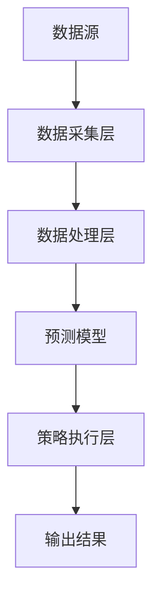
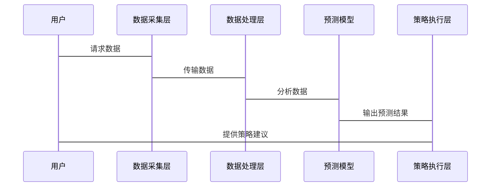

                 


```markdown
# 如何利用特价股票策略应对全球数字化供应链碎片化风险

> 关键词：特价股票策略, 全球供应链, 碎片化风险, 数字化供应链, 供应链风险管理

> 摘要：随着全球经济一体化的深入，供应链的复杂性不断增加，碎片化风险也随之上升。本文探讨如何利用特价股票策略来应对这一风险，通过算法原理、数学模型和系统架构设计，详细分析策略的实施步骤和最佳实践，为供应链管理者提供实用的解决方案。

---

## 第1章: 全球数字化供应链的碎片化风险

### 1.1 数字化供应链的定义与特点
#### 1.1.1 什么是数字化供应链
- 数字化供应链是通过信息技术将供应链的各个环节（供应商、制造商、分销商、零售商、消费者）连接起来，实现数据共享和协同工作的系统。
- 核心特点包括实时性、可视化、智能化和灵活性。

#### 1.1.2 数字化供应链的核心特点
- 数据驱动：利用大数据分析优化供应链运作。
- 智能协同：通过AI和物联网技术实现各环节的智能协同。
- 灵活性高：能够快速响应市场变化和客户需求。

#### 1.1.3 供应链碎片化的表现形式
- 供应商分散：全球采购导致供应链节点分散。
- 信息孤岛：各环节数据无法有效共享，导致协同困难。
- 风险分散：各环节独立运作，风险难以集中管理和应对。

### 1.2 全球化供应链的风险与挑战
#### 1.2.1 供应链的基本结构
- 供应商 -> 制造商 -> 分销商 -> 零售商 -> 消费者。
- 每个环节都可能引入风险，如原材料短缺、物流延迟等。

#### 1.2.2 供应链碎片化的成因分析
- 全球化采购导致供应链复杂化。
- 信息传递不畅，各环节缺乏协同。
- 地缘政治和经济波动对供应链的影响。

#### 1.2.3 碎片化供应链的风险与影响
- 高库存成本：由于信息不对称，各环节可能过度备货。
- 响应速度慢：问题在某一环节出现后，难以快速传递和解决。
- 成本增加：协调分散的供应链需要更多资源投入。

### 1.3 特价股票策略的定义与作用
#### 1.3.1 特价股票的基本概念
- 特价股票是指在特定时间段内，以低于市场价出售的股票。
- 通过特价股票策略，可以在市场波动中获取超额收益。

#### 1.3.2 特价股票策略的核心要素
- 时间窗口：确定特价股票的买卖时间。
- 市场分析：识别市场波动和潜在机会。
- 风险控制：制定止损策略，确保投资安全。

#### 1.3.3 特价股票策略在供应链管理中的作用
- 提供资金灵活性：通过快速变现特价股票，获取资金支持供应链运作。
- 优化库存管理：利用特价股票收益，降低库存成本。
- 应对突发事件：在供应链出现中断时，利用特价股票策略快速筹集资金。

---

## 第2章: 特价股票策略与供应链风险管理

### 2.1 特价股票策略的分类与特点
#### 2.1.1 按时间分类的特价股票策略
- 短期策略：在特定时间段内快速买卖，适合市场波动小的情况。
- 中长期策略：关注公司长期价值，适合市场波动大的情况。

#### 2.1.2 按风险程度分类的特价股票策略
- 低风险策略：投资于稳定公司，风险较低。
- 高风险策略：投资于高增长公司，风险较高，收益潜力大。

#### 2.1.3 特价股票策略的优缺点分析
- 优点：灵活性高，收益潜力大。
- 缺点：风险较高，需要精准的市场判断。

### 2.2 供应链风险管理的核心原则
#### 2.2.1 风险识别与评估
- 识别潜在风险：如原材料短缺、物流延迟等。
- 评估风险影响：分析风险对供应链整体的影响程度。

#### 2.2.2 风险应对策略
- 多元化采购：分散采购渠道，降低依赖单一供应商的风险。
- 建立应急储备：在关键节点保持一定的库存，应对突发事件。
- 灵活调整策略：根据市场变化及时调整供应链策略。

#### 2.2.3 风险监控与反馈
- 实时监控：通过数据监控系统，实时掌握供应链各环节的状态。
- 定期评估：定期评估风险应对措施的效果，及时调整策略。

### 2.3 特价股票策略在供应链风险管理中的应用
#### 2.3.1 特价股票策略如何降低供应链风险
- 提供资金支持：通过快速变现特价股票，为供应链提供资金支持。
- 优化库存管理：利用特价股票收益，优化库存结构，降低库存成本。
- 应对突发事件：在供应链中断时，利用特价股票策略快速筹集资金，缓解资金压力。

#### 2.3.2 特价股票策略与供应链弹性的关系
- 供应链弹性是指供应链在面对外部干扰时保持稳定运作的能力。
- 特价股票策略通过提供资金灵活性，增强供应链的弹性，使其能够更快地恢复和适应变化。

#### 2.3.3 特价股票策略的实施步骤
1. 识别供应链中的潜在风险点。
2. 制定特价股票买卖策略，确保资金的快速变现。
3. 建立监控机制，实时掌握供应链和市场的动态。
4. 根据市场变化和供应链状况，动态调整策略。

---

## 第3章: 特价股票策略的算法原理

### 3.1 特价股票策略的基本原理
#### 3.1.1 策略的基本逻辑
- 通过分析市场波动，确定特价股票的买卖时机。
- 结合供应链需求，优化资金分配，降低风险。

#### 3.1.2 策略的核心算法
- 时间序列分析：预测市场趋势。
- 风险评估模型：评估不同时间窗口的风险。

#### 3.1.3 算法的输入与输出
- 输入：历史股价数据、市场指标、供应链需求数据。
- 输出：建议的买卖时机、资金分配方案。

### 3.2 算法实现的数学模型
#### 3.2.1 数学模型的建立
- 使用时间序列模型（如ARIMA）预测股价走势。
- 通过回归分析评估市场风险。

#### 3.2.2 数学模型的验证
- 通过历史数据验证模型的准确性。
- 调整模型参数，优化预测效果。

#### 3.2.3 数学模型的优化
- 引入机器学习算法（如LSTM）提高预测精度。
- 结合供应链数据，优化模型的实用性。

### 3.3 算法实现的Python代码
```python
import pandas as pd
import numpy as np
from sklearn.metrics import mean_squared_error
from sklearn.linear_model import LinearRegression

# 示例数据加载
data = pd.read_csv('stock_prices.csv')

# 时间序列预测
model = LinearRegression()
model.fit(data[['time']], data['price'])

# 预测未来价格
future_time = np.array([[data.shape[0] + 1]])
predicted_price = model.predict(future_time)[0]
```

### 3.4 特价股票策略的数学公式
#### 3.4.1 关键公式推导
- 预测价格公式：
  $$ \hat{y}_t = a x_t + b $$
  其中，$x_t$ 是时间变量，$a$ 和 $b$ 是模型参数。

- 风险评估公式：
  $$ \text{风险} = \frac{\text{标准差}(y_t)}{\text{平均值}(y_t)} $$

#### 3.4.2 公式的应用与解释
- 使用线性回归模型预测未来股价，评估市场的波动风险。
- 根据风险评估结果，调整特价股票的买卖策略。

#### 3.4.3 公式的数学证明
- 通过最小二乘法确定模型参数：
  $$ \hat{a} = \frac{\sum (x_i - \bar{x})(y_i - \bar{y})}{\sum (x_i - \bar{x})^2} $$
  $$ \hat{b} = \bar{y} - \hat{a} \bar{x} $$

---

## 第4章: 特价股票策略的系统分析与架构设计

### 4.1 系统分析与设计
#### 4.1.1 系统功能需求分析
- 数据采集：实时采集市场数据和供应链数据。
- 风险评估：分析市场风险，评估供应链的稳定性。
- 策略制定：根据分析结果，制定特价股票策略。

#### 4.1.2 系统功能设计
- 数据处理模块：清洗和转换数据，确保数据的准确性。
- 预测模型：建立数学模型，预测市场趋势。
- 策略执行：根据预测结果，制定和执行特价股票策略。

#### 4.1.3 系统功能实现
- 使用Python和机器学习库（如TensorFlow、PyTorch）实现预测模型。
- 通过API接口获取实时市场数据，确保数据的及时性。

### 4.2 系统架构设计
#### 4.2.1 系统架构概述
- 分层架构：数据采集层、数据处理层、策略执行层。
- 模块化设计：每个模块独立运行，便于维护和扩展。

#### 4.2.2 系统架构图


#### 4.2.3 系统架构实现
- 数据采集层：使用API接口获取实时数据。
- 数据处理层：清洗和转换数据，建立数据库。
- 预测模型：基于机器学习算法，建立时间序列模型。
- 策略执行层：根据预测结果，制定和执行特价股票策略。

### 4.3 系统接口
#### 4.3.1 系统接口设计
- 数据接口：提供API接口，方便数据的获取和传输。
- 用户接口：提供友好的用户界面，方便用户查看和操作。

#### 4.3.2 系统交互流程


---

## 第5章: 项目实战

### 5.1 环境安装与配置
- 安装Python和必要的库（如Pandas、NumPy、Scikit-learn）。
- 配置数据源和API接口。

### 5.2 核心代码实现
```python
import pandas as pd
from sklearn.linear_model import LinearRegression

# 加载数据
data = pd.read_csv('stock_data.csv')

# 建立模型
model = LinearRegression()
model.fit(data[['time']], data['price'])

# 预测未来价格
future_time = np.array([[data.shape[0] + 1]])
predicted_price = model.predict(future_time)[0]
print(f'预测未来价格：{predicted_price}')
```

### 5.3 代码运行与测试
- 运行代码，验证模型的准确性。
- 调整模型参数，优化预测效果。

### 5.4 实际案例分析
- 分析某公司的供应链数据，制定特价股票策略。
- 通过模型预测，优化库存管理和资金分配。

### 5.5 项目小结
- 特价股票策略能够有效降低供应链碎片化风险。
- 通过数学模型和算法优化，提升供应链管理的效率和准确性。

---

## 第6章: 最佳实践与注意事项

### 6.1 最佳实践 tips
- 定期监控市场动态，及时调整策略。
- 结合供应链数据，优化模型的实用性。
- 建立应急机制，应对突发事件。

### 6.2 小结
- 特价股票策略是应对全球数字化供应链碎片化风险的有效工具。
- 通过算法和数学模型，优化供应链管理，提升企业的竞争力。

### 6.3 注意事项
- 风险控制是关键，避免过度依赖单一策略。
- 数据质量和模型准确性直接影响策略的效果。
- 定期回顾和优化策略，确保其适应市场变化。

### 6.4 拓展阅读
- 《供应链风险管理实战》
- 《机器学习在金融领域的应用》
- 《数字化供应链的优化与创新》

---

## 作者：AI天才研究院/AI Genius Institute & 禅与计算机程序设计艺术 /Zen And The Art of Computer Programming
```

