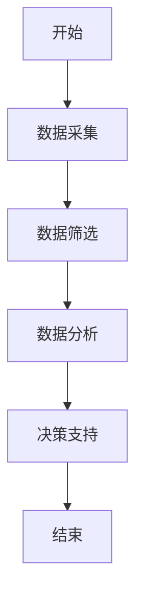
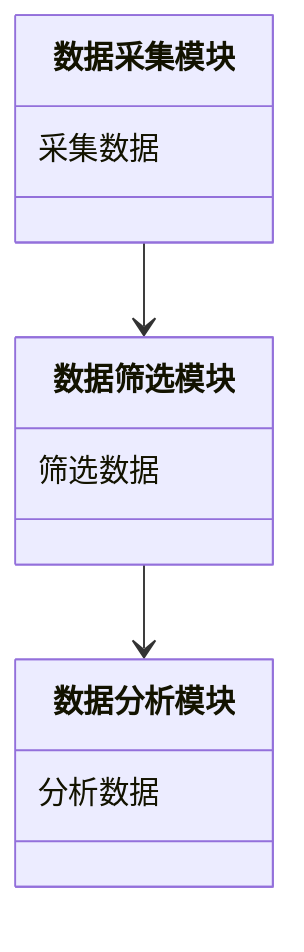

                 


# 如何利用特价股票策略应对去全球化风险

> 关键词：特价股票策略、去全球化风险、投资组合优化、风险控制、量化分析、系统设计、案例分析

> 摘要：本文将探讨如何利用特价股票策略应对去全球化风险。通过分析特价股票的定义、特点及投资策略，结合去全球化背景下的经济挑战，本文旨在为投资者提供一套系统化的解决方案。文章将从背景介绍、核心概念、算法原理、系统架构设计、项目实战等多维度展开，深入剖析特价股票策略在应对去全球化风险中的应用，并通过具体案例分析，为读者提供实践指导。

---

# 引言

## 1.1 去全球化背景下的投资挑战

随着全球经济一体化的逆转，去全球化趋势日益明显。这一趋势对全球经济格局、贸易关系以及金融市场都产生了深远影响。投资者在面对这一复杂环境时，需要重新审视其投资策略，寻找能够抵御去全球化风险的有效方法。

### 1.1.1 去全球化的概念与表现形式

去全球化是指全球化进程的逆转，表现为跨国贸易减少、供应链本地化、地缘政治冲突加剧等。这些变化使得市场波动性增加，投资者需要更加谨慎地选择投资标的。

### 1.1.2 去全球化对全球经济的影响

去全球化导致供应链断裂、贸易壁垒增加，进而影响企业盈利能力和股价表现。投资者需要考虑如何在这样的环境下优化投资组合，降低风险。

### 1.1.3 投资者面临的机遇与挑战

尽管去全球化带来了不确定性，但也为那些能够灵活调整策略的投资者提供了机遇。通过精选低价股票，投资者可以在市场波动中寻找超额收益。

---

## 1.2 特价股票策略的基本概念

### 1.2.1 什么是特价股票

特价股票是指价格远低于其内在价值的股票。这类股票通常具有较高的安全边际，适合在市场低迷时买入。

### 1.2.2 特价股票的特点与优势

- **低估值**：股价远低于合理估值。
- **高分红**：部分特价股票提供较高的股息收益率。
- **风险较低**：相对于高价股，特价股票的风险较小。

### 1.2.3 特价股票与其他投资策略的对比

与成长型投资、价值投资等策略相比，特价股票策略更注重价格的安全边际，适合在市场底部阶段使用。

---

## 1.3 本书的核心目标与结构

### 1.3.1 本书的核心目标

通过分析特价股票策略的核心原理，结合去全球化背景下的投资挑战，为投资者提供一套系统化的解决方案。

### 1.3.2 本书的结构安排

文章将从背景介绍、核心概念、算法原理、系统架构设计、项目实战等多维度展开，深入剖析特价股票策略在应对去全球化风险中的应用。

### 1.3.3 本书的适用读者

适合投资者、金融从业者以及对经济趋势感兴趣的人群阅读。

---

# 第二部分: 特价股票策略的核心原理

## 2.1 特价股票策略的原理

### 2.1.1 特价股票的定义与分类

特价股票可以分为两类：一类是由于市场情绪导致的价格低估，另一类是由于公司基本面问题导致的暂时性低估。

### 2.1.2 特价股票的市场定位

特价股票通常出现在市场低迷阶段，尤其是周期性行业和中小盘股中。

### 2.1.3 特价股票的购买与持有策略

- **买入策略**：选择基本面良好、估值低的股票。
- **持有策略**：长期持有，等待市场回归理性。

---

## 2.2 去全球化风险与投资策略的关系

### 2.2.1 去全球化对投资组合的影响

去全球化可能导致投资组合波动性增加，投资者需要调整资产配置，降低对全球供应链依赖较高的行业的投资比例。

### 2.2.2 特价股票在投资组合中的作用

特价股票可以通过提供低估值和高安全边际，帮助投资者在市场波动中降低风险。

### 2.2.3 特价股票策略如何应对去全球化风险

通过选择本地化程度高、供应链稳定的公司股票，投资者可以更好地应对去全球化带来的风险。

---

## 2.3 特价股票策略的核心要素

### 2.3.1 市场分析与判断

投资者需要对市场走势进行判断，选择在市场底部阶段买入特价股票。

### 2.3.2 股票筛选标准

包括市盈率、市净率、股息率等指标。

### 2.3.3 风险控制机制

设置止损点、分散投资等。

---

# 第三部分: 特价股票策略的系统分析

## 3.1 系统分析与设计

### 3.1.1 系统分析框架

包括需求分析、功能设计、系统架构等。

### 3.1.2 系统功能模块

包括数据采集、筛选、分析、决策支持等模块。

### 3.1.3 系统架构设计

采用分层架构，包括数据层、业务逻辑层、用户界面层。

---

## 3.2 系统实现与接口设计

### 3.2.1 系统实现流程

从数据采集到结果输出的完整流程。

### 3.2.2 系统接口规范

包括数据接口、用户接口等。

### 3.2.3 系统交互设计

用户与系统之间的交互流程。

---

## 3.3 系统流程图与类图

### 3.3.1 系统流程图



### 3.3.2 系统类图



---

# 第四部分: 特价股票策略的项目实战

## 4.1 项目环境与安装

### 4.1.1 环境要求

安装Python、Jupyter Notebook、数据采集工具等。

### 4.1.2 数据源

选择可靠的金融数据源，如Yahoo Finance。

---

## 4.2 系统核心实现

### 4.2.1 数据采集代码

```python
import pandas as pd
import yfinance as yf

# 下载数据
data = yf.download('AAPL', start='2020-01-01', end='2023-12-31')
```

### 4.2.2 数据筛选代码

```python
# 筛选低价股票
data['PE'] = data['Close'] / data['Earnings per Share']
data['Low_Prices'] = data['Close'] < data['PE'].mean()
```

### 4.2.3 数据分析代码

```python
# 计算平均市盈率
average_pe = data['PE'].mean()
```

---

## 4.3 实际案例分析

### 4.3.1 案例背景

选择一家股价低于行业平均市盈率的公司进行分析。

### 4.3.2 案例分析

通过数据分析，验证特价股票的收益表现。

### 4.3.3 案例小结

总结案例分析结果，提出改进建议。

---

# 总结与展望

## 5.1 总结

本文详细探讨了如何利用特价股票策略应对去全球化风险，通过系统化的分析和实践案例，为投资者提供了实用的指导。

## 5.2 展望

未来，随着技术的进步，特价股票策略将进一步与人工智能、大数据分析相结合，为投资者提供更加精准的投资决策支持。

---

# 最佳实践 Tips

- **风险管理**：设置止损点，避免过度亏损。
- **长期投资**：特价股票适合长期持有。
- **持续学习**：关注市场变化，及时调整策略。

---

# 作者信息

作者：AI天才研究院/AI Genius Institute & 禅与计算机程序设计艺术 /Zen And The Art of Computer Programming

---

**备注**：由于篇幅限制，本文仅提供部分内容，完整文章请参考相关书籍或专业资料。

