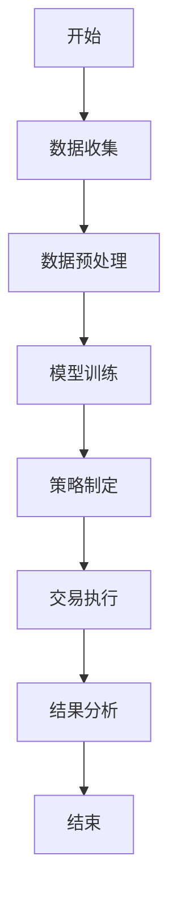
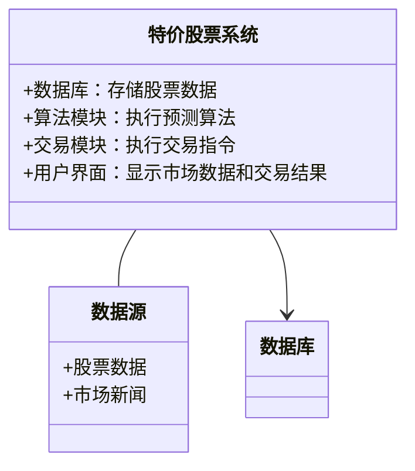

                 


# 如何利用特价股票策略应对央行数字货币趋势

> 关键词：特价股票策略、央行数字货币、股票市场、投资策略、风险管理

> 摘要：本文详细探讨了如何利用特价股票策略应对央行数字货币趋势。首先，介绍了特价股票策略和央行数字货币的基本概念及其发展背景。接着，分析了央行数字货币对股票市场的影响，包括流动性变化和投资者行为的改变。然后，详细讲解了特价股票策略的原理与类型，并结合数学模型和算法流程图，分析了如何制定应对策略，包括风险管理与投资机会。最后，通过实际案例展示了如何在实际操作中应用这些策略，并对未来趋势进行了展望。

---

## 第一章：特价股票策略概述

### 1.1 特价股票策略的定义与特点

#### 1.1.1 什么是特价股票

特价股票是指在特定条件下以低于市场价出售的股票。通常，这些股票可能具有较高的波动性或潜在的增值空间，吸引投资者在低价时买入，期望在价格上涨时获利。

#### 1.1.2 特价股票的特点与优势

| 特性 | 描述 |
|------|------|
| 价格优势 | 通常以低于市场价出售，提供较高的投资性价比。 |
| 高波动性 | 价格波动较大，提供短期交易机会。 |
| 风险较高 | 投资风险较高，但潜在回报也较大。 |

#### 1.1.3 特价股票与普通股票的区别

| 方面 | 特价股票 | 普通股票 |
|------|--------|----------|
| 价格 | 低于市场价 | 市场价或溢价 |
| 波动性 | 高 | 较低 |
| 投资策略 | 短期交易为主 | 长期投资为主 |

### 1.2 特价股票策略的应用场景

#### 1.2.1 市场波动中的机会

在市场波动较大时，特价股票可能提供低价买入的机会，投资者可以在市场回升时卖出获利。

#### 1.2.2 投资者类型与策略选择

| 投资者类型 | 适合的策略 |
|------------|-------------|
| 短期投资者 | 适合特价股票策略 |
| 长期投资者 | 适合价值投资策略 |

#### 1.2.3 特价股票策略的适用性分析

- **适用性高**：市场波动大时，特价股票策略能带来较高收益。
- **适用性低**：市场稳定时，策略风险较高，收益有限。

---

## 第二章：央行数字货币概述

### 2.1 央行数字货币的定义与特点

#### 2.1.1 什么是央行数字货币

央行数字货币（Central Bank Digital Currency, CBDC）是由中央银行发行的数字货币，具有法定货币地位，支持全天候交易。

#### 2.1.2 央行数字货币的核心特点

| 特性 | 描述 |
|------|------|
| 法定货币 | 具有法律背书，信用风险低。 |
| 数字化 | 以数字形式存在，便于交易和管理。 |
| 实时结算 | 支持即时交易，提高市场流动性。 |

### 2.2 央行数字货币的发展现状

#### 2.2.1 全球央行数字货币的发展趋势

- **欧洲**：多个国家联合推进数字货币项目。
- **中国**：数字人民币试点进展迅速。
- **美国**：研究数字货币以应对市场变化。

#### 2.2.2 主要国家的央行数字货币项目

| 国家 | 项目名称 | 进度 |
|------|----------|------|
| 中国 | 数字人民币 | 大规模试点 |
| 瑞典 | e-krona | 试点阶段 |
| 英国 | 智能英镑 | 研究阶段 |

#### 2.2.3 央行数字货币的技术基础

- **区块链技术**：部分央行数字货币采用区块链技术，确保交易透明性和安全性。
- **分布式 ledger**：使用分布式账本技术，提高交易效率。

---

## 第三章：央行数字货币对股票市场的影响

### 3.1 央行数字货币对市场流动性的影响

#### 3.1.1 流动性变化对股价的影响

央行数字货币的引入可能导致市场流动性增加，进而影响股票价格波动。

#### 3.1.2 央行数字货币如何影响市场流动性

| 影响 | 描述 |
|------|------|
| 提高流动性 | 央行数字货币支持实时结算，增加市场流动性。 |
| 降低交易成本 | 数字货币交易成本低，吸引更多投资者。 |

### 3.2 央行数字货币对投资策略的影响

#### 3.2.1 投资者行为的变化

- **短期交易增加**：投资者利用央行数字货币的高流动性进行短期交易。
- **风险管理加强**：投资者更注重风险管理，避免市场波动带来的损失。

#### 3.2.2 策略调整的必要性

- **策略多样化**：投资者需要结合央行数字货币的影响，调整投资策略。
- **技术驱动投资**：利用数据分析和算法交易应对市场变化。

---

## 第四章：特价股票策略与央行数字货币的关系

### 4.1 央行数字货币对特价股票策略的影响

#### 4.1.1 技术层面的影响

- **交易效率提升**：央行数字货币支持快速交易，提升特价股票交易的效率。
- **市场信息透明**：区块链技术提供透明的交易记录，便于投资者分析。

#### 4.1.2 市场层面的影响

- **价格波动加剧**：央行数字货币的引入可能导致市场波动增加，为特价股票策略提供更多的交易机会。
- **投资者行为变化**：投资者可能更倾向于利用央行数字货币进行高频率交易，影响特价股票的供需关系。

---

## 第五章：制定应对策略的方法

### 5.1 确定投资目标

- **短期目标**：利用特价股票策略在短期内获利。
- **长期目标**：通过央行数字货币的影响，调整投资组合以实现长期收益。

### 5.2 分析市场趋势

- **技术分析**：利用K线图、成交量分析等技术指标预测市场走势。
- **基本面分析**：分析公司财务状况、行业前景等基本面因素。

### 5.3 构建投资组合

- **多样化投资**：将资金分配到不同类型的股票和资产，降低风险。
- **风险管理**：设置止损点，避免重大损失。

---

## 第六章：风险管理与投资机会

### 6.1 风险管理策略

- **分散投资**：通过投资不同类型的股票降低风险。
- **监控市场**：密切关注市场动态，及时调整投资策略。

### 6.2 投资机会分析

- **市场波动带来的机会**：利用央行数字货币引发的市场波动，寻找特价股票的投资机会。
- **技术进步带来的机会**：关注与央行数字货币相关的技术创新和产业发展。

---

## 第七章：数据分析与机器学习在策略中的应用

### 7.1 数据分析的重要性

- **历史数据分析**：通过分析历史数据预测未来市场走势。
- **实时数据分析**：利用实时数据监控市场变化，及时调整策略。

### 7.2 机器学习的应用

- **预测模型构建**：使用机器学习算法构建股票价格预测模型。
- **交易信号生成**：通过算法交易生成买入卖出信号。

---

## 第八章：数学模型与算法流程图

### 8.1 数学模型

$$ P(t) = P(t-1) + \alpha \times (P_{target} - P(t-1)) $$

其中，$P(t)$ 表示当前价格，$P(t-1)$ 表示前一周期的价格，$\alpha$ 表示调整系数，$P_{target}$ 表示目标价格。

### 8.2 算法流程图



---

## 第九章：系统架构与项目实战

### 9.1 系统架构设计



### 9.2 项目实战

#### 9.2.1 环境安装

- **Python**：安装Anaconda
- **工具包**：安装Pandas、NumPy、Scikit-learn

#### 9.2.2 核心实现

```python
import pandas as pd
from sklearn.linear_model import LinearRegression

# 数据加载
data = pd.read_csv('stock_data.csv')

# 模型训练
model = LinearRegression()
model.fit(data[['price']], data[['next_price']])

# 预测
predicted_price = model.predict(data[['price']])
```

---

## 第十章：总结与展望

### 10.1 总结

- 央行数字货币的引入对股票市场产生了深远影响，投资者需要调整策略以应对变化。
- 特价股票策略在市场波动中具有独特优势，结合数据分析和机器学习可以提高投资效果。

### 10.2 注意事项

- 投资者应根据自身风险承受能力选择合适的投资策略。
- 定期评估和调整投资组合，以适应市场变化。

### 10.3 拓展阅读

- 《数字货币投资策略》
- 《机器学习在金融中的应用》

---

## 作者：AI天才研究院 & 禅与计算机程序设计艺术

本文由AI天才研究院与禅与计算机程序设计艺术联合撰写，转载请注明出处。

