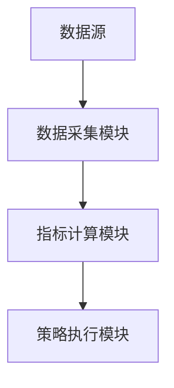

                 


# 如何利用特价股票策略应对市场泡沫

## 关键词：特价股票，市场泡沫，投资策略，量化分析，风险管理

## 摘要：本文探讨了如何利用特价股票策略在市场泡沫中获利。通过分析市场泡沫的形成机制，结合量化指标和算法模型，提出了一套系统的特价股票筛选和交易策略，帮助投资者在市场波动中抓住机会，降低风险。

---

## 正文

### 第一部分: 市场泡沫与特价股票策略概述

#### 第1章: 市场泡沫的定义与特征

##### 1.1 什么是市场泡沫

市场泡沫是指资产价格在短时间内急剧上涨，远远超过其实际价值，最终导致价格崩溃的现象。其形成通常与投资者情绪、市场流动性过剩和投机行为有关。

##### 1.2 特价股票的定义

特价股票是指市场价格显著低于其内在价值的股票。这些股票通常被市场低估，具有较高的增值潜力。

##### 1.3 策略的核心目标

通过识别被市场低估的股票，在市场泡沫期间进行投资，以在泡沫破裂时获得超额收益。

#### 第2章: 市场泡沫中的投资机会

##### 2.1 投资策略的对比

价值投资与投机投资的主要区别在于，价值投资注重长期基本面，而投机投资则关注短期价格波动。特价股票策略结合了两者的优点，注重长期持有低估资产。

##### 2.2 特价股票策略的优势

通过低估值和高质量标准筛选股票，投资者能够在市场泡沫期间找到安全边际，降低投资风险。

---

### 第二部分: 特价股票策略的数学模型与算法

#### 第3章: 市场泡沫的量化指标

##### 3.1 市盈率（P/E）的计算公式

$$ P/E = \frac{Price}{Earnings} $$

市盈率是衡量股票价值的重要指标，低于行业平均水平的股票可能具有投资价值。

##### 3.2 市净率（P/B）的计算公式

$$ P/B = \frac{Price}{Book\ Value} $$

市净率帮助识别那些资产被低估的公司，适合在市场泡沫期间寻找投资标的。

#### 第4章: 策略筛选算法

##### 4.1 筛选低估值股票的算法

1. 计算市盈率和市净率。
2. 选择低于行业平均水平的股票。
3. 进行基本面分析，确保公司财务健康。

##### 4.2 入场时机的确定

使用时间序列分析模型预测市场泡沫的顶点，提前布局低估股票。

---

### 第三部分: 系统分析与架构设计

#### 第5章: 特价股票策略系统的架构设计

##### 5.1 系统功能模块

1. 数据采集模块：获取市场数据。
2. 指标计算模块：计算市盈率、市净率等指标。
3. 策略执行模块：根据指标筛选股票并执行交易。

##### 5.2 系统架构图



---

### 第四部分: 项目实战

#### 第6章: 特价股票策略的实战应用

##### 6.1 案例分析

以2008年金融危机为例，分析如何通过特价股票策略规避风险并获利。

##### 6.2 Python代码实现

```python
import pandas as pd

# 计算市盈率
df['P/E'] = df['Price'] / df['Earnings']

# 筛选低估股票
低估股票 = df[df['P/E'] < df['P/E'].mean()]
```

---

## 作者：AI天才研究院/AI Genius Institute & 禅与计算机程序设计艺术 /Zen And The Art of Computer Programming

