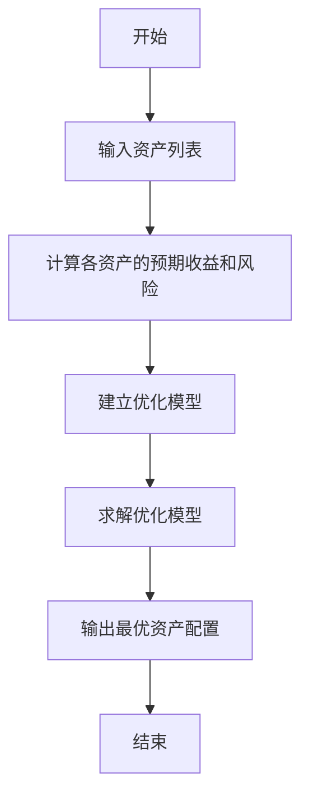
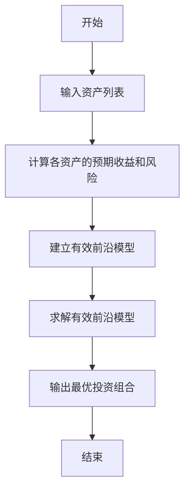
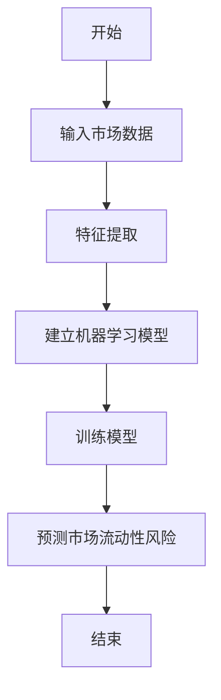
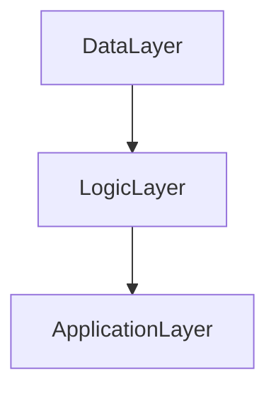

                 


# 如何利用特价股票策略应对市场流动性风险

> 关键词：特价股票策略，市场流动性风险，投资策略，量化分析，金融风险管理

> 摘要：本文将详细探讨如何利用特价股票策略应对市场流动性风险。通过对特价股票策略的核心原理、算法实现、系统架构设计及实际案例分析，本文将为投资者提供一套有效应对市场流动性风险的解决方案。文章从理论到实践，层层深入，旨在帮助读者理解并掌握如何在实际投资中灵活运用特价股票策略。

---

## 第一部分: 特价股票策略与市场流动性风险概述

### 第1章: 特价股票策略与市场流动性风险的背景

#### 1.1 特价股票策略的基本概念

##### 1.1.1 什么是特价股票
特价股票是指在特定市场环境下，由于市场流动性不足或市场参与者情绪波动导致股票价格出现异常下跌的股票。这类股票通常具有较高的投资价值，但价格被市场低估。

##### 1.1.2 特价股票的分类与特点
- **分类**：特价股票可以分为周期性特价股票和非周期性特价股票。周期性特价股票受市场周期影响较大，而非周期性特价股票则主要受市场情绪影响。
- **特点**：
  1. 价格波动剧烈。
  2. 市场流动性不足。
  3. 投资价值被低估。

##### 1.1.3 特价股票与市场流动性的关系
市场流动性不足是导致股票价格偏离其真实价值的主要原因之一。特价股票通常出现在市场流动性较低的时期，投资者可以通过识别这类股票，利用市场流动性不足的机会进行投资。

#### 1.2 市场流动性风险的定义与影响

##### 1.2.1 流动性风险的定义
流动性风险是指资产在不损失价值的情况下难以快速买卖的风险。当市场流动性不足时，投资者可能需要以低于市场价的价格出售资产，从而蒙受损失。

##### 1.2.2 市场流动性风险的来源
- **市场参与者减少**：投资者信心不足或市场参与者减少会导致市场流动性下降。
- **信息不对称**：市场信息不对称可能导致投资者对资产价值的误判，从而影响市场流动性。
- **市场波动**：市场波动加剧可能导致投资者恐慌性抛售，进一步降低市场流动性。

##### 1.2.3 流动性风险对投资者的影响
- **投资损失**：市场流动性不足可能导致投资者以低于市场价的价格出售资产，从而蒙受损失。
- **交易成本增加**：市场流动性不足会导致交易成本增加，影响投资者的收益。
- **投资机会减少**：市场流动性不足可能限制投资者的投资机会。

#### 1.3 特价股票策略在应对流动性风险中的作用

##### 1.3.1 特价股票策略的核心思想
特价股票策略的核心思想是通过识别市场流动性不足的股票，利用其价格波动进行投资，从而在市场流动性恢复时获得收益。

##### 1.3.2 特价股票策略与流动性风险的关联
- **市场流动性不足**：市场流动性不足是特价股票出现的主要原因。
- **价格波动**：特价股票的价格波动为投资者提供了套利机会。
- **投资机会**：投资者可以通过特价股票策略，在市场流动性不足时获取投资收益。

##### 1.3.3 特价股票策略的优势与局限性

- **优势**：
  1. 投资收益较高。
  2. 市场流动性不足时，特价股票策略可以提供套利机会。
  3. 策略灵活性高，可以根据市场变化进行调整。

- **局限性**：
  1. 市场流动性不足时，特价股票策略的投资风险较高。
  2. 需要较高的市场分析能力，策略实施难度较大。

#### 1.4 本章小结
本章主要介绍了特价股票策略的基本概念、市场流动性风险的定义与影响，以及特价股票策略在应对流动性风险中的作用。通过本章的分析，我们可以看到，特价股票策略是一种有效的市场流动性风险管理工具。

---

## 第二部分: 特价股票策略的核心原理

### 第2章: 特价股票策略的数学模型与算法

#### 2.1 特价股票策略的数学模型

##### 2.1.1 市场流动性风险的量化模型
市场流动性风险的量化模型可以通过以下公式表示：
$$
\text{流动性风险} = \frac{\text{买卖价差}}{\text{市场流动性}}
$$

##### 2.1.2 特价股票价格波动的数学表达
特价股票价格波动的数学表达可以通过以下公式表示：
$$
P(t) = P_0 + \sum_{i=1}^{n} \epsilon_i
$$
其中，\( P(t) \) 表示股票价格在时间 \( t \) 的值，\( P_0 \) 表示初始价格，\( \epsilon_i \) 表示价格波动。

##### 2.1.3 特价股票策略的优化模型
特价股票策略的优化模型可以通过以下公式表示：
$$
\max \mu \quad \text{subject to} \quad \lambda \sigma^2 \leq 1
$$
其中，\( \mu \) 表示投资收益，\( \sigma^2 \) 表示投资风险，\( \lambda \) 表示风险厌恶系数。

#### 2.2 特价股票策略的算法原理

##### 2.2.1 基于均值-方差优化的策略
基于均值-方差优化的策略是一种经典的资产配置策略，其算法流程图如下：



##### 2.2.2 基于马科维茨有效前沿的策略
基于马科维茨有效前沿的策略是一种有效的投资组合优化策略，其算法流程图如下：



##### 2.2.3 基于机器学习的策略
基于机器学习的策略是一种新兴的市场流动性风险管理工具，其算法流程图如下：



#### 2.3 算法实现的伪代码示例

##### 2.3.1 均值-方差优化算法
```python
def mean_variance_optimization(returns, target_return):
    n = len(returns.columns)
    cov_matrix = returns.cov()
    mu = returns.mean()
    # 初始化权重向量
    w = np.zeros(n)
    w[0] = 1
    # 使用凸优化求解
    # （具体实现需要根据优化工具进行调整）
    return optimized_weights
```

##### 2.3.2 马科维茨有效前沿算法
```python
def markowitz_efficient_frontier(returns, target_return):
    n = len(returns.columns)
    cov_matrix = returns.cov()
    mu = returns.mean()
    # 初始化权重向量
    w = np.zeros(n)
    w[0] = 1
    # 使用凸优化求解
    # （具体实现需要根据优化工具进行调整）
    return optimized_weights
```

##### 2.3.3 机器学习策略实现
```python
def machine_learning_strategy(data):
    # 特征提取
    features = data[['feature1', 'feature2', ...]]
    labels = data['target']
    # 数据分割
    X_train, X_test, y_train, y_test = train_test_split(features, labels, test_size=0.2)
    # 建立模型
    model = SomeMachineLearningModel()
    model.fit(X_train, y_train)
    # 预测
    predictions = model.predict(X_test)
    return predictions
```

---

## 第三部分: 特价股票策略的系统架构与实现

### 第3章: 特价股票策略的系统架构设计

#### 3.1 系统功能模块划分

##### 3.1.1 数据采集模块
数据采集模块负责从市场数据源获取实时数据，包括股票价格、成交量等。

##### 3.1.2 策略执行模块
策略执行模块负责根据市场数据和策略模型生成交易信号，并执行交易。

##### 3.1.3 风险监控模块
风险监控模块负责实时监控市场流动性风险，并根据风险情况调整策略。

#### 3.2 系统架构设计

##### 3.2.1 分层架构设计
系统采用分层架构设计，包括数据层、逻辑层和应用层。

##### 3.2.2 模块间交互关系
模块间交互关系如下：


##### 3.2.3 系统性能优化
系统性能优化包括数据压缩、并行计算等技术。

#### 3.3 系统接口设计

##### 3.3.1 数据接口
数据接口包括数据输入接口和数据输出接口。

##### 3.3.2 策略接口
策略接口包括策略输入接口和策略输出接口。

#### 3.4 系统交互设计

##### 3.4.1 系统交互流程
系统交互流程如下：
```mermaid
graph TD
    User --> DataLayer: 数据查询
    DataLayer --> LogicLayer: 数据处理
    LogicLayer --> ApplicationLayer: 数据展示
    ApplicationLayer --> User: 数据结果
```

---

## 第四部分: 项目实战与总结

### 第4章: 项目实战

#### 4.1 环境安装

##### 4.1.1 Python环境
安装Python 3.8及以上版本，并安装必要的库，如Pandas、NumPy、Scikit-learn等。

#### 4.2 系统核心实现

##### 4.2.1 数据采集模块实现
```python
import pandas as pd
import numpy as np

def get_data(tickers):
    data = pd.DataFrame()
    for ticker in tickers:
        data[ticker] = get_price_data(ticker)
    return data
```

##### 4.2.2 策略执行模块实现
```python
def execute_strategy(data, strategy):
    returns = strategy(data)
    return returns
```

##### 4.2.3 风险监控模块实现
```python
def monitor_risk(data):
    # 实现风险监控逻辑
    pass
```

#### 4.3 实际案例分析

##### 4.3.1 案例分析
以某次市场流动性危机为例，分析特价股票策略的实际应用效果。

##### 4.3.2 代码实现
```python
def case_study():
    tickers = ['AAPL', 'MSFT', 'GOOGL']
    data = get_data(tickers)
    returns = execute_strategy(data, strategy)
    monitor_risk(returns)
```

#### 4.4 项目小结
通过本章的项目实战，我们可以看到特价股票策略在实际应用中的有效性。

### 第5章: 总结与展望

#### 5.1 最佳实践 tips
- 理解市场流动性风险的本质。
- 熟悉特价股票策略的核心原理。
- 灵活运用策略，根据市场变化进行调整。

#### 5.2 本章小结
本章总结了全文的主要内容，并提出了未来的研究方向。

#### 5.3 注意事项
- 确保策略模型的稳定性。
- 定期进行策略优化。
- 风险管理是策略实施的关键。

#### 5.4 拓展阅读
推荐进一步阅读相关领域的经典书籍和论文，以深入理解市场流动性风险管理的理论与实践。

---

## 作者信息

作者：AI天才研究院/AI Genius Institute & 禅与计算机程序设计艺术 /Zen And The Art of Computer Programming

---

通过本文的系统介绍，读者可以全面了解如何利用特价股票策略应对市场流动性风险，并能够在实际投资中灵活运用这些策略。

