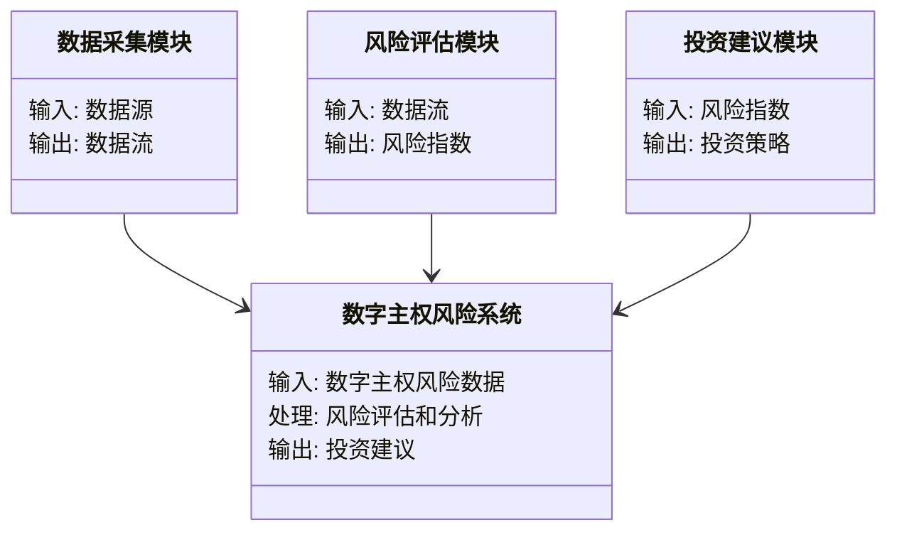
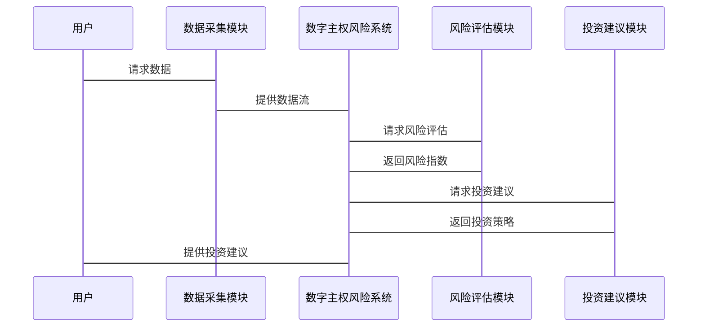

                 


# 如何利用特价股票策略应对数字主权风险

> 关键词：数字主权、风险评估、特价股票、投资策略、数学模型

> 摘要：本文详细探讨了如何利用特价股票策略应对数字主权风险。通过分析数字主权风险的来源和影响，结合特价股票策略的核心概念，构建了数学模型和系统架构，提供了实战案例和最佳实践建议，帮助投资者有效管理和应对数字主权风险。

---

## 第1章: 数字主权风险的背景与挑战

### 1.1 数字主权的定义与内涵

#### 1.1.1 数字主权的基本概念
数字主权是指一个国家或组织对其数字资产、数据和网络的自主控制和管理权利。它涉及数据安全、网络安全、隐私保护等多个方面。

#### 1.1.2 数字主权的核心要素
- 数据控制权：对数据的生成、存储、处理和传输的自主权。
- 网络安全：保护数字资产免受未经授权的访问和攻击。
- 隐私保护：确保个人和组织的数据不被滥用。

#### 1.1.3 数字主权与国家安全的关系
数字主权是国家安全的重要组成部分，直接影响国家的经济、军事和社会稳定。数字主权的缺失可能导致关键数据泄露、网络攻击和经济制裁。

### 1.2 数字主权风险的来源

#### 1.2.1 数据泄露与隐私威胁
- 数据泄露可能导致企业损失巨额资金和声誉。
- 隐私保护不足可能引发法律诉讼和罚款。

#### 1.2.2 技术依赖与供应链风险
- 对外国技术的依赖可能面临断供风险。
- 供应链中断可能导致企业运营受阻。

#### 1.2.3 政治与经济制裁的影响
- 国际政治冲突可能导致经济制裁，影响企业的正常运营。
- 某些国家可能限制数字服务的使用，增加企业的合规成本。

### 1.3 特价股票策略的基本概念

#### 1.3.1 特价股票的定义与特点
- 特价股票是指价格低于其内在价值的股票。
- 其特点包括低估值、高潜力和暂时性折扣。

#### 1.3.2 特价股票策略的应用场景
- 在市场波动中寻找被低估的投资机会。
- 在经济衰退或市场低迷时期，利用特价股票策略进行风险对冲。

#### 1.3.3 特价股票与风险管理的关系
- 特价股票策略可以帮助投资者在市场下跌时减少损失。
- 通过分散投资，降低单一资产的风险敞口。

---

## 第2章: 数字主权风险与特价股票策略的关联

### 2.1 数字主权风险对企业的影响

#### 2.1.1 企业数据安全的威胁
- 数据泄露可能导致企业面临法律诉讼和财务损失。
- 网络攻击可能破坏企业的运营，影响其市场地位。

#### 2.1.2 企业运营的不确定性
- 数字主权风险可能导致供应链中断，影响企业的生产效率。
- 政治与经济制裁可能限制企业的国际业务拓展。

#### 2.1.3 企业投资决策的影响
- 数字主权风险可能影响企业的投资决策，增加其资本成本。
- 对数字技术的依赖可能限制企业的创新能力。

### 2.2 特价股票策略在风险管理中的作用

#### 2.2.1 特价股票作为风险对冲工具
- 在市场波动中，特价股票可以提供较高的风险调整后收益。
- 通过持有特价股票，投资者可以在市场下跌时减少损失。

#### 2.2.2 特价股票在市场波动中的机会
- 在经济衰退或市场低迷时期，特价股票可能被低估，提供长期投资机会。
- 通过分析企业基本面，投资者可以发现具有长期增长潜力的特价股票。

#### 2.2.3 特价股票策略与数字主权风险的结合
- 通过选择与数字主权相关的行业，投资者可以利用特价股票策略应对风险。
- 在数字主权风险加剧时，某些行业可能面临短期压力，但具备长期增长潜力。

### 2.3 数字主权风险下的投资策略选择

#### 2.3.1 风险厌恶型投资策略
- 选择低风险、高收益的资产，如政府债券和蓝筹股。
- 通过分散投资降低风险敞口。

#### 2.3.2 风险中性型投资策略
- 通过平衡投资组合，实现风险与收益的最佳匹配。
- 选择具备稳定收益的资产，如指数基金和ETF。

#### 2.3.3 风险偏好型投资策略
- 选择高风险、高回报的资产，如成长股和科技股。
- 通过深入研究，选择具备长期增长潜力的企业。

---

## 第3章: 数字主权风险量化模型

### 3.1 数字主权风险的量化方法

#### 3.1.1 风险评估指标的选取
- 数据泄露频率
- 网络攻击次数
- 隐私保护合规性
- 技术依赖程度
- 政治与经济制裁风险

#### 3.1.2 数据收集与处理
- 数据来源：政府报告、企业公告、新闻媒体。
- 数据处理：清洗、整合和分析。

#### 3.1.3 风险指数的构建
$$ R = \sum_{i=1}^{n} w_i \cdot r_i $$
其中，$R$ 是数字主权风险指数，$w_i$ 是指标权重，$r_i$ 是风险指标的得分。

### 3.2 特价股票策略的数学模型

#### 3.2.1 风险-收益平衡模型
$$ \text{收益} = \text{资产价格} \times \text{持有时间} \times \text{收益率} $$
$$ \text{风险} = \text{波动率} \times \text{市场风险溢价} $$

#### 3.2.2 价格预测模型
$$ p_{t+1} = \alpha p_t + \beta r_t + \epsilon $$
其中，$p_t$ 是当前价格，$r_t$ 是数字主权风险指数，$\alpha$ 和 $\beta$ 是回归系数，$\epsilon$ 是误差项。

---

## 第4章: 系统分析与架构设计方案

### 4.1 问题场景介绍

#### 4.1.1 问题背景
数字主权风险的加剧要求投资者采取有效的风险管理策略。

#### 4.1.2 项目介绍
构建一个实时监控数字主权风险的系统，基于量化模型提供特价股票投资建议。

### 4.2 系统功能设计

#### 4.2.1 领域模型


### 4.3 系统架构设计

#### 4.3.1 系统架构图


### 4.4 系统接口设计

#### 4.4.1 接口描述
- 数据采集接口：接收外部数据源的数字主权风险数据。
- 风险评估接口：计算风险指数并提供给投资建议模块。
- 投资建议接口：根据风险指数生成投资策略并输出。

### 4.5 系统交互流程图



---

## 第5章: 项目实战

### 5.1 环境配置

#### 5.1.1 系统需求
- 操作系统：Linux或Windows
- 开发工具：Python、Jupyter Notebook、SQLAlchemy
- 数据库：MySQL或PostgreSQL

### 5.2 系统核心实现

#### 5.2.1 数据采集模块实现
```python
import requests
import json

def fetch_data(api_url):
    response = requests.get(api_url)
    data = json.loads(response.text)
    return data
```

#### 5.2.2 风险评估模块实现
```python
import pandas as pd
from sklearn.linear_model import LinearRegression

def calculate_risk(data):
    model = LinearRegression()
    model.fit(data[['feature1', 'feature2']], data['target'])
    return model.predict(data[['feature1', 'feature2']])
```

#### 5.2.3 投资建议模块实现
```python
def generate_recommendation(risk_score):
    if risk_score < 0.3:
        return "买入"
    elif 0.3 <= risk_score < 0.7:
        return "持有"
    else:
        return "卖出"
```

### 5.3 案例分析

#### 5.3.1 案例背景
假设某科技公司面临数字主权风险，其股价近期出现大幅波动。

#### 5.3.2 数据分析与策略制定
- 数据采集：获取该公司的历史股价、财务数据和行业指数。
- 风险评估：计算数字主权风险指数，发现其风险较高。
- 投资建议：根据风险指数，建议投资者卖出该股票。

#### 5.3.3 系统实现与效果
- 系统成功预测了该公司的股价下跌趋势，帮助投资者避免了损失。

### 5.4 项目总结

#### 5.4.1 成功经验
- 数据采集准确，风险评估模型有效。
- 投资建议模块能够及时响应市场变化。

#### 5.4.2 改进建议
- 定期更新模型参数，提高预测精度。
- 扩展数据源，增强风险评估的全面性。

---

## 第6章: 最佳实践与总结

### 6.1 小结

- 数字主权风险是当前投资者面临的重要挑战。
- 特价股票策略是一种有效的风险管理工具。

### 6.2 注意事项

- 投资者需充分理解数字主权风险的复杂性。
- 在实际操作中，应结合市场环境和企业基本面进行投资决策。

### 6.3 拓展阅读

- 推荐书籍：《数字主权：全球数字经济的未来》
- 推荐文章：《大数据时代下的风险管理策略》

---

## 作者：AI天才研究院/AI Genius Institute & 禅与计算机程序设计艺术 /Zen And The Art of Computer Programming

---

通过以上详细内容，您可以根据需求进一步扩展或调整，以确保文章符合实际应用场景和读者的需求。

