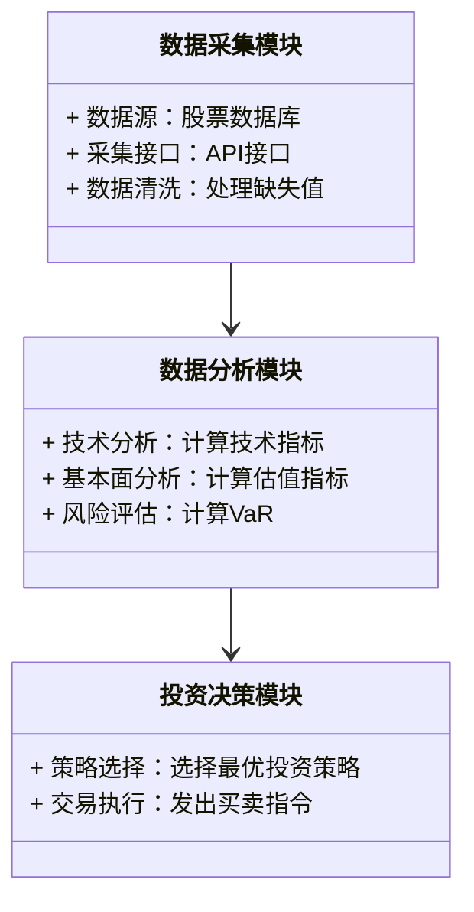
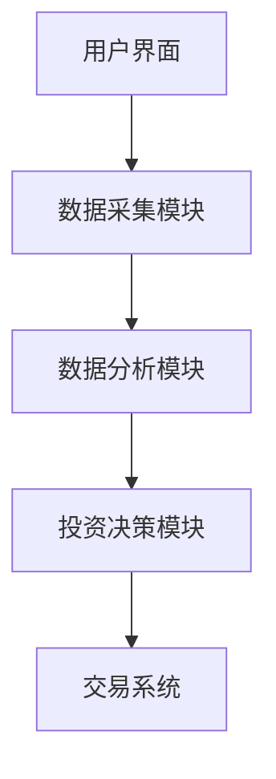

                 


# 如何利用特价股票策略应对数字化去全球化风险

> 关键词：特价股票策略，数字化，去全球化，投资风险，算法，系统架构

> 摘要：随着数字化和去全球化趋势的加剧，全球市场波动性和不确定性增加，投资者面临更大的风险。本文将深入探讨如何利用特价股票策略来应对这些风险，通过数学建模、算法优化和系统架构设计，为投资者提供一种高效的投资策略。文章结合实际案例，详细阐述了特价股票策略的核心原理、算法实现和系统架构，为投资者提供了理论支持和实践指导。

---

## 第一部分：背景与概念

### 第1章：数字化与去全球化背景下的投资风险

#### 1.1 数字化与去全球化的概念与影响

随着信息技术的飞速发展，全球经济正经历着深刻的数字化转型。数字化不仅改变了企业的运营方式，也深刻影响了投资领域。与此同时，近年来去全球化趋势的抬头，使得全球经济的不确定性增加。这种趋势可能导致供应链断裂、贸易壁垒增加，进而影响企业的盈利能力。

#### 1.2 投资风险的多样化

在传统投资中，风险主要来源于市场波动、公司基本面变化等。然而，在数字化和去全球化的背景下，投资风险变得更加复杂。例如，地缘政治冲突可能导致某国企业股价大幅波动，而数字化转型中的技术风险也可能导致企业业绩下滑。投资者需要更加灵活和多元化的方式来应对这些风险。

---

### 第2章：特价股票策略的核心概念

#### 2.1 特价股票的定义与特点

特价股票是指价格低于其内在价值的股票。这种股票通常具有较高的安全边际，适合长期投资者。其特点是价格波动大、市场关注度低、潜在回报高。

#### 2.2 特价股票策略的应用场景

在市场波动加剧的情况下，特价股票策略能够帮助投资者在低价时买入优质股票，从而在市场反弹时获得超额收益。此外，面对去全球化带来的不确定性，投资者可以通过特价股票策略规避部分风险。

---

## 第二部分：特价股票策略的数学模型与算法

### 第3章：特价股票策略的数学模型

#### 3.1 投资组合优化的数学模型

投资组合优化是投资决策中的核心问题。我们可以通过以下数学模型来构建投资组合：

$$
\text{目标：} \quad \max_{w} \left( \mu^T w - \lambda \sigma^T w \right)
$$

其中：
- \( w \) 是投资组合的权重向量；
- \( \mu \) 是资产的期望收益向量；
- \( \sigma \) 是资产的风险向量；
- \( \lambda \) 是风险厌恶系数。

#### 3.2 风险评估与量化分析

我们可以通过VaR（Value at Risk）模型来量化投资组合的风险。VaR模型能够给出在一定置信水平下，投资组合可能遭受的最大损失。

---

### 第4章：特价股票策略的算法实现

#### 4.1 基于技术分析的算法

技术分析是一种通过分析历史价格数据来预测未来价格走势的方法。以下是基于技术分析的特价股票算法实现步骤：

1. 数据采集：获取目标股票的历史价格数据。
2. 计算技术指标：计算移动平均线、相对强弱指数等指标。
3. 确定买卖信号：根据技术指标的交叉点或超买超卖信号发出买卖指令。

#### 4.2 基于基本面分析的算法

基本面分析是通过分析企业的财务报表、行业地位等因素来评估股票的价值。以下是基于基本面分析的特价股票算法实现步骤：

1. 数据采集：获取目标企业的财务报表数据。
2. 计算估值指标：计算市盈率、市净率等指标。
3. 确定投资标的：选择估值低于行业平均水平的股票。

---

## 第三部分：系统架构与实现

### 第5章：系统架构设计

#### 5.1 系统功能模块设计

以下是系统功能模块的类图：



#### 5.2 系统架构设计

以下是系统的架构图：



---

## 第四部分：项目实战

### 第6章：项目实战

#### 6.1 环境安装

以下是项目所需的环境和工具：

- 数据采集工具：Yahoo Finance API
- 数据分析工具：Python（Pandas、NumPy）
- 算法实现工具：Python（Scikit-learn）

#### 6.2 核心代码实现

以下是核心代码示例：

```python
import pandas as pd
import numpy as np

# 数据采集
data = pd.read_csv('stock_data.csv')

# 技术分析
def calculate_moving_average(data, window):
    return data['Close'].rolling(window).mean()

ma = calculate_moving_average(data, 20)

# 基本面分析
def calculate_valuation(data):
    pe = data['Price'] / data['Earnings']
    return pe

pe_ratio = calculate_valuation(data)
```

---

### 第7章：最佳实践

#### 7.1 小结

特价股票策略是一种有效的投资工具，能够帮助投资者在数字化和去全球化的背景下应对投资风险。通过数学建模和算法优化，投资者可以更好地把握投资机会。

#### 7.2 注意事项

- 投资者需要根据自身风险承受能力调整策略参数。
- 系统需要定期更新数据和模型，以适应市场变化。

#### 7.3 未来展望

随着人工智能和大数据技术的发展，特价股票策略将更加智能化和个性化。

---

## 作者：AI天才研究院 & 禅与计算机程序设计艺术

本文由AI天才研究院与“禅与计算机程序设计艺术”联合撰写，旨在为投资者提供科学的投资策略和系统化的解决方案。

