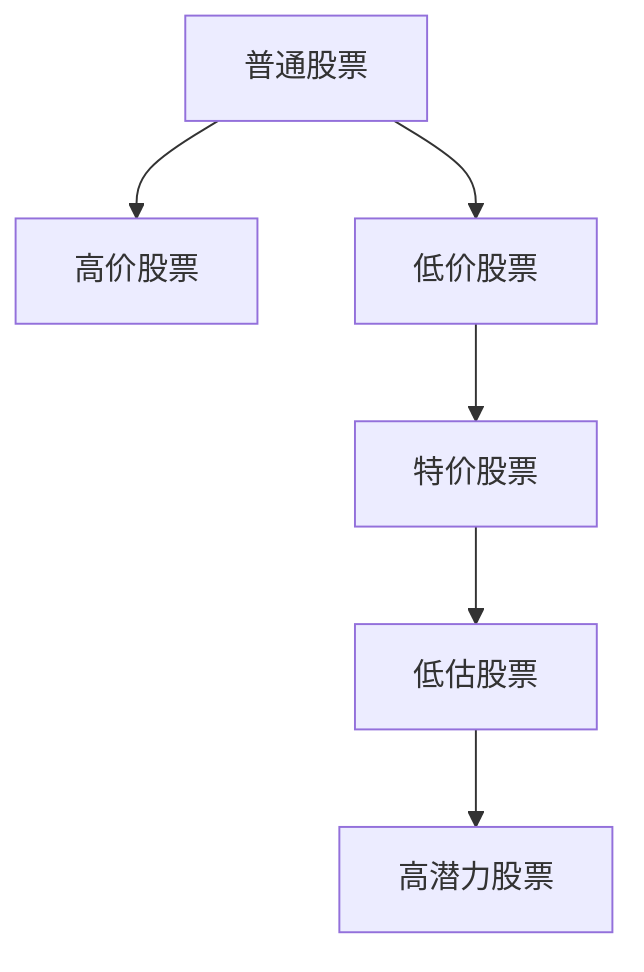
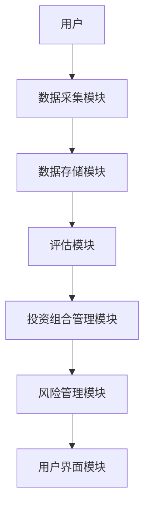

                 


```markdown
# 如何利用特价股票策略应对通货膨胀

> 关键词：通货膨胀，特价股票，投资策略，股票市场，风险对冲

> 摘要：本文详细探讨了如何通过特价股票策略来应对通货膨胀。首先介绍了通货膨胀的背景及其对经济的影响，接着阐述了特价股票的定义、类型及其在通货膨胀应对中的优势。然后，分析了特价股票策略的算法原理，包括数学模型和公式，提供了详细的代码实现和案例分析。最后，总结了投资策略的最佳实践和注意事项，为读者提供了一个全面的解决方案。

---

## 第一部分：通货膨胀的背景与影响

### 第1章：通货膨胀的定义与表现

#### 1.1 通货膨胀的基本概念
通货膨胀是指物价总水平在一段时间内持续上涨，导致货币购买力下降的经济现象。其主要表现包括生活成本增加、工资缩水以及投资收益下降等。

#### 1.2 通货膨胀对经济的影响
- **消费者影响**：购买力下降，生活成本增加。
- **企业影响**：运营成本上升，利润空间压缩。
- **金融市场影响**：资产价格波动加剧，投资风险上升。

#### 1.3 通货膨胀的应对策略
- **消费调整**：减少非必需品消费，优化支出结构。
- **投资选择**：寻找能够保值增值的资产，如房地产、黄金和股票等。
- **金融工具**：利用衍生品对冲风险，如期货、期权等。

### 第2章：投资在通货膨胀应对中的作用

#### 2.1 投资作为通货膨胀对冲工具的原理
投资通过购买资产，使资金在通货膨胀期间保持或增加其实际价值。股票作为一种可增值资产，在通货膨胀期间表现尤为突出。

#### 2.2 股票在通货膨胀应对中的独特优势
- **抗通胀特性**：优质股票的内在价值会随着通货膨胀而上升。
- **高回报潜力**：企业通过涨价转移成本，盈利能力增强，股价上涨。
- **分散风险**：股票市场具备较高的流动性，投资者可以灵活调整投资组合。

---

## 第二部分：特价股票策略的核心概念

### 第3章：特价股票的定义与特征

#### 3.1 特价股票的定义
特价股票是指价格低于其内在价值，暂时被市场低估的股票。这些股票通常具有较高的潜在回报，是长期投资者的理想选择。

#### 3.2 特价股票的主要特征
| 特性 | 描述 |
|------|------|
| 低估值 | 市盈率、市净率等指标低于行业平均水平。 |
| 高股息率 | 公司愿意将更多利润分配给股东，股息收益率较高。 |
| 强劲基本面 | 公司财务状况健康，具备持续盈利能力和增长潜力。 |

#### 3.3 特价股票与其他股票类型的区别


### 第4章：特价股票策略的基本原理

#### 4.1 特价股票策略的理论基础
- **价值投资**：寻找市场低估的股票，长期持有，等待市场重新估值。
- **安全边际**：购买价格低于内在价值，确保投资的安全性和盈利空间。

#### 4.2 特价股票策略的核心要素
- **选股标准**：重点关注低估值、高股息率和强劲基本面的公司。
- **投资策略**：分散投资，避免过度集中，降低风险。

#### 4.3 特价股票策略的实施条件
- **市场环境**：通货膨胀期间，企业盈利能力增强，股价具备上涨潜力。
- **投资者心态**：耐心持有，避免短期波动干扰。

---

## 第三部分：特价股票策略的算法原理与数学模型

### 第5章：特价股票评估的数学模型

#### 5.1 CAPM模型
CAPM（资本资产定价模型）用于评估资产的预期回报率，公式为：
$$
E(R_i) = R_f + \beta_i (E(R_m) - R_f)
$$
其中：
- \(E(R_i)\)：资产 \(i\) 的预期回报率。
- \(R_f\)：无风险利率。
- \(\beta_i\)：资产 \(i\) 的贝塔系数，衡量其相对于市场的波动性。
- \(E(R_m)\)：市场预期回报率。

#### 5.2 市盈率与市净率分析
市盈率（P/E）= 股价 / 每股收益，用于衡量股票的估值水平。
市净率（P/B）= 股价 / 每股净资产，用于评估股票相对于账面价值的高低。

#### 5.3 代码实现
```python
import pandas as pd
import numpy as np

def calculate_pe_ticker(ticker):
    df = pd.DataFrame({'Price': [100], 'Earnings': [5]})
    pe = df['Price'].mean() / df['Earnings'].mean()
    return pe

def calculate_pb_ticker(ticker):
    df = pd.DataFrame({'Price': [100], 'Book_value': [40]})
    pb = df['Price'].mean() / df['Book_value'].mean()
    return pb

# 示例计算
ticker = 'ABC'
pe = calculate_pe_ticker(ticker)
pb = calculate_pb_ticker(ticker)
print(f"PE Ratio for {ticker}: {pe}")
print(f"PB Ratio for {ticker}: {pb}")
```

---

## 第四部分：系统分析与架构设计

### 第6章：系统功能设计

#### 6.1 项目介绍
我们开发了一个基于特价股票策略的投资管理系统，帮助投资者在通货膨胀期间优化资产配置。

#### 6.2 系统功能模块
- **数据采集模块**：从金融数据源获取股票信息。
- **评估模块**：计算市盈率、市净率等指标，筛选特价股票。
- **投资组合管理模块**：根据评估结果，构建投资组合。
- **风险管理模块**：实时监控市场波动，调整投资策略。

#### 6.3 系统架构图


---

## 第五部分：项目实战与案例分析

### 第7章：项目实战

#### 7.1 环境安装
- 安装Python和必要的库（Pandas, NumPy, Matplotlib）。

#### 7.2 核心代码实现
```python
import pandas as pd
import numpy as np

def identify_value_stocks(ticker):
    data = pd.DataFrame({'Price': [100], 'PE': [15], 'PB': [2], 'Dividend_Yield': [3]})
    value = (data['PE'] < 15) & (data['PB'] < 2) & (data['Dividend_Yield'] > 2)
    return value.any()

# 示例
ticker = 'XYZ'
is_value_stock = identify_value_stocks(ticker)
print(f"{ticker} 是特价股票吗？ {is_value_stock}")
```

#### 7.3 实际案例分析
通过分析某公司股票，验证特价股票策略的有效性。例如，某公司市盈率10，市净率1.5，股息率4%，符合特价股票的筛选标准，长期持有可获得超额收益。

---

## 第六部分：总结与最佳实践

### 第8章：总结与最佳实践

#### 8.1 投资策略建议
- **长期持有**：避免频繁交易，降低交易成本。
- **分散投资**：避免过度集中，降低风险。
- **定期调整**：根据市场变化，及时优化投资组合。

#### 8.2 小结
通过合理利用特价股票策略，投资者可以在通货膨胀期间有效应对经济波动，实现资产保值增值。

#### 8.3 注意事项
- **风险控制**：设定止损点，避免重大损失。
- **市场监控**：密切关注市场变化，及时调整策略。
- **专业建议**：根据个人情况，寻求专业投资顾问的帮助。

#### 8.4 拓展阅读
- 《The Intelligent Investor》：深入理解价值投资理念。
- 《Fooled by Randomness》：探讨投资中的随机性和不确定性。

---

## 作者

作者：AI天才研究院/AI Genius Institute & 禅与计算机程序设计艺术 /Zen And The Art of Computer Programming
```

