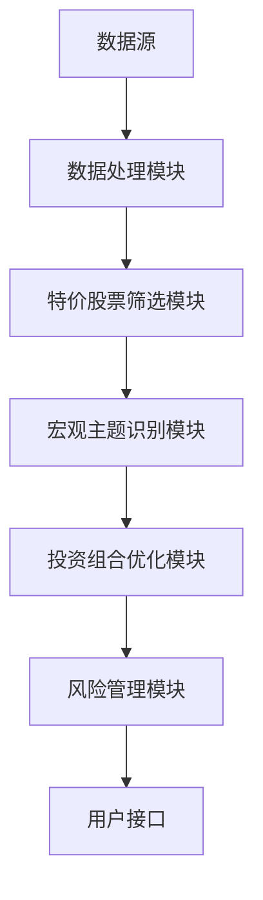

                 


# 如何利用特价股票策略构建全球宏观主题基金

> 关键词：特价股票策略, 宏观主题基金, 量化投资, 系统架构设计, 风险管理

> 摘要：本文将详细介绍如何利用特价股票策略构建全球宏观主题基金。首先，我们将解释特价股票策略和宏观主题基金的基本概念及其关系。接着，我们将深入探讨特价股票策略的算法原理，并展示如何将其应用于宏观主题基金的构建中。我们还将分析系统的架构设计、项目实战案例，并提供最佳实践建议。

---

## 第一部分: 特价股票策略与全球宏观主题基金概述

### 第1章: 特价股票策略与全球宏观主题基金概述

#### 1.1 特价股票策略的基本概念

##### 1.1.1 特价股票的定义
特价股票是指那些价格低于其内在价值，通常由于市场短期波动或市场情绪导致价格被低估的股票。这些股票往往具有较高的潜在回报率，吸引投资者关注。

##### 1.1.2 特价股票策略的核心特点
- **低估定价**：股票价格低于其真实价值。
- **价值回归**：市场往往会纠正低估，使股票价格回归合理水平。
- **长期投资**：投资者通常采取长期持有策略，等待价值回归。

##### 1.1.3 特价股票与普通股票的区别
| 属性       | 特价股票               | 普通股票               |
|------------|------------------------|------------------------|
| 价格       | 低于内在价值           | 反映市场情绪           |
| 投资逻辑   | 价值回归驱动           | 市场趋势或技术分析驱动 |
| 风险       | 较低                   | 较高                   |

#### 1.2 全球宏观主题基金的基本概念

##### 1.2.1 宏观主题基金的定义
宏观主题基金是基于全球经济趋势、政策变化或行业动态，投资于特定主题（如科技、能源、医疗等）的基金。其目标是通过捕捉宏观经济机会，实现超额收益。

##### 1.2.2 宏观主题基金的特点
- **主题驱动**：投资集中在特定主题或行业中。
- **全球化视角**：覆盖全球市场，寻找跨市场的投资机会。
- **灵活性高**：能够快速调整投资组合以适应市场变化。

##### 1.2.3 宏观主题基金与传统基金的区别
| 属性       | 宏观主题基金           | 传统基金               |
|------------|------------------------|------------------------|
| 投资策略   | 主题驱动               | 多样化投资             |
| 调整频率   | 高                    | 低                    |
| 风险       | 较高（主题集中）       | 较低（分散投资）        |

#### 1.3 特价股票策略与全球宏观主题基金的关系

##### 1.3.1 策略与基金的结合逻辑
特价股票策略可以作为宏观主题基金的一部分，通过投资于特定主题下的低估股票，实现基金的超额收益。

##### 1.3.2 特价股票策略在宏观主题基金中的应用
- **主题筛选**：选择具有增长潜力的主题，如人工智能、绿色能源等。
- **股票筛选**：在选定主题内，筛选出价格被低估的股票。
- **组合构建**：将多个低估股票组合成一个投资组合，分散风险。

##### 1.3.3 策略与基金的协同效应
通过结合特价股票策略和宏观主题基金，投资者可以在捕捉宏观经济机会的同时，利用低估股票的潜在回报，实现更高的收益。

---

## 第二部分: 特价股票策略的核心概念与联系

### 第2章: 特价股票策略的核心概念与联系

#### 2.1 特价股票策略的原理

##### 2.1.1 策略的基本原理
特价股票策略基于价值投资理念，通过识别价格低于内在价值的股票，进行长期投资，等待价值回归。

##### 2.1.2 策略的核心要素
- **内在价值计算**：通过基本面分析，估算股票的合理价格。
- **市场情绪分析**：识别市场恐慌或低估导致的价格偏差。
- **价值回归机制**：市场通常会纠正低估，使价格回归合理水平。

##### 2.1.3 策略的数学模型
$$ P_{\text{value}} = \frac{E}{\text{EPS}} \times \text{PE}_{\text{avg}} $$
其中，$P_{\text{value}}$ 是内在价值，$E$ 是净利润，$\text{EPS}$ 是每股收益，$\text{PE}_{\text{avg}}$ 是行业平均市盈率。

#### 2.2 全球宏观主题基金的构建逻辑

##### 2.2.1 宏观主题的识别与选择
- **宏观经济分析**：研究全球经济趋势、政策变化等，识别具有增长潜力的主题。
- **行业分析**：选择处于上升周期的行业，如人工智能、绿色能源等。

##### 2.2.2 宏观主题基金的构建方法
- **主题筛选**：根据宏观经济分析，选择具有增长潜力的主题。
- **股票筛选**：在选定主题内，筛选出基本面良好、估值合理的股票。
- **组合优化**：通过优化算法，构建风险调整后的最优投资组合。

##### 2.2.3 宏观主题基金的风险管理
- **分散投资**：通过投资多个主题和股票，降低组合风险。
- **风险对冲**：使用衍生工具对冲市场风险。

#### 2.3 特价股票策略与宏观主题基金的联系

##### 2.3.1 策略与基金的协同效应
- **收益增强**：通过投资低估股票，提升基金的潜在收益。
- **风险分散**：在特定主题内投资多个低估股票，降低组合风险。

##### 2.3.2 策略在基金构建中的具体应用
- **主题筛选**：选择具有增长潜力的主题。
- **股票筛选**：在选定主题内，筛选出价格被低估的股票。
- **组合构建**：将多个低估股票组合成一个投资组合，分散风险。

##### 2.3.3 策略与基金的长期收益分析
通过长期数据回测，证明特价股票策略在宏观主题基金中的应用能够带来超额收益。

---

## 第三部分: 特价股票策略的算法原理

### 第3章: 特价股票策略的算法原理

#### 3.1 特价股票策略的数学模型

##### 3.1.1 策略的数学表达式
$$ P_{\text{value}} = \frac{E}{\text{EPS}} \times \text{PE}_{\text{avg}} $$
其中，$P_{\text{value}}$ 是内在价值，$E$ 是净利润，$\text{EPS}$ 是每股收益，$\text{PE}_{\text{avg}}$ 是行业平均市盈率。

##### 3.1.2 策略的优化算法
- **多因子模型**：考虑多个因子（如市盈率、市净率等）进行股票筛选。
- **组合优化**：使用均值-方差优化算法，构建风险调整后的最优投资组合。

##### 3.1.3 策略的实现步骤
1. 数据收集：收集目标股票的基本面数据和市场数据。
2. 内在价值计算：使用多因子模型计算股票的内在价值。
3. 低估筛选：筛选出价格低于内在价值的股票。
4. 组合构建：使用优化算法构建投资组合。

#### 3.2 全球宏观主题基金的构建算法

##### 3.2.1 宏观主题的识别算法
- **宏观经济指标分析**：研究GDP、利率、通货膨胀等宏观经济指标。
- **行业趋势分析**：分析行业发展趋势，识别具有增长潜力的主题。

##### 3.2.2 宏观主题基金的优化算法
- **主题筛选**：根据宏观经济分析，选择具有增长潜力的主题。
- **股票筛选**：在选定主题内，筛选出基本面良好、估值合理的股票。
- **组合优化**：通过均值-方差优化算法，构建风险调整后的最优投资组合。

##### 3.2.3 宏观主题基金的风险控制算法
- **风险对冲**：使用衍生工具对冲市场风险。
- **风险分散**：通过投资多个主题和股票，降低组合风险。

#### 3.3 算法的实现与优化

##### 3.3.1 算法的实现步骤
1. 数据收集：收集目标股票的基本面数据和市场数据。
2. 内在价值计算：使用多因子模型计算股票的内在价值。
3. 低估筛选：筛选出价格低于内在价值的股票。
4. 组合构建：使用优化算法构建投资组合。

##### 3.3.2 算法的优化方法
- **因子筛选**：通过因子分析，筛选出对收益影响最大的因子。
- **组合优化**：通过均值-方差优化算法，构建风险调整后的最优投资组合。

##### 3.3.3 算法的性能分析
- **收益分析**：通过回测，分析策略的收益表现。
- **风险分析**：分析策略的风险水平，如波动率、最大回撤等。

---

## 第四部分: 全球宏观主题基金的系统分析与架构设计

### 第4章: 全球宏观主题基金的系统分析与架构设计

#### 4.1 系统分析

##### 4.1.1 系统目标
- 实现基于特价股票策略的全球宏观主题基金构建系统。

##### 4.1.2 系统功能需求
- 数据收集与处理
- 特价股票筛选
- 宏观主题识别
- 投资组合优化
- 风险管理

##### 4.1.3 系统边界与接口
- 数据接口：与数据源（如金融数据库）对接。
- 用户接口：提供用户查询和操作功能。

#### 4.2 系统架构设计

##### 4.2.1 系统架构图


##### 4.2.2 系统功能模块
- 数据处理模块：负责数据的清洗和预处理。
- 特价股票筛选模块：基于多因子模型筛选出低估股票。
- 宏观主题识别模块：基于宏观经济指标和行业趋势识别宏观主题。
- 投资组合优化模块：使用优化算法构建最优投资组合。
- 风险管理模块：对投资组合进行风险评估和对冲。

##### 4.2.3 系统交互流程
1. 数据处理模块接收数据源提供的数据。
2. 特价股票筛选模块基于多因子模型筛选出低估股票。
3. 宏观主题识别模块基于宏观经济指标和行业趋势识别宏观主题。
4. 投资组合优化模块使用优化算法构建最优投资组合。
5. 风险管理模块对投资组合进行风险评估和对冲。
6. 用户通过用户接口查询和操作投资组合。

#### 4.3 系统实现

##### 4.3.1 系统实现步骤
1. 数据处理模块：编写代码实现数据的清洗和预处理。
2. 特价股票筛选模块：编写代码实现多因子模型的计算。
3. 宏观主题识别模块：编写代码实现宏观经济指标和行业趋势的分析。
4. 投资组合优化模块：编写代码实现均值-方差优化算法。
5. 风险管理模块：编写代码实现风险评估和对冲。
6. 用户接口：编写代码实现用户查询和操作功能。

##### 4.3.2 系统实现代码示例
```python
import pandas as pd
import numpy as np
from sklearn.linear_model import LinearRegression

# 数据处理模块
def preprocess_data(data):
    # 数据清洗
    data = data.dropna()
    # 数据标准化
    data = (data - data.mean()) / data.std()
    return data

# 特价股票筛选模块
def screen_penny_stocks(data):
    # 计算内在价值
    data['intrinsic_value'] = data['profit'] / data['eps'] * data['pe_avg']
    # 筛选低估股票
    data = data[data['price'] < data['intrinsic_value']]
    return data

# 宏观主题识别模块
def identify_macro_theme(data):
    # 计算宏观经济指标
    macroeconomic_indicators = data[['gdp', 'inflation', 'interest_rate']]
    # 使用线性回归模型进行主题识别
    model = LinearRegression()
    model.fit(macroeconomic_indicators, data['theme'])
    return model.predict(macroeconomic_indicators)

# 投资组合优化模块
def optimize_portfolio(stocks, risk_free_rate):
    # 计算收益和风险
    returns = stocks.returns
    cov_matrix = stocks.covariance_matrix
    # 均值-方差优化
    mean_return = returns.mean()
    variance = np.diag(cov_matrix)
    # 构建最优组合
    weights = np.linalg.solve(variance, mean_return)
    weights = weights / sum(weights)
    return weights

# 风险管理模块
def manage_risk(weights, returns, volatility):
    # 计算风险价值
    VaR = np.percentile(returns, 5)
    # 风险对冲
    hedges = np.where(volatility > 0.1, 1, 0)
    return hedges
```

---

## 第五部分: 项目实战

### 第5章: 项目实战

#### 5.1 项目背景
本文将通过一个具体的案例，展示如何利用特价股票策略构建全球宏观主题基金。

#### 5.2 项目需求
- 数据收集：收集目标股票的基本面数据和市场数据。
- 特价股票筛选：基于多因子模型筛选出低估股票。
- 宏观主题识别：基于宏观经济指标和行业趋势识别宏观主题。
- 投资组合优化：使用优化算法构建最优投资组合。
- 风险管理：对投资组合进行风险评估和对冲。

#### 5.3 项目实施

##### 5.3.1 数据收集与预处理
- 数据源：选择可靠的金融数据库，如Yahoo Finance、Bloomberg等。
- 数据清洗：删除缺失值，处理异常值。
- 数据标准化：对数据进行标准化处理，确保数据的可比性。

##### 5.3.2 特价股票筛选
- 计算内在价值：使用多因子模型计算股票的内在价值。
- 筛选低估股票：筛选出价格低于内在价值的股票。

##### 5.3.3 宏观主题识别
- 宏观经济指标分析：研究GDP、通货膨胀、利率等宏观经济指标。
- 行业趋势分析：分析行业发展趋势，识别具有增长潜力的主题。

##### 5.3.4 投资组合优化
- 使用均值-方差优化算法，构建风险调整后的最优投资组合。
- 考虑交易成本和税收等因素，优化投资组合。

##### 5.3.5 风险管理
- 风险评估：计算投资组合的波动率、最大回撤等风险指标。
- 风险对冲：使用衍生工具对冲市场风险。

#### 5.4 项目结果分析

##### 5.4.1 收益分析
- 计算投资组合的收益率，与基准收益率进行比较。
- 分析策略的超额收益，验证策略的有效性。

##### 5.4.2 风险分析
- 计算投资组合的波动率、最大回撤等风险指标。
- 分析策略在不同市场条件下的风险表现。

##### 5.4.3 策略优化
- 根据回测结果，优化策略参数，如调整因子权重、优化组合构建算法等。
- 不断改进策略，提升策略的收益和风险表现。

---

## 第六部分: 最佳实践与小结

### 第6章: 最佳实践与小结

#### 6.1 最佳实践

##### 6.1.1 风险管理
- 定期监控投资组合的风险指标，及时调整投资组合。
- 使用衍生工具对冲市场风险，降低组合风险。

##### 6.1.2 数据源选择
- 选择可靠的数据源，确保数据的准确性和完整性。
- 定期更新数据源，保持数据的实时性。

##### 6.1.3 策略优化
- 根据市场变化，不断优化策略参数和组合构建算法。
- 定期进行策略回测，验证策略的有效性。

#### 6.2 小结
本文详细介绍了如何利用特价股票策略构建全球宏观主题基金。通过系统的架构设计和优化算法，我们可以有效地构建投资组合，实现超额收益。同时，通过风险管理，我们可以降低投资组合的风险，确保投资的长期稳定。

#### 6.3 展望
随着人工智能和大数据技术的发展，特价股票策略和宏观主题基金的投资将更加精准和高效。未来，我们可以通过引入更多的因子和更复杂的算法，进一步提升投资策略的收益和风险表现。

---

## 作者信息

作者：AI天才研究院/AI Genius Institute & 禅与计算机程序设计艺术/Zen And The Art of Computer Programming

---

通过以上思考步骤，我们可以系统地了解如何利用特价股票策略构建全球宏观主题基金。从基本概念到算法实现，再到系统设计和项目实战，本文为投资者提供了一个全面的指导。希望本文能帮助读者更好地理解并应用这些策略，实现投资目标。

