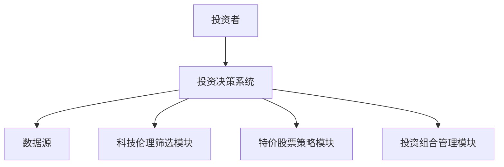
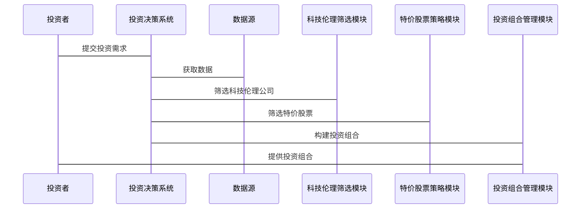

                 


# 如何利用特价股票策略构建未来科技伦理主题基金

## 关键词
- 特价股票
- 科技伦理
- 主题基金
- 投资策略
- 机器学习
- 风险管理
- 系统架构

## 摘要
本文详细探讨了如何利用特价股票策略构建一个专注于未来科技伦理的主题基金。通过分析科技伦理在投资中的重要性，结合特价股票策略的核心原理和算法，构建了一个基于科技伦理的股票筛选模型。同时，文章还提出了系统架构设计和风险管理策略，确保投资组合的稳健性。通过实际案例分析和代码实现，展示了如何在实践中应用这些策略，最终为投资者提供一个高效、可靠的科技伦理主题基金构建方案。

---

# 如何利用特价股票策略构建未来科技伦理主题基金

## 第1章：背景介绍

### 1.1 科技伦理的定义与重要性

科技伦理是指在科技发展过程中，人类行为必须遵循的道德规范和价值准则。随着科技的迅速发展，科技伦理的重要性日益凸显，尤其是在投资领域。投资者在选择科技公司时，需要考虑其是否符合伦理标准，例如数据隐私、环境保护、社会责任等方面。

#### 1.1.1 科技伦理的核心概念
科技伦理的核心在于平衡技术创新与社会责任。科技公司必须在追求利润的同时，确保其产品和服务不会对社会造成负面影响。例如，一家人工智能公司必须确保其算法不会导致偏见或歧视问题。

#### 1.1.2 科技伦理在投资中的应用
在投资领域，科技伦理的重要性体现在以下几个方面：
- **风险控制**：避免投资于可能导致社会问题的公司，降低投资风险。
- **长期价值**：符合科技伦理的公司更有可能获得长期成功，因为它们更注重社会责任和可持续发展。
- **品牌价值**：符合伦理标准的公司更容易获得消费者的信任和支持。

#### 1.1.3 科技伦理与股票投资的结合
科技伦理与股票投资的结合主要体现在以下几个方面：
- **筛选投资标的**：通过科技伦理标准筛选出符合条件的公司。
- **风险评估**：评估公司是否符合科技伦理标准，避免投资于存在伦理问题的公司。
- **长期收益**：通过投资于符合科技伦理的公司，获得长期稳定的收益。

### 1.2 特价股票策略的背景

#### 1.2.1 特价股票的定义
特价股票是指市场价格低于其内在价值的股票。这种股票通常被市场低估，具有较高的投资潜力。特价股票的核心在于“便宜”，即市场价格低于合理价值。

#### 1.2.2 特价股票策略的起源与发展
特价股票策略的起源可以追溯到价值投资理论。价值投资者认为，市场价格经常偏离内在价值，因此可以通过寻找被市场低估的股票来获得超额收益。格雷厄姆和巴菲特是价值投资的代表人物，他们的理论为特价股票策略奠定了基础。

#### 1.2.3 特价股票策略在科技伦理主题基金中的应用
在科技伦理主题基金中，特价股票策略的应用主要体现在以下几个方面：
- **筛选标的**：通过特价股票策略筛选出具有科技伦理标准的公司。
- **投资机会**：投资于符合科技伦理的特价股票，获得双重收益。
- **风险管理**：通过特价股票策略降低投资风险，同时确保投资符合伦理标准。

### 1.3 科技伦理主题基金的定义与特点

#### 1.3.1 科技伦理主题基金的定义
科技伦理主题基金是指以科技伦理为核心投资理念，专注于投资于符合科技伦理标准的公司或项目的基金。这类基金不仅关注公司的财务表现，还关注其社会责任和伦理标准。

#### 1.3.2 科技伦理主题基金的特点
- **主题明确**：科技伦理主题基金的投资范围明确，专注于科技伦理相关的公司。
- **长期投资**：科技伦理主题基金注重长期投资，关注公司的可持续发展能力。
- **风险管理**：科技伦理主题基金通过严格筛选投资标的，降低投资风险。

#### 1.3.3 科技伦理主题基金的优势与挑战
- **优势**：科技伦理主题基金具有较高的社会价值和长期收益潜力。
- **挑战**：科技伦理主题基金的投资范围有限，可能存在流动性风险。

---

## 第2章：特价股票策略与科技伦理主题基金的核心概念

### 2.1 特价股票策略的核心原理

#### 2.1.1 特价股票策略的原理
特价股票策略的核心原理是通过分析股票的内在价值，寻找市场价格低于内在价值的股票。这种方法通常用于价值投资，强调长期持有和价值回归。

#### 2.1.2 特价股票策略的数学模型
以下是特价股票策略的数学模型：

$$ V = \frac{E}{k} $$

其中：
- \( V \) 表示股票的内在价值
- \( E \) 表示公司的预期收益
- \( k \) 表示折现率

通过计算股票的内在价值，投资者可以判断股票是否被低估。

#### 2.1.3 特价股票策略与科技伦理的结合
将科技伦理标准融入特价股票策略，可以通过以下步骤实现：
1. 筛选符合科技伦理标准的公司。
2. 计算这些公司的内在价值。
3. 比较市场价格与内在价值，选择被低估的公司进行投资。

### 2.2 科技伦理主题基金的核心要素

#### 2.2.1 科技伦理主题基金的核心要素
- **投资理念**：以科技伦理为核心，筛选符合伦理标准的公司。
- **投资策略**：结合价值投资和科技伦理标准，选择具有长期增长潜力的公司。
- **风险管理**：通过严格筛选和分散投资，降低投资风险。

#### 2.2.2 科技伦理主题基金的筛选标准
- **行业地位**：公司是否在行业内具有领先地位。
- **财务状况**：公司的财务状况是否健康。
- **科技伦理标准**：公司是否符合科技伦理标准。

#### 2.2.3 科技伦理主题基金的优势与挑战
- **优势**：科技伦理主题基金具有较高的社会价值和长期收益潜力。
- **挑战**：科技伦理主题基金的投资范围有限，可能存在流动性风险。

### 2.3 特价股票策略与科技伦理主题基金的联系

#### 2.3.1 特价股票策略在科技伦理主题基金中的应用
- **筛选标的**：通过特价股票策略筛选出具有科技伦理标准的公司。
- **投资机会**：投资于符合科技伦理的特价股票，获得双重收益。
- **风险管理**：通过特价股票策略降低投资风险，同时确保投资符合伦理标准。

#### 2.3.2 科技伦理主题基金对特价股票策略的优化
- **筛选标准**：科技伦理主题基金通过引入科技伦理标准，优化了特价股票策略的筛选过程。
- **风险管理**：科技伦理主题基金通过严格筛选投资标的，降低了投资风险。

#### 2.3.3 特价股票策略与科技伦理主题基金的协同效应
- **协同效应**：通过将特价股票策略与科技伦理主题基金相结合，投资者可以在获得超额收益的同时，支持符合伦理标准的公司。

---

## 第3章：算法原理讲解

### 3.1 特价股票策略的算法模型

#### 3.1.1 特价股票策略的数学模型
以下是特价股票策略的数学模型：

$$ V = \frac{E}{k} $$

其中：
- \( V \) 表示股票的内在价值
- \( E \) 表示公司的预期收益
- \( k \) 表示折现率

通过计算股票的内在价值，投资者可以判断股票是否被低估。

#### 3.1.2 特价股票策略的算法流程
1. **数据收集**：收集目标公司的财务数据和市场数据。
2. **计算内在价值**：使用数学模型计算股票的内在价值。
3. **比较市场价格与内在价值**：判断股票是否被低估。
4. **筛选标的**：选择市场价格低于内在价值的股票进行投资。

#### 3.1.3 特价股票策略的优化方法
- **动态调整**：根据市场变化动态调整筛选标准。
- **多因子模型**：引入多个因子进行综合评估，提高筛选精度。

### 3.2 科技伦理主题基金的算法设计

#### 3.2.1 科技伦理主题基金的算法模型
以下是科技伦理主题基金的算法模型：

$$ S = \sum_{i=1}^{n} w_i x_i $$

其中：
- \( S \) 表示投资组合的评分
- \( w_i \) 表示第 \( i \) 个因子的权重
- \( x_i \) 表示第 \( i \) 个因子的评分

通过综合评估多个因子，投资者可以筛选出符合科技伦理标准的公司。

#### 3.2.2 科技伦理主题基金的算法流程
1. **数据收集**：收集目标公司的科技伦理相关数据。
2. **计算评分**：根据科技伦理标准对目标公司进行评分。
3. **筛选标的**：选择评分较高的公司进行投资。
4. **动态调整**：根据市场变化动态调整投资组合。

#### 3.2.3 科技伦理主题基金的优化方法
- **多因子模型**：引入多个因子进行综合评估，提高筛选精度。
- **动态调整**：根据市场变化动态调整投资组合。

---

## 第4章：系统分析与架构设计方案

### 4.1 系统分析

#### 4.1.1 问题场景介绍
投资者希望通过构建一个科技伦理主题基金，利用特价股票策略筛选出符合科技伦理标准的公司，实现长期稳定的收益。

#### 4.1.2 项目介绍
本项目旨在构建一个科技伦理主题基金，利用特价股票策略筛选出符合科技伦理标准的公司，实现长期稳定的收益。

### 4.2 系统架构设计

#### 4.2.1 系统架构图
以下是系统架构图的Mermaid代码：



#### 4.2.2 功能模块设计
- **数据源**：提供目标公司的财务数据和科技伦理相关数据。
- **科技伦理筛选模块**：根据科技伦理标准筛选出符合条件的公司。
- **特价股票策略模块**：根据特价股票策略筛选出被低估的公司。
- **投资组合管理模块**：根据筛选结果构建投资组合，并进行动态调整。

#### 4.2.3 接口设计
- **数据接口**：提供数据获取和处理接口。
- **筛选接口**：提供科技伦理筛选和特价股票策略筛选接口。
- **管理接口**：提供投资组合管理接口。

#### 4.2.4 交互流程图
以下是交互流程图的Mermaid代码：



---

## 第5章：项目实战

### 5.1 环境安装

#### 5.1.1 数据源安装
- **数据获取工具**：使用Python的`pandas`和`requests`库获取数据。
- **数据存储工具**：使用`pandas`进行数据处理和存储。

#### 5.1.2 系统核心实现
- **科技伦理筛选模块**：使用`pandas`进行数据处理，使用`scikit-learn`进行机器学习模型训练。
- **特价股票策略模块**：使用`pandas`进行数据处理，使用`numpy`进行数学计算。

### 5.2 核心代码实现

#### 5.2.1 科技伦理筛选模块的代码实现
以下是科技伦理筛选模块的Python代码：

```python
import pandas as pd

def screen_ethical_company(data):
    # 数据预处理
    data = data.dropna()
    data = data[ data['伦理评分'] > 0.8 ]
    return data
```

#### 5.2.2 特价股票策略模块的代码实现
以下是特价股票策略模块的Python代码：

```python
import pandas as pd
import numpy as np

def calculate_intrinsic_value(data):
    # 计算内在价值
    data['内在价值'] = data['预期收益'] / data['折现率']
    # 筛选被低估的股票
    data = data[ data['市场价格'] < data['内在价值'] ]
    return data
```

### 5.3 案例分析

#### 5.3.1 数据来源与处理
假设我们从公开数据源获取科技公司的数据，包括财务数据和科技伦理相关数据。

#### 5.3.2 筛选过程
1. **科技伦理筛选**：筛选出伦理评分高于0.8的公司。
2. **特价股票筛选**：计算这些公司的内在价值，筛选出市场价格低于内在价值的公司。

#### 5.3.3 投资组合构建
根据筛选结果构建投资组合，并进行动态调整。

### 5.4 项目总结

#### 5.4.1 项目成果
- **筛选出符合科技伦理标准的公司**。
- **筛选出被低估的股票**。
- **构建投资组合并进行动态调整**。

#### 5.4.2 项目经验
- **数据处理**：数据预处理是关键，需要仔细清洗和筛选。
- **模型优化**：需要不断优化模型，提高筛选精度。
- **风险管理**：需要严格控制风险，确保投资组合的稳健性。

---

## 第6章：最佳实践与小结

### 6.1 最佳实践

#### 6.1.1 投资策略
- **分散投资**：避免过度集中，降低风险。
- **长期投资**：注重长期收益，避免短期波动。

#### 6.1.2 风险管理
- **严格筛选**：确保投资标的符合科技伦理标准。
- **动态调整**：根据市场变化及时调整投资组合。

### 6.2 小结

通过本文的探讨，我们可以得出以下结论：
- **科技伦理主题基金**：以科技伦理为核心，筛选符合伦理标准的公司。
- **特价股票策略**：通过寻找被低估的股票，实现超额收益。
- **系统架构设计**：构建高效的系统架构，确保投资决策的科学性和准确性。

---

## 附录

### 附录A：数据源推荐

- **公开数据源**：Yahoo Finance、Google Finance、Bloomberg等。
- **API接口**：使用API获取实时数据，例如`alpha-vantage`。

### 附录B：工具推荐

- **数据分析工具**：Python的`pandas`、`numpy`、`scikit-learn`。
- **可视化工具**：Matplotlib、Seaborn。
- **机器学习框架**：TensorFlow、PyTorch。

### 附录C：参考文献

- 格雷厄姆，本杰明. 《证券分析》
- 巴菲特，沃伦. 《巴菲特致股东的信》
- 弗里德曼，米尔顿. 《资本主义与自由》

---

## 作者

作者：AI天才研究院/AI Genius Institute & 禅与计算机程序设计艺术/Zen And The Art of Computer Programming

