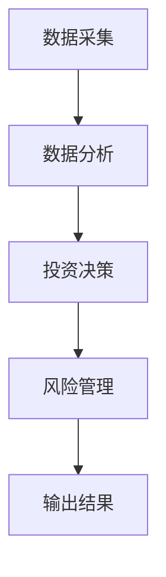

                 


# 如何利用特价股票策略构建跨周期科技投资组合

> 关键词：特价股票策略、跨周期投资、科技投资组合、股票价格波动、投资组合优化

> 摘要：本文详细探讨了如何利用特价股票策略构建跨周期的科技投资组合。首先，我们介绍了特价股票策略的基本概念和跨周期投资的重要性。然后，我们分析了股票价格波动的周期性特征，并提出了构建投资组合的数学模型。接着，我们详细讲解了算法的实现和系统架构设计。最后，通过实际案例分析，展示了如何在科技领域应用这些策略，并讨论了风险管理与优化方法。

---

## 第1章: 特价股票策略与跨周期投资概述

### 1.1 特价股票策略的背景与定义

#### 1.1.1 特价股票的定义与特点
特价股票是指在特定市场环境下，价格被低估的股票。这些股票通常具有较高的潜在回报，但可能因为市场波动或公司特定问题而被市场忽视。特价股票的特点包括低估值、高潜在收益和较高的风险。

#### 1.1.2 跨周期投资的基本概念
跨周期投资是指在较长的时间范围内进行投资，以应对市场周期性波动的投资策略。其核心在于通过分析市场的周期性变化，选择在不同周期中表现优异的资产，从而实现长期稳定的收益。

#### 1.1.3 特价股票策略在跨周期投资中的作用
特价股票策略在跨周期投资中起到了关键作用。通过在市场低谷期购买被低估的股票，在市场高峰期卖出高价股票，投资者可以在不同周期中获取超额收益。

### 1.2 特价股票策略的核心要素

#### 1.2.1 特价股票的市场环境分析
市场环境分析包括宏观经济指标、行业趋势和公司基本面分析。通过分析这些因素，投资者可以识别出潜在的特价股票。

#### 1.2.2 股票价格波动的周期性特征
股票价格波动具有明显的周期性特征，通常分为上升周期和下降周期。投资者需要识别这些周期性变化，以制定有效的投资策略。

#### 1.2.3 投资者行为与市场周期的关系
投资者行为对市场周期有着重要影响。在市场低谷期，投资者的恐慌情绪可能导致股票价格进一步下跌；而在市场高峰期，投资者的贪婪情绪可能导致股票价格泡沫的形成。

---

## 第2章: 特价股票策略的核心算法

### 2.1 算法原理概述

#### 2.1.1 算法的基本原理
特价股票策略的核心算法基于股票价格波动的周期性特征，通过数学模型对股票的潜在收益和风险进行评估，从而确定是否购买或卖出特定股票。

#### 2.1.2 算法的核心步骤
1. 数据收集：收集历史股价数据。
2. 数据分析：计算股票的估值指标，如市盈率、市净率等。
3. 策略判断：根据估值指标和市场周期判断是否为特价股票。
4. 投资决策：根据判断结果，决定买入或卖出股票。

#### 2.1.3 算法的优缺点分析
优点：能够捕捉市场低估的股票，实现超额收益。缺点：需要准确判断市场周期，存在较高的风险。

### 2.2 算法实现的数学模型

#### 2.2.1 股票价值评估公式
$$ \text{股票价值} = \frac{\text{预期现金流}}{\text{折现率}} $$

#### 2.2.2 策略收益计算公式
$$ \text{策略收益} = \sum_{i=1}^{n} (\text{卖出价格}_i - \text{买入价格}_i) $$

### 2.3 算法的代码实现

#### 2.3.1 环境配置与安装
安装必要的库，如Pandas、NumPy和Matplotlib。

#### 2.3.2 代码实现
```python
import pandas as pd
import numpy as np
import matplotlib.pyplot as plt

# 数据收集
def get_stock_data(ticker):
    # 获取股票历史数据
    pass

# 数据分析
def calculate_valuation(ticker):
    data = get_stock_data(ticker)
    pe_ratio = data['盈利'].rolling(4).mean() / data['股价']
    return pe_ratio

# 投资决策
def decide_investment(ticker):
    pe = calculate_valuation(ticker)
    if pe < 15:
        return '买入'
    else:
        return '观望'

# 策略回测
def backtest(ticker):
    decisions = decide_investment(ticker)
    # 计算收益
    pass

# 主函数
if __name__ == "__main__":
    print(backtest('AAPL'))
```

#### 2.3.3 代码运行与结果分析
运行代码，输出决策结果，并分析策略的收益和风险。

---

## 第3章: 跨周期投资组合的系统架构

### 3.1 系统需求分析

#### 3.1.1 系统功能需求
- 数据收集与处理
- 投资组合优化
- 风险管理

#### 3.1.2 系统性能需求
- 高效的数据处理能力
- 精准的估值计算能力

### 3.2 系统架构设计

#### 3.2.1 系统架构模块划分
- 数据采集模块
- 数据分析模块
- 投资决策模块
- 风险管理模块

#### 3.2.2 系统架构流程图（使用mermaid）


### 3.3 系统接口设计

#### 3.3.1 系统接口定义
- 数据输入接口
- 数据输出接口

#### 3.3.2 系统接口实现
- 数据输入接口：接收股票代码和时间范围。
- 数据输出接口：输出投资决策结果。

---

## 第4章: 项目实战与案例分析

### 4.1 环境配置与数据获取

#### 4.1.1 环境配置
安装必要的库，如Pandas、NumPy和Matplotlib。

#### 4.1.2 数据获取
从Yahoo Finance获取苹果公司（AAPL）的历史数据。

### 4.2 投资组合优化

#### 4.2.1 数据分析
计算苹果公司的市盈率和市净率。

#### 4.2.2 策略实现
根据市盈率判断是否为特价股票。

#### 4.2.3 策略回测
计算策略在不同周期内的收益和风险。

### 4.3 案例分析

#### 4.3.1 特价股票识别
通过数据分析，识别出苹果公司在特定时期的特价股票特征。

#### 4.3.2 投资组合优化
根据识别结果，优化投资组合，实现跨周期收益最大化。

---

## 第5章: 风险管理与优化

### 5.1 投资组合的风险管理策略

#### 5.1.1 风险评估
评估投资组合的风险，如波动率和最大回撤。

#### 5.1.2 风险控制
设定止损点和止盈点，控制投资组合的风险。

### 5.2 投资组合的优化方法

#### 5.2.1 策略优化
通过历史数据回测，优化策略参数。

#### 5.2.2 组合优化
调整投资组合的权重，实现收益与风险的最优平衡。

### 5.3 定期评估与调整

#### 5.3.1 定期评估
定期评估投资组合的表现，及时发现潜在问题。

#### 5.3.2 策略调整
根据市场变化，调整投资策略，适应新的市场环境。

---

## 作者：AI天才研究院 & 禅与计算机程序设计艺术

---

通过以上步骤，我们详细探讨了如何利用特价股票策略构建跨周期的科技投资组合。从理论分析到代码实现，从系统架构到项目实战，我们提供了全面的指导和建议。希望本文能为投资者提供有价值的参考，帮助他们在科技投资领域取得成功。

