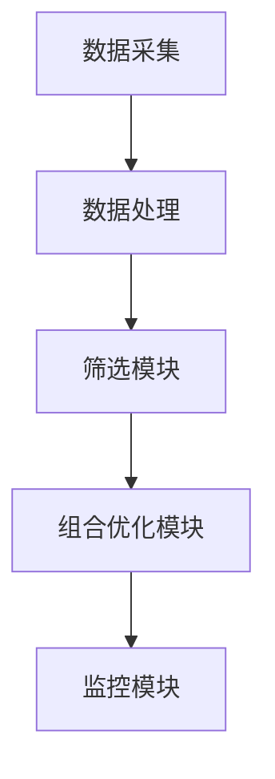
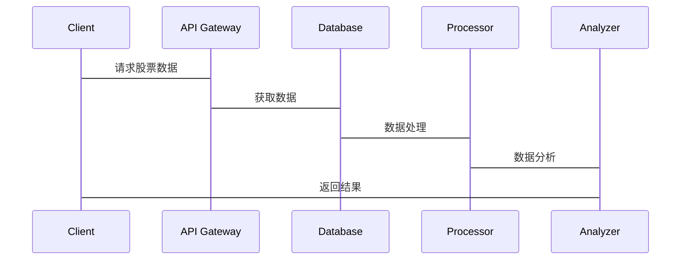

                 


# 如何利用特价股票策略构建长期价值投资组合

> **关键词**：特价股票、价值投资、投资组合、数学模型、系统架构  
> **摘要**：本文详细探讨了如何利用特价股票策略构建长期价值投资组合，从背景介绍、核心概念、算法原理、数学模型、系统架构到实战项目，全面分析了特价股票投资的策略和方法，帮助读者系统性地理解和实践长期价值投资。

---

## 第一部分: 特价股票与价值投资概述

### 第1章: 特价股票的基本概念

#### 1.1 特价股票的定义与特征

##### 1.1.1 什么是特价股票
特价股票是指在特定市场环境下，价格被低估的股票。这些股票通常具有较高的安全边际，适合长期价值投资者。特价股票的特征包括低市盈率（P/E）、低市净率（P/B）和高股息率。

##### 1.1.2 特价股票的市场特征
特价股票往往出现在市场低迷时期，投资者情绪低落，市场对公司的未来盈利能力持怀疑态度。此时，股票价格被市场低估，为价值投资者提供了介入的机会。

##### 1.1.3 特价股票与普通股票的区别
| 特性       | 特价股票                   | 普通股票                   |
|------------|----------------------------|-----------------------------|
| 价格       | 低于内在价值               | 接近或高于内在价值         |
| 市盈率     | 低于市场平均水平           | 接近或高于市场平均水平     |
| 股息率     | 高                        | 中等或低                   |
| 市场情绪   | 悲观或恐慌                | 中性或乐观                 |

##### 1.1.4 特价股票的优势
- **高安全边际**：价格低于内在价值，降低投资风险。
- **潜在回报高**：长期来看，价格回归内在价值的可能性较大。
- **逆向投资机会**：市场恐慌时买入，市场乐观时卖出。

#### 1.2 价值投资的基本原理

##### 1.2.1 价值投资的定义
价值投资是一种投资策略，强调以低于内在价值的价格买入优质资产，等待价格回归内在价值时卖出。

##### 1.2.2 价值投资的核心理念
- **安全边际**：买入价格远低于内在价值的资产。
- **长期持有**：耐心等待价格回归。
- **关注基本面**：选择财务健康、管理优秀的企业。

##### 1.2.3 价值投资与短期投机的对比

| 特性       | 价值投资                  | 短期投机                  |
|------------|---------------------------|---------------------------|
| 时间框架   | 长期（数年）               | 短期（数周或数月）         |
| 关注点     | 公司基本面、内在价值       | 市场情绪、技术指标         |
| 风险承受   | 低风险                   | 高风险                   |
| 收益来源   | 价值回归                  | 价格波动                 |

#### 1.3 特价股票在价值投资中的地位

##### 1.3.1 特价股票作为价值投资工具的优势
- **高性价比**：价格低于内在价值，提供较高的安全边际。
- **长期回报潜力**：优质公司在市场低迷时被低估，长期来看具有较高的回报潜力。

##### 1.3.2 特价股票市场的周期性特征
特价股票市场的周期性与整体市场密切相关，通常在市场低谷时出现较多特价股票，而在市场高点时，特价股票数量减少。

##### 1.3.3 特价股票投资的风险与收益平衡
- **风险**：市场长期低迷、公司基本面恶化。
- **收益**：价格回归内在价值带来的资本增值和股息收益。

### 第2章: 特价股票投资的背景与现状

#### 2.1 特价股票市场的历史发展

##### 2.1.1 特价股票市场的起源
特价股票市场的起源可以追溯到19世纪末和20世纪初，当时市场波动剧烈，许多投资者开始寻找低估的股票进行投资。

##### 2.1.2 特价股票市场的演变
随着金融市场的成熟，特价股票市场的参与者逐渐增多，投资策略也从简单的低价买入发展为基于基本面分析的系统化投资。

##### 2.1.3 特价股票市场的现状
当前，特价股票市场仍然是价值投资者的重要投资领域，尤其是在全球经济波动和市场低迷时期，特价股票往往表现出色。

#### 2.2 价值投资在特价股票中的应用

##### 2.2.1 价值投资的起源与发展
价值投资的起源可以追溯到本杰明·格雷厄姆和戴维·多德，他们提出了“安全边际”和“内在价值”的概念，为价值投资奠定了理论基础。

##### 2.2.2 价值投资在特价股票市场的成功案例
许多知名的价值投资者如巴菲特、彼得·林奇等，都通过投资特价股票取得了长期稳定的回报。

##### 2.2.3 价值投资在现代市场中的适应性
尽管金融市场环境不断变化，价值投资的基本原理仍然适用，但需要根据市场环境进行调整。

#### 2.3 特价股票投资的现状与趋势

##### 2.3.1 特价股票市场的当前状况
当前，市场波动加剧，全球经济不确定性增加，为特价股票投资提供了更多机会。

##### 2.3.2 价值投资策略的演变
随着市场的变化，价值投资策略也在不断优化，例如引入量化分析和大数据技术。

##### 2.3.3 特价股票投资的未来趋势
未来，价值投资将更加依赖于技术手段，如大数据分析和人工智能，以提高投资效率和准确性。

---

## 第二部分: 特价股票投资的核心策略

### 第3章: 特价股票筛选的数学模型

#### 3.1 特价股票筛选的核心指标

##### 3.1.1 市盈率（P/E）
市盈率是股票价格除以每股收益（EPS），用于衡量股票的估值。低市盈率通常意味着股票价格被低估。

##### 3.1.2 市净率（P/B）
市净率是股票价格除以每股净资产，用于衡量股票相对于其账面价值的高低。低市净率通常意味着股票价格被低估。

##### 3.1.3 股息率（Dividend Yield）
股息率是每股股息除以股票价格，用于衡量股票的分红回报。高股息率通常意味着股票具有较高的分红潜力。

##### 3.1.4 其他指标
- 市销率（P/S）
- 股东权益收益率（ROE）
- 资产负债率

#### 3.2 基于多指标的股票筛选模型

##### 3.2.1 指标权重的确定
为了构建综合评分模型，需要对各项指标赋予不同的权重。通常，市盈率和市净率权重较大，股息率权重次之。

##### 3.2.2 多指标综合评价模型
综合评分公式：
$$ \text{综合评分} = w_1 \times \text{市盈率} + w_2 \times \text{市净率} + w_3 \times \text{股息率} $$

##### 3.2.3 模型的优缺点分析
- **优点**：综合考虑多个指标，避免单一指标的局限性。
- **缺点**：权重的确定具有主观性，可能影响评分结果。

#### 3.3 数学模型的实现

##### 3.3.1 模型公式
$$ \text{综合评分} = 0.4 \times \text{市盈率} + 0.3 \times \text{市净率} + 0.3 \times \text{股息率} $$

##### 3.3.2 模型的实现步骤
1. 收集目标股票的市盈率、市净率和股息率数据。
2. 计算每只股票的综合评分。
3. 根据评分排序，选择评分最高的股票作为投资标的。

##### 3.3.3 模型的优化与调整
- 定期更新权重，根据市场变化调整指标的重要性。
- 增加更多指标，如ROE和负债率，以提高模型的准确性。

### 第4章: 特价股票组合构建的算法原理

#### 4.1 组合构建的基本原理

##### 4.1.1 组合构建的目标
构建一个包含多只特价股票的投资组合，以分散风险并最大化收益。

##### 4.1.2 组合构建的约束条件
- 投资组合的总风险在可接受范围内。
- 符合投资者的财务目标和风险承受能力。

##### 4.1.3 组合构建的优化方法
使用均值-方差模型优化投资组合，使风险最小化，同时最大化预期收益。

#### 4.2 基于均值-方差模型的组合优化

##### 4.2.1 均值-方差模型的数学公式
$$ \text{Minimize } \sigma^2 $$
$$ \text{Subject to } \sum_{i=1}^{n} w_i = 1 $$
$$ \text{和 } w_i \geq 0 \text{ 对所有 } i $$

其中，\( \sigma^2 \) 是投资组合的方差，\( w_i \) 是第 \( i \) 只股票的权重。

##### 4.2.2 组合优化的实现步骤
1. 收集目标股票的历史收益率数据。
2. 计算每只股票的预期收益率和方差。
3. 构建协方差矩阵。
4. 使用优化算法求解最优权重。

##### 4.2.3 优化结果的解读
- **权重分配**：每只股票在组合中的权重。
- **预期收益**：投资组合的预期收益率。
- **风险**：投资组合的风险，以方差或标准差衡量。

#### 4.3 组合优化的实现

##### 4.3.1 Python代码实现
```python
import numpy as np
from scipy.optimize import minimize

# 示例数据：每只股票的预期收益率和方差
returns = [0.1, 0.12, 0.08]
variances = [0.05, 0.06, 0.04]

# 构建协方差矩阵
cov_matrix = np.array([[0.05, 0.02, 0.01],
                        [0.02, 0.06, 0.03],
                        [0.01, 0.03, 0.04]])

# 定义优化目标函数
def portfolio_var(weights):
    return np.dot(weights.T, np.dot(cov_matrix, weights))

# 定义约束条件
cons = ({'type': 'eq', 'fun': lambda w: sum(w) - 1})

# 求解优化问题
result = minimize(portfolio_var, np.array([1/3, 1/3, 1/3]), constraints=cons)

# 输出结果
print("最优权重:", result.x)
print("最小方差:", result.fun)
```

##### 4.3.2 优化结果的解读
- **最优权重**：每只股票在组合中的权重。
- **最小方差**：投资组合的风险最小化。

---

## 第三部分: 特价股票投资系统的架构设计

### 第5章: 系统分析与架构设计

#### 5.1 系统功能设计

##### 5.1.1 系统功能模块
- 数据采集模块：采集股票数据。
- 筛选模块：根据指标筛选特价股票。
- 组合优化模块：构建投资组合。
- 监控模块：实时监控投资组合表现。

##### 5.1.2 功能流程图


#### 5.2 系统架构设计

##### 5.2.1 系统架构图
```mermaid
graph LR
    Client --> API Gateway
    API Gateway --> Database
    Database --> Processor
    Processor --> Analyzer
```

##### 5.2.2 系统交互图


---

## 第四部分: 项目实战

### 第6章: 特价股票投资组合实战

#### 6.1 项目环境安装

##### 6.1.1 Python环境安装
- 安装Python 3.8及以上版本。
- 安装必要的库：numpy、pandas、scipy、matplotlib。

##### 6.1.2 数据源获取
- 使用Yahoo Finance API获取股票数据。

#### 6.2 系统核心实现

##### 6.2.1 数据采集模块
```python
import yfinance as yf

# 下载股票数据
def download_data(tickers):
    data = {}
    for ticker in tickers:
        df = yf.download(ticker, start='2020-01-01', end='2023-12-31')
        data[ticker] = df['Close']
    return data

tickers = ['AAPL', 'MSFT', 'GOOGL']
data = download_data(tickers)
```

##### 6.2.2 筛选模块
```python
import pandas as pd

# 计算市盈率和市净率
def calculate_valuation_ratios(data):
    df = pd.DataFrame(data)
    df['PE'] = df['Close'] / df['EPS']
    df['PB'] = df['Close'] / df['Book Value per Share']
    df['Dividend Yield'] = df['Dividends'] / df['Close']
    return df

# 筛选低价股票
def screen_stocks(df, threshold=0.8):
    return df[df['PE'] < threshold]
```

##### 6.2.3 组合优化模块
```python
import numpy as np
from scipy.optimize import minimize

def optimize_portfolio(weights, cov_matrix):
    return minimize(np.dot(weights.T, np.dot(cov_matrix, weights)), weights, 
                    constraints={'type': 'eq', 'fun': lambda w: sum(w) - 1})

# 示例优化
tickers = ['AAPL', 'MSFT', 'GOOGL']
cov_matrix = np.array([[0.05, 0.02, 0.01],
                       [0.02, 0.06, 0.03],
                       [0.01, 0.03, 0.04]])

weights = np.array([1/3, 1/3, 1/3])
result = optimize_portfolio(weights, cov_matrix)
print("最优权重:", result.x)
```

##### 6.2.4 监控模块
```python
import matplotlib.pyplot as plt

def plot_portfolio_performance(weights, returns):
    portfolio_return = np.dot(weights.T, returns)
    print(f"投资组合预期收益率：{portfolio_return:.2f}%")

    plt.figure(figsize=(10,6))
    plt.bar(range(len(weights)), weights, tick_label=tickers)
    plt.title('投资组合权重')
    plt.show()

returns = [0.1, 0.12, 0.08]
plot_portfolio_performance(result.x, returns)
```

#### 6.3 案例分析与总结

##### 6.3.1 实战案例分析
- 数据采集：获取目标股票的历史数据。
- 筛选：根据市盈率和市净率筛选出符合条件的股票。
- 组合优化：构建最优投资组合，最小化风险，最大化收益。
- 监控：定期监控投资组合的表现，根据市场变化进行调整。

##### 6.3.2 实战总结
- **优势**：通过系统化的方法筛选和优化投资组合，降低投资风险，提高收益。
- **挑战**：需要持续监控市场变化，及时调整投资组合。
- **建议**：定期审查和优化投资组合，确保其符合投资目标。

---

## 第五部分: 总结与展望

### 第7章: 总结与展望

#### 7.1 总结
本文详细探讨了如何利用特价股票策略构建长期价值投资组合，从理论分析到实际操作，全面介绍了特价股票投资的策略和方法。通过系统化的方法和数学模型，投资者可以更有效地筛选和优化投资组合，实现长期稳定的收益。

#### 7.2 展望
未来，随着技术的进步，价值投资将更加依赖于大数据和人工智能。投资者可以利用先进的技术手段，如机器学习算法，进一步优化投资组合，提高投资效率和准确性。

---

**作者：AI天才研究院/AI Genius Institute & 禅与计算机程序设计艺术/Zen And The Art of Computer Programming**

