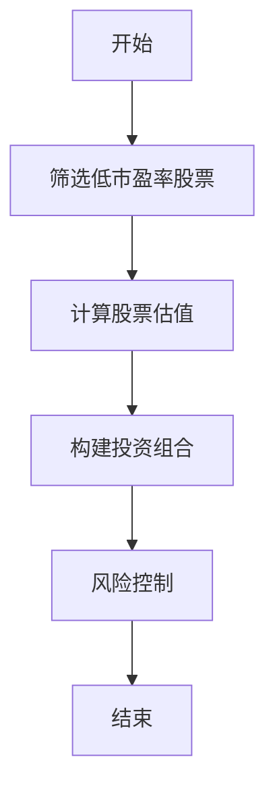
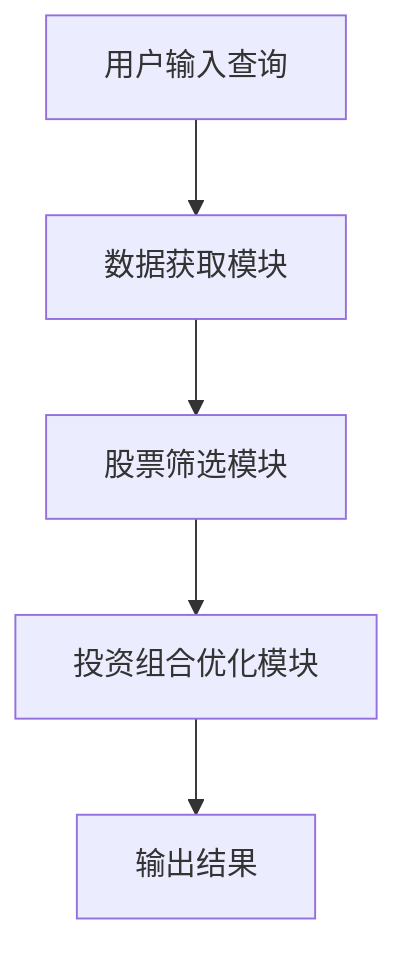
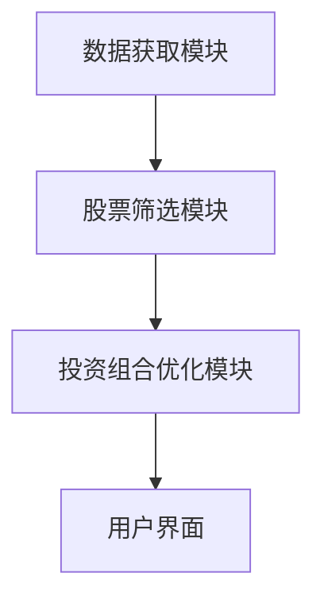
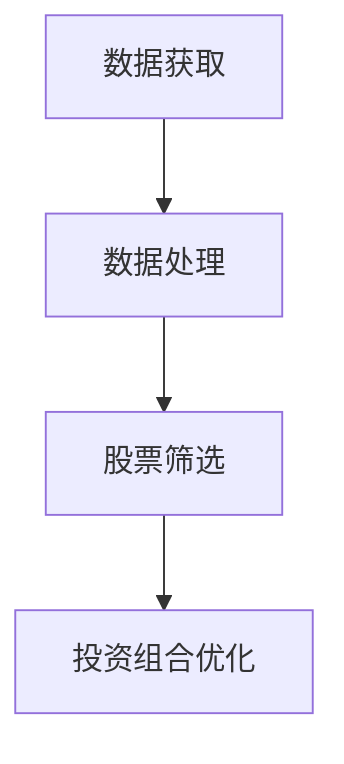

                 


# 如何利用特价股票策略构建长期增值组合

> 关键词：特价股票，投资策略，股票分析，风险管理，长期增值，Python代码

> 摘要：本文详细介绍了如何利用特价股票策略构建长期增值的投资组合。通过分析特价股票的定义、策略的算法原理、系统架构设计以及项目实战，为读者提供了从理论到实践的全面指导。文章结合数学模型、Mermaid图表和Python代码，深入剖析了特价股票策略的核心概念和应用场景，帮助读者在股票投资中实现长期增值。

---

## 第一部分：特价股票策略的背景与核心概念

### 第1章：特价股票策略的背景与问题背景

#### 1.1 特价股票策略的背景介绍
特价股票是指在特定市场条件下价格被低估的股票，通常具有较高的潜在增值空间。投资者通过识别这些股票，可以在长期持有中获得超额收益。

##### 1.1.1 什么是特价股票
特价股票是指那些价格低于其内在价值的股票。这些股票可能因为市场波动、公司暂时困境或其他因素而被低估。识别这些股票并进行投资，是实现长期增值的重要策略。

##### 1.1.2 特价股票的市场背景
在全球金融市场中，特价股票的出现通常是市场波动的结果。投资者在市场低迷时期或特定行业低迷时期，可以找到这些被低估的股票。通过长期持有，投资者可以在市场回升时获得收益。

##### 1.1.3 特价股票策略的定义与特点
特价股票策略是一种基于价值投资的策略，旨在通过识别被低估的股票进行长期投资。其特点包括低买高卖、长期持有、风险较低等。

#### 1.2 问题背景与问题描述
投资者在股票市场中面临诸多挑战，包括市场波动、信息不对称、投资策略的选择等。特价股票策略的核心问题是如何识别被低估的股票，并制定有效的投资计划。

##### 1.2.1 投资者面临的市场挑战
投资者在股票市场中需要应对市场波动、信息不对称、短期市场情绪等挑战。这些因素可能导致投资决策失误。

##### 1.2.2 特价股票策略的核心问题
如何识别被低估的股票，制定有效的投资计划，并在市场波动中保持稳定收益，是特价股票策略的核心问题。

##### 1.2.3 特价股票策略的目标与边界
特价股票策略的目标是通过长期持有被低估的股票，实现资产的长期增值。其边界包括市场风险、流动性风险和公司基本面变化等。

---

### 第2章：特价股票策略的核心概念与联系

#### 2.1 特价股票策略的核心概念
特价股票策略的核心概念包括股票估值、市场分析、投资组合优化等。

##### 2.1.1 特价股票的定义与分类
特价股票可以根据市盈率、市净率等指标进行分类。常见的分类包括低市盈率股票、低市净率股票等。

##### 2.1.2 特价股票策略的原理与机制
特价股票策略的原理是基于价值投资，通过识别被低估的股票进行投资。其机制包括股票筛选、投资组合构建、风险控制等。

##### 2.1.3 特价股票策略与其他投资策略的对比
与其他投资策略相比，特价股票策略具有低风险、长期持有等特点，适合风险偏好较低的投资者。

#### 2.2 特价股票策略的核心要素与属性
特价股票策略的核心要素包括股票筛选标准、投资组合优化、风险控制等。

##### 2.2.1 特价股票的属性特征对比表格
| 特性         | 高市盈率股票 | 低市盈率股票 |
|--------------|--------------|--------------|
| 市盈率（PE）  | 高            | 低            |
| 市净率（PB）  | 高            | 低            |
| 股息率        | 低            | 高            |
| 估值准确性    | 低            | 高            |

##### 2.2.2 特价股票策略的ER实体关系图
```mermaid
er
  entity 特价股票 {
    id
    股票代码
    市盈率
    市净率
    股息率
    估值
  }
```

---

### 第3章：特价股票策略的算法原理与数学模型

#### 3.1 特价股票策略的算法原理
特价股票策略的算法原理包括股票筛选、投资组合优化、风险控制等步骤。

##### 3.1.1 特价股票策略的算法流程


##### 3.1.2 特价股票策略的数学模型
特价股票的估值可以通过市盈率（PE）和市净率（PB）等指标进行计算。公式如下：

$$ PE = \frac{股价}{每股收益} $$

$$ PB = \frac{股价}{每股净资产} $$

##### 3.1.3 特价股票策略的公式推导
通过比较股票的市盈率和市净率，可以识别出被低估的股票。公式推导如下：

$$ 低估股票 = PE < 市场平均PE \land PB < 市场平均PB $$

---

#### 3.2 特价股票策略的数学模型与公式
##### 3.2.1 特价股票策略的数学表达式
$$ 投资收益 = \sum_{i=1}^{n} (股价_i - 成本价_i) $$

##### 3.2.2 特价股票策略的数学公式
$$ 投资组合收益 = \sum_{i=1}^{n} (r_i) $$

##### 3.2.3 特价股票策略的数学模型示例
假设我们有三只股票，其市盈率分别为15、20、25，市场平均市盈率为18。我们可以识别出市盈率低于市场平均的股票作为特价股票。

---

### 第4章：系统分析与架构设计方案

#### 4.1 系统分析与设计
##### 4.1.1 系统功能设计
系统需要实现股票数据获取、股票筛选、投资组合优化等功能。

##### 4.1.2 系统架构设计
系统架构包括数据获取模块、股票筛选模块、投资组合优化模块等。

##### 4.1.3 系统接口设计
系统需要与股票数据源接口、用户界面接口等进行交互。

#### 4.2 系统交互与流程图
##### 4.2.1 系统交互流程图


##### 4.2.2 系统架构图


##### 4.2.3 系统功能模块图


---

### 第5章：项目实战与应用案例

#### 5.1 项目环境与工具安装
##### 5.1.1 系统环境配置
建议使用Python 3.8及以上版本。

##### 5.1.2 开发工具安装
安装Anaconda、Jupyter Notebook等工具。

##### 5.1.3 数据源获取与处理
通过Yahoo Finance获取股票数据。

#### 5.2 核心算法实现
##### 5.2.1 算法实现代码
```python
import pandas as pd
import numpy as np

# 获取股票数据
data = pd.read_csv('stock_data.csv')

# 计算市盈率和市净率
data['PE'] = data['股价'] / data['每股收益']
data['PB'] = data['股价'] / data['每股净资产']

# 筛选特价股票
cheap_stocks = data[(data['PE'] < data['PE'].mean()) & (data['PB'] < data['PB'].mean())]
```

##### 5.2.2 代码解读与分析
上述代码从数据源获取股票数据，计算市盈率和市净率，并筛选出被低估的股票。

##### 5.2.3 代码优化与改进
可以根据具体需求进一步优化代码，例如增加更多的筛选条件或风险控制指标。

#### 5.3 实际案例分析与详细讲解
通过具体案例分析，展示如何利用特价股票策略构建投资组合。

---

## 第六章：总结与展望

### 6.1 投资策略与风险管理
##### 6.1.1 特价股票策略的风险管理
投资者需要关注市场波动、公司基本面变化等风险因素。

##### 6.1.2 特价股票策略的优化建议
可以根据市场变化调整筛选条件，优化投资组合。

##### 6.1.3 特价股票策略的长期规划
长期持有被低估的股票，可以实现资产的稳定增值。

### 6.2 项目总结与小结
##### 6.2.1 项目成果总结
本文详细介绍了特价股票策略的背景、算法原理、系统架构设计和项目实战。

##### 6.2.2 项目经验总结
通过项目实战，我们验证了特价股票策略的有效性，并积累了宝贵的经验。

##### 6.2.3 项目改进建议
未来可以进一步研究其他因素对股票估值的影响，优化投资策略。

---

## 第七章：注意事项与拓展阅读

### 7.1 投资者注意事项
##### 7.1.1 特价股票投资的注意事项
投资者需要关注市场风险、流动性风险等。

##### 7.1.2 特价股票策略的常见误区
避免盲目跟风，理性分析市场。

##### 7.1.3 风险提示
投资有风险，入市需谨慎。

### 7.2 拓展阅读与学习资源
##### 7.2.1 推荐书籍
- 《股票投资策略》
- 《价值投资的艺术》

##### 7.2.2 推荐课程
- 《量化投资策略》
- 《Python金融数据分析》

---

作者：AI天才研究院/AI Genius Institute & 禅与计算机程序设计艺术 /Zen And The Art of Computer Programming

