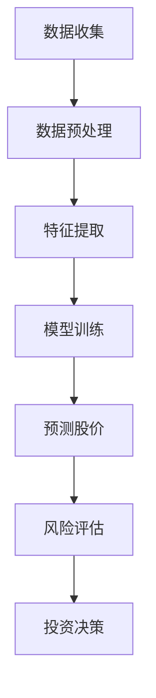
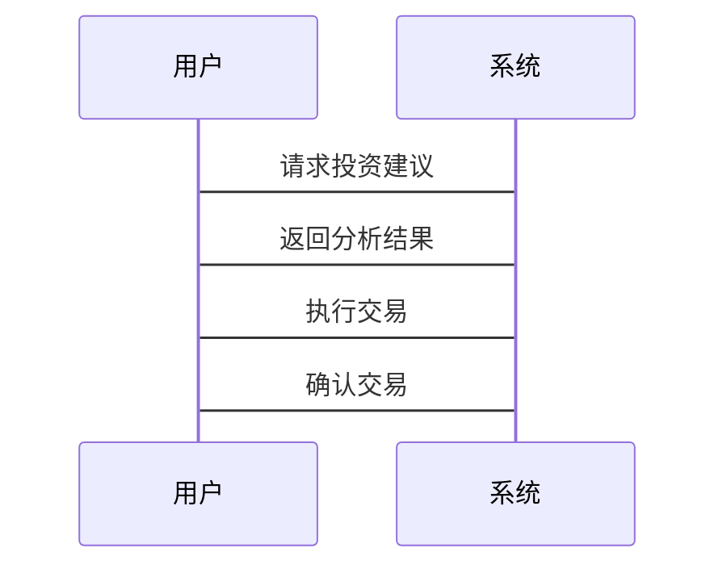

                 


# 如何利用特价股票策略构建长期技术主权投资组合

> 关键词：特价股票、技术主权、投资组合、长期投资、算法策略

> 摘要：本文详细探讨了如何利用特价股票策略构建长期技术主权投资组合。通过分析特价股票的定义、特点及长期投资的意义，结合数学模型和算法原理，提出了一种基于数据驱动的投资策略。文章还介绍了系统设计与架构方案，并通过实际案例展示了如何在项目中实现这些策略。最后，总结了最佳实践和投资中的注意事项，为读者提供了全面的指导。

---

## 第一部分: 特价股票策略与长期技术主权投资组合概述

### 第1章: 特价股票策略的背景与重要性

#### 1.1 特价股票的定义与特点
##### 1.1.1 什么是特价股票
特价股票是指在特定市场条件下，由于各种原因导致其价格被低估的股票。这些股票通常具有较高的潜在回报，但同时也伴随着较高的风险。

##### 1.1.2 特价股票的特点
- **低估值**：市场价格低于内在价值。
- **高波动性**：价格波动较大，容易出现短期大幅波动。
- **市场周期性**：通常出现在市场低迷或特定行业衰退期。

##### 1.1.3 特价股票与普通股票的区别
| 特性 | 特价股票 | 普通股票 |
|------|----------|----------|
| 价格 | 低于内在价值 | 反映市场整体情况 |
| 风险 | 较高 | 较低 |
| 回报 | 高潜力 | 稳定回报 |

#### 1.2 长期技术主权投资组合的概念
##### 1.2.1 投资组合的基本概念
投资组合是指将资金分配到不同的资产或股票中，以分散风险并实现长期收益最大化。

##### 1.2.2 技术主权的内涵
技术主权是指在技术领域中，一个国家或个人对关键技术和核心产业的自主掌控能力。在投资中，技术主权投资组合强调投资那些具有核心技术优势的公司。

##### 1.2.3 长期投资的目标与意义
- **目标**：通过长期持有优质资产，实现资产增值。
- **意义**：分散风险，抓住技术进步带来的投资机会。

---

### 第2章: 特价股票策略的核心概念与联系

#### 2.1 特价股票策略的核心原理
##### 2.1.1 数据驱动的投资决策
通过分析历史数据和市场趋势，利用大数据和机器学习模型预测股票价格走势。

##### 2.1.2 市场周期与特价股票的机会
在市场低迷期，特价股票往往被低估，为投资者提供了低价买入的机会。

##### 2.1.3 技术分析与基本面分析的结合
- **技术分析**：通过K线图、成交量等技术指标预测价格走势。
- **基本面分析**：分析公司的财务状况、行业地位等因素。

#### 2.2 特价股票与技术主权的关系
##### 2.2.1 技术主权的定义
技术主权是指一个国家或组织在关键技术领域具备自主可控的能力。

##### 2.2.2 特价股票在技术主权中的作用
投资具有核心技术优势的公司，可以提升技术主权，同时获得投资回报。

##### 2.2.3 技术主权投资的长期性与稳定性
通过长期持有技术领先公司的股票，投资者可以在技术进步中获益，同时降低短期市场波动的影响。

---

### 第3章: 特价股票策略的数学模型与算法原理

#### 3.1 数据收集与分析
##### 3.1.1 数据来源与处理
- 数据来源：历史股价、财务数据、行业报告等。
- 数据处理：清洗、归一化、特征提取。

##### 3.1.2 数据特征提取
通过统计分析和机器学习算法提取影响股价的关键特征。

##### 3.1.3 数据可视化
使用Matplotlib或Tableau等工具进行数据可视化，帮助理解市场趋势。

#### 3.2 算法原理
##### 3.2.1 基于机器学习的预测模型
- 算法选择：线性回归、随机森林、LSTM等。
- 模型训练：利用历史数据训练模型，预测未来股价。

##### 3.2.2 时间序列分析
- 方法：ARIMA、GARCH等。
- 应用：预测股价走势，识别市场拐点。

##### 3.2.3 风险评估与优化算法
- 风险评估：VaR、CVaR等。
- 优化算法：均值-方差优化，最大收益化险比。

#### 3.3 算法流程图


#### 3.4 核心代码实现
```python
import pandas as pd
import numpy as np
from sklearn.ensemble import RandomForestRegressor
from sklearn.metrics import mean_squared_error

# 数据加载
data = pd.read_csv('stock_data.csv')

# 特征工程
features = data[['open', 'high', 'low', 'volume']]
target = data['close']

# 模型训练
model = RandomForestRegressor(n_estimators=100)
model.fit(features, target)

# 预测
predicted = model.predict(features)

# 评估
mse = mean_squared_error(target, predicted)
print(f'MSE: {mse}')
```

---

### 第4章: 系统分析与架构设计方案

#### 4.1 投资管理系统设计
##### 4.1.1 系统功能需求
- 数据采集：实时采集股票数据。
- 数据分析：分析数据并生成投资建议。
- 投资决策：基于分析结果自动或手动执行交易。

##### 4.1.2 系统架构设计


##### 4.1.3 系统接口设计
- API接口：与其他系统（如交易平台）对接。
- 用户界面：方便用户查看数据和投资建议。

#### 4.2 系统交互流程


---

### 第5章: 项目实战

#### 5.1 环境安装与配置
- 安装Python、Jupyter Notebook、Pandas、Scikit-learn等工具。
- 数据源：获取历史股票数据，如Yahoo Finance。

#### 5.2 核心代码实现
```python
import pandas as pd
import numpy as np
from sklearn.ensemble import RandomForestRegressor
from sklearn.metrics import mean_squared_error

# 数据加载
data = pd.read_csv('stock_data.csv')

# 特征工程
features = data[['open', 'high', 'low', 'volume']]
target = data['close']

# 模型训练
model = RandomForestRegressor(n_estimators=100)
model.fit(features, target)

# 预测
predicted = model.predict(features)

# 评估
mse = mean_squared_error(target, predicted)
print(f'MSE: {mse}')
```

#### 5.3 案例分析与解读
通过分析具体案例，展示如何利用特价股票策略实现投资回报。例如，分析某科技公司在市场低迷期的股价表现，预测其未来走势，并制定投资策略。

---

### 第6章: 最佳实践与小结

#### 6.1 投资策略中的注意事项
- **风险控制**：设置止损点，避免重大损失。
- **税务规划**：合理避税，降低投资成本。
- **市场波动应对策略**：灵活调整投资组合，应对市场变化。

#### 6.2 项目总结与展望
本文通过分析特价股票策略和长期技术主权投资组合的关系，提出了基于数据驱动的投资策略。未来，可以进一步研究人工智能在投资中的应用，优化算法模型，提高投资收益。

---

作者：AI天才研究院/AI Genius Institute & 禅与计算机程序设计艺术 /Zen And The Art of Computer Programming

